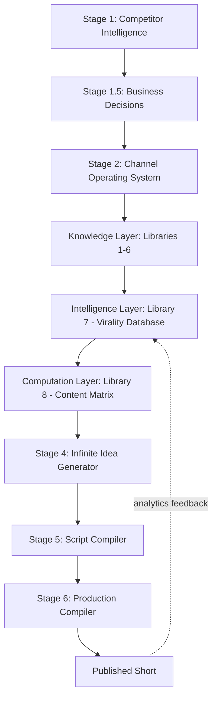

# C-Cloning

> An evidence-driven operating system for building a profitable, faceless, AI-produced **YouTube Shorts** animation studio — designed to reach monetization as fast as possible and then scale into a multi-format AI content company.

C-Cloning is **not** a single channel or a bag of tips. It is a layered decision system that converts competitor intelligence into permanent, reusable knowledge, and then compiles that knowledge — deterministically — into production-ready animated comedy Shorts.

The core thesis:

> **Virality is caused by structure, not luck.** If you reverse-engineer the structures behind viral animated comedy and encode them into a queryable system, content generation becomes a repeatable engineering process instead of a creative gamble.

---

## What this repository is

This repository is the **authoritative documentation** of the C-Cloning system. It captures only the **final, locked decisions** — not the exploratory conversation that produced them. A new contributor should be able to understand and operate the entire system from these documents alone.

## What this repository is not

- It is not a chat transcript.
- It does not contain discarded ideas, obsolete drafts, or iterative debate.
- It does not re-open any locked decision (see the [Locked Roadmap](docs/03-locked-roadmap.md)).

---

## The system at a glance



The system is organized into three macro-layers:

| Layer | Purpose | Documents |
|---|---|---|
| **Knowledge Layer** | Discover *why* viral animated comedy works | [Libraries 1–6](intelligence/) |
| **Intelligence Layer** | Store that knowledge as a queryable graph | [Library 7](intelligence/07-virality-intelligence-database.md) |
| **Generation & Production Layer** | Compile knowledge into ranked ideas → scripts → assets | [Library 8](intelligence/08-content-matrix.md), [Stages 4–6](docs/) |

See the [System Architecture](docs/04-system-architecture.md) for the full picture.

---

## Start here

| If you want to… | Read |
|---|---|
| Understand why the project exists | [Project Vision](docs/01-project-vision.md) |
| See the concrete goals | [Objectives](docs/02-objectives.md) |
| Understand the fixed execution order | [Locked Roadmap](docs/03-locked-roadmap.md) |
| Understand the technical architecture | [System Architecture](docs/04-system-architecture.md) |
| Learn the knowledge system | [Knowledge Layer](docs/05-knowledge-layer.md) → [Libraries](intelligence/) |
| See how a video is generated | [Generation Layer](docs/06-generation-layer.md) |
| See how a video is produced | [Production Layer](docs/07-production-layer.md) |
| Understand the business strategy | [Business Strategy](docs/20-business-strategy.md) |
| See why each decision was made | [Decision Log](docs/21-decision-log.md) |
| Operate the system day-to-day | [Daily Workflow](docs/30-daily-workflow.md) |
| See the creative + runtime design standards | [Production Design](production/design/README.md) |
| **Set up the actual channel (IPPA)** | [**Channel Setup**](channel/README.md) |
| **Generate the next video package** | [**Video Generation Standards**](.kiro/steering/video-generation-standards.md) |
| **Check what has already been spent** | [**Freshness Log & Idea Ledger**](intelligence/09-freshness-log.md) |
| Write image prompts | [Image-Generation Reference](IMAGE-GEN-REFERENCE.md) |
| Know what is currently broken | [Base Audit](BASE-AUDIT.md) |
| Look up a term | [Glossary](docs/40-glossary.md) |
| Get quick answers | [FAQ](docs/41-faq.md) |

---

## Episode catalogue

Seventeen packages, `v1`–`v17`. Each folder is self-contained and internally locked to one master
timeline. `v1`–`v7` use the full package shape (5 numbered files + README); `v8`–`v17` use the compact
3-file shape. Both are defined in the [standards](.kiro/steering/video-generation-standards.md).

| | Title | Format | Idea | Pattern × Scenario | Score |
|---|---|---|---|---|---|
| [v1](v1/) | The Wrong Scooter | Shorts | `A1` | `NP1` × `SC1` | 9.2 |
| [v2](v2/) | The Victory Lap | Shorts | `A2` | `NP2` × `SC3` | 9.0 |
| [v3](v3/) | One Block Too Many | Shorts | `A3` | `NP3` × `SC3` | 8.9 |
| [v4](v4/) | The Wrong Side of the Fence | Shorts | `A4` | `NP1` × `SC10` | 8.8 |
| [v5](v5/) | The Case of the Missing Pie | **Long form 1:30** | `B1` | `NP4` × `SC6` | 5.5 |
| [v6](v6/) | One Sweet, One Coin | Shorts | `A5` | `NP3` × `SC2` | 8.7 |
| [v7](v7/) | The Big One | Shorts | `A6` | `NP1` × `SC8` | 8.6 |
| [v8](v8/) | The Smart Lock | Shorts | `A8` | `NP3` × `SC9` | 8.5 |
| [v9](v9/) | The Last Slice | Shorts | `A9` | `NP2` × ⚠ | 8.4 |
| [v10](v10/) | The Printer | Shorts | `A10` | `NP2` × ⚠ | 8.5 |
| [v11](v11/) | The Express Lane | Shorts | `A11` | `NP3` × ⚠ | 8.6 |
| [v12](v12/) | The Express Elevator | Shorts | `A12` | `NP1` × ⚠ | 8.4 |
| [v13](v13/) | The Big Catch | Shorts | `A13` | `NP3` × ⚠ | 8.3 |
| [v14](v14/) | The Sand Castle | Shorts | `A14` | `NP3` × ⚠ | 8.5 |
| [v15](v15/) | The Last Dryer | Shorts | `A15` | `NP3` × ⚠ | 8.4 |
| [v16](v16/) | The Book Tower | Shorts | `A16` | `NP3` × ⚠ | 8.5 |
| [v17](v17/) | The Biggest Kite | Shorts | `A17` | `NP3` × ⚠ | 8.6 |

⚠ The scenario ID cited by the package is not resolvable against
[Library 4](intelligence/04-scenario-intelligence-library.md). See [`BASE-AUDIT.md`](BASE-AUDIT.md)
§3 — the script is fine, the metadata is not.

**Before starting `v18`:** read the [standing corrections](intelligence/09-freshness-log.md#standing-corrections-for-the-next-package).
`NP3` and `CM-C4` are both heavily over-spent, and a Mode B exploration is overdue.

---

## Repository map

```
C-Cloning/
├── README.md                     ← you are here
├── BASE-AUDIT.md                 ← current known defects + open decisions
├── IMAGE-GEN-REFERENCE.md        ← paste-ready image-prompt cheat sheet (style, cast, props, camera)
├── .kiro/steering/               ← video-generation standards (the production contract)
├── docs/                         ← project, architecture, stages, strategy, workflows
├── intelligence/                 ← the knowledge/computation libraries (1–8) + freshness log (9)
├── diagrams/                     ← Mermaid architecture & dependency diagrams
├── prompts/                      ← reusable stage prompt contracts
├── production/                   ← cast sheets, the Idea A1 package, templates, tool guides,
│                                   and the Production Design system (design/)
├── channel/                      ← the live channel (IPPA): identity lock, metadata, brand-art
│                                   specs, YouTube Studio setup, launch checklist
├── v1/ … v17/                    ← the episode catalogue (one folder per video)
└── V1/                           ← ⚠ legacy first-video package, superseded by v1/
                                     (case-collides with v1/ on macOS/Windows — see BASE-AUDIT §6)
```

A complete index of every document is maintained in [`docs/00-index.md`](docs/00-index.md).

### How the layers feed each other

`intelligence/` decides **what** to make → `.kiro/steering/` defines **how** a package must be built →
`production/design/` and `IMAGE-GEN-REFERENCE.md` define **what it looks like** → `vN/` is the output.
The chain only holds if every link is present on the branch you are working on; when it was not, the
catalogue drifted ([`BASE-AUDIT.md`](BASE-AUDIT.md) §1).

---

## Status

| Item | State |
|---|---|
| Knowledge Layer (Libraries 1–6) | ✅ Locked |
| Intelligence Layer (Library 7) | ✅ Locked |
| Computation Layer (Library 8) | ✅ Locked |
| Generation → Production (Stages 4–6) | ✅ Locked & demonstrated (Idea `A1`) |
| First-video production artifacts | ✅ Delivered ([`production/`](production/README.md): cast, full A1 package, templates, tool guides) |
| Production Design system | ✅ Delivered ([`production/design/`](production/design/README.md): 10-doc creative + runtime standard) |
| Channel name | ✅ **Locked: IPPA** ([D-21](docs/21-decision-log.md), [identity lock](channel/01-CHANNEL-IDENTITY-LOCK.md)) |
| Channel setup pack | ✅ Delivered ([`channel/`](channel/README.md): metadata, brand-art specs, Studio setup, launch checklist) |
| Brand art (icon / banner / wordmark) | ⏳ Specs + prompts ready; exports pending |
| Episode catalogue | ✅ 17 packages (`v1`–`v17`) — `v8`–`v17` metadata needs repair ([audit](BASE-AUDIT.md)) |
| Freshness log / idea ledger | ✅ Reconstructed ([`intelligence/09`](intelligence/09-freshness-log.md)) — next idea `A18`, Mode B overdue |
| Phase 1 (Shorts → monetization) | ▶ Ready to execute |
| Phase 2 (long-form expansion) | ⏳ Post-monetization |

### Branch state

This branch is the consolidation of twelve previously unmerged pull requests — the foundation chain
plus the ten episode branches plus the live-wallpaper asset. Four architecture branches
(`feature/production-tool-stack`, `feature/visual-production-system`, `feature/master-runtime`,
`feature/master-runtime-implementation`) are **not** included; they carry no pull request and describe
a future automation subsystem rather than the creative canon. See [`BASE-AUDIT.md`](BASE-AUDIT.md) §2.

---

## License / ownership

This is internal project documentation for the C-Cloning content system. Treat all frameworks herein as proprietary intellectual property of the project owner.
