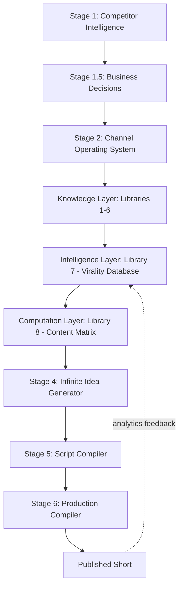

# C-Cloning

> An evidence-driven operating system for building a profitable, faceless, AI-produced **YouTube Shorts** animation studio — designed to reach monetization as fast as possible and then scale into a multi-format AI content company.

C-Cloning is **not** a single channel or a bag of tips. It is a layered decision system that converts competitor intelligence into permanent, reusable knowledge, and then compiles that knowledge — deterministically — into production-ready animated comedy Shorts.

The core thesis:

> **Virality is caused by structure, not luck.** If you reverse-engineer the structures behind viral animated comedy and encode them into a queryable system, content generation becomes a repeatable engineering process instead of a creative gamble.

---

## What this repository is

This repository is the **authoritative documentation** of the C-Cloning system. It captures only the **final, locked decisions** — not the exploratory conversation that produced them. A new contributor should be able to understand and operate the entire system from these documents alone.

## What this repository is not

- It is not a chat transcript.
- It does not contain discarded ideas, obsolete drafts, or iterative debate.
- It does not re-open any locked decision (see the [Locked Roadmap](docs/03-locked-roadmap.md)).

---

## The system at a glance



The system is organized into three macro-layers:

| Layer | Purpose | Documents |
|---|---|---|
| **Knowledge Layer** | Discover *why* viral animated comedy works | [Libraries 1–6](intelligence/) |
| **Intelligence Layer** | Store that knowledge as a queryable graph | [Library 7](intelligence/07-virality-intelligence-database.md) |
| **Generation & Production Layer** | Compile knowledge into ranked ideas → scripts → assets | [Library 8](intelligence/08-content-matrix.md), [Stages 4–6](docs/) |

See the [System Architecture](docs/04-system-architecture.md) for the full picture.

---

## Start here

| If you want to… | Read |
|---|---|
| Understand why the project exists | [Project Vision](docs/01-project-vision.md) |
| See the concrete goals | [Objectives](docs/02-objectives.md) |
| Understand the fixed execution order | [Locked Roadmap](docs/03-locked-roadmap.md) |
| Understand the technical architecture | [System Architecture](docs/04-system-architecture.md) |
| Learn the knowledge system | [Knowledge Layer](docs/05-knowledge-layer.md) → [Libraries](intelligence/) |
| See how a video is generated | [Generation Layer](docs/06-generation-layer.md) |
| See how a video is produced | [Production Layer](docs/07-production-layer.md) |
| Understand the business strategy | [Business Strategy](docs/20-business-strategy.md) |
| See why each decision was made | [Decision Log](docs/21-decision-log.md) |
| Operate the system day-to-day | [Daily Workflow](docs/30-daily-workflow.md) |
| Look up a term | [Glossary](docs/40-glossary.md) |
| Get quick answers | [FAQ](docs/41-faq.md) |

---

## Repository map

```
C-Cloning/
├── README.md                     ← you are here
├── docs/                         ← project, architecture, stages, strategy, workflows
├── intelligence/                 ← the 8 knowledge/computation libraries
├── diagrams/                     ← Mermaid architecture & dependency diagrams
└── prompts/                      ← reusable stage prompt contracts
```

A complete index of every document is maintained in [`docs/00-index.md`](docs/00-index.md).

---

## Status

| Item | State |
|---|---|
| Knowledge Layer (Libraries 1–6) | ✅ Locked |
| Intelligence Layer (Library 7) | ✅ Locked |
| Computation Layer (Library 8) | ✅ Locked |
| Generation → Production (Stages 4–6) | ✅ Locked & demonstrated (Idea `A1`) |
| Phase 1 (Shorts → monetization) | ▶ Ready to execute |
| Phase 2 (long-form expansion) | ⏳ Post-monetization |

---

## License / ownership

This is internal project documentation for the C-Cloning content system. Treat all frameworks herein as proprietary intellectual property of the project owner.
