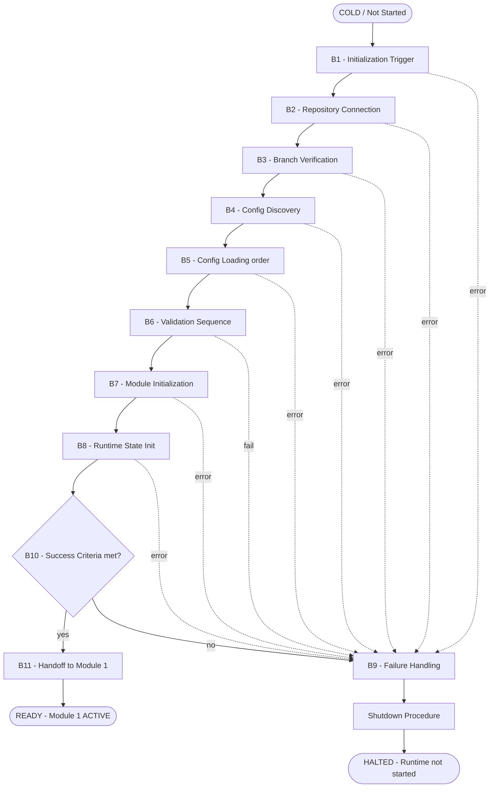
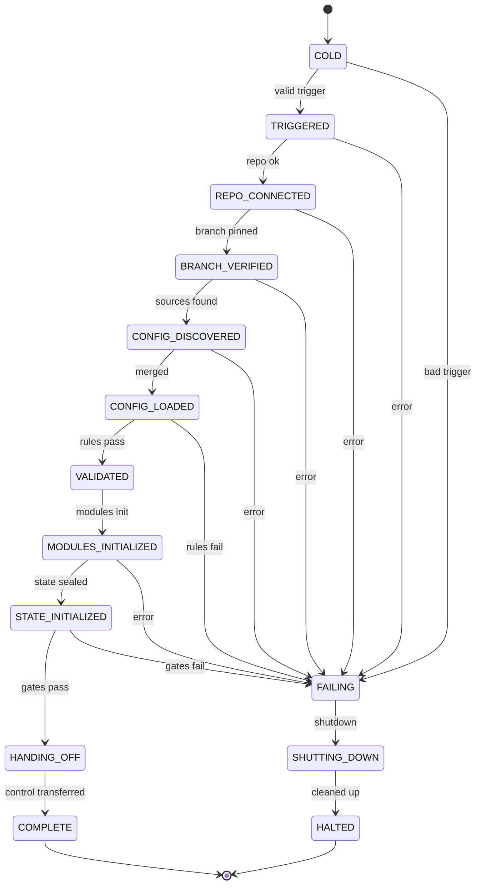
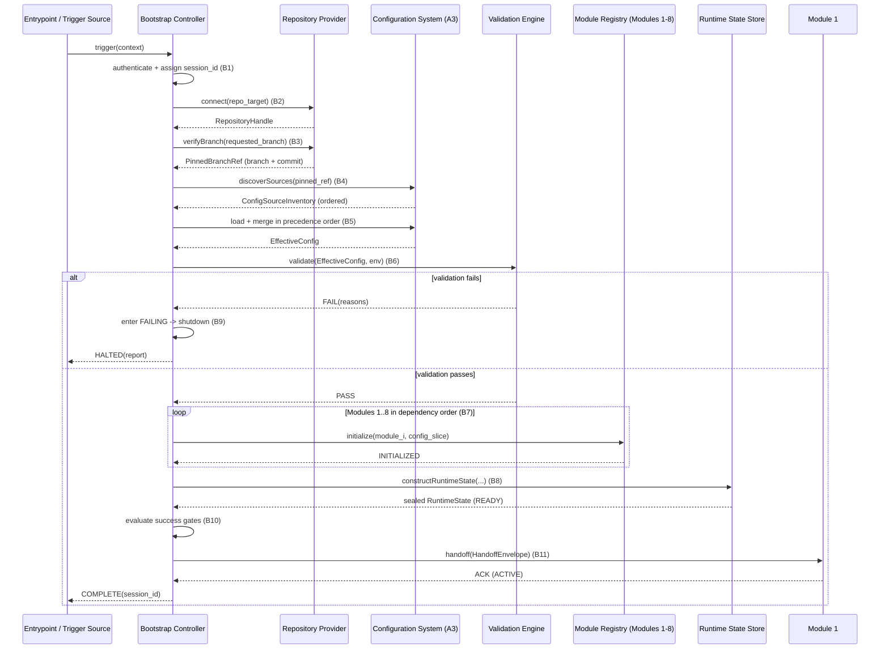
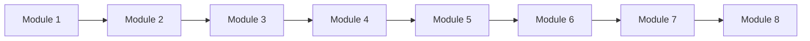

# Runtime Bootstrap Specification

**Project:** C-Cloning — Master Runtime Implementation
**Phase:** Phase 1 — Runtime Bootstrap
**Document Type:** Implementation Specification (platform-agnostic)
**Status:** Draft for Implementation
**Branch:** `feature/master-runtime-implementation`
**Conforms To:** Master Runtime Architecture v1.1 (LOCKED)

---

## 0. Purpose & Scope

### 0.1 Purpose
This document defines **exactly how a Runtime session starts** using the already-approved,
locked Runtime Design. It is the authoritative implementation specification for **Phase 1 —
Runtime Bootstrap**. The Bootstrap is the deterministic startup process that takes the Runtime
from *cold* (no state) to *ready* (all configuration loaded, all invariants validated, all modules
initialized, control handed to Module 1).

### 0.2 Scope
This specification **implements** the existing design. It does **not** redesign it.

**In scope:**
- The startup sequence from initialization trigger to Module 1 handoff.
- Discovery, ordering, and consumption of Runtime Configuration.
- Validation, state initialization, failure handling, and shutdown-on-failure.

**Out of scope (LOCKED — referenced, never modified):**
- Master Runtime Architecture v1.1
- Runtime Engineering Standard
- Runtime Configuration System
- Runtime Integration / Testing / Optimization Reports
- Runtime Modules 1–8 (internal logic)
- Runtime Roadmap

### 0.3 Locked Artifact Dependencies
The Bootstrap **consumes** but **never alters** the following authoritative artifacts:

| Ref | Locked Artifact | Bootstrap Usage |
|-----|-----------------|-----------------|
| A1  | Master Runtime Architecture v1.1 | Defines phase order, layering, and Module 1 handoff contract |
| A2  | Runtime Engineering Standard | Defines determinism, logging, and error-handling conventions |
| A3  | Runtime Configuration System | Defines config schema, sources, precedence, and validation |
| A4  | Runtime Integration Report | Defines cross-module interfaces the Bootstrap must honor |
| A5  | Runtime Testing Report | Defines the acceptance criteria referenced by validation |
| A6  | Runtime Optimization Report | Defines performance envelopes / budgets for startup |
| A7  | Runtime Modules 1–8 | Bootstrap initializes their containers and hands off to Module 1 |

> **Compliance note:** No file belonging to the locked design set is created, edited, moved, or
> deleted by this phase. The only artifact produced is this specification document.

### 0.4 Platform-Agnostic Mandate
The Bootstrap must be implementable **identically in behavior** across **Claude, OpenAI, Python,
LangGraph, and n8n**. This document therefore describes **states, transitions, contracts, and
rules** — never platform-specific code. Section 11 maps each abstract step to an implementation
surface per platform without prescribing code.

---

## 1. Runtime Bootstrap Specification

### 1.1 Definition
**Runtime Bootstrap** is the ordered, deterministic, idempotent procedure that transitions the
Runtime from `COLD` to `READY`, after which control is transferred to Module 1. Bootstrap is
a **single-entry, single-exit** process: it either reaches `READY` (success) or `HALTED` (failure),
and never leaves the Runtime in a partially-initialized externally-visible state.

### 1.2 Core Principles (derived from A1 + A2)
1. **Determinism** — Identical inputs (repo state + config sources) always yield identical Bootstrap
   outcomes and identical ordering. No wall-clock, randomness, or map/dict iteration order may
   affect sequencing.
2. **Fail-closed** — Any unrecoverable error aborts Bootstrap and triggers Shutdown (Section 9).
   The Runtime never proceeds to Module 1 in a degraded state.
3. **Idempotence** — Re-running Bootstrap from `COLD` produces the same result; partial artifacts
   from a failed prior attempt are discarded, never reused.
4. **Ordered configuration precedence** — Configuration is loaded and merged in a fixed, documented
   order (Section 5). Precedence is total and unambiguous.
5. **Validate-before-activate** — No module is initialized until global validation (Section 6)
   passes. No handoff occurs until completion criteria (Section 7) are met.
6. **Observability** — Every stage emits a structured, ordered event record per A2 logging rules.

### 1.3 The Eleven Bootstrap Responsibilities
The Bootstrap discharges the following responsibilities in strict order. Each is a named stage.

| # | Stage ID | Responsibility | Entry Precondition | Exit Guarantee |
|---|----------|----------------|--------------------|----------------|
| 1 | `B1_TRIGGER`   | Runtime initialization trigger | Trigger event received | Trigger authenticated & context captured |
| 2 | `B2_REPO`      | Repository connection | Trigger valid | Repository handle established |
| 3 | `B3_BRANCH`    | Repository branch verification | Repo connected | Correct branch confirmed & pinned |
| 4 | `B4_DISCOVER`  | Runtime configuration discovery | Branch verified | All config sources located & inventoried |
| 5 | `B5_LOAD`      | Runtime configuration loading order | Sources inventoried | Config parsed & merged deterministically |
| 6 | `B6_VALIDATE`  | Runtime validation sequence | Config merged | Effective config & environment validated |
| 7 | `B7_MODINIT`   | Module initialization sequence | Validation passed | Modules 1–8 containers initialized in order |
| 8 | `B8_STATE`     | Runtime state initialization | Modules initialized | Canonical runtime state constructed |
| 9 | `B9_FAILURE`   | Bootstrap failure handling (cross-cutting) | Any stage error | Deterministic abort path invoked |
| 10 | `B10_SUCCESS` | Bootstrap success criteria | State initialized | All completion gates satisfied |
| 11 | `B11_HANDOFF` | Runtime handoff to Module 1 | Success confirmed | Control transferred under handoff contract |

> Stage 9 (`B9_FAILURE`) is **cross-cutting**: it can be entered from any of stages 1–8, 10 (see
> Section 8). Stages 1–8, 10, 11 form the **happy path**.

### 1.4 Stage Detail

#### Stage 1 — `B1_TRIGGER` (Initialization Trigger)
- **Inputs:** trigger event (invocation request), invocation context (caller identity, requested
  session parameters, correlation ID).
- **Actions:**
  1. Receive the trigger from the platform entrypoint.
  2. Assign a unique, deterministic `session_id` (derived from correlation ID + monotonic sequence,
     never from wall-clock alone).
  3. Capture the immutable **Bootstrap Context**: caller, requested repo target, requested branch,
     config overrides supplied at invocation.
  4. Authenticate/authorize the trigger per A2. Reject unauthenticated triggers.
- **Output:** `BootstrapContext` (immutable) + `session_id`.
- **Trigger types (all normalized to the same context shape):** manual invocation, scheduled
  invocation, event-driven invocation, chained invocation from an orchestrator.

#### Stage 2 — `B2_REPO` (Repository Connection)
- **Inputs:** `BootstrapContext.repo_target`.
- **Actions:**
  1. Resolve the repository target to a concrete addressable handle.
  2. Establish a read-capable connection to the repository.
  3. Confirm reachability and access rights (fail-closed on denial).
  4. Record the resolved repository identity (owner/name) into runtime state.
- **Output:** `RepositoryHandle` (connected, verified access).

#### Stage 3 — `B3_BRANCH` (Branch Verification)
- **Inputs:** `RepositoryHandle`, `BootstrapContext.requested_branch`.
- **Actions:**
  1. Enumerate available branches.
  2. Verify the requested implementation branch exists
     (`feature/master-runtime-implementation` for this project).
  3. Confirm the branch is the intended target and **pin the exact commit** the Bootstrap will
     operate against (ensures determinism across the remaining stages).
  4. Reject if the branch is missing, ambiguous, or diverged from the expected base.
- **Output:** `PinnedBranchRef` (branch name + immutable commit id).

#### Stage 4 — `B4_DISCOVER` (Configuration Discovery)
- **Inputs:** `PinnedBranchRef`.
- **Actions (per A3):**
  1. Scan the fixed, documented configuration locations defined by the Runtime Configuration System.
  2. Inventory every configuration source found, tagging each with its **source class** (see 5.1).
  3. Detect required-but-missing sources and unexpected/unknown sources.
  4. Produce a **deterministic, sorted source inventory** (sorted by source-class rank, then by
     canonical path) — iteration order must never depend on filesystem enumeration order.
- **Output:** `ConfigSourceInventory` (ordered, immutable).

#### Stage 5 — `B5_LOAD` (Configuration Loading Order)
- **Inputs:** `ConfigSourceInventory`.
- **Actions:** Parse and merge sources in the fixed precedence order (Section 5). Produce the
  single **Effective Configuration**.
- **Output:** `EffectiveConfig` (immutable, fully-resolved).

#### Stage 6 — `B6_VALIDATE` (Validation Sequence)
- **Inputs:** `EffectiveConfig`, environment facts (repo, branch, platform capabilities).
- **Actions:** Execute the ordered validation rule set (Section 5 validation rules + Section 6).
- **Output:** `ValidationResult` = PASS (proceed) or FAIL (→ `B9_FAILURE`).

#### Stage 7 — `B7_MODINIT` (Module Initialization Sequence)
- **Inputs:** validated `EffectiveConfig`.
- **Actions (per A1 layering + A4 interfaces):**
  1. Initialize module **containers** for Modules 1–8 in **dependency order** (Section 7).
  2. Inject each module's slice of the effective configuration.
  3. Confirm each module reports `INITIALIZED` before initializing the next.
  4. **Do not execute module business logic** — Bootstrap only constructs and wires modules.
- **Output:** `ModuleRegistry` (all 8 modules `INITIALIZED`, none `RUNNING`).

#### Stage 8 — `B8_STATE` (Runtime State Initialization)
- **Inputs:** `EffectiveConfig`, `ModuleRegistry`, `RepositoryHandle`, `PinnedBranchRef`.
- **Actions:** Construct the canonical, immutable **RuntimeState** object (Section 8 schema),
  seal it, and mark the Runtime `READY`.
- **Output:** `RuntimeState` (sealed).

#### Stage 10 — `B10_SUCCESS` (Success Criteria)
- Evaluate all completion gates (Section 7). All must pass to proceed to handoff.

#### Stage 11 — `B11_HANDOFF` (Handoff to Module 1)
- **Inputs:** sealed `RuntimeState`, `ModuleRegistry`.
- **Actions (per A1 handoff contract):**
  1. Assemble the **Module 1 Handoff Envelope** (Section 10).
  2. Transition Module 1 from `INITIALIZED` → `ACTIVE`.
  3. Transfer control. Bootstrap performs **no** further work after a successful handoff.
- **Output:** Control owned by Module 1; Bootstrap terminates in `COMPLETE`.

---

## 2. Bootstrap Lifecycle Diagram

The lifecycle shows the coarse phases from cold start to Module 1 ownership.



---

## 3. Bootstrap State Machine

### 3.1 States
| State | Meaning | Terminal? |
|-------|---------|-----------|
| `COLD` | No Bootstrap activity; no state exists | No (start) |
| `TRIGGERED` | Trigger accepted, context captured | No |
| `REPO_CONNECTED` | Repository connected & authorized | No |
| `BRANCH_VERIFIED` | Branch confirmed & commit pinned | No |
| `CONFIG_DISCOVERED` | All config sources inventoried | No |
| `CONFIG_LOADED` | Effective configuration merged | No |
| `VALIDATED` | Effective config + environment validated | No |
| `MODULES_INITIALIZED` | Modules 1–8 containers initialized | No |
| `STATE_INITIALIZED` | Canonical RuntimeState sealed; Runtime `READY` | No |
| `HANDING_OFF` | Success gates passed; transferring to Module 1 | No |
| `COMPLETE` | Module 1 is `ACTIVE`; Bootstrap done | **Yes (success)** |
| `FAILING` | An error/validation-fail was raised | No |
| `SHUTTING_DOWN` | Shutdown procedure executing | No |
| `HALTED` | Runtime stopped; nothing handed off | **Yes (failure)** |

### 3.2 Transition Table
| From | Event / Guard | To |
|------|---------------|-----|
| `COLD` | valid trigger authenticated | `TRIGGERED` |
| `COLD` | invalid/unauthorized trigger | `FAILING` |
| `TRIGGERED` | repo connected + authorized | `REPO_CONNECTED` |
| `REPO_CONNECTED` | branch exists + commit pinned | `BRANCH_VERIFIED` |
| `BRANCH_VERIFIED` | sources inventoried (required present) | `CONFIG_DISCOVERED` |
| `CONFIG_DISCOVERED` | all sources parsed + merged | `CONFIG_LOADED` |
| `CONFIG_LOADED` | all validation rules PASS | `VALIDATED` |
| `CONFIG_LOADED` | any validation rule FAIL | `FAILING` |
| `VALIDATED` | Modules 1–8 report INITIALIZED in order | `MODULES_INITIALIZED` |
| `MODULES_INITIALIZED` | RuntimeState constructed + sealed | `STATE_INITIALIZED` |
| `STATE_INITIALIZED` | all success gates PASS | `HANDING_OFF` |
| `STATE_INITIALIZED` | any success gate FAIL | `FAILING` |
| `HANDING_OFF` | Module 1 → ACTIVE, control transferred | `COMPLETE` |
| *any non-terminal* | unrecoverable error | `FAILING` |
| `FAILING` | shutdown initiated | `SHUTTING_DOWN` |
| `SHUTTING_DOWN` | cleanup complete | `HALTED` |

### 3.3 Invariants
- **INV-1:** `COMPLETE` is reachable **only** through `HANDING_OFF` (never directly from a failure).
- **INV-2:** No transition may skip a state (strict linear progression on the happy path).
- **INV-3:** From any non-terminal state, an unrecoverable error routes to `FAILING` — there is no
  "continue anyway" edge.
- **INV-4:** `HALTED` implies **zero** handoff occurred and **no** externally-visible module is
  `ACTIVE`.
- **INV-5:** Exactly one terminal state is reached per Bootstrap run.

### 3.4 State Machine Diagram



---

## 4. Bootstrap Sequence Diagram

Participants are abstract roles, not platform components.



---

## 5. Configuration Loading Order & Precedence

### 5.1 Source Classes (discovery tags, B4)
Configuration originates from a fixed set of source classes defined by the Runtime Configuration
System (A3). Discovery tags each located source with exactly one class.

| Rank | Source Class | Description |
|------|--------------|-------------|
| 1 | `DEFAULTS` | Built-in Runtime defaults shipped with the design |
| 2 | `REPO_BASE` | Repository-committed base configuration |
| 3 | `BRANCH` | Branch-scoped configuration on the pinned branch |
| 4 | `ENVIRONMENT` | Environment/platform-provided configuration |
| 5 | `INVOCATION` | Overrides supplied in the trigger context (B1) |

### 5.2 Loading & Merge Order (B5)
Sources are merged in **ascending rank order** (1 → 5). **Higher rank overrides lower rank** on key
conflict. This yields a total, deterministic precedence:

```
DEFAULTS  <  REPO_BASE  <  BRANCH  <  ENVIRONMENT  <  INVOCATION
(lowest precedence)                                  (highest precedence)
```

**Rules:**
- **LO-1:** Merge is applied strictly left-to-right in the order above; the result after each step is
  the input to the next. No source may be loaded out of order.
- **LO-2:** Merge is a deep key-wise override. Scalar conflicts resolve to the higher-rank value;
  object keys merge recursively; arrays are replaced (not concatenated) by the higher-rank value.
- **LO-3:** A missing optional source is skipped without error but recorded in the load log.
- **LO-4:** A missing **required** source (per A3) aborts to `B9_FAILURE`.
- **LO-5:** Within a single source class, if multiple files exist, they are ordered by canonical path
  (lexicographic) before merging — never by discovery/enumeration order.
- **LO-6:** The merged `EffectiveConfig` is immutable once produced; later stages read but never write it.

### 5.3 Bootstrap Validation Rules (Deliverable 5)
Validation runs **after** merge, in this fixed order. First failing rule aborts to `B9_FAILURE`
(fail-closed). Every rule outcome is logged.

| ID | Rule | Category | On Fail |
|----|------|----------|---------|
| V-01 | Trigger authenticated & authorized | Security | ABORT |
| V-02 | Repository reachable & access granted | Connectivity | ABORT |
| V-03 | Requested branch exists and commit pinned | Integrity | ABORT |
| V-04 | Operating branch is `feature/master-runtime-implementation` (implementation branch) | Policy | ABORT |
| V-05 | All **required** config sources present | Config presence | ABORT |
| V-06 | Effective config conforms to A3 schema (types, required keys) | Config schema | ABORT |
| V-07 | No unknown/undeclared config keys | Config schema | ABORT |
| V-08 | Config value ranges within A3 constraints | Config semantics | ABORT |
| V-09 | Cross-key consistency (no contradictory settings) | Config semantics | ABORT |
| V-10 | Declared module set == Modules 1–8 (complete, no extras) | Architecture (A1) | ABORT |
| V-11 | Module dependency graph is acyclic & matches A1 order | Architecture (A1) | ABORT |
| V-12 | Platform capabilities satisfy declared requirements | Environment | ABORT |
| V-13 | Startup resource budget within A6 envelope | Performance | ABORT |
| V-14 | No locked artifact modified during Bootstrap | Compliance | ABORT |
| V-15 | Determinism check: identical inputs → identical merged config hash | Determinism | ABORT |

> **Note:** All validation failures are ABORT (fail-closed) per principle 1.2.2. There is no
> "warn and continue" class in Bootstrap.

---

## 6. Runtime Validation Sequence (B6 detail)

The validation sequence is executed as three ordered gates. A gate must fully pass before the next
begins.

1. **Gate 1 — Preconditions** (`V-01`–`V-04`): trigger, repository, branch, branch-policy.
   Confirms the Bootstrap is operating on the correct, authorized substrate.
2. **Gate 2 — Configuration** (`V-05`–`V-09`): presence, schema, unknown keys, ranges, cross-key
   consistency. Confirms `EffectiveConfig` is correct and complete.
3. **Gate 3 — Architecture & Environment** (`V-10`–`V-15`): module completeness, dependency acyclicity,
   platform capability, performance budget, compliance, determinism.

Passing all three gates yields `ValidationResult = PASS` and transitions `CONFIG_LOADED → VALIDATED`.

---

## 7. Module Initialization Sequence (B7 detail)

### 7.1 Ordering Principle
Modules are initialized in **dependency (topological) order** as defined by A1/A4 — Module 1 first,
then each subsequent module only after all modules it depends on report `INITIALIZED`. The Bootstrap
**constructs and wires** modules; it does **not** run their business logic.



> The exact edges are governed by the locked A4 Integration Report. The invariant enforced here:
> initialization order is a valid topological sort of the A1/A4 dependency graph, and it is stable
> (deterministic) across runs and platforms.

### 7.2 Per-Module Initialization Contract
For each module `i` (in order):
1. Instantiate the module container.
2. Inject `EffectiveConfig[module_i]` (its configuration slice only).
3. Bind declared inter-module interfaces (from A4).
4. Await `INITIALIZED` acknowledgment.
5. On failure → `B9_FAILURE` (the partially-built registry is discarded in shutdown).

### 7.3 Post-condition
`ModuleRegistry` contains Modules 1–8, each in state `INITIALIZED` (none `ACTIVE`/`RUNNING`).

---

## 8. Runtime State Initialization (B8 detail)

### 8.1 RuntimeState Schema (canonical, immutable once sealed)
| Field | Source | Description |
|-------|--------|-------------|
| `session_id` | B1 | Unique deterministic session identifier |
| `bootstrap_context` | B1 | Immutable trigger context |
| `repository` | B2 | Resolved repository identity (owner/name) |
| `pinned_branch` | B3 | Branch name + pinned commit id |
| `effective_config` | B5 | Fully merged, validated configuration (immutable) |
| `config_source_manifest` | B4/B5 | Ordered record of sources merged + their hashes |
| `module_registry` | B7 | Modules 1–8 with state `INITIALIZED` |
| `validation_report` | B6 | Ordered results of V-01…V-15 |
| `bootstrap_metrics` | B1–B8 | Per-stage timings vs. A6 budget |
| `runtime_status` | B8 | Set to `READY` on seal |
| `state_hash` | B8 | Deterministic hash of the sealed state (for determinism checks) |

### 8.2 Rules
- **ST-1:** RuntimeState is assembled once, then **sealed** (immutable). Modules receive read access.
- **ST-2:** Sealing sets `runtime_status = READY` and computes `state_hash`.
- **ST-3:** `state_hash` must be reproducible: identical inputs across platforms → identical hash
  (supports V-15 and cross-platform parity testing).
- **ST-4:** No secrets are stored in plaintext in RuntimeState; references only, per A2.

---

## 9. Bootstrap Failure Handling Strategy (B9 detail — Deliverable 6)

### 9.1 Classification
| Class | Examples | Recoverable within Bootstrap? |
|-------|----------|-------------------------------|
| `TRIGGER_ERROR` | unauthorized/malformed trigger | No |
| `REPO_ERROR` | unreachable repo, access denied | No |
| `BRANCH_ERROR` | branch missing, wrong branch, ambiguous ref | No |
| `CONFIG_DISCOVERY_ERROR` | required source missing | No |
| `CONFIG_LOAD_ERROR` | parse failure, merge conflict undefinable | No |
| `VALIDATION_ERROR` | any V-rule fail | No |
| `MODULE_INIT_ERROR` | a module fails to initialize | No |
| `STATE_ERROR` | state construction/seal failure | No |
| `SUCCESS_GATE_ERROR` | a completion gate fails | No |

> Per the fail-closed principle, **no** Bootstrap failure class is auto-recovered mid-flight. The
> Runtime does not partially start. (Retry, if any, is an *outer* orchestration concern that re-invokes
> Bootstrap from `COLD` — see 9.4.)

### 9.2 Failure Handling Procedure
On any error in stages B1–B8 or a failed gate in B10:
1. **Freeze** — stop forward progress immediately; capture the current state ID and offending stage.
2. **Classify** — assign a failure class and stable error code.
3. **Record** — emit a structured failure record: `session_id`, stage, class, code, human-readable
   reason, and remediation hint (per A2).
4. **Transition** — `→ FAILING`.
5. **Invoke Shutdown** — hand off to the Shutdown Procedure (Section 12).
6. **Report** — return a deterministic failure result to the trigger source; never return `COMPLETE`.

### 9.3 Determinism of Failure
Given identical faulty inputs, Bootstrap must fail at the **same stage** with the **same error code**
every time and on every platform. Failure ordering follows the stage order; the **first** violation
encountered aborts (no "collect all errors then continue").

### 9.4 Retry Semantics (out of Bootstrap scope, documented for integrators)
- Bootstrap itself does not retry. An external orchestrator may re-invoke Bootstrap from `COLD`.
- Re-invocation must not reuse any artifact from the failed attempt (idempotence, principle 1.2.3).

---

## 10. Bootstrap Completion Criteria & Module 1 Handoff

### 10.1 Success Criteria / Completion Gates (B10 — Deliverable 7)
All gates must be TRUE to proceed to handoff. Any FALSE → `B9_FAILURE`.

| Gate | Criterion |
|------|-----------|
| G-1 | State machine reached `STATE_INITIALIZED` via the linear happy path |
| G-2 | `ValidationResult == PASS` (all V-01…V-15 passed) |
| G-3 | `ModuleRegistry` contains exactly Modules 1–8, all `INITIALIZED` |
| G-4 | `RuntimeState` sealed with `runtime_status == READY` and a computed `state_hash` |
| G-5 | Startup metrics within the A6 performance envelope |
| G-6 | No locked artifact modified (compliance re-check) |
| G-7 | Module 1 handoff contract prerequisites satisfied (see 10.2) |

### 10.2 Module 1 Handoff Contract (B11 — Runtime Handoff to Module 1)
The Bootstrap transfers control to Module 1 by delivering the **Handoff Envelope**:

| Envelope Field | Description |
|----------------|-------------|
| `runtime_state_ref` | Read reference to the sealed `RuntimeState` |
| `module_registry_ref` | Reference to Modules 2–8 (already `INITIALIZED`) for Module 1 to orchestrate |
| `effective_config_ref` | Read reference to the validated configuration |
| `session_id` | Session correlation id |
| `handoff_token` | One-time token asserting a valid, verified Bootstrap completed |

**Handoff rules:**
- **HO-1:** Handoff occurs **only** after all completion gates (G-1…G-7) pass.
- **HO-2:** On handoff, Module 1 transitions `INITIALIZED → ACTIVE`; Bootstrap transitions to `COMPLETE`.
- **HO-3:** After a successful handoff, the Bootstrap performs no further actions and owns no control.
- **HO-4:** The envelope is read-only w.r.t. `RuntimeState`; Module 1 cannot mutate sealed state.
- **HO-5:** If Module 1 rejects the envelope (ACK failure), Bootstrap treats it as `SUCCESS_GATE_ERROR`
  → `B9_FAILURE` (no partial activation).

---

## 11. Platform-Agnostic Implementation Mapping

This section maps each abstract Bootstrap stage to an implementation surface per target platform.
**No code is prescribed** — only *where* each responsibility lives, so behavior stays identical.

| Stage | Claude | OpenAI | Python | LangGraph | n8n |
|-------|--------|--------|--------|-----------|-----|
| B1 Trigger | Tool/session invocation | Assistant run / function call | Entrypoint function | Graph entry node | Trigger node |
| B2 Repo connect | Repo tool call | Function tool | VCS client call | Tool node | Git/HTTP node |
| B3 Branch verify | Repo tool call | Function tool | VCS client call | Tool node | Git node |
| B4 Discover | Structured tool step | Function step | Loader routine | Node | Read/List node |
| B5 Load/merge | Deterministic reducer step | Deterministic step | Merge routine | Reducer node | Merge/Set node |
| B6 Validate | Guard step | Guard function | Validator routine | Conditional node | IF/Function node |
| B7 Module init | Ordered init steps | Ordered init calls | Init sequence | Sequential nodes | Sequential nodes |
| B8 State init | State object build | State object build | Immutable dataclass | Graph state channel | Static data / Set node |
| B9 Failure | Error branch | Error handler | Exception → abort | Error edge | Error workflow branch |
| B10 Success gates | Guard step | Guard function | Assertions | Conditional node | IF node |
| B11 Handoff | Invoke Module 1 | Invoke Module 1 | Call Module 1 | Edge to M1 node | Execute-workflow node |

**Parity requirement:** For any given repo state + config sources, all five platforms must reach the
**same terminal state**, the **same `state_hash`** (on success), or the **same failure stage + error
code** (on failure).

---

## 12. Bootstrap Shutdown Procedure (Deliverable 9)

Invoked whenever Bootstrap enters `FAILING`. Its goal: leave **no** partially-started Runtime and
**no** side effects beyond diagnostic records.

### 12.1 Ordered Shutdown Steps
1. **Halt progression** — ensure no further stage executes.
2. **Quiesce modules** — for any module in `INITIALIZED`, tear down its container in **reverse**
   initialization order (Module N … Module 1). No module is ever transitioned to `ACTIVE`.
3. **Release repository connection** — close the `RepositoryHandle`; no writes are performed.
4. **Discard transient artifacts** — drop the partial `EffectiveConfig`, partial `ModuleRegistry`,
   and any unsealed `RuntimeState`. Nothing is persisted for reuse.
5. **Emit shutdown record** — write the final structured failure + shutdown log (per A2), including
   which cleanup steps ran.
6. **Confirm compliance** — assert no locked artifact was modified during the run.
7. **Enter `HALTED`** — return the deterministic failure result to the trigger source.

### 12.2 Shutdown Guarantees
- **SD-1:** Shutdown is itself deterministic and idempotent.
- **SD-2:** Shutdown never partially activates a module.
- **SD-3:** After `HALTED`, re-invocation must start from `COLD` (no reuse of failed-run artifacts).
- **SD-4:** Shutdown performs only reads/tear-downs — it never mutates the repository or locked artifacts.

---

## 13. Runtime Startup Checklist (Deliverable 8)

A run-time-usable checklist mirroring the ordered stages. Each item must be TRUE before advancing.

**Preconditions**
- [ ] Trigger received and authenticated (V-01)
- [ ] Bootstrap context captured; `session_id` assigned
- [ ] Repository connected and access authorized (V-02)
- [ ] Requested branch exists; commit pinned (V-03)
- [ ] Operating branch is `feature/master-runtime-implementation` (V-04)

**Configuration**
- [ ] All required config sources discovered (V-05)
- [ ] Sources ordered deterministically (rank, then canonical path)
- [ ] Sources merged in precedence order DEFAULTS → REPO_BASE → BRANCH → ENVIRONMENT → INVOCATION
- [ ] `EffectiveConfig` conforms to A3 schema; no unknown keys (V-06, V-07)
- [ ] Value ranges and cross-key consistency validated (V-08, V-09)

**Architecture & Environment**
- [ ] Declared modules == Modules 1–8; graph acyclic & matches A1 order (V-10, V-11)
- [ ] Platform capabilities satisfy requirements (V-12)
- [ ] Startup within A6 performance budget (V-13)
- [ ] No locked artifact modified (V-14)
- [ ] Determinism hash check passed (V-15)

**Initialization & State**
- [ ] Modules 1–8 initialized in dependency order; each `INITIALIZED`
- [ ] `RuntimeState` constructed and sealed; `runtime_status == READY`
- [ ] `state_hash` computed

**Completion & Handoff**
- [ ] All completion gates G-1…G-7 pass
- [ ] Handoff Envelope assembled
- [ ] Module 1 transitioned `INITIALIZED → ACTIVE`; ACK received
- [ ] Bootstrap state `COMPLETE`

**On any failure**
- [ ] Failure classified + error code assigned
- [ ] Shutdown procedure executed (Section 12)
- [ ] Terminal state `HALTED`; deterministic failure report returned

---

## 14. Production Readiness Assessment (Deliverable 10)

### 14.1 Readiness Dimensions
| Dimension | Requirement | Status vs. this Spec |
|-----------|-------------|----------------------|
| **Determinism** | Same inputs → same outcome, ordering, and `state_hash` across 5 platforms | Specified (V-15, ST-3, §11 parity) — **verifiable by implementation** |
| **Fail-closed safety** | No partial start; all failures abort + shutdown | Specified (§9, §12) — **met at spec level** |
| **Config correctness** | Fixed precedence + full schema validation | Specified (§5, §6) — **met at spec level** |
| **Architecture conformance** | Follows A1 v1.1 order and Module 1 handoff contract | Specified (§7, §10) — **met at spec level** |
| **Compliance** | No locked artifact modified | Specified (V-14, G-6, SD-4) — **met at spec level** |
| **Observability** | Structured, ordered logs per stage + failure records | Specified (§1.2.6, §9.2, §12.1) — **met at spec level** |
| **Idempotence** | Re-invocation from COLD is clean | Specified (§9.4, SD-3) — **met at spec level** |
| **Performance** | Startup within A6 envelope | Specified (V-13, G-5) — **budget defined by A6; must be measured** |
| **Portability** | Identical behavior on Claude/OpenAI/Python/LangGraph/n8n | Specified (§11) — **requires per-platform conformance tests** |

### 14.2 Readiness Verdict
**Specification-level: READY for implementation.** The Bootstrap is fully, deterministically
specified and conforms to the locked design. It is safe to begin platform implementation.

**Not yet demonstrated (deferred to implementation & test phases, requires executable code + the
locked artifacts to be resolvable at runtime):**
1. Empirical determinism/parity across all five platforms (cross-platform `state_hash` equality).
2. Measured startup performance against the A6 envelope.
3. Live validation against the *actual* A3 configuration schema and A4 interface definitions.
4. Fault-injection tests for every failure class in §9.1.

### 14.3 Go / No-Go
- **GO** to implement Phase 1 against this specification.
- **NO-GO** to declare the Bootstrap production-certified until items 14.2.1–14.2.4 are executed and
  pass in the Testing phase.

---

## 15. Internal Quality Review (self-verification)

Performed prior to publishing this document:

| Check | Result |
|-------|--------|
| Bootstrap conforms to Master Runtime Architecture v1.1 (phase order, layering, Module 1 handoff) | **PASS** — §1, §7, §10 |
| Startup sequence is deterministic (fixed order, no wall-clock/random sequencing, stable sorts) | **PASS** — §1.2.1, §5.2 LO-5, V-15 |
| Runtime Configuration consumed in correct order (DEFAULTS→…→INVOCATION) | **PASS** — §5.2 |
| Bootstrap hands control to Module 1 correctly (envelope + gated transition) | **PASS** — §10.2 |
| No locked artifact modified (Architecture, Config, Modules, Roadmap, Reports, Standard) | **PASS** — only this file produced; V-14/G-6/SD-4 enforce at runtime |
| Single-entry/single-exit; exactly one terminal state | **PASS** — §3.3 INV-5 |
| Failure path fail-closed with shutdown | **PASS** — §9, §12 |

**No inconsistencies found. Document approved for commit.**

---

*End of Runtime Bootstrap Specification — Phase 1, Project C-Cloning.*
