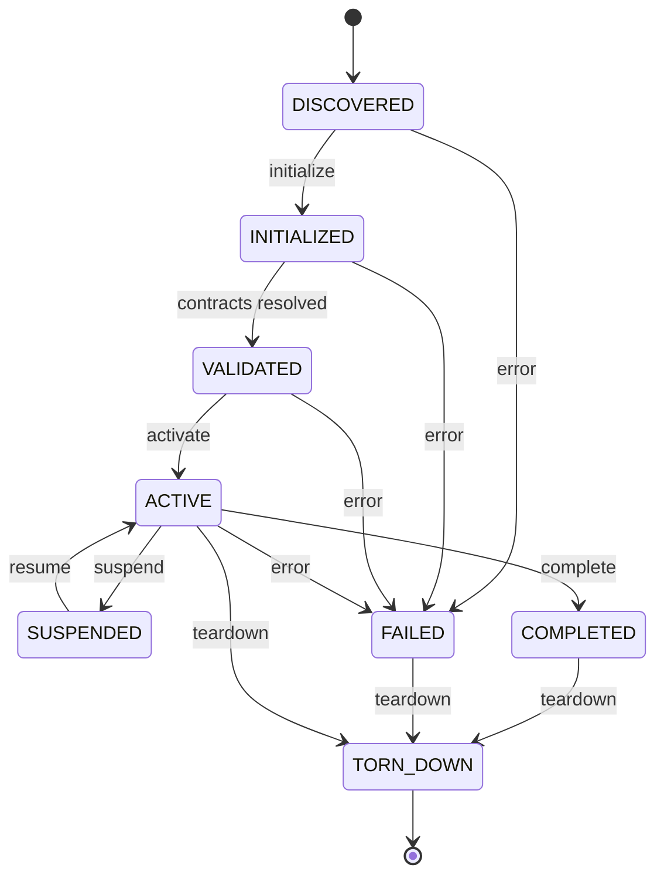

# Runtime Module Engine Implementation

**Project:** C-Cloning — Master Runtime Implementation
**Phase:** Phase 3 — Module Engine
**Artifact Type:** Implementation (runtime objects, contracts, interfaces, pipeline)
**Branch:** `feature/master-runtime-implementation`
**Consumes (LOCKED, never modified):** Runtime Modules 1–8; Runtime Configuration System
(`module_registry.yaml`, `runtime_manifest.yaml`, `execution_modes.yaml`, `runtime_versions.yaml`,
`repository_map.yaml`); Master Runtime Architecture v1.1; Runtime Engineering Standard;
Runtime Bootstrap Implementation (Phase 1); Runtime Configuration Loader Implementation (Phase 2).

> This is an **implementation** artifact, not a design or specification. It defines the concrete
> engine that **manages and executes** the Runtime modules. It does **not** implement the modules
> and does **not** redesign them. Module definitions are consumed as-is through the Phase-2
> `ConfigurationRegistry`. Here we describe only **how the engine operates the modules**.

---

## 0. Implementation Conventions (inherited from Phases 1–2)

- **Object notation:** typed field lists (`name: Type`) with abstract types (`String`, `Int`, `Bool`,
  `Enum`, `Map<K,V>`, `List<T>`, `Ref<T>`, `Hash`, `Timestamp`). No platform types.
- **Interface notation:** `operation(inputs) -> outputs throws ModuleError`.
- **Config access:** the engine reads module definitions **only** through the Phase-2
  `ConfigurationRegistry` (e.g. `registry.moduleView("module_3")`, `registry.get(...)`). It never
  opens the YAML files directly and never rewrites module definitions.
- **Immutability:** objects marked `sealed` are frozen after construction; consumers receive `Ref<T>`.
- **Determinism:** module discovery order, initialization order, and transition order are derived from
  `module_registry` (declared order + dependency graph), never from enumeration order. Same
  configuration ⇒ same lifecycle sequence and same hashes.

### 0.1 Relationship to prior phases
- **Phase 1 (Bootstrap)** produced a `ModuleInitTable` and a `BootstrapSession`. That table was a
  *container-level* skeleton created during startup.
- **Phase 2 (Configuration Loader)** produced the authoritative `ConfigurationSession` /
  `ConfigurationRegistry` with per-module `ConfigModuleView` slices.
- **Phase 3 (this)** consumes the `ConfigurationSession` and the (validated) module views to build
  the durable **ModuleEngine** that discovers, initializes, validates, activates, executes, and
  transitions modules during runtime. The engine is what Phase 4 orchestrates.

---

## 1. Module Engine Implementation (component inventory)

| Component | Role (implementation) |
|-----------|-----------------------|
| **ModuleEngine** | Top-level façade owning the module runtime. Exposes the module execution surface to Phase 4. Holds the `ModuleTable`, the `ModuleStateManager`, and the lifecycle/transition controllers. |
| **ModuleManager** | Coordinates the engine pipeline (M0–M8); orchestrates the other components; enforces fail-closed behavior; returns exactly one of `ModuleEngineHandle` (success) or `ModuleError` (failure). |
| **ModuleRegistryAdapter** | Read-only adapter over the Phase-2 `ConfigurationRegistry`. Translates `module_registry` entries into engine-internal `ModuleDescriptor` objects. Never modifies definitions. |
| **ModuleInitializer** | Constructs a `ModuleInstance` container per descriptor, injects the module's `ConfigModuleView` slice, wires declared interfaces. Does not run module business logic. |
| **ModuleContractResolver** | Resolves each module's declared provides/requires interfaces (from `module_registry` + Integration Report references) into a bound `ModuleContractSet`; verifies the dependency graph. |
| **ModuleLifecycleController** | Drives each module through the deterministic lifecycle (Section 4). |
| **ModuleStateManager** | Owns the authoritative `ModuleStateTable`; the only component permitted to mutate module state, via validated transitions. |
| **ModuleTransitionManager** | Validates and applies lifecycle transitions (Section 8); rejects illegal transitions. |
| **ModuleExecutor** | Provides the uniform execution interface used to invoke a module's declared entry operation; enforces preconditions (module must be `ACTIVE`). Does not implement module logic. |

### 1.1 Module Manager (implementation)
```
ModuleManager.run(config_session: ConfigurationSession, bootstrap_session: BootstrapSession)
    -> ModuleEngineResult                        # ModuleEngineHandle | ModuleError
  ctx := new ModuleEngineContext(config_session, bootstrap_session)
  for stage in ModuleExecutionPipeline.stages:   # M0..M8, fixed order
      outcome := stage.execute(ctx)
      if outcome.is_failure:
          err := ModuleError.from(stage, outcome, ctx)
          ModuleLifecycleController.teardown(ctx)   # reverse-order quiesce of INITIALIZED/ACTIVE modules
          return { status: FAILED, error: err }
      ctx.apply(outcome.produced_objects)          # append-only
  engine := ModuleEngine.seal(ctx)                 # sealed, immutable façade
  return { status: SUCCESS, handle: engine.handle() }
```
- Single entry, single result. Fail-closed: first failing stage aborts, modules are torn down in
  reverse order, a structured `ModuleError` is returned; no partial engine is exposed.
- Only the `ModuleStateManager` mutates module state, and only through the `ModuleTransitionManager`.

---

## 2. Module Runtime Objects

### 2.1 `ModuleDescriptor` (produced by M1 via adapter, sealed per module)
```
ModuleDescriptor {
  module_id:     String            # "module_1".."module_8", from module_registry (read-only)
  declared_order:Int               # position in module_registry
  depends_on:    List<String>      # dependency module_ids (read-only)
  provides:      List<String>      # interface ids this module provides
  requires:      List<String>      # interface ids this module requires
  version_req:   String            # from runtime_versions view
  config_view:   Ref<ConfigModuleView>   # Phase-2 slice (read-only)
  descriptor_hash: Hash
}
```
> `ModuleDescriptor` is a **projection** of the locked module definition. The engine never edits the
> module's responsibilities, interfaces, or dependencies — it only reflects them.

### 2.2 `ModuleInstance` (produced by M2, mutable state ref via StateManager)
```
ModuleInstance {
  module_id:     String
  descriptor:    Ref<ModuleDescriptor>
  container:     Ref<Opaque>        # the constructed module container (logic is the module's own)
  contract_set:  Ref<ModuleContractSet>
  state_ref:     Ref<ModuleStateEntry>   # owned by ModuleStateManager
}
```

### 2.3 `ModuleContractSet` (produced by M3, sealed per module)
```
ModuleContractSet {
  module_id:     String
  bound_provides:Map<String, InterfaceBinding>   # interface_id -> binding this module exposes
  bound_requires:Map<String, InterfaceBinding>   # interface_id -> resolved provider binding
  resolved:      Bool
}
InterfaceBinding { interface_id: String, provider_module: String, signature_ref: String }
```

### 2.4 `ModuleTable` (produced by M1, sealed ordering)
```
ModuleTable {
  order:         List<String>       # topological order derived from descriptors (deterministic)
  descriptors:   Map<String, Ref<ModuleDescriptor>>
  instances:     Map<String, Ref<ModuleInstance>>
  table_hash:    Hash
}
```

### 2.5 `ModuleStateEntry` / `ModuleStateTable` (owned by ModuleStateManager) — see Section 5.

### 2.6 `ModuleEngineHandle` (produced by M8, sealed) — see Section 6 exposure.

### 2.7 Object lineage (what produces what)
```
ConfigurationSession (Phase 2) + BootstrapSession (Phase 1)
   └─(M1 Discovery)→ ModuleDescriptor[1..8] + ModuleTable(order)
                        └─(M2 Initialization)→ ModuleInstance[1..8] (state=INITIALIZED)
                                                  └─(M3 Validation)→ ModuleContractSet[1..8] (resolved)
                                                                       └─(M4 Activation)→ state=ACTIVE (per order)
                                                                                            └─(M5 Exec IF)→ ModuleExecutor bound
                                                                                                              └─(M6 Transition)→ ModuleTransition records
                                                                                                                                   └─(M7 State Update)→ ModuleStateTable (sealed snapshot)
                                                                                                                                                          └─(M8 Expose)→ ModuleEngineHandle → Phase 4
```

---

## 3. Module Runtime Contracts

| Contract ID | Between | Guarantee |
|-------------|---------|-----------|
| **ME-DEF-READONLY** | Adapter → module definitions | Module definitions are read via the Phase-2 registry only; never modified, reordered, or re-authored. |
| **ME-ALL-MODULES** | Engine → modules | The engine supports every module declared in `module_registry` (Modules 1–8) uniformly; none is special-cased in logic. |
| **ME-ORDER** | Discovery → lifecycle | Initialization/activation follow a deterministic topological order derived from `depends_on`; ties broken by `declared_order`. |
| **ME-NO-LOGIC** | Initializer/Executor → modules | The engine constructs containers and invokes declared entry operations; it never implements or alters module business logic. |
| **ME-CONTRACT** | ContractResolver → modules | Every `requires` interface resolves to exactly one `provides` from another module; unresolved/ambiguous → fail. |
| **ME-STATE-OWNER** | StateManager → all | Module state is mutated **only** by the `ModuleStateManager` via the `ModuleTransitionManager`; no component mutates state directly. |
| **ME-LEGAL-TRANSITION** | TransitionManager → lifecycle | Only transitions in the lifecycle table (Section 8) are permitted; illegal transitions are rejected as errors. |
| **ME-ACTIVE-EXEC** | Executor → modules | A module's entry operation is invocable only while its state is `ACTIVE`; otherwise `ModuleError{ NOT_ACTIVE }`. |
| **ME-DETERMINISTIC** | Engine → all | Same configuration ⇒ same order, same state sequence, same `table_hash`/`engine_hash`. |
| **ME-FAILCLOSED** | Manager → all | Any breach → structured `ModuleError` + reverse-order teardown; no partial engine exposed. |
| **ME-SINGLE-RESULT** | Manager → caller | Exactly one of `ModuleEngineHandle` or `ModuleError` is returned. |

---

## 4. Module Lifecycle Model

Each module moves through a single, deterministic lifecycle. The engine (not the module) drives it.

| State | Meaning | Set by |
|-------|---------|--------|
| `DISCOVERED` | Descriptor built from registry; no container yet | M1 |
| `INITIALIZED` | Container constructed, config slice injected, interfaces wired | M2 |
| `VALIDATED` | Contract set resolved; dependencies satisfied | M3 |
| `ACTIVE` | Ready to execute its declared entry operation | M4 |
| `SUSPENDED` | Temporarily paused (engine-controlled), retains state | M6/M7 |
| `COMPLETED` | Finished its execution obligations for the session | M6/M7 |
| `FAILED` | Errored during init/validation/activation/execution | any stage |
| `TORN_DOWN` | Container released during teardown | teardown |

**Lifecycle rules**
- The **happy path** per module is strictly `DISCOVERED → INITIALIZED → VALIDATED → ACTIVE`.
- `ACTIVE` may move to `SUSPENDED` (and back to `ACTIVE`) or to `COMPLETED` under engine control.
- Any non-terminal state may move to `FAILED` on error; `FAILED`/`COMPLETED`/`ACTIVE` may move to
  `TORN_DOWN` during teardown.
- No state may be skipped on the happy path (deterministic progression), matching Architecture v1.1
  layering as consumed via the registry.

### 4.1 Lifecycle diagram


---

## 5. Module State Model

The **ModuleStateManager** owns the authoritative state table. It is the single writer.

```
ModuleStateEntry {
  module_id:     String
  state:         Enum{ DISCOVERED, INITIALIZED, VALIDATED, ACTIVE, SUSPENDED, COMPLETED, FAILED, TORN_DOWN }
  prev_state:    Optional<Enum>
  transition_seq:Int              # monotonic per module; deterministic
  last_error:    Optional<Ref<ModuleError>>
  updated_at:    Timestamp
}
ModuleStateTable {
  entries:       Map<String, ModuleStateEntry>   # all 8 modules
  global_seq:    Int                              # monotonic engine-wide transition counter
  state_hash:    Hash                             # deterministic over (module_id, state, transition_seq)*
}
```
**State rules**
- `ModuleStateManager.transition(module_id, target)` is the **only** mutation path; it delegates
  legality to `ModuleTransitionManager` and increments `transition_seq` + `global_seq`.
- State reads are lock-free reference reads for consumers (Phase 4 orchestration).
- `state_hash` is recomputed on each committed transition, enabling deterministic parity checks.

---

## 6. Module Interfaces

Behavioral contracts implemented by engine components. Platform bindings deferred to the conformance phase.

```
interface ModuleRegistryAdapter {
  descriptors(registry: ConfigurationRegistry) -> List<ModuleDescriptor> throws ModuleError
}

interface ModuleInitializer {
  initialize(descriptor: ModuleDescriptor) -> ModuleInstance throws ModuleError
}

interface ModuleContractResolver {
  resolve(instances: Map<String, ModuleInstance>) -> Map<String, ModuleContractSet> throws ModuleError
}

interface ModuleLifecycleController {
  advance(module_id: String, target: LifecycleState) -> ModuleStateEntry throws ModuleError
  teardown(ctx: ModuleEngineContext) -> Unit
}

interface ModuleStateManager {
  get(module_id: String) -> ModuleStateEntry
  transition(module_id: String, target: LifecycleState) -> ModuleStateEntry throws ModuleError
  snapshot() -> ModuleStateTable
}

interface ModuleTransitionManager {
  isLegal(from: LifecycleState, to: LifecycleState) -> Bool
  apply(entry: ModuleStateEntry, to: LifecycleState) -> ModuleStateEntry throws ModuleError
}

interface ModuleExecutor {                          # uniform invocation surface for Phase 4
  invoke(module_id: String, input: ModuleInput) -> ModuleOutput throws ModuleError   # requires state==ACTIVE
}

interface ModuleEngine {                            # exposed façade (Section 2.6)
  handle() -> ModuleEngineHandle
  executor() -> ModuleExecutor
  states() -> ModuleStateTable
  module(module_id: String) -> Ref<ModuleInstance> throws ModuleError
}
```
**Interface rules**
- Every failable operation throws a `ModuleError` (never a platform-native exception escaping the
  engine boundary).
- `ModuleExecutor.invoke` never contains module logic; it validates preconditions and dispatches to
  the module container's declared entry operation.

---

## 7. Module Execution Pipeline

Ordered stages. Each declares **Inputs**, **Consumed Runtime Objects**, **Produced Runtime Objects**,
**Outputs**, and **Failure Behaviour**, matching the required implementation flow
(Configuration Session → Discovery → Initialization → Validation → Activation → Execution Interface →
Transition → State Update → Expose → Phase 4).

### Stage M0 — Configuration Session Intake
- **Inputs:** `ConfigurationSession` (Phase 2), `BootstrapSession` (Phase 1)
- **Consumed objects:** `ConfigurationRegistry` (read handle)
- **Produced objects:** initialized `ModuleEngineContext`
- **Failure behaviour:** missing/unexposed config session → `ModuleError{ INTAKE_ERROR }`; abort.

### Stage M1 — Module Discovery
- **Inputs:** `ConfigurationRegistry`
- **Consumed objects:** `module_registry` view (module ids, order, deps, provides/requires), `runtime_versions` view
- **Produced objects:** `ModuleDescriptor[1..8]`, `ModuleTable(order)`; each module state `DISCOVERED`
- **Failure behaviour:** module set ≠ Modules 1–8 / dependency cycle → `ModuleError{ DISCOVERY_ERROR }`; abort.

### Stage M2 — Module Initialization
- **Inputs:** `ModuleTable`, per-module `ConfigModuleView`
- **Consumed objects:** module config slices
- **Produced objects:** `ModuleInstance[1..8]`; state `DISCOVERED → INITIALIZED` in topological order
- **Failure behaviour:** container construction/config injection failure → `ModuleError{ INIT_ERROR }`; abort + teardown.

### Stage M3 — Module Validation
- **Inputs:** `ModuleInstance[1..8]`
- **Consumed objects:** descriptors' provides/requires
- **Produced objects:** `ModuleContractSet[1..8]`; state `INITIALIZED → VALIDATED`
- **Failure behaviour:** unresolved/ambiguous interface, version incompatibility → `ModuleError{ VALIDATION_ERROR }`; abort + teardown.

### Stage M4 — Module Activation
- **Inputs:** validated instances
- **Consumed objects:** contract sets, `execution_modes` active-mode flags
- **Produced objects:** state `VALIDATED → ACTIVE` in topological order
- **Failure behaviour:** activation precondition unmet → `ModuleError{ ACTIVATION_ERROR }`; abort + teardown.

### Stage M5 — Module Execution Interface Binding
- **Inputs:** active instances
- **Consumed objects:** contract sets
- **Produced objects:** bound `ModuleExecutor` (uniform invoke surface)
- **Failure behaviour:** entry-operation binding missing → `ModuleError{ EXEC_BIND_ERROR }`; abort + teardown.

### Stage M6 — Module Transition
- **Inputs:** state table, transition requests (engine-internal, e.g. suspend/complete sequencing)
- **Consumed objects:** `ModuleStateTable`
- **Produced objects:** `ModuleTransition` records (validated)
- **Failure behaviour:** illegal transition attempted → `ModuleError{ ILLEGAL_TRANSITION }`; abort + teardown.

### Stage M7 — Module State Update
- **Inputs:** committed transitions
- **Consumed objects:** `ModuleStateTable`
- **Produced objects:** updated, sealed `ModuleStateTable` snapshot (recomputed `state_hash`)
- **Failure behaviour:** state commit inconsistency → `ModuleError{ STATE_ERROR }`; abort + teardown.

### Stage M8 — Expose Module Engine & Pass to Phase 4
- **Inputs:** sealed engine context
- **Consumed objects:** `ModuleTable`, `ModuleStateTable`, `ModuleExecutor`
- **Produced objects:** `ModuleEngineHandle`; engine `lifecycle → EXPOSED`
- **Failure behaviour:** exposure/publish failure → `ModuleError{ EXPOSE_ERROR }`; abort + teardown.

### Pipeline order (fixed)
```
M0 Intake → M1 Discovery → M2 Initialization → M3 Validation → M4 Activation →
M5 Execution IF → M6 Transition → M7 State Update → M8 Expose → Phase 4
```

---

## 8. Module Transition Model

The **ModuleTransitionManager** enforces the legal transition table. Any transition not listed is
rejected with `ModuleError{ ILLEGAL_TRANSITION }`.

| From | Allowed To | Trigger |
|------|-----------|---------|
| `DISCOVERED` | `INITIALIZED`, `FAILED` | initialize / error |
| `INITIALIZED` | `VALIDATED`, `FAILED` | contracts resolved / error |
| `VALIDATED` | `ACTIVE`, `FAILED` | activate / error |
| `ACTIVE` | `SUSPENDED`, `COMPLETED`, `FAILED`, `TORN_DOWN` | suspend / complete / error / teardown |
| `SUSPENDED` | `ACTIVE`, `FAILED`, `TORN_DOWN` | resume / error / teardown |
| `COMPLETED` | `TORN_DOWN` | teardown |
| `FAILED` | `TORN_DOWN` | teardown |
| `TORN_DOWN` | — | terminal |

```
ModuleTransition {
  module_id:   String
  from_state:  Enum
  to_state:    Enum
  seq:         Int              # module transition_seq
  global_seq:  Int              # engine-wide counter
  legal:       Bool             # always true once committed
  at:          Timestamp
}
```
**Transition rules**
- Transitions are applied atomically by the `ModuleStateManager`; on rejection, no state changes.
- The transition sequence is deterministic: given the same activation order and engine events, every
  platform produces the same `(module_id, from, to, seq)` series.

---

## 9. Module Error Objects

The single structured error returned on any unrecoverable engine failure.

```
ModuleError {
  error_id:        String
  session_id:      String                 # inherited from ConfigurationSession/BootstrapSession
  stage_id:        Enum{ M0, M1, M2, M3, M4, M5, M6, M7, M8 }
  module_id:       Optional<String>       # the offending module, if applicable
  error_class:     Enum{ INTAKE_ERROR, DISCOVERY_ERROR, INIT_ERROR, VALIDATION_ERROR,
                          ACTIVATION_ERROR, EXEC_BIND_ERROR, ILLEGAL_TRANSITION, STATE_ERROR,
                          EXPOSE_ERROR, NOT_ACTIVE, CONTRACT_UNRESOLVED }
  error_code:      String                 # stable, deterministic per (stage, cause)
  message:         String
  cause_detail:    String                 # e.g. unresolved interface id, cyclic dependency, bad transition
  produced_before_failure: List<String>   # object ids produced before abort
  teardown_performed: Bool
  occurred_at:     Timestamp
  recoverable:     Bool                    # always false within the engine (retry is outer-orchestration only)
}
```
**Failure behaviour (implementation)**
- Built by the manager the instant a stage returns failure or an interface throws.
- Deterministic: identical faulty configuration ⇒ identical `stage_id` + `error_code` + `module_id`
  across all platforms.
- Triggers reverse-order `teardown` (Modules N…1: `ACTIVE`/`INITIALIZED` → `TORN_DOWN`), discards the
  partial engine context, and returns the error. No `ModuleEngineHandle` is ever exposed on failure.

---

## 10. Implementation Readiness Assessment

| Dimension | What is implemented here | Ready? |
|-----------|--------------------------|--------|
| Engine orchestration | `ModuleManager` + fixed pipeline M0–M8, single result | **Yes** |
| Module consumption | Reads Modules 1–8 via Phase-2 registry only, read-only | **Yes** |
| Lifecycle | Deterministic 8-state lifecycle, engine-driven | **Yes** |
| State ownership | Single-writer `ModuleStateManager` + sealed `ModuleStateTable` | **Yes** |
| Contracts/resolution | `ModuleContractResolver` binds provides/requires; cycle detection | **Yes** |
| Transition safety | `ModuleTransitionManager` legal-transition table enforced | **Yes** |
| Execution surface | Uniform `ModuleExecutor.invoke` (ACTIVE-only), no module logic | **Yes** |
| Errors | Single structured `ModuleError` + reverse-order teardown | **Yes** |
| Determinism | Order + state sequence + hashes derived from configuration | **Yes (spec-level; verify in test phase)** |
| All-module support | Engine treats Modules 1–8 uniformly (ME-ALL-MODULES) | **Yes** |

**Deferred to later phases (require executable bindings + resolvable locked module defs at runtime):**
1. Binding the interfaces per platform (Claude/OpenAI/Python/LangGraph/n8n) and asserting identical
   `table_hash` / `state_hash` / `engine_hash` across all five.
2. Executing lifecycle/transition sequences against the *actual* `module_registry` dependency graph.
3. Fault-injecting each `error_class` to confirm deterministic codes and clean reverse-order teardown.

**Verdict:** The Module Engine is **implementation-ready**. Every artifact is concrete, consumes the
locked module definitions (through the Configuration System) without altering or redesigning them,
supports all eight modules uniformly, and produces the objects Phase 4 requires.

---

## 11. Internal Quality Review (self-verification)

| Check | Result |
|-------|--------|
| No Runtime Module redesigned | **PASS** — descriptors are read-only projections; `ME-DEF-READONLY`, `ME-NO-LOGIC` |
| Module Engine consumes Runtime Configuration correctly | **PASS** — all module data via Phase-2 `ConfigurationRegistry` (M0/M1); no direct YAML access |
| Module lifecycle is deterministic | **PASS** — topological order from registry; §4, §8; monotonic seqs; hashes |
| Module Engine supports all Runtime Modules | **PASS** — `ME-ALL-MODULES`; Modules 1–8 handled uniformly (§2, §7) |
| Output is implementation-oriented | **PASS** — components, objects, interfaces, pipeline, state/transition/error wiring; no design narrative |
| State mutation is controlled | **PASS** — single-writer `ModuleStateManager` via `ModuleTransitionManager` (`ME-STATE-OWNER`) |
| Single entry, single result; fail-closed | **PASS** — §1.1 (`ME-SINGLE-RESULT`, `ME-FAILCLOSED`) |

**No section resembled a design document; no rewrite required. Approved for commit.**

---

*End of Runtime Module Engine Implementation — Phase 3, Project C-Cloning.*
