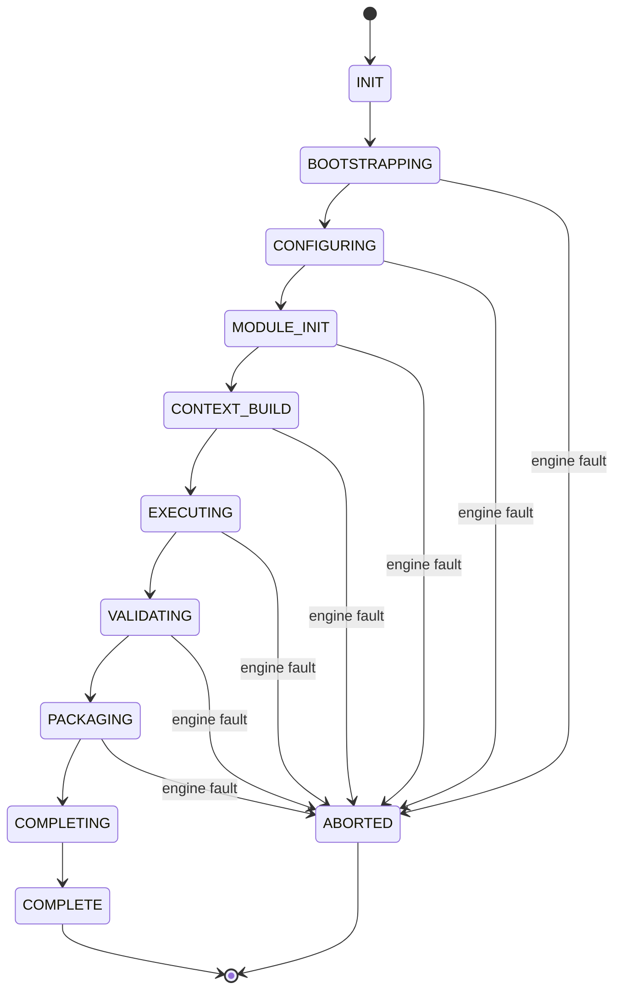

# Runtime Orchestrator Implementation

**Project:** C-Cloning — Master Runtime Implementation
**Phase:** Phase 8 — Runtime Orchestrator
**Artifact Type:** Implementation (runtime objects, contracts, interfaces, pipeline)
**Branch:** `feature/master-runtime-implementation`
**Consumes (LOCKED / prior implementation phases, never modified):** Master Runtime Architecture
v1.1; Runtime Engineering Standard; Runtime Bootstrap Implementation (Phase 1 → `BootstrapHandle`/
`BootstrapSession`); Runtime Configuration Loader Implementation (Phase 2 → `ConfigurationHandle`/
`ConfigurationSession`); Runtime Module Engine Implementation (Phase 3 → `ModuleEngineHandle`);
Runtime Context Engine Implementation (Phase 4 → `ExecutionContextHandle`); Runtime Execution Engine
Implementation (Phase 5 → `ExecutionHandle`); Runtime Validation Engine Implementation (Phase 6 →
`ValidationHandle`); Runtime Output Engine Implementation (Phase 7 → `OutputHandle`).

> This is an **implementation** artifact, not a design or specification. It defines the concrete
> orchestrator that **drives all seven previously implemented engines into one deterministic Runtime
> lifecycle**. It does **not** redesign any engine and **does not duplicate engine logic** — it only
> sequences, transitions, coordinates, and handles failure across the engines via their exposed
> handles. It never bypasses an implementation layer.

---

## 0. Implementation Conventions (inherited from Phases 1–7)

- **Object notation:** typed field lists (`name: Type`) with abstract types (`String`, `Int`, `Bool`,
  `Enum`, `Map<K,V>`, `List<T>`, `Ref<T>`, `Hash`, `Timestamp`). No platform types.
- **Interface notation:** `operation(inputs) -> outputs throws RuntimeError`.
- **Layering rule:** the orchestrator invokes each engine **only** through its exposed entrypoint and
  consumes **only** the engine handles listed above. It performs no configuration reads, no module
  logic, no execution, no validation, and no packaging itself — those belong to their engines.
- **No duplication:** the orchestrator holds no copy of any engine's internal logic; it calls the
  engine and forwards the produced handle to the next engine.
- **Immutability:** objects marked `sealed` are frozen after construction; consumers receive `Ref<T>`.
- **Determinism:** the phase order is fixed (Bootstrap → Configuration → Module → Context → Execution
  → Validation → Output → Completion); each transition is guarded and hashed. Same trigger + same
  repository/config state ⇒ same lifecycle sequence, same terminal state, same `runtime_hash`. No
  wall-clock, randomness, or enumeration-order dependence in sequencing.

### 0.1 Relationship to prior phases
Each prior phase exposes a **handle** and hands control forward. Until now, that hand-forward was
described pairwise (Phase N → Phase N+1). Phase 8 makes the whole chain **explicit and owned**: the
orchestrator is the single component that starts Bootstrap, threads each produced handle into the
next engine, and produces the final **`RuntimeHandle`** for Phase 9. It is the top-level lifecycle
owner; the engines remain the authorities for their own work.

---

## 1. Runtime Orchestrator Implementation (component inventory)

| Component | Role (implementation) |
|-----------|-----------------------|
| **RuntimeOrchestrator** | Top-level façade owning the Runtime lifecycle. Accepts a `RuntimeTrigger`, drives the orchestration pipeline across all seven engines, and exposes the `RuntimeHandle`/`RuntimeResult` to Phase 9. Holds the lifecycle controller, coordinator, scheduler, transition manager, and failure coordinator. |
| **RuntimeLifecycleController** | Orchestrates the pipeline (R0–R9); enforces fail-closed behavior; returns exactly one of `RuntimeHandle` (success) or `RuntimeError` (failure). Sole owner of the mutable `RuntimeScope`. |
| **RuntimeCoordinator** | Threads the handle produced by each engine phase into the next engine's entrypoint; verifies continuity (session id + upstream hash) between phases. Contains no engine logic. |
| **RuntimePhaseScheduler** | Produces the deterministic ordered phase list from the locked flow; a phase is dispatchable only when its predecessor reported `COMPLETED`. |
| **RuntimeTransitionManager** | Validates and applies lifecycle transitions (Section 4); rejects illegal transitions. |
| **RuntimeSessionController** | Owns the `RuntimeSession` (Section 5): the run-scoped record binding all engine sessions/handles under one Runtime identity. |
| **RuntimeFailureCoordinator** | On any engine fault, classifies it, requests deterministic teardown from already-run engines (in reverse order), and produces the `RuntimeError` (Section 8). |
| **RuntimeStateManager** | Single writer of the `RuntimePhaseTable`; records per-phase and overall lifecycle state via validated transitions. |

### 1.1 Runtime Lifecycle Controller (implementation)
```
RuntimeLifecycleController.run(trigger: RuntimeTrigger) -> RuntimeResult    # RuntimeHandle | RuntimeError
  scope := new RuntimeScope(trigger)
  for phase in RuntimeOrchestrationPipeline.phases:   # R0..R9, fixed order
      guard := RuntimeTransitionManager.enter(phase, scope)   # legal transition + predecessor COMPLETED
      if guard.is_failure: return fail(scope, guard)
      handle := phase.invokeEngine(scope)             # calls the engine entrypoint; NO engine logic here
      if handle.is_engine_error:
          err := RuntimeError.from(phase, handle, scope)
          RuntimeFailureCoordinator.teardown(scope, err)   # reverse-order teardown of prior engines
          return { status: FAILED, error: err }
      scope.apply(phase.id, handle)                   # append-only: record engine handle
      RuntimeStateManager.transition(phase.id, COMPLETED)
  session := RuntimeSessionController.seal(scope)      # sealed RuntimeSession + RuntimeResult
  return { status: SUCCESS, handle: session.handle() }
```
- Single entry, single result (`RuntimeResult` tagged union). Fail-closed: the first engine fault
  aborts, prior engines are torn down in reverse order, a structured `RuntimeError` is returned; no
  partial `RuntimeHandle` (success) escapes.
- The controller **never** performs engine work; `phase.invokeEngine` calls the engine's own
  entrypoint (e.g., `ExecutionEngine`, `ValidationEngine`) and captures its handle.

> **Verdict pass-through.** A validation FAIL **verdict** (Phase 6) is not an engine fault: Phase 6
> still returns a `ValidationHandle`, Phase 7 still packages it, and the Runtime completes with an
> overall status reflecting the verdict. Only an **engine fault** (an engine returning its own error
> object) aborts the lifecycle.

---

## 2. Runtime Runtime Objects

### 2.1 `RuntimeTrigger` (input object, sealed at intake)
```
RuntimeTrigger {
  trigger_id:     String
  correlation_id: String
  trigger_kind:   Enum{ MANUAL, SCHEDULED, EVENT, CHAINED }
  repo_target:    String            # forwarded to Bootstrap; orchestrator does not connect itself
  requested_branch: String
  requested_mode: String
  invocation_overrides: Map<String, Any>
  received_at:    Timestamp
}
```

### 2.2 `PhaseHandleRef` (produced per phase, sealed)
```
PhaseHandleRef {
  phase_id:       Enum{ BOOTSTRAP, CONFIGURATION, MODULE, CONTEXT, EXECUTION, VALIDATION, OUTPUT }
  handle_ref:     Ref<Opaque>       # the engine's exposed handle (read-only to orchestrator)
  produced_hash:  Hash              # engine-reported identity hash for continuity checks
  order_index:    Int
}
```

### 2.3 `RuntimePhaseState` / `RuntimePhaseTable` (owned by RuntimeStateManager) — see Section 4.

### 2.4 `RuntimeResult` (produced by R8, sealed)
```
RuntimeResult {
  result_id:      String
  session_id:     String
  phase_handles:  Map<Enum, Ref<PhaseHandleRef>>   # by phase_id
  output_package_ref: Ref<RuntimeOutputPackage>    # from Phase 7 (read-only)
  validation_verdict: Enum{ PASSED, FAILED, PASSED_WITH_WARNINGS }
  overall_status: Enum{ RUNTIME_SUCCEEDED, RUNTIME_SUCCEEDED_WITH_FAIL_VERDICT, RUNTIME_ABORTED }
  runtime_hash:   Hash              # deterministic over ordered produced_hashes + overall_status
}
```

### 2.5 `RuntimeHandle` (produced by R9, exposed) — see Section 5 exposure.

### 2.6 Object lineage (what produces what)
```
RuntimeTrigger
   └─(R0 Init)→ RuntimeScope + RuntimeSession(open)
   └─(R1 Bootstrap)→ PhaseHandleRef[BOOTSTRAP]   (calls Bootstrap engine)
                       └─(R2 Configuration)→ PhaseHandleRef[CONFIGURATION]
                                               └─(R3 Module)→ PhaseHandleRef[MODULE]
                                                               └─(R4 Context)→ PhaseHandleRef[CONTEXT]
                                                                                 └─(R5 Execution)→ PhaseHandleRef[EXECUTION]
                                                                                                     └─(R6 Validation)→ PhaseHandleRef[VALIDATION]
                                                                                                                          └─(R7 Output)→ PhaseHandleRef[OUTPUT]
                                                                                                                                           └─(R8 Completion)→ RuntimeResult
                                                                                                                                                                └─(R9 Expose)→ RuntimeHandle → Phase 9
```

---

## 3. Runtime Runtime Contracts

| Contract ID | Between | Guarantee |
|-------------|---------|-----------|
| **RT-HANDLES-ONLY** | Orchestrator → engines | Consumes only the seven engine handles; performs no config reads, no module/exec/validation/output work itself. |
| **RT-NO-DUP** | Orchestrator → engines | No engine logic is reimplemented; each phase calls the engine's own entrypoint. |
| **RT-NO-BYPASS** | Coordinator → layers | Each engine is invoked through its exposed interface only; no layer is skipped or reordered. |
| **RT-NO-REDESIGN** | Orchestrator → model | Orchestration follows the locked lifecycle; no engine or architecture semantics are changed. |
| **RT-ORDER** | Scheduler → phases | Phases run in the fixed locked order; a phase dispatches only after its predecessor is `COMPLETED`. |
| **RT-CONTINUITY** | Coordinator → phases | Each phase's input handle must carry the same `session_id` and reference the predecessor's `produced_hash`; mismatch aborts. |
| **RT-VERDICT-PASSTHROUGH** | Controller → completion | A validation FAIL verdict flows through Output and into `RuntimeResult`; only engine faults abort. |
| **RT-STATE-OWNER** | StateManager → all | Lifecycle state is mutated only by `RuntimeStateManager` via validated transitions. |
| **RT-DETERMINISTIC** | Orchestrator → all | Same trigger + same upstream state ⇒ same phase sequence, same terminal state, same `runtime_hash`. |
| **RT-FAILCLOSED** | Controller → all | Any engine fault → structured `RuntimeError` + reverse-order teardown; no partial success handle exposed. |
| **RT-SINGLE-RESULT** | Controller → caller | Exactly one of `RuntimeHandle` or `RuntimeError` is returned. |

---

## 4. Runtime Lifecycle Model

The Runtime moves through a single, deterministic lifecycle. The orchestrator drives it; the engines
do their own work within each phase.

| Phase state | Meaning | Set by |
|-------------|---------|--------|
| `PENDING` | Phase not yet started | scheduler |
| `ENTERED` | Transition guard passed; engine about to be invoked | transition mgr |
| `RUNNING` | Engine executing (engine-internal) | state mgr |
| `COMPLETED` | Engine returned a valid handle | state mgr |
| `FAILED` | Engine returned its error object | state mgr |
| `TORN_DOWN` | Phase quiesced during failure teardown | failure coord |

**Overall lifecycle states:** `INIT → BOOTSTRAPPING → CONFIGURING → MODULE_INIT → CONTEXT_BUILD →
EXECUTING → VALIDATING → PACKAGING → COMPLETING → COMPLETE` (success) or `→ ABORTED` (failure).

### 4.1 Phase transition rules (legal only)
| From | Allowed To | Trigger |
|------|-----------|---------|
| `PENDING` | `ENTERED`, `TORN_DOWN` | guard pass / abort before start |
| `ENTERED` | `RUNNING`, `FAILED` | engine invoked / immediate engine fault |
| `RUNNING` | `COMPLETED`, `FAILED` | valid handle / engine error |
| `COMPLETED` | `TORN_DOWN` | teardown during a later phase's failure |
| `FAILED` | `TORN_DOWN` | teardown |
| `TORN_DOWN` | — | terminal |

```
RuntimePhaseState { phase_id: Enum, state: Enum, prev_state: Optional<Enum>, transition_seq: Int, updated_at: Timestamp }
RuntimePhaseTable { phases: Map<Enum, RuntimePhaseState>, overall: Enum, global_seq: Int, state_hash: Hash }
```
**Rules**
- `RuntimeStateManager.transition(phase_id, target)` is the only mutation path; illegal transitions →
  `RuntimeError{ ILLEGAL_TRANSITION }`.
- Transition ordering is deterministic: identical trigger + identical engine outcomes ⇒ identical
  `(phase_id, from, to, seq)` series and identical `state_hash`.

### 4.2 Lifecycle diagram


---

## 5. Runtime Session Model

The **RuntimeSession** is the sealed, run-scoped object that binds all engine sessions/handles under
one Runtime identity and is exposed (via `RuntimeHandle`) to Phase 9.

```
RuntimeSession {
  session_id:      String                    # the single Runtime identity (originates at Bootstrap)
  trigger_ref:     Ref<RuntimeTrigger>        # sealed
  phase_handles:   Map<Enum, Ref<PhaseHandleRef>>   # all seven engine handles (read-only)
  result_ref:      Ref<RuntimeResult>         # sealed
  phase_table_ref: Ref<RuntimePhaseTable>     # sealed snapshot
  created_at:      Timestamp
  lifecycle:       Enum{ SEALED, EXPOSED, CLOSED }
  session_hash:    Hash                        # over session_id + runtime_hash + phase_table.state_hash
}
```
And the exposed handle:
```
RuntimeHandle {
  handle_id:       String
  session_ref:     Ref<RuntimeSession>
  result_ref:      Ref<RuntimeResult>
  output_package_ref: Ref<RuntimeOutputPackage>   # convenience direct ref (read-only, from Phase 7)
  overall_status:  Enum
  issued_at:       Timestamp
}
```
**Rules**
- A `RuntimeSession` is created only from a fully-populated scope where all seven phases are
  `COMPLETED` and a sealed `RuntimeResult` exists.
- On any engine fault before completion, no session is produced; the controller returns `RuntimeError`.
- `lifecycle` moves `SEALED → EXPOSED` when Stage R9 publishes the handle to Phase 9.
- All engine handles are held read-only; the orchestrator never mutates them (`RT-NO-DUP`, no bypass).

---

## 6. Runtime Interfaces

Behavioral contracts implemented by orchestrator components. Platform bindings deferred to the
conformance phase.

```
interface RuntimePhase {                          # one per engine phase; wraps the engine entrypoint
  id() -> PhaseId
  invokeEngine(scope: RuntimeScope) -> PhaseHandleRef throws RuntimeError   # calls the engine; no logic here
  teardown(scope: RuntimeScope) -> Unit
}

interface RuntimeCoordinator {
  thread(prev: PhaseHandleRef, next: RuntimePhase, scope: RuntimeScope) -> Unit throws RuntimeError  # continuity check
}

interface RuntimePhaseScheduler {
  phases() -> List<RuntimePhase>                 # fixed locked order
  next(table: RuntimePhaseTable) -> Optional<RuntimePhase>
}

interface RuntimeTransitionManager {
  enter(phase: RuntimePhase, scope: RuntimeScope) -> GuardResult
  isLegal(from: PhaseState, to: PhaseState) -> Bool
}

interface RuntimeStateManager {
  transition(phase_id: PhaseId, target: PhaseState) -> RuntimePhaseState throws RuntimeError
  snapshot() -> RuntimePhaseTable
}

interface RuntimeFailureCoordinator {
  teardown(scope: RuntimeScope, err: RuntimeError) -> Unit    # reverse-order engine teardown
  classify(engine_error: Opaque) -> RuntimeFailureClass
}

interface RuntimeOrchestrator {                    # exposed façade
  run(trigger: RuntimeTrigger) -> RuntimeResult
  handle() -> RuntimeHandle
  states() -> RuntimePhaseTable
}
```
**Interface rules**
- `RuntimePhase.invokeEngine` contains **no** engine logic; it invokes the corresponding engine's own
  entrypoint and returns the produced handle (or raises `RuntimeError` if the engine returns its error).
- Every failable operation throws a `RuntimeError` (never a platform-native exception escaping the
  orchestrator boundary).

---

## 7. Runtime Orchestration Pipeline

Ordered phases. Each declares **Inputs**, **Consumed Runtime Objects**, **Produced Runtime Objects**,
**Outputs**, and **Failure Behaviour**, matching the required implementation flow
(Bootstrap → Configuration → Module Engine → Context Engine → Execution Engine → Validation Engine →
Output Engine → Runtime Completion → Expose → Phase 9).

### Stage R0 — Runtime Initialization
- **Inputs:** `RuntimeTrigger`
- **Consumed objects:** trigger
- **Produced objects:** initialized `RuntimeScope`, open `RuntimeSession`; all phases → `PENDING`
- **Failure behaviour:** malformed/unauthorized trigger → `RuntimeError{ TRIGGER_ERROR }`; abort.

### Stage R1 — Bootstrap
- **Inputs:** `RuntimeTrigger`
- **Consumed objects:** trigger
- **Produced objects:** `PhaseHandleRef[BOOTSTRAP]` (Bootstrap engine invoked; yields `BootstrapHandle`)
- **Failure behaviour:** Bootstrap engine returns its error → `RuntimeError{ BOOTSTRAP_FAULT }`; abort (nothing to tear down).

### Stage R2 — Configuration
- **Inputs:** `BootstrapHandle`
- **Consumed objects:** `PhaseHandleRef[BOOTSTRAP]`
- **Produced objects:** `PhaseHandleRef[CONFIGURATION]` (Configuration Loader invoked; yields `ConfigurationHandle`)
- **Failure behaviour:** engine fault / continuity mismatch → `RuntimeError{ CONFIGURATION_FAULT }`; abort + teardown(R1).

### Stage R3 — Module Engine
- **Inputs:** `ConfigurationHandle`, `BootstrapHandle`
- **Consumed objects:** prior handles
- **Produced objects:** `PhaseHandleRef[MODULE]` (Module Engine invoked; yields `ModuleEngineHandle`)
- **Failure behaviour:** engine fault → `RuntimeError{ MODULE_FAULT }`; abort + teardown(R2,R1).

### Stage R4 — Context Engine
- **Inputs:** `BootstrapHandle`, `ConfigurationHandle`, `ModuleEngineHandle`
- **Consumed objects:** prior handles
- **Produced objects:** `PhaseHandleRef[CONTEXT]` (Context Engine invoked; yields `ExecutionContextHandle`)
- **Failure behaviour:** engine fault → `RuntimeError{ CONTEXT_FAULT }`; abort + teardown(R3..R1).

### Stage R5 — Execution Engine
- **Inputs:** `ExecutionContextHandle`, `ModuleEngineHandle`, `ConfigurationHandle`, `BootstrapHandle`
- **Consumed objects:** prior handles
- **Produced objects:** `PhaseHandleRef[EXECUTION]` (Execution Engine invoked; yields `ExecutionHandle`)
- **Failure behaviour:** engine fault → `RuntimeError{ EXECUTION_FAULT }`; abort + teardown(R4..R1).

### Stage R6 — Validation Engine
- **Inputs:** `ExecutionHandle`, `ConfigurationHandle`
- **Consumed objects:** prior handles
- **Produced objects:** `PhaseHandleRef[VALIDATION]` (Validation Engine invoked; yields `ValidationHandle` + verdict)
- **Failure behaviour:** engine fault → `RuntimeError{ VALIDATION_FAULT }`; abort + teardown(R5..R1). A FAIL **verdict** is **not** a fault — it flows forward (`RT-VERDICT-PASSTHROUGH`).

### Stage R7 — Output Engine
- **Inputs:** `ValidationHandle`, `ExecutionHandle`
- **Consumed objects:** prior handles
- **Produced objects:** `PhaseHandleRef[OUTPUT]` (Output Engine invoked; yields `OutputHandle` + `RuntimeOutputPackage`)
- **Failure behaviour:** engine fault → `RuntimeError{ OUTPUT_FAULT }`; abort + teardown(R6..R1).

### Stage R8 — Runtime Completion
- **Inputs:** all seven `PhaseHandleRef`s
- **Consumed objects:** phase handles, validation verdict, output package ref
- **Produced objects:** `RuntimeResult` (sealed; `overall_status`, `runtime_hash`)
- **Failure behaviour:** completion assembly inconsistency → `RuntimeError{ COMPLETION_ERROR }`; abort + teardown(R7..R1).

### Stage R9 — Expose Runtime Handle & Pass to Phase 9
- **Inputs:** sealed `RuntimeSession`
- **Consumed objects:** `RuntimeResult`, `RuntimePhaseTable`
- **Produced objects:** `RuntimeHandle`; session `lifecycle → EXPOSED`
- **Failure behaviour:** exposure/publish failure → `RuntimeError{ EXPOSE_ERROR }`; abort + teardown(R8..R1).

### Pipeline order (fixed)
```
R0 Init → R1 Bootstrap → R2 Configuration → R3 Module → R4 Context →
R5 Execution → R6 Validation → R7 Output → R8 Completion → R9 Expose → Phase 9
```

---

## 8. Runtime Error Objects

The single structured error returned on any unrecoverable orchestration failure (an engine fault or
an orchestration guard breach — never a validation FAIL verdict).

```
RuntimeError {
  error_id:        String
  session_id:      String
  phase_id:        Enum{ R0, R1, R2, R3, R4, R5, R6, R7, R8, R9 }
  failure_class:   Enum{ TRIGGER_ERROR, BOOTSTRAP_FAULT, CONFIGURATION_FAULT, MODULE_FAULT,
                          CONTEXT_FAULT, EXECUTION_FAULT, VALIDATION_FAULT, OUTPUT_FAULT,
                          CONTINUITY_MISMATCH, ILLEGAL_TRANSITION, COMPLETION_ERROR, EXPOSE_ERROR }
  error_code:      String                 # stable, deterministic per (phase, cause)
  engine_error_ref: Optional<Ref<Opaque>> # the underlying engine's own error object, unmodified
  message:         String
  cause_detail:    String
  completed_phases: List<Enum>            # phases COMPLETED before the fault
  torn_down_phases: List<Enum>            # phases quiesced during teardown (reverse order)
  occurred_at:     Timestamp
  recoverable:     Bool                    # always false within the orchestrator (retry re-runs from R0)
}
```
**Failure behaviour (implementation)**
- Built by the controller/failure coordinator the instant an engine returns its error object or a
  guard fails.
- The orchestrator **wraps** the engine's own error (`engine_error_ref`) rather than reinterpreting it
  (no duplication of engine logic).
- Deterministic: identical faulty inputs ⇒ identical `phase_id` + `error_code` and identical
  `torn_down_phases` order across all platforms.
- Triggers `RuntimeFailureCoordinator.teardown` (already-`COMPLETED` engines quiesced in reverse order
  R(n-1)…R1), then returns the error. No success `RuntimeHandle` is exposed. Locked artifacts and
  engine internals remain untouched.

---

## 9. Runtime Coordination Strategy

How the orchestrator threads seven engines into one deterministic lifecycle without duplicating them.

| Aspect | Strategy (implementation) |
|--------|---------------------------|
| **Handle threading** | Each phase's produced handle is recorded in the scope and passed as input to the next phase's engine — the orchestrator is a conductor, not a re-implementer (`RT-NO-DUP`). |
| **Continuity checks** | Before invoking phase N, the coordinator verifies the incoming handle's `session_id` equals the Runtime `session_id` and references phase N-1's `produced_hash` (`RT-CONTINUITY`); mismatch → `CONTINUITY_MISMATCH`. |
| **Deterministic order** | The scheduler exposes the fixed locked phase order; a phase dispatches only after its predecessor is `COMPLETED` (`RT-ORDER`). No parallelism across phases (the lifecycle is strictly linear). |
| **Single identity** | The `session_id` originates at Bootstrap and is carried through every phase and into `RuntimeSession`, giving one Runtime identity end to end. |
| **Verdict pass-through** | A validation FAIL verdict is data, not a fault: it flows Validation → Output → `RuntimeResult.overall_status = RUNTIME_SUCCEEDED_WITH_FAIL_VERDICT` (`RT-VERDICT-PASSTHROUGH`). |
| **Fail-closed teardown** | On an engine fault, completed engines are torn down in reverse order via each engine's own teardown surface; the orchestrator adds no new teardown logic beyond ordering. |
| **Determinism** | `runtime_hash` folds the ordered `produced_hash`es + `overall_status`; identical inputs ⇒ identical hash, enabling parity/idempotency checks. |
| **No bypass** | Every engine is reached only through its exposed entrypoint/handle; no engine is skipped, reordered, or short-circuited (`RT-NO-BYPASS`). |
| **Conformance** | Phase naming, logging, and error wrapping follow the Runtime Engineering Standard. |

---

## 10. Implementation Readiness Assessment

| Dimension | What is implemented here | Ready? |
|-----------|--------------------------|--------|
| Lifecycle orchestration | `RuntimeLifecycleController` + fixed pipeline R0–R9, single result | **Yes** |
| Engine consumption | Invokes all seven engines via their handles only; no config/module/exec/validation/output work itself | **Yes** |
| No duplication | Phases wrap engine entrypoints; no engine logic reimplemented (`RT-NO-DUP`) | **Yes** |
| Continuity | Session-id + upstream-hash continuity checks between phases | **Yes** |
| Deterministic lifecycle | Fixed linear phase order; content-derived hashes; single identity | **Yes (spec-level; verify in test phase)** |
| Verdict pass-through | FAIL verdict completes the Runtime with a distinct status; only faults abort | **Yes** |
| State ownership | Single-writer `RuntimeStateManager` + legal transition table | **Yes** |
| Failure handling | `RuntimeFailureCoordinator` reverse-order teardown; wraps engine errors | **Yes** |
| Errors | Single structured `RuntimeError` (faults/guard breaches only) | **Yes** |
| Session/handle | Sealed `RuntimeSession` + `RuntimeHandle` for Phase 9 | **Yes** |

**Deferred to later phases (require executable bindings + resolvable engines at runtime):**
1. Binding the orchestrator + all seven engines per platform (Claude/OpenAI/Python/LangGraph/n8n) and
   asserting identical `runtime_hash` / `state_hash` across all five.
2. Running the full lifecycle end to end against *actual* engine handles.
3. Fault-injecting each `failure_class` to confirm deterministic codes and clean reverse-order teardown,
   and verifying FAIL verdicts complete (not abort).

**Verdict:** The Runtime Orchestrator is **implementation-ready**. Every artifact is concrete, consumes
only the seven prior engine handles (never bypassing a layer, never duplicating engine logic), drives a
deterministic linear lifecycle, and produces the `RuntimeResult`/`RuntimeHandle` Phase 9 requires.

---

## 11. Internal Quality Review (self-verification)

| Check | Result |
|-------|--------|
| No Runtime Architecture modified | **PASS** — no architecture defined/changed; only orchestration machinery |
| No Runtime engine duplicated | **PASS** — `RT-NO-DUP`; phases wrap engine entrypoints; engine errors wrapped, not reinterpreted |
| Runtime Orchestrator consumes only Runtime implementation artifacts | **PASS** — `RT-HANDLES-ONLY` / `RT-NO-BYPASS`; R1–R7 consume only the seven handles |
| Runtime lifecycle remains deterministic | **PASS** — fixed linear order, continuity checks, content-derived hashes; §0, §4, §9 |
| Output is implementation-oriented | **PASS** — components, objects, interfaces, pipeline, state/failure/error wiring; no design narrative |
| State mutation controlled | **PASS** — single-writer `RuntimeStateManager` via legal transitions (`RT-STATE-OWNER`) |
| Single entry, single result; fail-closed | **PASS** — §1.1 (`RT-SINGLE-RESULT`, `RT-FAILCLOSED`) |

**No section resembled a design document; no rewrite required. Approved for commit.**

---

*End of Runtime Orchestrator Implementation — Phase 8, Project C-Cloning.*
