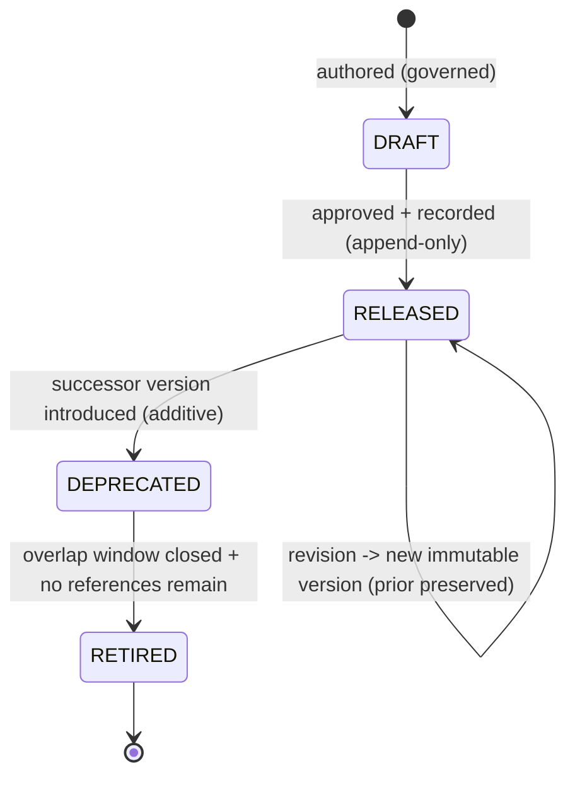

# Visual Production System (VPS)

## Stage B — Module B7: Animation Preset System

> **Document type:** Module specification (conceptual, implementation-independent)
> **Project:** Visual Production System (VPS)
> **Roadmap position:** Stage B · Module B7 — the seventh and **final Asset-Layer** specification module, following the locked B1 Character, B2 Expression, B3 Pose, B4 Prop, B5 Environment, and B6 Camera Systems
> **Home layer:** Asset Layer (`vps/asset/`) — per A6 §2 (B7) and A3 §3
> **Depends on / inherits (locked):** A1–A10 (Stage A), B1–B6 (Asset-Layer kinds)
> **Status:** Proposed — the canonical Animation Preset System specification
> **Scope discipline:** This document defines **only the canonical Animation Preset System.** It **does not define characters, expressions, poses, props, environments, or cameras**, **does not define compatibility relationships** (Knowledge Layer / B8), and **does not define scene composition** (Composition / B9). It is **conceptual and implementation-independent**: no engines, models, formats, schemas-as-code, field types, or tools. It defines *what an animation preset is and how it is governed* — not how it is applied to any asset, sequenced into a scene, executed over time, or rendered.

---

## 0. Purpose of This Document

B7 specifies the animation preset as an independent, reusable Asset-Layer asset kind — a reusable **animation preset definition**, a sibling of the character, expression, pose, prop, environment, and camera. Under A6, the Animation Preset System is an **Asset-Layer module** whose single responsibility is to be the **single source of truth for what an animation preset is and which animation preset is which.**

The critical boundary (per A6 §1/§2, B7): B7 owns reusable animation preset **definitions**; the **application** of a preset to an asset, its **sequencing/timeline placement** within a scene, and its **execution over time** are **NOT B7's** — those belong to the Composition Layer (B9). Likewise, *which* assets a preset may be applied to is a **relationship owned by the Knowledge Layer (B8)**. A preset is therefore a self-contained, reusable definition — not an applied animation and not a scene behavior. This keeps B7 an independent Asset-Layer leaf (A6 §5) and preserves single source of truth.

Every rule applies the locked disciplines: **asset-first**, **single source of truth**, **determinism**, **identity over location**, **implementation-independence**, **contract-based Runtime compatibility**, and **no responsibility overlap**.

---

## 1. Animation Preset Purpose

- **P-1 · An animation preset is a reusable visual asset.** It is a first-class, reusable Asset-Layer entity (a reusable animation preset definition) referenceable by identity across unlimited future productions (A1 reuse; A6 B7).
- **P-2 · Single source of truth for "what an animation preset is."** The Animation Preset System is the one authoritative place a preset is defined; no other module defines or copies a preset definition (A2 §4; A7 MD-1/ID-6).
- **P-3 · Define once, reference everywhere.** A preset is authored once and consumed by reference; never duplicated (A1 §12; A7 ID-6).
- **P-4 · A definition, not an application.** A preset is defined without reference to any asset it may later animate, any scene, or any timeline; application/sequencing/execution are B9's, and applicability relationships are B8's (§12).
- **P-5 · A stable anchor for future modules.** The identity a preset exposes is what B8, B9, and future modules reference — without B7 knowing about them (§12).

**Out of purpose (explicitly):** characters, expressions, poses, props, environments, cameras, applying a preset to an asset, sequencing/timeline placement, runtime execution/playback, scene composition, compatibility relationships, and rendering.

---

## 2. Animation Preset Identity Model

The backbone of single source of truth and determinism (A7 ID-*).

- **IM-1 · Exactly one identity per preset.** A single canonical identity denotes one animation preset (A7 ID-1).
- **IM-2 · Stable & immutable.** Once assigned, a preset identity never changes and is never reused for a different preset, regardless of later edits or storage reorganization (A7 ID-1; A3 §5).
- **IM-3 · Globally unique within the VPS.** A preset identity never collides with any other asset identity of any kind — including characters, expressions, poses, props, environments, and cameras (A7 ID-2).
- **IM-4 · Kind-attributable.** A preset identity makes its owning kind (animation preset) and owning module (B7) unambiguous from the identity alone (A7 ID-3).
- **IM-5 · Opaque to consumers.** Consumers treat a preset identity as an opaque reference; they must not parse it to infer content or bypass B7 (A7 ID-4).
- **IM-6 · Identity ≠ version.** Identity says *which preset*; version says *which revision* (A7 ID-5; §8).
- **IM-7 · Deterministic resolution.** Identity + version resolves to the same canonical definition given the same repository/version state (A4 determinism).
- **IM-8 · Kind- and target-independent.** A preset identity encodes no character/pose/camera/other-kind identity and no association to any asset it may animate (§12; A7 CP-4).

---

## 3. Animation Preset Metadata Model *(intrinsic only)*

> **Boundary note (no-overlap):** the Knowledge Layer (B8) owns **relational/extrinsic metadata** — relationships (including any preset↔asset "applicable-to" association), compatibility, and cross-kind indexing (A2 §4; A7 MD-1; A8 §5). B7 owns **only intrinsic definitional metadata** — attributes that *are* part of the canonical preset definition.

Intrinsic metadata categories (conceptual — not a storage schema):

- **MM-1 · Identity metadata.** The preset's canonical identity and kind attribution (§2). Owned by B7.
- **MM-2 · Descriptive metadata.** Human-meaningful descriptors of the preset as a standalone entity (its name, classification tags — §4/§5). Owned by B7.
- **MM-3 · Definitional metadata.** The canonical, intrinsic properties that constitute *what the preset is* as a reusable definition, kept implementation-independent. Owned by B7.
- **MM-4 · Lifecycle/version metadata.** The preset's version and lifecycle state (§8). Content authority is B7's; **version authority of record remains the Knowledge Layer registry** (A8 §5) — B7 exposes its version, it does not run a competing registry.
- **MM-5 · Provenance/governance metadata.** Attribution and change-record references supporting audit (A7 DOC/CM), recorded append-only per A8.

**Explicitly excluded from B7 metadata:** any preset↔asset "applicable-to" association, application/sequencing/timeline data, execution or playback state, relationships to other assets, compatibility rules, and any cross-kind index — all Knowledge-Layer (B8) or Composition (B9) concerns.

---

## 4. Animation Preset Classification System

Classification is an **intrinsic, preset-only taxonomy** — categorizing presets *as presets*, never as relationships to other kinds or as application semantics.

- **CL-1 · Intrinsic categorization only.** Classification describes properties of the preset itself; it never encodes links to characters, cameras, or other assets, and never encodes where/how it is applied (§12 no-overlap).
- **CL-2 · Governed vocabulary.** Uses a governed, versioned vocabulary so categories are consistent across all presets (A7; A8 additive dimensions).
- **CL-3 · Additive & versioned.** New categories are added additively behind a versioned vocabulary; existing presets are never broken (A8 EV-1).
- **CL-4 · Deterministic.** A preset's classification is a stable property of its definition/version, not a runtime decision.
- **CL-5 · Non-authoritative for combination.** Classification may *inform* future compatibility decisions but B7 decides no compatibility; it only exposes classification for B8 to consult (§9 boundary).

---

## 5. Animation Preset Naming Standard

Naming makes presets unambiguous for humans; it never substitutes for identity (A7 N-*/ID-*).

- **NM-1 · Name is descriptive, identity is authoritative.** Consumers reference by identity, never by name (A7 ID-4).
- **NM-2 · Uniqueness within the preset kind.** Names are unique among presets to avoid human ambiguity; renaming does not change identity (IM-2).
- **NM-3 · Consistent casing/format per A7.** Follows the single A7 §1 naming rule, applied uniformly to all presets — no per-preset dialects.
- **NM-4 · Renderer/model-neutral.** Names never encode a renderer, engine, model, or vendor (A7 N-6).
- **NM-5 · No cross-kind/target encoding.** A preset name never embeds a character, camera, or other kind's name/identity, nor any target it may animate — names describe the preset alone (§12).
- **NM-6 · Renaming is a governed change.** A name change is governed and recorded, leaving identity untouched (A7 N-7; §11).

---

## 6. Animation Preset Identifier Strategy

- **ID-STR-1 · Minted once, by B7.** Preset identities are assigned solely by the Animation Preset System at definition time; no other module mints preset identities (A2 §4).
- **ID-STR-2 · Opaque & stable.** Identifiers are opaque and permanent (IM-5/IM-2); consumers derive no meaning from them.
- **ID-STR-3 · Distinct from name and version.** Identifier ≠ name (§5) and identifier ≠ version (§8) — three separate concepts (A7 ID-5).
- **ID-STR-4 · Reference-only across boundaries.** Anything leaving B7 — into the Knowledge Layer, Composition, or across the Runtime seam — carries the identifier (and version), never a copy of the definition (A4 §12; A5 §5; A7 ID-6).
- **ID-STR-5 · Kind-resolvable, collision-free.** The scheme keeps preset identities resolvable to the preset kind/module and free of collision with any other kind (A7 ID-2/ID-3).

---

## 7. Animation Preset Ownership

Ownership is exclusive and singular (A6 §7; A7 SSOT).

| Owned datum | Owner | Others may… |
|-------------|-------|-------------|
| Canonical animation preset **definitions** + their **identities** | **B7 Animation Preset System** (Asset Layer) | reference by identity/version only |
| Preset **name & intrinsic classification** | **B7** | read; never redefine |
| Preset **version content** | **B7** (content) / **Knowledge Layer** (version authority of record) | query authority via B8 |
| Preset↔asset "applicable-to" (and any cross-kind) relationships & compatibility | **Knowledge Layer (B8)** — *not B7* | B7 exposes identity/attributes for B8 to relate |
| Applying a preset to an asset, sequencing/timeline placement, execution over time | **Composition (B9)** — *not B7* | B7 remains unaware of it |
| Scene composition that uses a preset | **Composition (B9)** — *not B7* | B7 provides referenced definitions only |

- **OW-1 · One owner, no copies.** No module copies a preset definition; all use references (A7 ID-6).
- **OW-2 · B7 owns definitions, not application.** B7 never owns relational/compatibility data (B8) or application/sequencing/execution (B9) — this prevents the most likely overlap for an animation preset (definition vs. applied behavior).

---

## 8. Animation Preset Lifecycle

The preset lifecycle instantiates the locked A8 version lifecycle for preset definitions; B7 defines the shape, not a version manager.



- **LC-1 · Immutable per version.** A change to a released preset produces a **new version**; existing versions are never mutated (A8 VE-3) — enabling deterministic reproduction.
- **LC-2 · Self-describing usage.** When a preset participates in a production, the exact preset version is embedded in the immutable production package by Composition (A4 §10; A8 VE-4) — B7 simply exposes stable, versioned definitions.
- **LC-3 · Deprecate with a successor.** A superseded version is deprecated only when an additive successor exists, with a governed overlap window (A8 VL-3/VL-4).
- **LC-4 · Safe retirement.** Retirement occurs only after the window closes and no governed reference remains (A8 VL-5; A7 DEP-6).
- **LC-5 · Append-only history.** All lifecycle transitions are recorded append-only (A3 §6; A8 VE-5).
- **LC-6 · Independent lifecycle.** A preset's lifecycle is independent of any other kind's lifecycle and of any application; versions are not coupled across kinds (an association, if any, is a B8 concern).

---

## 9. Animation Preset Compatibility Posture *(requirements only — relationships owned by B8)*

> **Boundary note:** compatibility *relationships* (including which assets a preset may be applied to) are owned and decided by the Knowledge Layer (B8) and enforced at the A4 V3 checkpoint by Asset Validation (B10) (A8 §6). B7 defines **no** compatibility relationships; it defines only the **requirements it must satisfy to be compatibility-checkable.**

- **CR-1 · Expose a stable, resolvable identity + version** so B8 can relate it and B10 can gate it deterministically (§2/§8).
- **CR-2 · Expose intrinsic classification** (§4) as read-only attributes for B8 to form relationships — B7 states none itself (CL-5).
- **CR-3 · Deterministic, immutable inputs.** Because preset versions are immutable (§8), any verdict B8/B10 compute over a preset is deterministic and reproducible (A8 CM-5).
- **CR-4 · No cross-kind/target assumptions.** A preset definition must not assume or encode compatibility with, or applicability to, any specific asset or kind; it remains self-contained (A7 CP-4; §12).
- **CR-5 · Contract-exposed, not self-asserted.** A preset exposes compatibility-relevant attributes through the governed contract surface; it never asserts that it *is* compatible with or applicable to anything (that is B8's verdict).

---

## 10. Animation Preset Repository Organization

Per A3 (`vps/asset/`), the Animation Preset System occupies a single, exclusive subtree; B7 defines the organization, this document creates no content.

```text
vps/
└── asset/
    ├── registry/
    │   └── animation-preset/       # authoritative preset identity registry (define-once identities)
    └── definitions/
        └── animation-preset/       # canonical preset definitions (governed data; assets NOT defined here in B7)
```

- **RO-1 · One exclusive subtree.** Presets live only under the animation-preset subtree of the Asset Layer; no preset data exists elsewhere (A3 §3; SSOT).
- **RO-2 · Registry separated from definitions.** Identity assignment (registry) is kept distinct from definition content, both owned by B7.
- **RO-3 · Identity-addressed, not path-addressed.** References use identity, so definitions may be reorganized within the subtree without breaking references (A3 §5; IM-2).
- **RO-4 · Grows as governed data.** The subtree grows by adding preset definitions as data, not by changing logic (A3 §7; A1 "grow the library").
- **RO-5 · No foreign content.** The animation-preset subtree holds only preset definitions/identities — never other kinds, applications, sequencing, timelines, relationships, or metadata owned by other modules.
- **RO-6 · Sibling to other kinds.** The animation-preset subtree is parallel to the character, expression, pose, prop, environment, and camera subtrees; presets are never stored inside another kind (reinforces independence, §12).

---

## 11. Animation Preset Extensibility Strategy

- **EX-1 · Additive definitions.** New presets are added as new governed definitions under the animation-preset subtree; no structural change and no impact on existing presets (A6 §8; A8 EV-1).
- **EX-2 · Additive intrinsic attributes.** New intrinsic classification/descriptive dimensions are added additively behind versioned vocabularies (§4; A8).
- **EX-3 · Versioned evolution.** Changes to an existing preset are new immutable versions, never in-place mutations (§8).
- **EX-4 · No overlap growth.** Extensibility never expands B7 into application, sequencing, execution, scene composition, other kinds, relationships, or compatibility — those grow in their own modules (§12).
- **EX-5 · Contract-stable.** The preset contract surface evolves additively and backward-compatibly so consumers (B8, Composition, Runtime) are never broken (A7 CT-6; A8 §6).

---

## 12. Animation Preset Scope Boundaries & No-Overlap Declaration

B7 explicitly **defers** the following and absorbs none of them:

| Concern | Owner (not B7) | B7's only relationship to it |
|---------|----------------|-------------------------------|
| Characters | B1 Character System | independent kind; B7 defines no characters |
| Expressions | B2 Expression System | independent kind; B7 defines no expressions |
| Poses | B3 Pose System | independent kind; B7 defines no poses |
| Props | B4 Prop System | independent kind; B7 defines no props |
| Environments | B5 Environment System | independent kind; B7 defines no environments |
| Cameras | B6 Camera System | independent kind; B7 defines no cameras |
| Applying a preset / sequencing / timeline / execution over time | Composition (B9) | B7 defines a reusable preset; no application, sequencing, or playback |
| Preset↔asset "applicable-to" associations | Knowledge Layer (B8) | B7 exposes a preset identity to be related; encodes no association |
| Relationships & cross-kind index | Knowledge Layer (B8) | B7 exposes identity/attributes; owns no relationships |
| Compatibility relationships & verdicts | B8 (owner) + B10 (gate) | B7 satisfies compatibility *requirements* (§9); asserts no compatibility |
| Scene composition / package | Composition (B9) | B7 provides referenced definitions; composes nothing |
| Renderer output | Production (later stage) | B7 is renderer-agnostic; defines nothing renderer-specific |

**No-overlap guarantee:** B7 owns exactly "what an animation preset is + which preset is which." Every other concern — especially *applying* a preset, *sequencing/timeline* placement, *execution over time*, and *scene composition* (all B9), and preset↔asset applicability (B8) — is referenced by identity or owned elsewhere, never absorbed.

---

## 13. Animation Preset System Specification (Consolidated)

> The Animation Preset System is the Asset-Layer, single-source, identity-addressed, versioned definition of reusable animation presets, defined independently of all other kinds and independently of application, sequencing, execution, and scene composition. It owns preset definitions, identities, intrinsic metadata, intrinsic classification, and names; it exposes stable identities/versions/attributes for other modules to reference; and it owns no relationships, compatibility, cross-kind associations, application/sequencing/execution, scene composition, or rendering.

This consolidates the identity model (§2), intrinsic metadata (§3), classification (§4), naming (§5), identifier strategy (§6), ownership (§7), lifecycle (§8), compatibility posture (§9), repository organization (§10), extensibility (§11), and scope boundaries (§12) into one coherent, preset-only module.

---

## 14. Animation Preset Readiness Assessment

| Dimension | Question | Assessment |
|-----------|----------|------------|
| **Scope limited to preset definitions** | Does B7 define only animation preset definitions? | **Yes** — no other kinds, no application/sequencing/execution, no scene composition, and no compatibility relationships; §12 declares all deferrals. |
| **No absorbed responsibilities** | Are future-module responsibilities absorbed? | **No** — application/sequencing/execution/composition are B9; applicability/relationships/compatibility are B8; B7 owns only definitions/identities. |
| **Stage A alignment** | Does B7 fit A1–A10? | **Yes** — Asset-Layer home (A2/A3/A6), identity/standards (A7), lifecycle/validation (A8), evolution (A9), within the lock (A10). |
| **B1–B6 alignment** | Is B7 consistent with the locked prior Asset-Layer modules? | **Yes** — parallel independent Asset-Layer kind; references other identities only via B8; encodes no cross-kind or target data. |
| **SSOT** | Is single source of truth preserved? | **Yes** — B7 is the sole preset authority; references only elsewhere. |
| **Runtime compatibility** | Is B7 Runtime-compatible? | **Yes** — exposes identity/version by reference; reachable only via the locked seam through Composition; owns no orchestration or execution. |
| **Implementation-independence** | Any implementation detail? | **No** — conceptual model only; no engines/models/formats/schemas-as-code/tools. |
| **Supports future modules** | Can all other kinds and the Knowledge Layer build on B7? | **Yes** — B7 provides a stable, opaque, versioned preset identity they reference, without B7 knowing them. |

**Readiness verdict:** **READY.** The Animation Preset System is a complete, preset-definition-only, Stage-A-aligned specification that completes the seven Asset-Layer kinds and supports the Knowledge Layer and Composition without overlap.

---

## 15. Internal Quality Review (self-check performed before finalization)

- ✅ **Scope is limited to animation preset definitions.** Verified — B7 defines only the preset definition model; §12 explicitly defers all other kinds, application, sequencing, timeline, execution, scene composition, relationships, and compatibility to their owners.
- ✅ **No future module responsibilities are absorbed.** Verified — applying/sequencing/executing a preset and scene composition are owned by Composition (B9); preset↔asset applicability and all relational/extrinsic metadata and compatibility by B8; B7 owns only intrinsic definitions and identities and merely *exposes* attributes.
- ✅ **Aligns with Stage A.** Verified — Asset-Layer placement (A2/A3/A6), identifier/naming/metadata standards (A7), version lifecycle and validation gates (A8), additive evolution (A9), within the A10 lock; Runtime-compatible via the single seam (A5).
- ✅ **Supports Character, Expression, Pose, Prop, Environment, Camera, and Knowledge Layer modules.** Verified — B7 is an independent kind parallel to B1–B6 that exposes a stable, opaque, versioned identity those modules (and B8) reference, without B7 depending on or defining any of them.
- ✅ **Scope discipline held.** Verified — conceptual/implementation-independent; no assets enumerated; no scene composition; a single document is committed.

No inconsistencies remained at finalization.

---

## 16. Remaining Stage B Modules

B7 is the seventh of the ten locked Stage B modules (A6/A9) and **completes the Asset Layer**; it changes no roadmap.

- **Asset Layer:** **COMPLETE** — B1 Character, B2 Expression, B3 Pose, B4 Prop, B5 Environment, B6 Camera, B7 Animation Preset are all specified as independent, disjoint asset-kind modules.
- **Knowledge Layer (next):** **B8 Asset Relationship Graph** — will own relationships, compatibility, cross-kind indexing, and version authority across kinds, referencing all of B1–B7 identities. This is the first module that *relates* the asset kinds rather than defining one.
- **Composition Layer:** **B9 Asset Packaging** — will assemble resolved selections (including applying presets and sequencing) into the immutable production package.
- **Cross-cutting:** **B10 Asset Validation** — will gate preset (and all) invariants at the A4 checkpoints.

B7 guarantees these can proceed by providing the final stable asset-kind identity foundation they build upon, with no overlap and no roadmap change.

---

*End of Stage B · Module B7 — Animation Preset System. This document specifies only the canonical Animation Preset System and inherits the locked A1–A10 and B1–B6. It defines no other asset kinds, no compatibility relationships, and no scene composition, and implements no behavior.*
