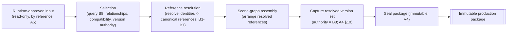

# Visual Production System (VPS)

## Stage B — Module B9: Asset Packaging

> **Document type:** Module specification (conceptual, implementation-independent)
> **Project:** Visual Production System (VPS)
> **Roadmap position:** Stage B · Module B9 — the **Composition Layer** specification module; the first module that *acts on* the asset + knowledge foundation to produce an output artifact, and the VPS's single Runtime entry point
> **Home layer:** Composition Layer (`vps/composition/`) — per A6 §2 (B9) and A3 §3
> **Depends on / inherits (locked):** A1–A10 (Stage A), B1–B7 (Asset-Layer kinds), B8 Asset Relationship Graph (Knowledge Layer)
> **Status:** Proposed — the canonical Asset Packaging specification
> **Scope discipline:** This document defines **only the canonical Asset Packaging architecture.** It **defines no assets**, **modifies no asset definitions**, **defines no relationships** (Knowledge / B8), **implements no validation logic** (Asset Validation / B10), and **implements no rendering** (Production / later stage). It is **conceptual and implementation-independent**: no engines, models, formats, schemas-as-code, algorithms, or tools. It defines *what a production package is, how it is assembled, and how it is handed to the Runtime* — always by **reference** to asset and relationship identities, never by copying or modifying them.

---

## 0. Purpose of This Document

B9 is where the VPS turns a body of governed, single-source assets (B1–B7) and their governed relationships (B8) into a **finished, immutable, renderer-agnostic production package** — the deterministic output of the Composition Layer (A2 §2.3, A4 M4). It is the first Stage B module that *produces* rather than *defines*.

B9 is a **compiler, not an author**. It never creates or alters an asset, never declares or alters a relationship, never checks validity itself, and never renders. It **resolves references, assembles a scene graph and selections, and seals a self-describing package** that downstream layers consume. This keeps the Asset and Knowledge layers as the sole sources of truth and confines composition to deterministic assembly.

Every rule applies the locked disciplines: **generation-as-compilation**, **single source of truth**, **determinism**, **reference-not-duplicate**, **immutable production packages**, **renderer-agnostic**, **contract-based Runtime integration (single entry)**, **implementation-independence**, and **no responsibility overlap**.

---

## 1. Purpose of Asset Packaging

- **P-1 · Compile inputs into one immutable package.** B9's single responsibility is to compile Runtime-approved input + B8 facts + resolved B1–B7 references into exactly one **immutable, self-describing, renderer-agnostic production package** (A2 §2.3; A4 M4/V4; A6 B9).
- **P-2 · The single Runtime entry point.** B9 is the one control entry into the VPS; the Runtime invokes production here and nowhere else (A5 VP-2; A4 M1).
- **P-3 · Reference, never duplicate or modify.** B9 resolves asset identities to canonical references and consumes B8 relationships/compatibility/version authority — copying no definition and altering no asset or relationship (P; architectural rules).
- **P-4 · Deterministic compilation.** Given identical Runtime input, asset library, knowledge state, and governed configuration, B9 yields the same package (A1 determinism; A4 §5).
- **P-5 · The hand-off origin to Production.** B9 seals the package and hands it, immutable, to the Production Layer (later stage) via a one-way artifact hand-off (A4 M5; A2 §3).

**Out of purpose (explicitly):** defining/altering assets (B1–B7), declaring/altering relationships or compatibility (B8), executing validation verdicts (B10), and rendering/renderer-specific output (Production, later stage).

---

## 2. Package Identity Model

A production package is a **first-class, governed Composition-Layer artifact** with its own identity — distinct from the asset and relationship identities it references (A7 ID-*).

- **PIM-1 · Every package has exactly one identity.** A single canonical identity denotes one production package (A7 ID-1).
- **PIM-2 · Stable & immutable.** A package identity never changes and is never reused for a different package (A7 ID-1; A3 §5).
- **PIM-3 · Globally unique within the VPS.** Package identities never collide with asset, relationship, or other identities (A7 ID-2).
- **PIM-4 · Kind-attributable.** A package identity is attributable to the package kind and to B9 as owner (A7 ID-3).
- **PIM-5 · Correlatable to the request.** A package carries the Runtime request identity (A5 §4) so it is traceable end-to-end, without B9 owning orchestration state (A5 §6).
- **PIM-6 · Identity ≠ version/content.** A package identity says *which package*; the package embeds the exact resolved asset/relationship **version set** it was built from (§3/§10; A4 §10).
- **PIM-7 · Opaque & deterministic.** Package identities are opaque to consumers and the package resolves deterministically from the same inputs/repository state (A7 ID-4; A4 determinism).

---

## 3. Package Metadata Model *(intrinsic to the package)*

> **Boundary note:** B9 owns metadata *about the package it assembles* — it holds **references** to assets (B1–B7) and relationships (B8) and copies neither their definitions nor their records.

Intrinsic package-metadata categories (conceptual — not a storage schema):

- **PM-1 · Package identity metadata.** The package's canonical identity, kind attribution, and correlating request identity (§2). Owned by B9.
- **PM-2 · Resolved reference set.** The asset identities (by identity + resolved version) the package includes — **references only** (P-3; A7 ID-6).
- **PM-3 · Scene graph.** The assembled structural arrangement of the resolved references (§4). Owned by B9 as a derived artifact; it arranges references, it does not contain asset definitions.
- **PM-4 · Selection record.** The asset-selection decisions made during assembly, traceable to the B8 facts that informed them (§4/§5). Owned by B9.
- **PM-5 · Embedded version set.** The exact resolved content-version set (assets + relationships) the package was sealed with, making it self-describing and reproducible (A4 §10; A8 VE-4). Owned by B9 as captured data; version *authority* remains B8 (§5).
- **PM-6 · Provenance/governance metadata.** Attribution and change-record references supporting audit (A7 DOC/CM), recorded append-only per A8.

**Explicitly excluded:** any copy of an asset definition (B1–B7) or relationship record (B8); any validation verdict (B10); any renderer-specific artifact (Production).

---

## 4. Package Assembly Model

Assembly is **deterministic compilation** (A1; A4 M4). B9 transforms known inputs into one predictable package through defined, ordered steps — assembling references, never creating content.



- **AM-1 · Selection via B8.** B9 queries the Asset Relationship Graph (B8) for compatible selections and version authority; it applies B8's declared relationships, it does not invent them (P-3; A4 M3).
- **AM-2 · Reference resolution.** Selected asset identities are resolved to canonical references (B1–B7) — resolution reads definitions by reference; it never copies or edits them (A4 M2; P-3).
- **AM-3 · Scene-graph assembly.** B9 arranges the resolved references into a scene graph — the derived structural artifact it owns (A2 §2.3). The scene graph holds references and structure, not asset content.
- **AM-4 · Preset application belongs here (as arrangement), not in B7.** Applying/sequencing an animation preset and placing a camera are **composition arrangements** performed by B9 over references (per B6/B7 boundaries) — B9 arranges; it authors no preset or camera.
- **AM-5 · Deterministic and complete.** Assembly is deterministic and must yield a *complete* package or fail; B9 never emits a partial or improvised package (A4 FB-3/V4).
- **AM-6 · Renderer-agnostic output.** The assembled package carries structure + references + version set only — nothing renderer-specific (A2 §2.3; renderer-agnostic rule).

---

## 5. Asset Resolution Strategy

- **RS-1 · Resolve by identity + version.** B9 resolves each selected asset by its identity and the version authoritatively resolved via B8's version registry (A4 §10; A8 §5) — the resolved version is captured, not re-derived.
- **RS-2 · Reference-only resolution.** Resolution yields a canonical **reference** placed into the scene graph/package; the asset definition stays owned by B1–B7 and is never copied into the package (P-3; A7 ID-6).
- **RS-3 · Knowledge-mediated selection.** *Which* identities to resolve is determined by B8 relationships/compatibility (declared) — B9 consumes these facts; it declares none (A6 overlap guard).
- **RS-4 · Deterministic resolution.** The same identity + version + repository state resolves to the same canonical reference every time (A4 determinism).
- **RS-5 · Fail loud on unresolved references.** An identity that cannot be resolved halts assembly with an attributable failure (A4 V2/§9) — never a fabricated or guessed asset.
- **RS-6 · No modification.** Resolution is strictly read/reference; B9 modifies no asset and no relationship during resolution (architectural rules).

---

## 6. Package Ownership

Ownership is exclusive and singular (A6 §7; A7 SSOT).

| Owned datum | Owner | Others may… |
|-------------|-------|-------------|
| **Scene graph, selection decisions, and the production package** (records + identities) | **B9 Asset Packaging** (Composition Layer) | receive references to the sealed package |
| **Embedded version set** (captured in the package) | **B9** (captured) / **B8** (version authority of record) | read; B8 remains the authority |
| Asset **definitions/identities** | **B1–B7** — *not B9* | B9 references/resolves; never copies or edits |
| Relationships, compatibility, index, version authority | **B8** — *not B9* | B9 queries; never declares or edits |
| Validation verdicts / gate execution | **Asset Validation (B10)** — *not B9* | B9 presents the package to be gated; runs no checks |
| Renderer-specific output | **Production (later stage)** — *not B9* | B9 hands off the immutable package; renders nothing |
| Orchestration/scheduling/global state | **Master Runtime** — *not B9* | B9 is driven; owns no orchestration |

- **OW-1 · B9 owns derived artifacts only.** The scene graph, selections, and package are derived from — never new sources of truth over — assets/relationships (A4 §12).
- **OW-2 · Never duplicate or modify.** B9 holds references; it copies no definition and edits no asset or relationship (architectural rules).

---

## 7. Package Lifecycle

A package's lifecycle mirrors the A4 request data-states and honors the A8 immutability discipline; B9 defines the shape, executes no orchestration.

```mermaid
stateDiagram-v2
    [*] --> ASSEMBLING: Runtime invokes (A5 entry); input read-only
    ASSEMBLING --> RESOLVED: selections resolved via B8 + B1-B7 references
    RESOLVED --> COMPOSED: scene graph + selections assembled
    COMPOSED --> SEALED: package sealed immutable (V4) + version set embedded
    SEALED --> HANDED_OFF: immutable package handed to Production (A4 M5)
    HANDED_OFF --> REPORTED: completion/reference reported to Runtime (A5)
    REPORTED --> [*]
    ASSEMBLING --> FAILED: cannot resolve/assemble -> attributable failure (A4 §9)
    RESOLVED --> FAILED
    COMPOSED --> FAILED
    FAILED --> [*]: reported to Runtime
```

- **LC-1 · Sealed = immutable boundary.** Once SEALED (V4), the package content is frozen; no state after it may mutate the package (A4 §11; immutability rule §10).
- **LC-2 · Self-describing at seal.** At seal, the exact resolved version set is embedded, making the package reproducible (A4 §10; A8 VE-4).
- **LC-3 · One-way hand-off.** HANDED_OFF is a one-way transfer of a finished artifact to Production; B9 retains authorship, not control of rendering (A4 M5; A2 §3).
- **LC-4 · Fail loud.** If a complete, deterministic package cannot be assembled/sealed, B9 halts and reports an attributable failure — never a partial package (A4 FB-3/§9).
- **LC-5 · Append-only history.** Package lifecycle/provenance transitions are recorded append-only (A3 §6; A8 VE-5).

---

## 8. Runtime Handoff Model

B9 is the sole Runtime-facing seam of the VPS control flow (A5), and it is subordinate to the Runtime.

- **HO-1 · Single entry.** The Runtime invokes production by passing approved, compiled input to B9 — the one VPS control entry (A5 VP-2; A4 M1). No other module is Runtime-reachable for control.
- **HO-2 · Read-only input.** The approved input is treated as read-only and remains owned by the Runtime; B9 never mutates it (A5 §4; A4 §12).
- **HO-3 · Contract-bound.** Invocation, status, and results cross the versioned Runtime contracts (A5 §7); B9 couples to no Runtime internals.
- **HO-4 · Report references, not artifacts.** On completion, B9 reports the package identity/reference and resolved version set to the Runtime; it transfers references, not embedded artifacts (A5 §5; SSOT).
- **HO-5 · Failures are attributable; Runtime decides.** B9 reports attributable assembly failures (layer + A4 checkpoint + request id) via the failure contract; the Runtime alone decides retry/reroute/abort (A5 §9). B9 self-orchestrates nothing.
- **HO-6 · Production hand-off is internal.** The sealed package moves to the Production Layer as an internal A4 M5 hand-off, distinct from the Runtime reporting channel — preserving the acyclic flow (A4 §10).

---

## 9. Immutability Rules

- **IMM-1 · Seal freezes content.** At V4 seal, the package's scene graph, selections, references, and embedded version set become immutable; nothing downstream may alter them (A4 §11; A8 immutability).
- **IMM-2 · Change ⇒ new package.** A different result requires assembling a **new** package (with its own identity); a sealed package is never mutated in place (A8 VE-3 analog for packages).
- **IMM-3 · Self-describing = reproducible.** Because the package embeds its exact version set and references immutable asset/relationship versions, any past production is reconstructable deterministically (A4 §10; A8 VE-4).
- **IMM-4 · Downstream is read-only.** Production (and any consumer) reads the sealed package; it never writes back into it (A2 §2.4; A4 M5).
- **IMM-5 · No hidden mutation.** B9 introduces no post-seal side effects on the package or on the assets/relationships it referenced (SSOT; architectural rules).

---

## 10. Repository Organization

Per A3 §2.3 (`vps/composition/`), B9 owns the single, exclusive Composition-Layer hierarchy; this document creates no content.

```text
vps/
└── composition/
    ├── scene-graph/            # scene-graph assembly definitions (structure over references)
    ├── selection/              # asset-selection strategy definitions (consume B8 facts)
    ├── package/                # immutable production-package assembly + the sealed-package shape
    └── registry/
        └── package/            # authoritative package identity registry (define-once identities)
```

- **RO-1 · One exclusive hierarchy.** All scene-graph, selection, and package data live under `vps/composition/`; none exists elsewhere (A3 §3; SSOT).
- **RO-2 · References, never definitions.** Every record here references asset/relationship identities; no asset definition or relationship record is stored under `composition/` (P-3).
- **RO-3 · Identity-addressed.** Packages and their contents reference by identity, so assets/relationships may be reorganized without breaking references (A3 §5).
- **RO-4 · Grows as governed data.** The hierarchy grows by adding assembly/selection/package definitions as data, not by changing logic (A3 §7).
- **RO-5 · Separated from Asset & Knowledge layers.** `vps/composition/` is parallel to `vps/asset/` and `vps/knowledge/`; Composition never lives inside them and vice versa (A2/A3; A6 §5).

---

## 11. Governance Rules

- **GV-1 · One packaging authority.** B9 is the sole authority for scene graphs, selections, and production packages across the VPS; no shadow package assembly anywhere (SSOT).
- **GV-2 · Reference-only, never duplicate or modify.** Every B9 record references identities; duplicating a definition or modifying an asset/relationship is a governance defect (P-3; enforced via `vps/validation/`).
- **GV-3 · Compiles, never authors, declares, enforces, or renders.** B9 assembles; it authors no asset (B1–B7), declares no relationship (B8), executes no verdict (B10), and renders nothing (Production).
- **GV-4 · Immutable output.** Every sealed package is immutable and self-describing; a change is a new package (§9).
- **GV-5 · Standards- & framework-bound.** Every package conforms to A7 standards (identifiers, naming, metadata principles, contracts) and the A8 validation/versioning framework; conformance is part of its definition of done.
- **GV-6 · Acyclic dependency preserved.** B9 depends on B8 (queries) and B1–B7 (resolves references) downward; it does not depend on B10 (which gates it) or on Production, preserving the A2/A6 DAG (no cycle).
- **GV-7 · Runtime authority respected.** B9 is driven by the Runtime through the single seam; it owns no orchestration and self-retries nothing (A5).
- **GV-8 · Precedence.** Where a packaging design conflicts with a Stage A lock, the Stage A lock prevails until formally amended (A7 APP-5; A10 lock).

---

## 12. Scope Boundaries & No-Overlap Declaration

B9 explicitly **defers** the following and absorbs none of them:

| Concern | Owner (not B9) | B9's only relationship to it |
|---------|----------------|-------------------------------|
| Asset kinds & definitions | B1–B7 | resolves identities to references; never defines, copies, or modifies |
| Relationships, compatibility, index, version authority | B8 | queries and applies declared facts; never declares or modifies |
| Validation verdicts / gate execution | Asset Validation (B10) | presents the assembled/sealed package to be gated; runs no checks |
| Rendering / renderer-specific output | Production (later stage) | hands off the immutable package; renders nothing |
| Orchestration / scheduling / retries | Master Runtime | is driven via the single seam; owns no orchestration |
| Authoring presets/cameras/etc. | B6/B7 (and B1–B5) | *arranges/applies* them by reference during assembly; authors none |

**No-overlap guarantee:** B9 owns exactly "assemble resolved references + relationships into one immutable, self-describing package, and hand it off." It defines no asset, modifies no asset or relationship, runs no validation, and renders nothing.

---

## 13. Asset Packaging Specification (Consolidated)

> The Asset Packaging module is the Composition-Layer, single-source authority for **assembling Runtime-approved input + Knowledge-Layer (B8) facts + resolved Asset-Layer (B1–B7) references into exactly one immutable, self-describing, renderer-agnostic production package**, and for handing that package to the Production Layer while reporting to the Runtime. It resolves and references identities, arranges a scene graph and selections, captures the resolved version set, and seals — copying no definition, declaring/altering no relationship, executing no validation, and rendering nothing. It is the VPS's single Runtime entry point.

This consolidates the package identity model (§2), package metadata (§3), assembly model (§4), asset resolution strategy (§5), ownership (§6), lifecycle (§7), Runtime handoff (§8), immutability rules (§9), repository organization (§10), governance (§11), and scope boundaries (§12) into one coherent, assembly-only Composition-Layer module.

---

## 14. Asset Packaging Readiness Assessment

| Dimension | Question | Assessment |
|-----------|----------|------------|
| **No asset definitions duplicated** | Does B9 copy any asset definition? | **No** — packages hold references + structure only; definitions remain in B1–B7 (P-3; §3/§6). |
| **No relationships modified** | Does B9 change any relationship? | **No** — B9 queries and applies B8's declared relationships; it declares/edits none (§5/§6/§12). |
| **Scope limited to package assembly** | Does B9 stay within assembly + handoff? | **Yes** — no asset/relationship authoring, no validation execution, no rendering; §12 declares all deferrals. |
| **Immutable packages** | Are production packages immutable? | **Yes** — sealed at V4, self-describing, change ⇒ new package (§9). |
| **Stage A alignment** | Does B9 fit A1–A10? | **Yes** — Composition-Layer home (A2/A3/A6), single Runtime entry (A5), deterministic compilation + version flow (A4/A8), standards (A7), within the lock (A10). |
| **Dependency direction** | Does B9 preserve the acyclic DAG? | **Yes** — depends on B8 + B1–B7 downward; not on B10 or Production (GV-6). |
| **Runtime compatibility** | Is B9 Runtime-compatible? | **Yes** — the single contract-bound entry/reporting seam; owns no orchestration (A5; §8). |
| **Implementation-independence** | Any implementation detail? | **No** — conceptual model only; no engines/models/formats/schemas-as-code/algorithms/tools. |
| **Supports Validation Layer** | Can B10 build on B9? | **Yes** — B9 produces a complete, sealed, self-describing package B10 gates at the A4 checkpoints (esp. V4). |

**Readiness verdict:** **READY.** The Asset Packaging module is a complete, assembly-only, Stage-A-aligned Composition-Layer specification that compiles the asset + knowledge foundation into an immutable production package and directly enables the Validation Layer and (later) Production.

---

## 15. Internal Quality Review (self-check performed before finalization)

- ✅ **No asset definitions are duplicated.** Verified — the package holds references + a scene graph over references + a captured version set; §3 explicitly excludes copies of asset definitions and relationship records; §6 keeps definitions in B1–B7.
- ✅ **No relationships are modified.** Verified — B9 queries and applies B8's declared relationships/compatibility/version authority; it declares and edits none (§5/§6/§12).
- ✅ **Scope is limited to package assembly.** Verified — B9 authors no assets, declares no relationships, executes no validation verdicts, and renders nothing; preset/camera *application* is arrangement-by-reference, not authoring (§4/§12).
- ✅ **Aligns with Stage A.** Verified — Composition-Layer placement (A2/A3/A6), single Runtime entry and contract-bound handoff (A5), deterministic compilation + immutable self-describing package + version flow (A4/A8), identifiers/standards (A7), additive evolution (A9), within the A10 lock; acyclic dependency preserved.
- ✅ **Supports the Validation Layer.** Verified — B9 yields a complete, sealed, self-describing package with a captured version set and traceable selection record that B10 gates at the A4 checkpoints (V1–V6, especially V4).
- ✅ **Scope discipline held.** Verified — conceptual/implementation-independent; no assets enumerated; no rendering; a single document is committed.

No inconsistencies remained at finalization.

---

## 16. Remaining Stage B Modules

B9 is the ninth of the ten locked Stage B modules (A6/A9) and **completes the Composition Layer**; it changes no roadmap.

- **Asset Layer: COMPLETE** — B1–B7 (seven independent kinds).
- **Knowledge Layer: COMPLETE** — B8 Asset Relationship Graph.
- **Composition Layer: COMPLETE** — B9 Asset Packaging (immutable production package + single Runtime entry).
- **Cross-cutting (final, next): B10 Asset Validation** — will enforce all invariants (structural, ownership/SSOT, compatibility) as gates at the A4 checkpoints (V1–V6), consuming B9's sealed package and B8's declared compatibility, and surfacing attributable failures to the Runtime. B10 completes Stage B.

B9 guarantees B10 can proceed by producing a complete, sealed, self-describing package to be gated — with no duplication, no modification, no overlap, and no roadmap change.

---

*End of Stage B · Module B9 — Asset Packaging. This document specifies only the canonical Composition-Layer Asset Packaging architecture and inherits the locked A1–A10 and B1–B8. It defines no assets, modifies no asset definitions, defines no relationships, implements no validation logic, and implements no rendering.*
