# Visual Production System (VPS)

## Stage B — Module B8: Asset Relationship Graph

> **Document type:** Module specification (conceptual, implementation-independent)
> **Project:** Visual Production System (VPS)
> **Roadmap position:** Stage B · Module B8 — the **Knowledge Layer** specification module; the first module that *relates* asset kinds rather than defining one
> **Home layer:** Knowledge Layer (`vps/knowledge/`) — per A6 §2 (B8) and A3 §3
> **Depends on / inherits (locked):** A1–A10 (Stage A), B1 Character, B2 Expression, B3 Pose, B4 Prop, B5 Environment, B6 Camera, B7 Animation Preset Systems (the seven Asset-Layer kinds)
> **Status:** Proposed — the canonical Asset Relationship Graph specification
> **Scope discipline:** This document defines **only the canonical Asset Relationship Graph.** It **defines no new asset kinds**, **modifies no asset definitions**, **performs no scene composition** (Composition / B9), and **implements no validation logic** (Asset Validation / B10). It is **conceptual and implementation-independent**: no engines, models, formats, schemas-as-code, algorithms, or tools. It defines *what relationships, compatibility, indexing, and version authority are — and how they are governed* — always **referencing asset identities, never copying asset definitions.**

---

## 0. Purpose of This Document

B8 is the pivot of Stage B. The seven Asset-Layer modules (B1–B7) each defined an independent asset kind and **deferred every cross-kind concern** — relationships, compatibility, cross-asset indexing, and version authority — to the Knowledge Layer. B8 is that Knowledge Layer module: the **single source of truth for how assets relate, what is compatible, how assets are found, and which version is authoritative** (A2 §2.2, A4 §10, A6 B8).

B8 owns **relationships, not assets**. It never re-states what an asset *is* (that stays in B1–B7); it states how asset *identities* connect. This separation is the mechanism that lets the Asset Layer remain a set of independent, disjoint leaves while the VPS still knows how everything fits together — without duplicating a single definition.

Every rule applies the locked disciplines: **single source of truth**, **reference-not-duplicate**, **determinism**, **identity over location**, **implementation-independence**, **contract-based Runtime compatibility**, **downward-acyclic dependency**, and **no responsibility overlap**.

---

## 1. Purpose of the Relationship Graph

- **P-1 · Single source of truth for cross-asset relationships.** B8 is the one authoritative place any relationship between asset identities is declared; no asset-kind module, Composition, or Validation defines relationships (A2 §4; A6 §7).
- **P-2 · The connective tissue of the Asset Layer.** B8 expresses how the independent B1–B7 identities relate (applicability, framing, hosting, grouping, compatibility) without merging or modifying them (A6 §5).
- **P-3 · Reference-only.** Every relationship endpoint is an **asset identity** owned by an Asset-Layer module; B8 stores **no copy** of any asset definition (A7 ID-6; architectural rule "never duplicate asset definitions").
- **P-4 · Authoritative for version, compatibility, and search.** B8 additionally owns version authority of record, compatibility relationships, and the cross-asset index/search (A4 §10; A8 §5/§6).
- **P-5 · A queryable foundation for downstream modules.** B8 answers "what relates to what, what is compatible, which version applies, and how to find it" for Composition (B9) and Validation (B10) — by reference (§12).

**Out of purpose (explicitly):** defining/altering asset kinds or definitions (B1–B7), scene composition/assembly (B9), and executing validation checks/verdicts (B10).

---

## 2. Relationship Identity Model

A relationship is itself a **first-class, governed Knowledge-Layer entity** with its own identity — distinct from the asset identities it connects (A7 ID-*).

- **RIM-1 · Every relationship has exactly one identity.** A single canonical identity denotes one relationship (A7 ID-1).
- **RIM-2 · Stable & immutable.** A relationship identity never changes and is never reused for a different relationship (A7 ID-1; A3 §5).
- **RIM-3 · Globally unique within the VPS.** Relationship identities never collide with asset identities of any kind or with each other (A7 ID-2).
- **RIM-4 · Kind-attributable.** A relationship identity is attributable to the relationship kind and to B8 as owner (A7 ID-3).
- **RIM-5 · Endpoints are asset identities by reference.** A relationship names its participating **asset identities** (its endpoints) by reference only — never by embedding their definitions (P-3; A7 ID-6).
- **RIM-6 · Directionality is a property of the relationship, not of the assets.** Whether a relationship is directed or symmetric is declared on the relationship; the endpoint assets are unaware of it (keeps assets independent, A6 §5).
- **RIM-7 · Identity ≠ version.** A relationship identity says *which relationship*; its version says *which revision* (A7 ID-5; §7/§10).
- **RIM-8 · Opaque & deterministic.** Relationship identities are opaque to consumers and resolve deterministically to the same relationship record given the same repository/version state (A7 ID-4; A4 determinism).

---

## 3. Relationship Metadata Model *(intrinsic to the relationship)*

> **Boundary note:** B8 owns metadata *about relationships*; it does **not** own or restate metadata about the assets themselves (that intrinsic metadata stays in B1–B7). B8's records reference asset identities.

Intrinsic relationship-metadata categories (conceptual — not a storage schema):

- **RM-1 · Relationship identity metadata.** The relationship's canonical identity and kind attribution (§2). Owned by B8.
- **RM-2 · Endpoint references.** The asset identities the relationship connects, held **by reference** (identity, and version-scope per §7). Owned by B8 as references; the definitions remain owned by B1–B7.
- **RM-3 · Relationship-descriptive metadata.** Human-meaningful descriptors of the relationship (its taxonomy category §4, direction, descriptive tags). Owned by B8.
- **RM-4 · Compatibility metadata.** The declared compatibility semantics of the relationship (§5) — declarative data only, not a computed verdict (verdicts are B10). Owned by B8.
- **RM-5 · Lifecycle/version metadata.** The relationship's version and lifecycle state (§10), plus the version authority of record for assets (§7). Owned by B8 (A4 §10; A8 §5).
- **RM-6 · Provenance/governance metadata.** Attribution and change-record references supporting audit (A7 DOC/CM), recorded append-only per A8.

**Explicitly excluded:** any copy of an asset's intrinsic definition or asset-only metadata (owned by B1–B7); any scene/timeline data (B9); any executed validation result (B10).

---

## 4. Relationship Taxonomy

The taxonomy is a **governed, versioned classification of relationship types** — categories of connection between asset identities. It is conceptual and open to additive growth; it names *kinds of relationships*, not asset kinds.

- **RT-1 · Governed relationship categories.** Relationships are classified into governed categories (conceptual examples, not an exhaustive or implementation list): **association** (a general link), **applicability** (one asset may be applied to another, e.g., a preset to a subject), **framing** (one asset frames another, e.g., a camera and an environment/subject), **hosting/containment** (one asset may host others, e.g., an environment and occupants), **grouping/set** (assets that belong together), and **compatibility** (whether two assets may combine — §5).
- **RT-2 · Categories are relationship-level, kind-neutral.** A category describes the *connection*, not the participating kinds; the same category can relate different kind pairs (keeps B8 general and asset-kind-agnostic).
- **RT-3 · Governed, versioned vocabulary.** The taxonomy is a governed, versioned vocabulary; new categories/dimensions are added additively without breaking existing relationships (A8 EV-1; A7).
- **RT-4 · Deterministic classification.** A relationship's category is a stable property of its (versioned) record, not a runtime decision.
- **RT-5 · No behavior implied.** A taxonomy category declares *that* a relationship exists and of what type; it does not execute or apply anything (application is B9; enforcement is B10).

---

## 5. Cross-Asset Compatibility Model

Compatibility is a **declared relationship owned by B8** — the authoritative statement of whether asset identities may be combined. B8 **declares**; B10 **enforces** at the A4 V3 checkpoint (A8 §6). B8 implements no checking logic.

- **CM-1 · Compatibility is declared, never inferred.** Whether two (or more) asset identities may combine is a governed compatibility relationship in B8; no module fabricates compatibility to satisfy a request (A8 CM-1; A4 FB-2).
- **CM-2 · Reference + version aware.** A compatibility relationship references asset identities and is aware of their versions/version-scope (§7), so compatibility is stated precisely and reproducibly.
- **CM-3 · Declarative, not executable.** B8 stores the compatibility *relationship/rule* as data; it does **not** compute or return a pass/fail verdict — that is B10's gate (A8 §6; scope rule "implement no validation logic").
- **CM-4 · Deterministic.** The same asset versions against the same compatibility state always yield the same (B10-computed) verdict, because the underlying relationships are immutable per version (A8 CM-5).
- **CM-5 · No cross-kind leakage into assets.** Compatibility never lives inside an asset definition; it is exclusively a B8 relationship (A6 overlap guard; honored by B1–B7 §9 postures).

---

## 6. Relationship Ownership

Ownership is exclusive and singular (A6 §7; A7 SSOT).

| Owned datum | Owner | Others may… |
|-------------|-------|-------------|
| **All cross-asset relationships** (records + identities) | **B8 Asset Relationship Graph** (Knowledge Layer) | reference/query by relationship or asset identity |
| **Compatibility relationships/rules** (declarative) | **B8** | query; B10 enforces verdicts; none redefine |
| **Cross-asset index / search catalog** | **B8** | query |
| **Version authority of record** (which asset/definition version is canonical) | **B8** (`vps/knowledge/versions/`) | query; asset modules expose their versions, B8 records authority |
| Asset **definitions & intrinsic metadata/identities** | **B1–B7** — *not B8* | B8 references identities only; never copies or edits |
| Scene assembly / package | **Composition (B9)** — *not B8* | B8 answers queries; assembles nothing |
| Validation verdicts / gate execution | **Asset Validation (B10)** — *not B8* | B8 supplies relationships/compatibility as data |

- **OW-1 · B8 owns relationships; B1–B7 own definitions.** No overlap: identities/definitions vs. connections between them.
- **OW-2 · Never duplicate definitions.** B8 holds references, never copies (P-3; architectural rule).
- **OW-3 · Declares, does not enforce or assemble.** B8 owns relationship/compatibility *data*; enforcement is B10, assembly is B9.

---

## 7. Version-Aware Relationship Strategy

B8 is the **version authority of record** (A4 §10) and makes relationships precise across asset evolution.

- **VR-1 · Version authority lives here.** The registry of which asset/definition version is canonical is owned by B8 (`vps/knowledge/versions/`); no downstream layer re-derives it (A4 §10; A8 VE-1).
- **VR-2 · Relationships are version-scoped.** A relationship references its endpoints with an explicit version scope (a specific version or a governed range), so it states precisely which asset revisions it connects (A7 ID-5; A8 VE-2).
- **VR-3 · Immutable per version.** A relationship revision is a **new version**; existing relationship versions are never mutated (A8 VE-3) — preserving deterministic reproduction.
- **VR-4 · Self-describing participation.** When a relationship informs a production, the exact relationship and asset versions are captured in the immutable production package by Composition (A4 §10; A8 VE-4) — B8 exposes stable, versioned records.
- **VR-5 · Deterministic resolution.** Resolving a relationship at given versions yields the same record for the same repository/version state (A4 determinism).
- **VR-6 · Additive, backward-compatible evolution.** New relationships/version-scopes are added; breaking change is a new version with governed deprecation (§10; A8 §7).

---

## 8. Cross-Asset Indexing Strategy

The index/search catalog is **owned by B8** as derived Knowledge-Layer data that makes assets and their relationships findable — by identity, never by copying definitions.

- **IX-1 · Identity-addressed index.** The index maps queryable attributes (exposed asset classifications, relationship categories) to **asset/relationship identities**; it stores references, not definitions (P-3; A7 ID-6).
- **IX-2 · Derived and rebuildable.** The index is derived from the authoritative relationships and the asset identities/attributes B1–B7 expose; it is not a second source of truth and can be rebuilt deterministically (SSOT).
- **IX-3 · Cross-kind by design.** The index spans all asset kinds uniformly, enabling "find compatible/related identities across kinds" without any asset-kind coupling (A6).
- **IX-4 · Query-only surface.** Consumers (B9, B10, Runtime via seam) **query** the index; they never write to it (A5; §12).
- **IX-5 · Deterministic results.** The same query against the same repository/version state returns the same identities (A4 determinism).

---

## 9. Repository Organization

Per A3 §2.2 (`vps/knowledge/`), B8 owns the single, exclusive Knowledge-Layer hierarchy; this document creates no content.

```text
vps/
└── knowledge/
    ├── relationships/          # authoritative cross-asset relationship records (endpoints by identity)
    ├── compatibility/          # declared compatibility relationships/rules (declarative, not verdicts)
    ├── index/                  # derived cross-asset search/lookup catalog (identity-addressed)
    ├── versions/               # version authority of record (which asset/definition version is canonical)
    ├── metadata/               # relationship-level descriptive metadata (about relationships, by reference)
    └── registry/
        └── relationship/       # authoritative relationship identity registry (define-once identities)
```

- **RO-1 · One exclusive hierarchy.** All relationship, compatibility, index, and version-authority data live under `vps/knowledge/`; none exists elsewhere (A3 §3; SSOT).
- **RO-2 · References, never definitions.** Every record here references asset identities; no asset definition is stored under `knowledge/` (P-3).
- **RO-3 · Identity-addressed.** Records reference by identity, so both assets and relationships may be reorganized without breaking references (A3 §5).
- **RO-4 · Grows as governed data.** The hierarchy grows by adding relationship/compatibility/index records as data, not by changing logic (A3 §7).
- **RO-5 · Separated from the Asset Layer.** `vps/knowledge/` is parallel to `vps/asset/`; the Knowledge Layer never lives inside an asset kind and vice versa (A2/A3; A6 §5).

---

## 10. Relationship Lifecycle

The relationship lifecycle instantiates the locked A8 version lifecycle for relationship records; B8 defines the shape, not a version manager.

```mermaid
stateDiagram-v2
    [*] --> DRAFT: authored (governed; endpoints reference existing asset identities)
    DRAFT --> RELEASED: approved + recorded (append-only)
    RELEASED --> DEPRECATED: successor version introduced (additive)
    DEPRECATED --> RETIRED: overlap window closed + no references remain
    RETIRED --> [*]
    RELEASED --> RELEASED: revision -> new immutable version (prior preserved)
```



- **LC-1 · Endpoints must resolve.** A relationship may be authored only against **existing asset identities**; it never invents or modifies an asset (P-3; scope rule).
- **LC-2 · Immutable per version.** A change to a released relationship produces a **new version**; existing versions are never mutated (A8 VE-3).
- **LC-3 · Deprecate with a successor.** A superseded relationship is deprecated only when an additive successor exists, with a governed overlap window (A8 VL-3/VL-4).
- **LC-4 · Safe retirement.** Retirement occurs only after the window closes and no governed reference remains (A8 VL-5; A7 DEP-6).
- **LC-5 · Endpoint retirement awareness.** If an endpoint asset version is retired, affected relationships are governed through deprecation — never silently broken (A8 §7; recorded).
- **LC-6 · Append-only history.** All relationship lifecycle transitions are recorded append-only (A3 §6; A8 VE-5).

---

## 11. Governance Rules

- **GV-1 · One relationship authority.** B8 is the sole authority for cross-asset relationships, compatibility relationships, the cross-asset index, and version authority of record across the VPS; no shadow relationship stores anywhere (SSOT).
- **GV-2 · Reference-only, never duplicate.** Every B8 record references asset identities; duplicating an asset definition is a governance defect (P-3; A7; enforced via `vps/validation/`).
- **GV-3 · Declares, never enforces or assembles.** B8 owns relationship/compatibility data; enforcement/verdicts are B10, assembly is B9 (scope rules).
- **GV-4 · Standards- & framework-bound.** Every relationship conforms to A7 standards (identifiers, naming, metadata principles, contracts) and the A8 validation/versioning framework; conformance is part of its definition of done.
- **GV-5 · Additive & recorded change.** Relationship changes are additive-first and recorded append-only with architectural traceability (A7 CM; A8 VE-5).
- **GV-6 · Acyclic dependency preserved.** B8 depends only on Asset-Layer **identities** (references); it depends on neither Composition nor Validation, preserving the A2/A6 downward DAG (no cycle).
- **GV-7 · Precedence.** Where a relationship design conflicts with a Stage A lock, the Stage A lock prevails until formally amended (A7 APP-5; A10 lock).

---

## 12. Scope Boundaries & No-Overlap Declaration

B8 explicitly **defers** the following and absorbs none of them:

| Concern | Owner (not B8) | B8's only relationship to it |
|---------|----------------|-------------------------------|
| Asset kinds & definitions (character, expression, pose, prop, environment, camera, animation preset) | B1–B7 | references their identities; never defines, copies, or modifies them |
| Intrinsic asset metadata/classification | B1–B7 | reads exposed attributes by reference to form relationships/index |
| Scene assembly / selection / package | Composition (B9) | answers B9's relationship/compatibility/version/index queries; assembles nothing |
| Applying/sequencing/executing presets or placement | Composition (B9) | declares applicability relationships only; applies nothing |
| Validation verdicts / gate execution | Asset Validation (B10) | supplies compatibility/relationship data B10 enforces at V3; runs no checks |
| New asset kinds | (future Asset-Layer modules, via governed amendment) | relates them once they exist; defines none |
| Renderer output | Production (later stage) | renderer-agnostic; defines nothing renderer-specific |

**No-overlap guarantee:** B8 owns exactly "how asset identities relate + what is compatible + how they are found + which version is authoritative." It defines no asset, modifies no definition, composes no scene, and runs no validation — it declares relationship *data* that others reference.

---

## 13. Asset Relationship Graph Specification (Consolidated)

> The Asset Relationship Graph is the Knowledge-Layer, single-source, identity-addressed, versioned authority for **all cross-asset relationships, compatibility relationships, the cross-asset index/search, and version authority of record**. It references asset identities owned by B1–B7 and never duplicates a definition; it declares relationships and compatibility as governed, versioned data; and it owns no asset definitions, no scene composition, and no validation execution. It exposes queryable relationship/compatibility/version/index data for Composition (B9) and Validation (B10).

This consolidates the relationship identity model (§2), relationship metadata (§3), taxonomy (§4), compatibility model (§5), ownership (§6), version-aware strategy (§7), indexing strategy (§8), repository organization (§9), lifecycle (§10), governance (§11), and scope boundaries (§12) into one coherent, relationship-only Knowledge-Layer module.

---

## 14. Relationship Readiness Assessment

| Dimension | Question | Assessment |
|-----------|----------|------------|
| **No asset definitions duplicated** | Does B8 copy any asset definition? | **No** — every record references asset identities; definitions remain solely in B1–B7 (P-3; §6/§9). |
| **Scope limited to relationships** | Does B8 stay within relationships/compatibility/index/version authority? | **Yes** — no asset kinds defined, no definitions modified, no scene composition, no validation logic; §12 declares all deferrals. |
| **Owns all cross-asset relationships** | Is B8 the single relationship authority? | **Yes** — sole owner of relationships, compatibility relationships, index, and version authority of record (§6). |
| **Stage A alignment** | Does B8 fit A1–A10? | **Yes** — Knowledge-Layer home (A2/A3/A6), identity/standards (A7), version/validation framework (A8), evolution (A9), within the lock (A10). |
| **Dependency direction** | Does B8 preserve the acyclic DAG? | **Yes** — depends only on Asset-Layer identities; not on Composition or Validation (A2/A6; GV-6). |
| **Runtime compatibility** | Is B8 Runtime-compatible? | **Yes** — exposes queryable data by reference; reachable via the locked seam through Composition; owns no orchestration. |
| **Implementation-independence** | Any implementation detail? | **No** — conceptual model only; no engines/models/formats/schemas-as-code/algorithms/tools. |
| **Supports Composition & Validation** | Can B9 and B10 build on B8? | **Yes** — B9 queries relationships/compatibility/version/index to assemble; B10 enforces B8-declared compatibility at V3. |

**Readiness verdict:** **READY.** The Asset Relationship Graph is a complete, relationship-only, Stage-A-aligned Knowledge-Layer specification that unifies the seven asset kinds without duplicating a single definition and directly enables the Composition and Validation layers.

---

## 15. Internal Quality Review (self-check performed before finalization)

- ✅ **No asset definitions are duplicated.** Verified — every relationship, compatibility, and index record references asset identities only; §3 explicitly excludes copies of asset definitions, and §6/§9 keep definitions solely in B1–B7.
- ✅ **Scope is limited to relationships.** Verified — B8 defines no new asset kinds, modifies no asset definitions, performs no scene composition, and implements no validation logic; §12 defers each to its owner. Compatibility is declared as data; verdicts/enforcement are B10.
- ✅ **Aligns with Stage A.** Verified — Knowledge-Layer placement (A2/A3/A6), version authority of record (A4 §10/A8 §5), compatibility-declared/B10-enforced (A8 §6), identifiers/standards (A7), additive evolution (A9), within the A10 lock; acyclic dependency preserved (depends only on Asset-Layer identities).
- ✅ **Supports Composition Layer and Validation Layer.** Verified — B8 exposes queryable relationships, compatibility relationships, version authority, and a cross-asset index that B9 uses to assemble and B10 uses to gate at V3, all by reference.
- ✅ **Scope discipline held.** Verified — conceptual/implementation-independent; no assets enumerated; a single document is committed.

No inconsistencies remained at finalization.

---

## 16. Remaining Stage B Modules

B8 is the eighth of the ten locked Stage B modules (A6/A9) and **completes the Knowledge Layer**; it changes no roadmap.

- **Asset Layer: COMPLETE** — B1–B7 (seven independent asset kinds).
- **Knowledge Layer: COMPLETE** — B8 Asset Relationship Graph (relationships, compatibility, index, version authority).
- **Composition Layer (next): B9 Asset Packaging** — will query B8 and resolve B1–B7 references to assemble the immutable, self-describing production package (A4 M4/V4). This is the first module that *acts on* the asset+knowledge foundation to produce an output artifact.
- **Cross-cutting: B10 Asset Validation** — will enforce B8-declared compatibility and all invariants at the A4 checkpoints (V1–V6).

B8 guarantees these can proceed by providing the single, queryable, version-aware relationship/compatibility/index foundation they build upon, with no duplication, no overlap, and no roadmap change.

---

*End of Stage B · Module B8 — Asset Relationship Graph. This document specifies only the canonical Knowledge-Layer relationship graph and inherits the locked A1–A10 and B1–B7. It defines no asset kinds, duplicates no asset definitions, composes no scenes, and implements no validation logic.*
