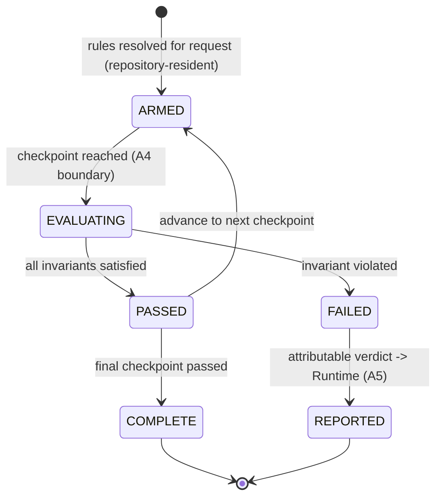

# Visual Production System (VPS)

## Stage B — Module B10: Asset Validation

> **Document type:** Module specification (conceptual, implementation-independent)
> **Project:** Visual Production System (VPS)
> **Roadmap position:** Stage B · Module B10 — the **Validation Layer** (cross-cutting) specification module; the **final Stage B module**, completing the VPS architecture
> **Home layer:** Cross-cutting Validation (`vps/validation/`) — per A6 §2 (B10) and A3 §4
> **Depends on / inherits (locked):** A1–A10 (Stage A), B1–B7 (Asset-Layer kinds), B8 Asset Relationship Graph (Knowledge Layer), B9 Asset Packaging (Composition Layer)
> **Status:** Proposed — the canonical Asset Validation specification
> **Scope discipline:** This document defines **only the canonical Asset Validation architecture.** It **defines no assets**, **modifies no asset definitions**, **modifies no relationships**, **modifies no packages**, and **implements no rendering.** It is **conceptual and implementation-independent**: no engines, models, formats, schemas-as-code, algorithms, or tools. It defines *what validation is, where it gates, what it owns, and how it reports* — reading validated artifacts strictly **by reference** and **never mutating** them.

---

## 0. Purpose of This Document

B10 is the final Stage B module and the VPS's **correctness-proving subsystem**. Where B1–B7 define assets, B8 declares relationships/compatibility, and B9 assembles packages, B10 is the module that **proves those artifacts are valid** — as a set of gates in the data flow (A4), owned as a cross-cutting concern (A3 `vps/validation/`), consistent with the locked A8 framework.

B10 is a **gate, not an owner of data**. It reads assets (B1–B7), relationships/compatibility (B8), and packages (B9) **by reference**, issues attributable pass/fail verdicts, and blocks invalid advancement — but it never authors, alters, or stores any of the artifacts it checks. This is what keeps B10 outside the dependency graph (nothing depends on it as a data source) and preserves single source of truth.

Every rule applies the locked disciplines: **fail loud / fail traceable**, **single source of truth**, **determinism**, **read-only validation**, **contract-based Runtime reporting**, **implementation-independence**, **uniform governance of all Stage B modules**, and **no responsibility overlap**.

---

## 1. Purpose of Asset Validation

- **P-1 · Prove correctness, do not create it.** B10's single responsibility is to enforce the VPS invariants as gates so invalid data never crosses a layer boundary (A8 §1; A4 §8).
- **P-2 · Three invariant classes.** All validation reduces to **structural** (well-formedness), **ownership/SSOT** (exactly one owner per datum), and **compatibility** (governed combinability + contract/version agreement) (A8 VA-2).
- **P-3 · Gate, never owner of data.** B10 reads by reference and issues verdicts; it owns *rules and verdicts* only — never asset definitions, relationships, or packages (A6 B10; A8 VA-1).
- **P-4 · Deterministic and attributable.** The same inputs always yield the same verdict; every verdict names layer + checkpoint + request identity + cause (A8 VA-4; A7 EC-1).
- **P-5 · The last line before advancement.** A failed gate halts the flow and reports; it never degrades into a silent, non-deterministic success (A1; A4 §9).

**Out of purpose (explicitly):** defining/altering assets (B1–B7), declaring/altering relationships or compatibility (B8), assembling/altering packages (B9), orchestration/response decisions (Runtime), and rendering (Production, later stage).

---

## 2. Validation Authority Model

- **AU-1 · Single validator of record.** B10 is the one authority for validation rules and verdicts across the entire VPS; no layer runs a competing, privately-owned validation authority (A8 VO-1; SSOT).
- **AU-2 · Authority over verdicts, not over data.** B10's authority is to *rule* on artifacts, not to own them; owning verdicts never makes B10 an owner of the validated data (A8 VO-2).
- **AU-3 · Rules are governed and repository-resident.** Validation rules live in `vps/validation/` and are resolved from the repository; there are no ad-hoc, out-of-band rules (A7 GOV-4; A8 LC-1).
- **AU-4 · Declares verdicts; the Runtime owns the response.** B10 supplies attributable pass/fail cause; the Master Runtime alone decides retry/reroute/abort (A8 VO-3; A5 §9).
- **AU-5 · Enforces B8-declared compatibility; does not declare it.** Compatibility relationships are declared by B8 (A8 §6); B10 computes and gates the verdict. B10 enforces; B8 declares — no overlap.

---

## 3. Validation Scope

B10 validates the **Asset, Knowledge, and Composition layers** — every artifact that flows toward a production, by reference.

| Validated artifact | Owner (read by B10) | Invariant classes applied |
|--------------------|---------------------|----------------------------|
| Asset definitions/identities | B1–B7 | structural, ownership/SSOT |
| Relationships, compatibility, index, version authority | B8 | structural, ownership/SSOT, compatibility |
| Scene graph, selections, sealed package | B9 | structural, ownership/SSOT, compatibility |
| Runtime-approved input (at entry) | Master Runtime (read-only) | structural (contract-conformance) |

- **SC-1 · Read-only across all layers.** B10 reads each artifact by reference; it never writes to Asset, Knowledge, or Composition stores (architectural rule "never modify validated artifacts").
- **SC-2 · Cross-layer, single discipline.** The same three invariant classes are applied uniformly wherever B10 gates — one validation discipline for the whole VPS (A8 §1).
- **SC-3 · No new artifacts.** B10 produces only verdicts; it creates no asset, relationship, or package (P-3).

---

## 4. Validation Lifecycle

A validation instance follows the locked A8 lifecycle for each production request; B10 defines the shape, executes no orchestration.



- **LC-1 · Armed from the repository.** Applicable rules are resolved from `vps/validation/` before evaluation — no ad-hoc rules (A8 LC-1).
- **LC-2 · Evaluated at checkpoints only.** Evaluation occurs at defined A4 boundaries (§5), never arbitrarily (A8 LC-2).
- **LC-3 · Binary, attributable verdict.** Each checkpoint yields pass or fail; failure carries full attribution and stops advancement (A8 LC-3; A7 EC-1).
- **LC-4 · No mutation.** The lifecycle never alters the data it evaluates; it only permits or blocks advancement (A8 LC-4; SC-1).
- **LC-5 · Deterministic replay.** Re-evaluating the same request against the same repository/version state reproduces the same verdicts (A8 LC-5).

---

## 5. Validation Checkpoint Model

B10 binds to the **locked A4 checkpoint set (V1–V6)**; it adds no new checkpoints. Each checkpoint enforces its invariant class and maps to the locked A7 error class (§9).

| Checkpoint | A4 boundary | Layer(s) gated | Invariant class | Failure class |
|-----------|-------------|----------------|-----------------|---------------|
| **V1 · Entry** | after M1 | Runtime input | structural (contract-conformance) | E1 |
| **V2 · Asset resolution** | during M2 | Asset (B1–B7) | structural + ownership | E2 |
| **V3 · Compatibility & version** | during M3 | Knowledge (B8) | compatibility (+ version authority resolvable) | E3 |
| **V4 · Package seal** | end of M4 | Composition (B9) | structural + ownership (complete, deterministic, self-describing, single-owner) | E4 |
| **V5 · Handoff/adapter** | during M5 | Production (later stage) | structural (adapter can consume sealed package) | E5 (renderer-scoped) |
| **V6 · Ownership/SSOT** | continuous | all layers | ownership (no datum acquires a second owner) | E6 |

- **CK-1 · Uniform coverage.** Every module participating in a movement is subject to the checkpoint(s) on that boundary — no module is exempt (A8 CK-1; A7 §13).
- **CK-2 · Continuous SSOT gate.** V6 runs across all transitions, not just at one point (A8 CK-2; A7 VAL-3).
- **CK-3 · Renderer isolation.** V5 failures stay renderer-scoped and never affect the sealed package or other adapters (A2 FB-4; A8 CK-3).
- **CK-4 · Compatibility uses B8, executed by B10.** At V3, B10 computes the verdict over B8-declared compatibility relationships; it declares none (§2 AU-5).

---

## 6. Validation Ownership

Ownership is exclusive and singular (A6 §7; A8 §4).

| Owned datum | Owner | Others may… |
|-------------|-------|-------------|
| Validation **rules** | **B10 Asset Validation** (`vps/validation/`) | reference the rule set; never define private rules |
| Validation **verdicts** | **B10** | receive verdicts; never override them |
| The **data being validated** (assets, relationships, packages, input) | its home layer (B1–B7 / B8 / B9 / Runtime) | B10 reads by reference only, never owns or edits |
| **Response** to a failed verdict | **Master Runtime** | B10 supplies cause; never decides retry/abort |

- **OW-1 · Gate, not data owner.** B10 owning verdicts does not make it an owner of validated data — preserving SSOT and the acyclic graph (A8 VO-2; §10).
- **OW-2 · Nothing depends on B10 as a data source.** B10 is a read-only gate in the flow; no module consumes B10-owned data to build its own — so B10 introduces no dependency cycle (A6 B10; §10).

---

## 7. Runtime Reporting Model

B10's verdicts reach the Runtime through the locked A5 seam; B10 is subordinate to the Runtime and self-orchestrates nothing.

- **RR-1 · Report via the failure/reporting contract.** Failed verdicts are surfaced to the Runtime through the A5 failure contract from the VPS's single reporting channel (A4 §9; A5 §9); passing verdicts simply permit flow advancement.
- **RR-2 · Attributable + traceable.** Each verdict names the layer, the A4 checkpoint, the request identity, and the cause — cause only, never remediation (A7 EC-1).
- **RR-3 · Runtime owns the response.** The Runtime alone decides retry/reroute/abort/rollback; B10 never self-retries or self-orchestrates (A5 §9; A8 §12).
- **RR-4 · Single aggregation point respected.** Upstream (V1–V4/V6) failures aggregate through Composition's single reporting channel to the Runtime; V5 renderer failures report renderer-scoped — preserving the A4 §9 error flow. B10 supplies the verdict; it does not open a second control channel.
- **RR-5 · No artifact transfer.** Reporting carries verdicts and attributable causes by reference; it transfers no validated artifact (SSOT).

---

## 8. Repository Organization

Per A3 §4 (`vps/validation/`), B10 owns the single, exclusive cross-cutting Validation hierarchy; this document creates no content.

```text
vps/
└── validation/
    ├── schemas/               # structural validation rules for each hierarchy's data (well-formedness)
    ├── ownership/             # ownership / single-source-of-truth (no-duplicate-owner) checks
    ├── contracts/             # contract-conformance / version-agreement checks (versioned)
    └── registry/
        └── rule/              # authoritative validation-rule identity registry (define-once rule identities)
```

- **RO-1 · One exclusive hierarchy.** All validation rules live under `vps/validation/`; no validation rule exists elsewhere (A3 §4; SSOT).
- **RO-2 · Rules, not data.** This hierarchy holds validation rules and rule identities only — never assets, relationships, packages, or verdicts-as-stored-artifacts of other layers (P-3).
- **RO-3 · Identity-addressed & governed.** Rules are identity-addressed, governed, and versioned like any VPS artifact (A7; A8).
- **RO-4 · Grows as governed data.** The hierarchy grows by adding rules as data, not by changing logic (A3 §7).
- **RO-5 · Separated from all validated layers.** `vps/validation/` is parallel to `vps/asset/`, `vps/knowledge/`, and `vps/composition/`; it lives inside none of them and none inside it (A3; A6 §5).

---

## 9. Failure Classification Model

B10 uses the **locked A7 error taxonomy (E1–E6)** verbatim; it adds no new classes. Each class maps to a checkpoint and an invariant class.

| Class | Meaning | Checkpoint / origin | Invariant class |
|-------|---------|---------------------|-----------------|
| **E1 · Input/Contract** | Malformed or contract-incompatible request | V1 / entry | structural |
| **E2 · Resolution** | An asset identity cannot be resolved | V2 / Asset | structural + ownership |
| **E3 · Compatibility/Version** | Unsatisfiable selection, incompatible pair, or version conflict | V3 / Knowledge | compatibility |
| **E4 · Composition/Seal** | A complete, deterministic package cannot be assembled/sealed | V4 / Composition | structural + ownership |
| **E5 · Renderer/Adapter** | A specific renderer/adapter cannot consume the package | V5 / Production (later) | structural (renderer-scoped) |
| **E6 · Governance/Ownership** | SSOT/ownership or governance invariant violated | V6 / continuous | ownership |

- **FC-1 · Every failure carries** layer, checkpoint, request identity, and cause — never remediation (A7 EC-1).
- **FC-2 · No reclassification to succeed.** B10 never downgrades a failure into a silent success (A7 EC-2; fail loud).
- **FC-3 · Isolation preserved.** E5 stays renderer-scoped and never corrupts the immutable package or other adapters (A2 FB-4; A7 EC-3).
- **FC-4 · Deterministic classification.** The same violation classifies to the same class every time (A8 VA-4).

---

## 10. Governance Rules

- **GV-1 · One validation authority.** B10 is the sole authority for validation rules and verdicts across the VPS; no shadow validators anywhere (SSOT; AU-1).
- **GV-2 · Read-only, never modify.** B10 reads validated artifacts by reference; modifying any asset, relationship, or package is a governance defect (architectural rule; enforced by B10's own ownership checks).
- **GV-3 · Gate, never author/declare/assemble/render.** B10 rules; it authors no asset (B1–B7), declares no relationship (B8), assembles no package (B9), and renders nothing (Production).
- **GV-4 · Standards- & framework-bound.** Every rule conforms to A7 standards (identifiers, naming, contracts) and the A8 framework; conformance is part of its definition of done.
- **GV-5 · Additive & recorded change.** Rule changes are additive-first and recorded append-only with architectural traceability (A7 CM; A8 VE-5).
- **GV-6 · Acyclic dependency preserved.** B10 reads B1–B9 artifacts by reference but **nothing depends on B10 as a data source**; as a gate it introduces no cycle (A6 B10; §6).
- **GV-7 · Deterministic & automatable.** All rules are deterministic and automatable/repository-checkable, supporting future unattended execution (A8 VA-4/VA-5).
- **GV-8 · Precedence.** Where a validation design conflicts with a Stage A lock, the Stage A lock prevails until formally amended (A7 APP-5; A10 lock).

---

## 11. Version-Aware Validation Strategy

- **VV-1 · Validate at authoritative versions.** B10 evaluates artifacts at the versions authoritatively resolved via B8's version registry (A4 §10; A8 §5) — it re-derives no version authority (SSOT).
- **VV-2 · Immutable inputs ⇒ deterministic verdicts.** Because asset/relationship/package versions are immutable (A8 VE-3; B9 §9), a verdict computed over a given version set is deterministic and reproducible (A8 CM-5).
- **VV-3 · Self-describing packages are re-validatable.** Because a sealed package embeds its exact version set (A4 §10; B9 §3), B10 can re-validate any package deterministically at any time.
- **VV-4 · Version conflicts are E3.** Unresolvable version authority or version mismatch is a compatibility/version failure at V3 (§9), reported attributably.
- **VV-5 · Rules are themselves versioned.** Validation rules follow the A8 version lifecycle; a rule change is a new immutable rule version, so past verdicts remain explainable (A8 §7; GV-5).

---

## 12. Scope Boundaries & No-Overlap Declaration

B10 explicitly **defers** the following and absorbs none of them:

| Concern | Owner (not B10) | B10's only relationship to it |
|---------|-----------------|-------------------------------|
| Asset kinds & definitions | B1–B7 | reads by reference to gate; never defines/modifies |
| Relationships, compatibility, index, version authority | B8 | reads/enforces declared compatibility; never declares/modifies |
| Scene graph, selections, sealed package | B9 | reads to gate (esp. V4); never assembles/modifies |
| Applying/sequencing/rendering | B9 / Production (later) | gates readiness; performs neither |
| Response to failure (retry/reroute/abort/rollback) | Master Runtime | reports attributable cause; decides nothing |
| Orchestration/scheduling/state | Master Runtime | is invoked at checkpoints; owns no orchestration |

**No-overlap guarantee:** B10 owns exactly "validation rules + verdicts, applied as read-only gates at the A4 checkpoints." It defines no asset, modifies no relationship, alters no package, renders nothing, and decides no response — it proves correctness and reports.

---

## 13. Asset Validation Specification (Consolidated)

> The Asset Validation module is the cross-cutting Validation-Layer, single validator of record for the VPS. It enforces three invariant classes (structural, ownership/SSOT, compatibility) as read-only gates bound to the locked A4 checkpoints (V1–V6), owns only validation rules and verdicts, reads Asset/Knowledge/Composition artifacts by reference and never modifies them, computes verdicts deterministically at authoritative versions, classifies failures using the locked E1–E6 taxonomy, and surfaces attributable causes to the Runtime — which alone decides the response.

This consolidates the authority model (§2), scope (§3), lifecycle (§4), checkpoint model (§5), ownership (§6), Runtime reporting (§7), repository organization (§8), failure classification (§9), governance (§10), and version-aware strategy (§11) into one coherent, validation-only cross-cutting module.

---

## 14. Asset Validation Readiness Assessment

| Dimension | Question | Assessment |
|-----------|----------|------------|
| **Scope limited to validation** | Does B10 stay within rules + verdicts + gates? | **Yes** — no asset/relationship/package authoring or modification, no rendering, no response decisions; §12 declares all deferrals. |
| **No validated artifact modified** | Does B10 change anything it checks? | **No** — read-only across all layers; verdicts only (SC-1; §6/§10). |
| **Validation ownership unambiguous** | Is there a single validator of record? | **Yes** — B10 owns all rules and verdicts; it owns no validated data (§2/§6). |
| **Determinism** | Are verdicts deterministic and reproducible? | **Yes** — repository-resident rules + immutable versioned inputs + deterministic replay (§4/§11). |
| **Stage A alignment** | Does B10 fit A1–A10? | **Yes** — Validation home (A3 §4), A4 checkpoints V1–V6, A7 E1–E6 taxonomy, A8 framework, A5 reporting, within the A10 lock. |
| **Dependency direction** | Does B10 preserve the acyclic DAG? | **Yes** — reads B1–B9 by reference; nothing depends on it as a data source; a gate, not a node others rely on (§6/§10). |
| **Runtime compatibility** | Is B10 Runtime-compatible? | **Yes** — reports via the A5 failure/reporting seam; the Runtime owns the response; B10 owns no orchestration. |
| **Implementation-independence** | Any implementation detail? | **No** — conceptual model only; no engines/models/formats/schemas-as-code/algorithms/tools. |
| **Completes the VPS** | Does B10 finish the Stage B architecture? | **Yes** — the tenth and final Stage B module; the correctness subsystem that guards the whole pipeline. |

**Readiness verdict:** **READY.** The Asset Validation module is a complete, validation-only, Stage-A-aligned cross-cutting specification that guards the Asset, Knowledge, and Composition layers deterministically and completes the Visual Production System architecture.

---

## 15. Internal Quality Review (self-check performed before finalization)

- ✅ **Scope is limited to validation.** Verified — B10 owns only rules and verdicts and applies them as gates; §12 defers assets (B1–B7), relationships/compatibility (B8), packages (B9), rendering (Production), and response decisions (Runtime).
- ✅ **No validated artifact is modified.** Verified — B10 reads Asset/Knowledge/Composition artifacts and Runtime input strictly by reference and issues verdicts only; SC-1/§6/§10 forbid mutation; compatibility is declared by B8 and merely enforced by B10.
- ✅ **Aligns with Stage A.** Verified — Validation home (A3 §4), the locked A4 checkpoints V1–V6, the locked A7 error taxonomy E1–E6, the A8 validation/versioning framework, A5 reporting seam, and the A10 lock; version authority remains B8; acyclic dependency preserved (nothing depends on B10 as a data source).
- ✅ **Completes the Visual Production System architecture.** Verified — B10 is the tenth and final Stage B module; with the Asset Layer (B1–B7), Knowledge Layer (B8), Composition Layer (B9), and this Validation Layer (B10) all specified, every locked A6 module now has a specification.
- ✅ **Scope discipline held.** Verified — conceptual/implementation-independent; no assets enumerated; no rendering; a single document is committed.

No inconsistencies remained at finalization.

---

## 16. Final Stage B Completion Statement

B10 is the tenth of the ten locked Stage B modules (A6/A9). With it, **Stage B is COMPLETE** — every module in the locked map now has a canonical specification:

- **Asset Layer (COMPLETE):** B1 Character · B2 Expression · B3 Pose · B4 Prop · B5 Environment · B6 Camera · B7 Animation Preset — seven independent, disjoint asset kinds.
- **Knowledge Layer (COMPLETE):** B8 Asset Relationship Graph — all cross-asset relationships, compatibility, index, and version authority.
- **Composition Layer (COMPLETE):** B9 Asset Packaging — the immutable, self-describing production package and the single Runtime entry.
- **Validation Layer (COMPLETE):** B10 Asset Validation — the read-only correctness gates across the whole pipeline.

No roadmap item was added or reordered. The only architecturally-scoped work beyond B1–B10 remains the **Production-Layer renderer adapters** (milestone M-Prod), which the locked roadmap (A6 §1, A9 §3) explicitly defers to a later stage and which B1–B10 already accommodate through the immutable package and the renderer-adapter contract.

---

*End of Stage B · Module B10 — Asset Validation. This document specifies only the canonical Validation-Layer architecture and inherits the locked A1–A10 and B1–B9. It defines no assets, modifies no asset definitions, modifies no relationships, modifies no packages, and implements no rendering. With B10, the Visual Production System Stage B architecture is complete.*
