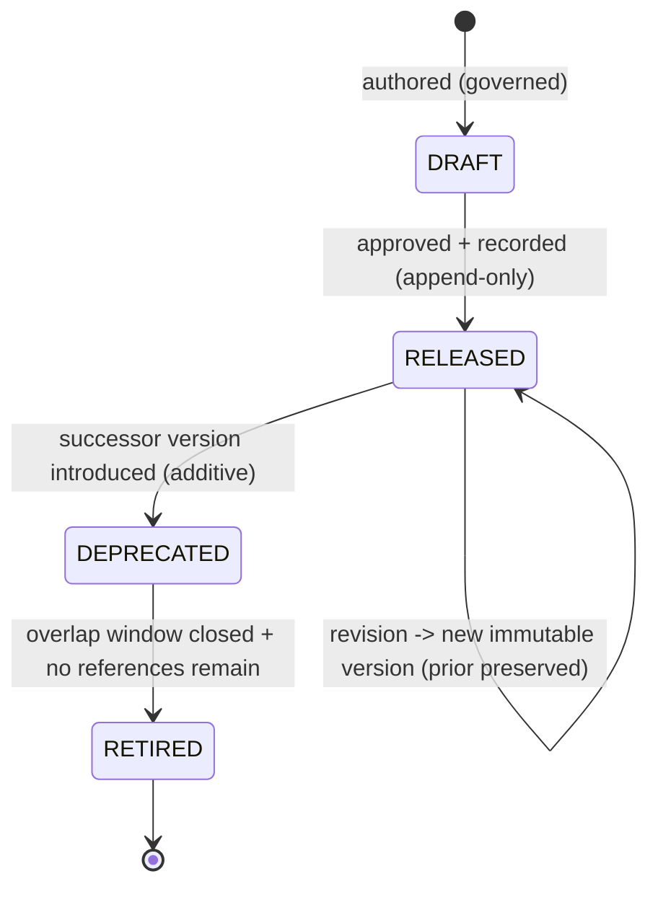

# Visual Production System (VPS)

## Stage B — Module B6: Camera System

> **Document type:** Module specification (conceptual, implementation-independent)
> **Project:** Visual Production System (VPS)
> **Roadmap position:** Stage B · Module B6 — the sixth Asset-Layer specification module, following the locked B1 Character, B2 Expression, B3 Pose, B4 Prop, and B5 Environment Systems
> **Home layer:** Asset Layer (`vps/asset/`) — per A6 §2 (B6) and A3 §3
> **Depends on / inherits (locked):** A1–A10 (Stage A), B1 Character, B2 Expression, B3 Pose, B4 Prop, B5 Environment Systems
> **Status:** Proposed — the canonical Camera System specification
> **Scope discipline:** This document defines **only the canonical Camera System.** It **does not define characters, expressions, poses, props, environments, or animations**, and it **does not define compatibility relationships** (those belong to the Knowledge Layer / B8). It is **conceptual and implementation-independent**: no engines, models, formats, schemas-as-code, field types, or tools. It defines *what a camera asset is and how it is governed* — not how it is placed in a scene, what it frames, how it moves, or how it is rendered.

---

## 0. Purpose of This Document

B6 specifies the camera as an independent, reusable Asset-Layer asset kind — a reusable **camera definition** (a framing/rig preset treated as an asset), a sibling of the character, expression, pose, prop, and environment. Under A6, the Camera System is an **Asset-Layer module** whose single responsibility is to be the **single source of truth for what a camera asset is and which camera asset is which.**

A camera in B6 is defined **on its own terms**, disjoint from any other kind and from any scene. The critical boundary (per A6 §2, B6): B6 owns reusable camera *definitions*; the **application/placement of a camera into a scene, and any camera movement over time, are NOT B6's** — placement belongs to the Composition Layer (B9), and time-based motion belongs to the Animation Preset System (B7) + B9. Likewise, what a camera "frames" (an environment or a character) is a **relationship owned by the Knowledge Layer (B8)**. This keeps B6 an independent Asset-Layer leaf (A6 §5) and preserves single source of truth.

Every rule applies the locked disciplines: **asset-first**, **single source of truth**, **determinism**, **identity over location**, **implementation-independence**, **contract-based Runtime compatibility**, and **no responsibility overlap**.

---

## 1. Camera Purpose

- **P-1 · A camera is a reusable visual asset.** It is a first-class, reusable Asset-Layer entity (a reusable camera/framing/rig preset definition) referenceable by identity across unlimited future productions (A1 reuse; A6 B6).
- **P-2 · Single source of truth for "what a camera asset is."** The Camera System is the one authoritative place a camera asset is defined; no other module defines or copies a camera definition (A2 §4; A7 MD-1/ID-6).
- **P-3 · Define once, reference everywhere.** A camera asset is authored once and consumed by reference; never duplicated (A1 §12; A7 ID-6).
- **P-4 · A definition, not a placement.** A camera is defined without reference to any scene, environment, or subject it may later frame; placement is B9's and framing relationships are B8's (§12).
- **P-5 · A stable anchor for future modules.** The identity a camera asset exposes is what B8, B9, and future modules reference — without B6 knowing about them (§12).

**Out of purpose (explicitly):** characters, expressions, poses, props, environments, animations, scene placement of a camera, camera movement/motion over time, what the camera frames, compatibility relationships, and rendering.

---

## 2. Camera Identity Model

The backbone of single source of truth and determinism (A7 ID-*).

- **IM-1 · Exactly one identity per camera asset.** A single canonical identity denotes one camera asset (A7 ID-1).
- **IM-2 · Stable & immutable.** Once assigned, a camera identity never changes and is never reused for a different camera asset, regardless of later edits or storage reorganization (A7 ID-1; A3 §5).
- **IM-3 · Globally unique within the VPS.** A camera identity never collides with any other asset identity of any kind — including characters, expressions, poses, props, and environments (A7 ID-2).
- **IM-4 · Kind-attributable.** A camera identity makes its owning kind (camera) and owning module (B6) unambiguous from the identity alone (A7 ID-3).
- **IM-5 · Opaque to consumers.** Consumers treat a camera identity as an opaque reference; they must not parse it to infer content or bypass B6 (A7 ID-4).
- **IM-6 · Identity ≠ version.** Identity says *which camera asset*; version says *which revision* (A7 ID-5; §8).
- **IM-7 · Deterministic resolution.** Identity + version resolves to the same canonical definition given the same repository/version state (A4 determinism).
- **IM-8 · Kind-independent.** A camera identity encodes no character, environment, or other-kind identity and no association to them (§12; A7 CP-4).

---

## 3. Camera Metadata Model *(intrinsic only)*

> **Boundary note (no-overlap):** the Knowledge Layer (B8) owns **relational/extrinsic metadata** — relationships (including any camera↔environment/character "frames" association), compatibility, and cross-kind indexing (A2 §4; A7 MD-1; A8 §5). B6 owns **only intrinsic definitional metadata** — attributes that *are* part of the canonical camera definition.

Intrinsic metadata categories (conceptual — not a storage schema):

- **MM-1 · Identity metadata.** The camera's canonical identity and kind attribution (§2). Owned by B6.
- **MM-2 · Descriptive metadata.** Human-meaningful descriptors of the camera asset as a standalone entity (its name, classification tags — §4/§5). Owned by B6.
- **MM-3 · Definitional metadata.** The canonical, intrinsic properties that constitute *what the camera asset is* as a reusable framing/rig preset, kept implementation-independent. Owned by B6.
- **MM-4 · Lifecycle/version metadata.** The camera's version and lifecycle state (§8). Content authority is B6's; **version authority of record remains the Knowledge Layer registry** (A8 §5) — B6 exposes its version, it does not run a competing registry.
- **MM-5 · Provenance/governance metadata.** Attribution and change-record references supporting audit (A7 DOC/CM), recorded append-only per A8.

**Explicitly excluded from B6 metadata:** any camera↔environment/character/subject "frames" association, camera placement or motion data, relationships to other assets, compatibility rules, and any cross-kind index — all Knowledge-Layer (B8), Composition (B9), or Animation (B7) concerns.

---

## 4. Camera Classification System

Classification is an **intrinsic, camera-only taxonomy** — categorizing camera assets *as cameras*, never as relationships to other kinds.

- **CL-1 · Intrinsic categorization only.** Classification describes properties of the camera asset itself; it never encodes links to environments, characters, or other assets (§12 no-overlap).
- **CL-2 · Governed vocabulary.** Uses a governed, versioned vocabulary so categories are consistent across all camera assets (A7; A8 additive dimensions).
- **CL-3 · Additive & versioned.** New categories are added additively behind a versioned vocabulary; existing camera assets are never broken (A8 EV-1).
- **CL-4 · Deterministic.** A camera's classification is a stable property of its definition/version, not a runtime decision.
- **CL-5 · Non-authoritative for combination.** Classification may *inform* future compatibility decisions but B6 decides no compatibility; it only exposes classification for B8 to consult (§9 boundary).

---

## 5. Camera Naming Standard

Naming makes camera assets unambiguous for humans; it never substitutes for identity (A7 N-*/ID-*).

- **NM-1 · Name is descriptive, identity is authoritative.** Consumers reference by identity, never by name (A7 ID-4).
- **NM-2 · Uniqueness within the camera kind.** Names are unique among camera assets to avoid human ambiguity; renaming does not change identity (IM-2).
- **NM-3 · Consistent casing/format per A7.** Follows the single A7 §1 naming rule, applied uniformly to all camera assets — no per-camera dialects.
- **NM-4 · Renderer/model-neutral.** Names never encode a renderer, engine, model, or vendor (A7 N-6).
- **NM-5 · No cross-kind encoding.** A camera name never embeds an environment, character, or other kind's name or identity — names describe the camera asset alone (§12).
- **NM-6 · Renaming is a governed change.** A name change is governed and recorded, leaving identity untouched (A7 N-7; §11).

---

## 6. Camera Identifier Strategy

- **ID-STR-1 · Minted once, by B6.** Camera identities are assigned solely by the Camera System at definition time; no other module mints camera identities (A2 §4).
- **ID-STR-2 · Opaque & stable.** Identifiers are opaque and permanent (IM-5/IM-2); consumers derive no meaning from them.
- **ID-STR-3 · Distinct from name and version.** Identifier ≠ name (§5) and identifier ≠ version (§8) — three separate concepts (A7 ID-5).
- **ID-STR-4 · Reference-only across boundaries.** Anything leaving B6 — into the Knowledge Layer, Composition, or across the Runtime seam — carries the identifier (and version), never a copy of the definition (A4 §12; A5 §5; A7 ID-6).
- **ID-STR-5 · Kind-resolvable, collision-free.** The scheme keeps camera identities resolvable to the camera kind/module and free of collision with any other kind (A7 ID-2/ID-3).

---

## 7. Camera Ownership

Ownership is exclusive and singular (A6 §7; A7 SSOT).

| Owned datum | Owner | Others may… |
|-------------|-------|-------------|
| Canonical camera **definitions** + their **identities** | **B6 Camera System** (Asset Layer) | reference by identity/version only |
| Camera **name & intrinsic classification** | **B6** | read; never redefine |
| Camera **version content** | **B6** (content) / **Knowledge Layer** (version authority of record) | query authority via B8 |
| Camera↔environment / character / subject "frames" (and any cross-kind) relationships & compatibility | **Knowledge Layer (B8)** — *not B6* | B6 exposes identity/attributes for B8 to relate |
| Placement of a camera in a scene | **Composition (B9)** — *not B6* | B6 remains unaware of it |
| Camera movement / motion over time | **Animation Preset System (B7) + B9** — *not B6* | B6 defines a static reusable preset, not motion |

- **OW-1 · One owner, no copies.** No module copies a camera definition; all use references (A7 ID-6).
- **OW-2 · B6 owns definitions, not application.** B6 never owns relational/compatibility data (B8), scene placement (B9), or motion (B7) — this prevents the most likely overlaps for a camera.

---

## 8. Camera Lifecycle

The camera lifecycle instantiates the locked A8 version lifecycle for camera definitions; B6 defines the shape, not a version manager.



- **LC-1 · Immutable per version.** A change to a released camera asset produces a **new version**; existing versions are never mutated (A8 VE-3) — enabling deterministic reproduction.
- **LC-2 · Self-describing usage.** When a camera asset participates in a production, the exact camera version is embedded in the immutable production package by Composition (A4 §10; A8 VE-4) — B6 simply exposes stable, versioned definitions.
- **LC-3 · Deprecate with a successor.** A superseded version is deprecated only when an additive successor exists, with a governed overlap window (A8 VL-3/VL-4).
- **LC-4 · Safe retirement.** Retirement occurs only after the window closes and no governed reference remains (A8 VL-5; A7 DEP-6).
- **LC-5 · Append-only history.** All lifecycle transitions are recorded append-only (A3 §6; A8 VE-5).
- **LC-6 · Independent lifecycle.** A camera's lifecycle is independent of any other kind's lifecycle; versions are not coupled across kinds (an association, if any, is a B8 concern).

---

## 9. Camera Compatibility Posture *(requirements only — relationships owned by B8)*

> **Boundary note:** compatibility *relationships* (including whether a camera asset may frame a given environment or subject) are owned and decided by the Knowledge Layer (B8) and enforced at the A4 V3 checkpoint by Asset Validation (B10) (A8 §6). B6 defines **no** compatibility relationships; it defines only the **requirements it must satisfy to be compatibility-checkable.**

- **CR-1 · Expose a stable, resolvable identity + version** so B8 can relate it and B10 can gate it deterministically (§2/§8).
- **CR-2 · Expose intrinsic classification** (§4) as read-only attributes for B8 to form relationships — B6 states none itself (CL-5).
- **CR-3 · Deterministic, immutable inputs.** Because camera versions are immutable (§8), any verdict B8/B10 compute over a camera asset is deterministic and reproducible (A8 CM-5).
- **CR-4 · No cross-kind assumptions.** A camera definition must not assume or encode compatibility with any other kind; it remains self-contained (A7 CP-4; §12).
- **CR-5 · Contract-exposed, not self-asserted.** A camera asset exposes compatibility-relevant attributes through the governed contract surface; it never asserts that it *is* compatible with anything (that is B8's verdict).

---

## 10. Camera Repository Organization

Per A3 (`vps/asset/`), the Camera System occupies a single, exclusive subtree; B6 defines the organization, this document creates no content.

```text
vps/
└── asset/
    ├── registry/
    │   └── camera/             # authoritative camera identity registry (define-once identities)
    └── definitions/
        └── camera/             # canonical camera definitions (governed data; assets NOT defined here in B6)
```

- **RO-1 · One exclusive subtree.** Camera assets live only under the camera subtree of the Asset Layer; no camera data exists elsewhere (A3 §3; SSOT).
- **RO-2 · Registry separated from definitions.** Identity assignment (registry) is kept distinct from definition content, both owned by B6.
- **RO-3 · Identity-addressed, not path-addressed.** References use identity, so definitions may be reorganized within the subtree without breaking references (A3 §5; IM-2).
- **RO-4 · Grows as governed data.** The subtree grows by adding camera definitions as data, not by changing logic (A3 §7; A1 "grow the library").
- **RO-5 · No foreign content.** The camera subtree holds only camera definitions/identities — never characters, expressions, poses, props, environments, animations, placement, motion, relationships, or metadata owned by other modules.
- **RO-6 · Sibling to other kinds.** The camera subtree is parallel to the character, expression, pose, prop, environment, and other asset-kind subtrees; camera assets are never stored inside another kind (reinforces independence, §12).

---

## 11. Camera Extensibility Strategy

- **EX-1 · Additive definitions.** New camera assets are added as new governed definitions under the camera subtree; no structural change and no impact on existing camera assets (A6 §8; A8 EV-1).
- **EX-2 · Additive intrinsic attributes.** New intrinsic classification/descriptive dimensions are added additively behind versioned vocabularies (§4; A8).
- **EX-3 · Versioned evolution.** Changes to an existing camera asset are new immutable versions, never in-place mutations (§8).
- **EX-4 · No overlap growth.** Extensibility never expands B6 into placement, motion, environments, characters, relationships, or compatibility — those grow in their own modules (§12).
- **EX-5 · Contract-stable.** The camera contract surface evolves additively and backward-compatibly so consumers (B8, Composition, Runtime) are never broken (A7 CT-6; A8 §6).

---

## 12. Camera Scope Boundaries & No-Overlap Declaration

B6 explicitly **defers** the following and absorbs none of them:

| Concern | Owner (not B6) | B6's only relationship to it |
|---------|----------------|-------------------------------|
| Characters | B1 Character System | independent kind; B6 defines no characters |
| Expressions | B2 Expression System | independent kind; B6 defines no expressions |
| Poses | B3 Pose System | independent kind; B6 defines no poses |
| Props | B4 Prop System | independent kind; B6 defines no props |
| Environments | B5 Environment System | independent kind; B6 defines no environments and no "what it frames" |
| Animations / camera motion over time | Animation Preset System (B7) + B9 | B6 defines a static reusable preset; no motion/sequencing |
| Camera↔environment/character "frames" associations | Knowledge Layer (B8) | B6 exposes a camera identity to be related; encodes no association |
| Relationships & cross-kind index | Knowledge Layer (B8) | B6 exposes identity/attributes; owns no relationships |
| Compatibility relationships & verdicts | B8 (owner) + B10 (gate) | B6 satisfies compatibility *requirements* (§9); asserts no compatibility |
| Scene assembly / camera placement / package | Composition (B9) | B6 provides referenced definitions; places nothing |
| Renderer output | Production (later stage) | B6 is renderer-agnostic; defines nothing renderer-specific |

**No-overlap guarantee:** B6 owns exactly "what a camera asset is + which camera asset is which." Every other concern — especially camera *placement* (B9), camera *motion* (B7), and what a camera *frames* (B8) — is referenced by identity or owned elsewhere, never absorbed.

---

## 13. Camera System Specification (Consolidated)

> The Camera System is the Asset-Layer, single-source, identity-addressed, versioned definition of reusable camera assets (framing/rig presets), defined independently of characters, expressions, poses, props, environments, and animations, and independently of scene placement and motion. It owns camera definitions, identities, intrinsic metadata, intrinsic classification, and names; it exposes stable identities/versions/attributes for other modules to reference; and it owns no relationships, compatibility, cross-kind associations, placement, motion, or rendering.

This consolidates the identity model (§2), intrinsic metadata (§3), classification (§4), naming (§5), identifier strategy (§6), ownership (§7), lifecycle (§8), compatibility posture (§9), repository organization (§10), extensibility (§11), and scope boundaries (§12) into one coherent, camera-only module.

---

## 14. Camera Readiness Assessment

| Dimension | Question | Assessment |
|-----------|----------|------------|
| **Scope limited to cameras** | Does B6 define only camera assets? | **Yes** — no other kinds, no motion, no placement, and no compatibility relationships; §12 declares all deferrals. |
| **No absorbed responsibilities** | Are future-module responsibilities absorbed? | **No** — placement is B9, motion is B7+B9, framing/relationships/compatibility are B8; B6 owns only definitions/identities. |
| **Stage A alignment** | Does B6 fit A1–A10? | **Yes** — Asset-Layer home (A2/A3/A6), identity/standards (A7), lifecycle/validation (A8), evolution (A9), within the lock (A10). |
| **B1–B5 alignment** | Is B6 consistent with the locked prior Asset-Layer modules? | **Yes** — parallel independent Asset-Layer kind; references other identities only via B8; encodes no cross-kind data. |
| **SSOT** | Is single source of truth preserved? | **Yes** — B6 is the sole camera authority; references only elsewhere. |
| **Runtime compatibility** | Is B6 Runtime-compatible? | **Yes** — exposes identity/version by reference; reachable only via the locked seam through Composition; owns no orchestration. |
| **Implementation-independence** | Any implementation detail? | **No** — conceptual model only; no engines/models/formats/schemas-as-code/tools. |
| **Supports future modules** | Can Character, Expression, Pose, Prop, Environment, Animation, and the Knowledge Layer build on B6? | **Yes** — B6 provides a stable, opaque, versioned camera identity they reference, without B6 knowing them. |

**Readiness verdict:** **READY.** The Camera System is a complete, camera-only, Stage-A-aligned specification that supports every other Stage B module without overlap.

---

## 15. Internal Quality Review (self-check performed before finalization)

- ✅ **Scope is limited to cameras.** Verified — B6 defines only the camera asset model; §12 explicitly defers all other kinds, camera motion, placement, framing, relationships, and compatibility to their owners.
- ✅ **No future module responsibilities are absorbed.** Verified — the camera↔environment/character "frames" association and all relational/extrinsic metadata and compatibility are owned by B8; scene placement by Composition (B9); motion over time by the Animation Preset System (B7) + B9; B6 owns only intrinsic definitions and identities and merely *exposes* attributes.
- ✅ **Aligns with Stage A.** Verified — Asset-Layer placement (A2/A3/A6), identifier/naming/metadata standards (A7), version lifecycle and validation gates (A8), additive evolution (A9), within the A10 lock; Runtime-compatible via the single seam (A5).
- ✅ **Supports Character, Expression, Pose, Prop, Environment, Animation, and Knowledge Layer modules.** Verified — B6 is an independent kind parallel to B1–B5 that exposes a stable, opaque, versioned identity those modules (and B8) reference, without B6 depending on or defining any of them.
- ✅ **Scope discipline held.** Verified — conceptual/implementation-independent; no assets enumerated; a single document is committed.

No inconsistencies remained at finalization.

---

## 16. Remaining Stage B Modules

B6 is the sixth of the ten locked Stage B modules (A6/A9); it changes no roadmap.

- **Asset Layer (remaining):** **B7 Animation Preset** — the last asset-kind module; will define reusable animation preset *definitions* independently (application/sequencing deferred to B9), referencing other identities only via B8.
- **Knowledge Layer:** **B8 Asset Relationship Graph** — will own relationships/compatibility/index across kinds, referencing B1 character, B2 expression, B3 pose, B4 prop, B5 environment, and B6 camera identities.
- **Composition Layer:** **B9 Asset Packaging** — will assemble resolved selections (including camera placement) into the immutable production package.
- **Cross-cutting:** **B10 Asset Validation** — will gate camera (and all) invariants at the A4 checkpoints.

B6 guarantees these can proceed by providing the stable camera identity foundation they build upon, with no overlap and no roadmap change.

---

*End of Stage B · Module B6 — Camera System. This document specifies only the canonical Camera System and inherits the locked A1–A10 and B1–B5. It defines no characters, expressions, poses, props, environments, animations, or compatibility relationships, and implements no behavior.*
