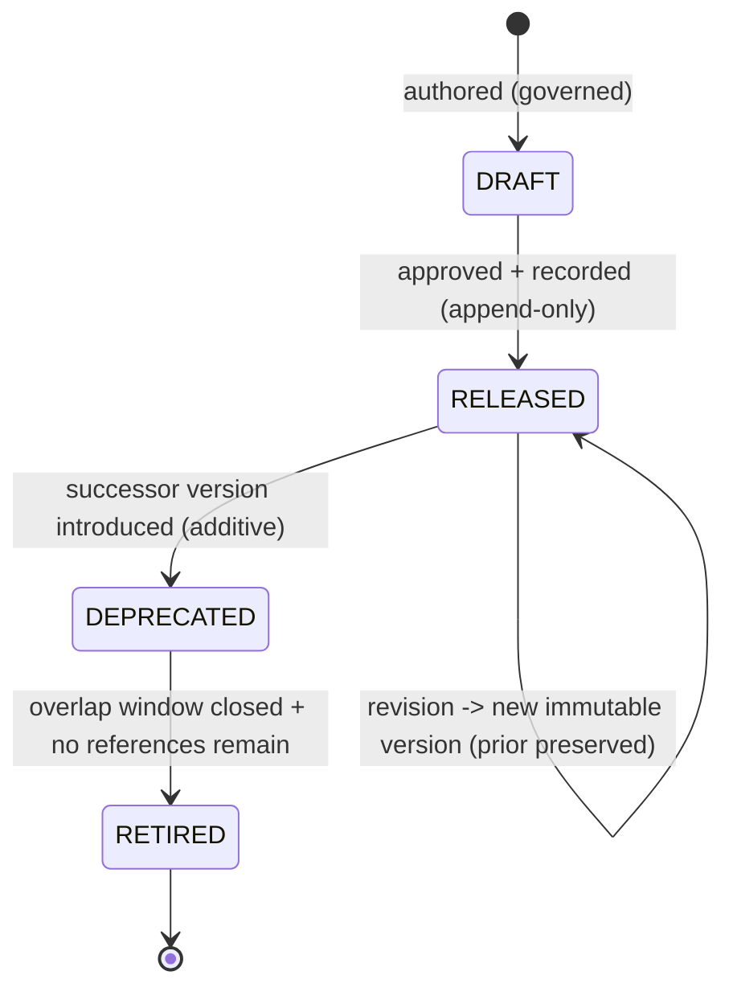

# Visual Production System (VPS)

## Stage B — Module B1: Character System

> **Document type:** Module specification (conceptual, implementation-independent)
> **Project:** Visual Production System (VPS)
> **Roadmap position:** Stage B · Module B1 — the **first** specification module; the Asset-Layer foundation begins here
> **Home layer:** Asset Layer (`vps/asset/`) — per A6 §2 (B1) and A3 §3
> **Depends on / inherits (locked):** A1 Vision & Philosophy · A2 System Architecture · A3 Repository Structure · A4 Data Flow · A5 Runtime Integration · A6 Module Overview · A7 Engineering Standards · A8 Validation & Versioning · A9 Roadmap & Evolution · A10 Architecture Review & Lock
> **Status:** Proposed — the canonical Character System specification
> **Scope discipline:** This document defines **only the canonical Character System.** It **does not define expressions, poses, animations, or relationship graphs**, and it does **not** own relationships, compatibility relationships, or cross-kind indexing (those belong to the Knowledge Layer / B8). It is **conceptual and implementation-independent**: it introduces no engines, models, formats, schemas-as-code, field types, or tools. It defines *what a character is and how it is governed*, not how it is stored or rendered.

---

## 0. Purpose of This Document

B1 is where the VPS stops describing itself and begins specifying its content model — starting with the character, the most foundational reusable visual asset. Under A6, the Character System is an **Asset-Layer module** whose single responsibility is to be the **single source of truth for what a character is and which character is which.**

B1 specifies the character as a governed, identity-addressed, versioned asset — nothing more. Everything *about* how characters relate to other assets, what they are compatible with, or how they are expressed, posed, or animated is **explicitly out of scope** and owned by other modules. B1's discipline is to define a complete character model while absorbing none of those responsibilities.

Every rule applies the locked disciplines: **asset-first**, **single source of truth**, **determinism**, **identity over location**, **implementation-independence**, **contract-based Runtime compatibility**, and **no responsibility overlap**.

---

## 1. Character Purpose

- **P-1 · A character is a reusable visual identity.** It is a first-class, reusable Asset-Layer entity that can be referenced by identity across unlimited future productions (A1 reuse; A6 B1).
- **P-2 · Single source of truth for "what a character is."** The Character System is the one authoritative place a character is defined; no other module may define or copy a character definition (A2 §4; A7 MD-1/ID-6).
- **P-3 · Define once, reference everywhere.** A character is authored once and consumed by reference; it is never duplicated (A1 §12 reusability; A7 ID-6).
- **P-4 · A stable anchor for future modules.** A character is the identity that future modules (Expression, Pose, Animation, and the Relationship Graph) will *reference* — without B1 knowing anything about them (§13).

**Out of purpose (explicitly):** deciding a character's expressions, poses, animations, scene placement, compatibility relationships, or rendering. Those are other modules' concerns.

---

## 2. Character Identity Model

The identity model is the backbone of single source of truth and determinism (A7 ID-*).

- **IM-1 · Every character has exactly one identity.** A single, canonical identity denotes one character (A7 ID-1).
- **IM-2 · Stable & immutable.** Once assigned, a character identity never changes and is never reused for a different character, regardless of later edits or storage reorganization (A7 ID-1; A3 §5).
- **IM-3 · Globally unique within the VPS.** A character identity never collides with any other asset identity of any kind (A7 ID-2).
- **IM-4 · Kind-attributable.** A character identity makes its owning kind (character) and owning module (B1) unambiguous, so ownership is resolvable from the identity alone (A7 ID-3).
- **IM-5 · Opaque to consumers.** Consumers treat a character identity as an opaque reference; they must not parse it to infer content or bypass B1 (A7 ID-4).
- **IM-6 · Identity ≠ version.** Identity says *which character*; version says *which revision of that character* (A7 ID-5; §8, A8 §5). The two are distinct and never conflated.
- **IM-7 · Deterministic resolution.** A character identity + version resolves to the same canonical definition given the same repository/version state (A4 determinism).

---

## 3. Character Metadata Model *(intrinsic only)*

> **Boundary note (critical for no-overlap):** the Knowledge Layer (B8) owns **relational/extrinsic metadata** — relationships, compatibility, and cross-kind indexing (A2 §4; A7 MD-1; A8 §5). B1 owns **only intrinsic definitional metadata**: the attributes that *are* part of the canonical character definition. B1 defines no relationships and no compatibility relationships.

Intrinsic metadata categories (conceptual — not a storage schema):

- **MM-1 · Identity metadata.** The character's canonical identity and kind attribution (§2). Owned by B1.
- **MM-2 · Descriptive metadata.** Human-meaningful descriptors of the character as a standalone entity (its name, classification tags — §4/§5). Owned by B1.
- **MM-3 · Definitional metadata.** The canonical, intrinsic properties that constitute *what the character is* as a reusable identity, kept implementation-independent here. Owned by B1.
- **MM-4 · Lifecycle/version metadata.** The character's version and lifecycle state (§8). Content authority is B1's; **version authority of record remains the Knowledge Layer registry** (A8 §5) — B1 exposes its version; it does not run a competing registry.
- **MM-5 · Provenance/governance metadata.** Attribution and change-record references supporting audit (A7 DOC/CM). Owned by B1 for its own definitions; recorded append-only per A8.

**Explicitly excluded from B1 metadata:** relationships to other characters or assets, compatibility rules, expression/pose/animation associations, and any cross-kind index. These are Knowledge-Layer (B8) concerns.

---

## 4. Character Classification System

Classification is an **intrinsic, character-only taxonomy** — a way to categorize characters *as characters*. It is not a relationship to other kinds (which would be B8).

- **CL-1 · Intrinsic categorization only.** Classification describes properties of the character itself; it never encodes links to expressions, poses, props, environments, or other characters (§13 no-overlap).
- **CL-2 · Governed vocabulary.** Classification uses a governed, versioned vocabulary so categories are consistent across all characters (A7 standards; A8 additive dimensions).
- **CL-3 · Additive & versioned.** New classification categories are added additively behind a versioned vocabulary; existing characters are never broken (A8 EV-1).
- **CL-4 · Deterministic.** A character's classification is a stable property of its definition/version, not a runtime decision.
- **CL-5 · Non-authoritative for combination.** Classification may *inform* future compatibility decisions, but B1 does not decide compatibility; it only exposes classification as an intrinsic attribute for B8 to consult (§9).

---

## 5. Character Naming Standard

Naming makes characters unambiguous and stable for humans; it never substitutes for identity (A7 N-*/ID-*).

- **NM-1 · Name is descriptive, identity is authoritative.** A name is human-facing; the identity (§2) is the authoritative reference. Consumers reference by identity, never by name (A7 ID-4).
- **NM-2 · Uniqueness of name within the character kind.** Names are unique among characters to avoid human ambiguity; renaming does not change identity (IM-2).
- **NM-3 · Consistent casing/format per A7.** Character naming follows the single casing/format rule defined in A7 §1, applied uniformly to all characters — no per-character dialects.
- **NM-4 · Renderer/model-neutral.** Names never encode a renderer, engine, model, or vendor (A7 N-6).
- **NM-5 · Renaming is a governed change.** A name change is a governed, recorded change that leaves identity untouched (A7 N-7; §12).

---

## 6. Character Identifier Strategy

- **ID-STR-1 · Identity is minted once, by B1.** Character identities are assigned solely by the Character System at definition time; no other module mints character identities (A2 §4).
- **ID-STR-2 · Opaque & stable.** Identifiers are opaque and permanent (IM-5/IM-2); consumers must not derive meaning from them.
- **ID-STR-3 · Distinct from name and version.** Identifier ≠ name (§5) and identifier ≠ version (§8) — three separate concepts (A7 ID-5).
- **ID-STR-4 · Reference-only across boundaries.** Anything leaving B1 — into the Knowledge Layer, Composition, or across the Runtime seam — carries the identifier (and version), never a copy of the definition (A4 §12; A5 §5; A7 ID-6).
- **ID-STR-5 · Kind-resolvable.** The identifier scheme keeps character identities resolvable to the character kind/module without collision with other kinds (A7 ID-2/ID-3).

---

## 7. Character Ownership

Ownership is exclusive and singular (A6 §7; A7 SSOT).

| Owned datum | Owner | Others may… |
|-------------|-------|-------------|
| Canonical character **definitions** + their **identities** | **B1 Character System** (Asset Layer) | reference by identity/version only |
| Character **name & intrinsic classification** | **B1** | read; never redefine |
| Character **version content** | **B1** (content) / **Knowledge Layer** (version authority of record) | query authority via B8 |
| Relationships, compatibility, cross-kind index involving characters | **Knowledge Layer (B8)** — *not B1* | B1 exposes identity/attributes for B8 to relate |
| Expression / Pose / Animation associations to a character | **their respective future modules + B8** — *not B1* | B1 remains unaware of them |

- **OW-1 · One owner, no copies.** No module copies a character definition; all use references (A7 ID-6).
- **OW-2 · B1 owns definitions, not relationships.** B1 never becomes an owner of relational or compatibility data — that is B8 (prevents the most likely overlap).

---

## 8. Character Lifecycle

The character lifecycle instantiates the locked A8 version lifecycle for character definitions; B1 defines the shape, not a version manager.



- **LC-1 · Immutable per version.** A change to a released character produces a **new version**; existing versions are never mutated (A8 VE-3) — enabling deterministic reproduction.
- **LC-2 · Self-describing usage.** When a character participates in a production, the exact character version is embedded in the immutable production package by Composition (A4 §10; A8 VE-4) — B1 simply exposes stable, versioned definitions.
- **LC-3 · Deprecate with a successor.** A superseded character version is deprecated only when an additive successor exists, with a governed overlap window (A8 VL-3/VL-4).
- **LC-4 · Safe retirement.** Retirement occurs only after the window closes and no governed reference remains (A8 VL-5; A7 DEP-6).
- **LC-5 · Append-only history.** All character lifecycle transitions are recorded append-only (A3 §6; A8 VE-5).

---

## 9. Character Compatibility Requirements

> **Boundary note:** compatibility *relationships* are owned and decided by the Knowledge Layer (B8) and enforced at the A4 V3 checkpoint by Asset Validation (B10) (A8 §6). B1 does **not** define or store compatibility. B1 defines only the **requirements it must satisfy to be compatibility-checkable.**

- **CR-1 · Expose a stable, resolvable identity + version.** A character must present a stable identity and an explicit version so B8 can relate it and B10 can gate it deterministically (§2/§8).
- **CR-2 · Expose intrinsic classification.** A character must expose its intrinsic classification (§4) as read-only attributes so B8 can form compatibility relationships — B1 states no such relationship itself (CL-5).
- **CR-3 · Deterministic, immutable inputs.** Because character versions are immutable (§8), any compatibility verdict computed by B8/B10 over a character is deterministic and reproducible (A8 CM-5).
- **CR-4 · No cross-kind assumptions.** A character definition must not assume or encode compatibility with any other kind; it remains self-contained (A7 CP-4; §13).
- **CR-5 · Contract-exposed, not self-asserted.** A character makes its compatibility-relevant attributes available through the governed contract surface; it never asserts that it *is* compatible with anything (that is B8's verdict).

---

## 10. Character Repository Organization

Per A3 (`vps/asset/`), the Character System occupies a single, exclusive subtree; B1 defines the organization, this document creates no content.

```text
vps/
└── asset/
    ├── registry/
    │   └── character/          # authoritative character identity registry (define-once identities)
    └── definitions/
        └── character/          # canonical character definitions (organized as governed data; assets NOT defined here in B1)
```

- **RO-1 · One exclusive subtree.** Characters live only under the character subtree of the Asset Layer; no character data exists elsewhere (A3 §3; SSOT).
- **RO-2 · Identity registry separated from definitions.** Identity assignment (registry) is kept distinct from definition content, both owned by B1.
- **RO-3 · Identity-addressed, not path-addressed.** References use identity, so definitions may be reorganized within the subtree without breaking references (A3 §5; IM-2).
- **RO-4 · Grows as governed data.** The subtree grows by adding character definitions as data, not by changing logic (A3 §7; A1 "grow the library").
- **RO-5 · No foreign content.** The character subtree holds only character definitions/identities — never expressions, poses, animations, relationships, or metadata owned by other modules.

---

## 11. Character Extensibility Strategy

- **EX-1 · Additive definitions.** New characters are added as new governed definitions under the character subtree; no structural change and no impact on existing characters (A6 §8; A8 EV-1).
- **EX-2 · Additive intrinsic attributes.** New intrinsic classification/descriptive dimensions are added additively behind versioned vocabularies (§4; A8).
- **EX-3 · Versioned evolution.** Changes to an existing character are new immutable versions, never in-place mutations (§8).
- **EX-4 · No overlap growth.** Extensibility never expands B1 into relationships, compatibility, expressions, poses, or animations — those grow in their own modules (§13).
- **EX-5 · Contract-stable.** The character contract surface evolves additively and backward-compatibly so consumers (B8, Composition, Runtime) are never broken (A7 CT-6; A8 §6).

---

## 12. Character Governance Rules

- **GV-1 · One character authority.** B1 is the sole authority for character definitions and identities across the VPS; no shadow character definitions anywhere (SSOT).
- **GV-2 · Standards-bound.** Every character conforms to the applicable A7 standards (naming, identifiers, metadata principles, documentation, contracts) — conformance is part of its definition of done (A7 §13).
- **GV-3 · Framework-bound.** Every character is subject to the A8 validation gates and version lifecycle; a character that fails a gate does not advance (A8 §1–§3, §9).
- **GV-4 · Additive & recorded change.** Character changes are additive-first and recorded append-only with architectural traceability (A7 CM; A8 VE-5).
- **GV-5 · Governed deprecation.** Character versions are deprecated and retired only through the governed lifecycle (§8; A7 §12).
- **GV-6 · Enforced, not trusted.** Automatable character invariants (identity uniqueness, naming, ownership, versioning) are enforced via `vps/validation/` (A7 GOV-6; A8 §1).
- **GV-7 · Precedence.** Where a character design conflicts with Stage A locks, the Stage A lock prevails until formally amended (A7 APP-5; A10 lock).

---

## 13. Scope Boundaries & No-Overlap Declaration

B1 explicitly **defers** the following to their owning modules and absorbs none of them:

| Concern | Owner (not B1) | B1's only relationship to it |
|---------|----------------|-------------------------------|
| Expressions | Expression System (future) + B8 | B1 exposes a stable character identity to reference; defines no expressions |
| Poses | Pose System (future) + B8 | same — identity only |
| Animations | Animation Preset System (future) + B8 | same — identity only |
| Props / Environments / Cameras | their future modules | independent kinds; B1 knows nothing of them |
| Relationships & cross-kind index | Knowledge Layer (B8) | B1 exposes identity/attributes; owns no relationships |
| Compatibility relationships & verdicts | B8 (owner) + B10 (gate) | B1 satisfies compatibility *requirements* (§9); asserts no compatibility |
| Scene assembly / package | Composition (B9) | B1 provides referenced definitions; assembles nothing |
| Renderer output | Production (later stage) | B1 is renderer-agnostic; defines nothing renderer-specific |

**No-overlap guarantee:** B1 owns exactly "what a character is + which character is which." Every other concern is referenced by identity, never absorbed.

---

## 14. Character System Specification (Consolidated)

> The Character System is the Asset-Layer, single-source, identity-addressed, versioned definition of reusable characters. It owns character definitions, identities, intrinsic metadata, intrinsic classification, and names; it exposes stable identities/versions/attributes for other modules to reference; and it owns no relationships, compatibility, expressions, poses, animations, assembly, or rendering.

This consolidates the identity model (§2), intrinsic metadata (§3), classification (§4), naming (§5), identifier strategy (§6), ownership (§7), lifecycle (§8), compatibility requirements (§9), repository organization (§10), extensibility (§11), and governance (§12) into one coherent, character-only module.

---

## 15. Character Readiness Assessment

| Dimension | Question | Assessment |
|-----------|----------|------------|
| **Scope limited to characters** | Does B1 define only characters? | **Yes** — no expressions/poses/animations/relationships/compatibility ownership; §13 declares all deferrals. |
| **No absorbed responsibilities** | Are future-module responsibilities absorbed? | **No** — relational/compatibility/expression/pose/animation concerns are explicitly owned elsewhere. |
| **Stage A alignment** | Does B1 fit A1–A10? | **Yes** — Asset-Layer home (A2/A3/A6), identity/standards (A7), lifecycle/validation (A8), evolution (A9), within the lock (A10). |
| **SSOT** | Is single source of truth preserved? | **Yes** — B1 is the sole character authority; references only elsewhere. |
| **Runtime compatibility** | Is B1 Runtime-compatible? | **Yes** — exposes identity/version by reference; reachable only via the locked seam through Composition; owns no orchestration. |
| **Implementation-independence** | Any implementation detail? | **No** — conceptual model only; no engines/models/formats/schemas-as-code/tools. |
| **Supports future modules** | Can Expression/Pose/Prop/Environment/Animation build on B1? | **Yes** — B1 provides the stable character identity they reference, without B1 knowing them. |
| **Determinism** | Are character definitions deterministic? | **Yes** — immutable versions, stable identities, deterministic resolution. |

**Readiness verdict:** **READY.** The Character System is a complete, character-only, Stage-A-aligned specification that supports every future asset and knowledge module without overlap.

---

## 16. Internal Quality Review (self-check performed before finalization)

- ✅ **Scope is limited to characters.** Verified — B1 defines only the character model; §13 explicitly defers expressions, poses, animations, relationships, and compatibility to their owners.
- ✅ **No future module responsibilities are absorbed.** Verified — relational/extrinsic metadata and compatibility relationships are owned by B8; expressions/poses/animations by their future modules; B1 owns only intrinsic definitions and identities and merely *exposes* attributes for others to consult.
- ✅ **Aligns with Stage A.** Verified — Asset-Layer placement (A2/A3/A6), identifier/naming/metadata standards (A7), version lifecycle and validation gates (A8), additive evolution (A9), all within the A10 lock; Runtime-compatible via the single seam (A5).
- ✅ **Supports future Expression, Pose, Prop, Environment, and Animation modules.** Verified — B1 provides a stable, opaque, versioned character identity those modules (and B8) reference, without B1 depending on or defining any of them.
- ✅ **Scope discipline held.** Verified — conceptual/implementation-independent; no assets enumerated; a single document is committed.

No inconsistencies remained at finalization.

---

## 17. Remaining Stage B Modules

B1 is the first of the ten locked Stage B modules (A6/A9); it changes no roadmap.

- **Asset Layer (remaining):** **B2 Expression**, **B3 Pose**, **B4 Prop**, **B5 Environment**, **B6 Camera**, **B7 Animation Preset** — each a separate, disjoint asset-kind module that will *reference* character identities (via B8) but is defined independently.
- **Knowledge Layer:** **B8 Asset Relationship Graph** — will own relationships/compatibility/index across kinds, referencing B1 character identities.
- **Composition Layer:** **B9 Asset Packaging** — will assemble resolved selections (including characters) into the immutable production package.
- **Cross-cutting:** **B10 Asset Validation** — will gate character (and all) invariants at the A4 checkpoints.

B1 guarantees these can proceed by providing the stable character identity foundation they build upon, with no overlap and no roadmap change.

---

*End of Stage B · Module B1 — Character System. This document specifies only the canonical Character System and inherits the locked A1–A10. It defines no expressions, poses, animations, or relationships, and implements no behavior.*
