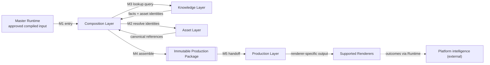
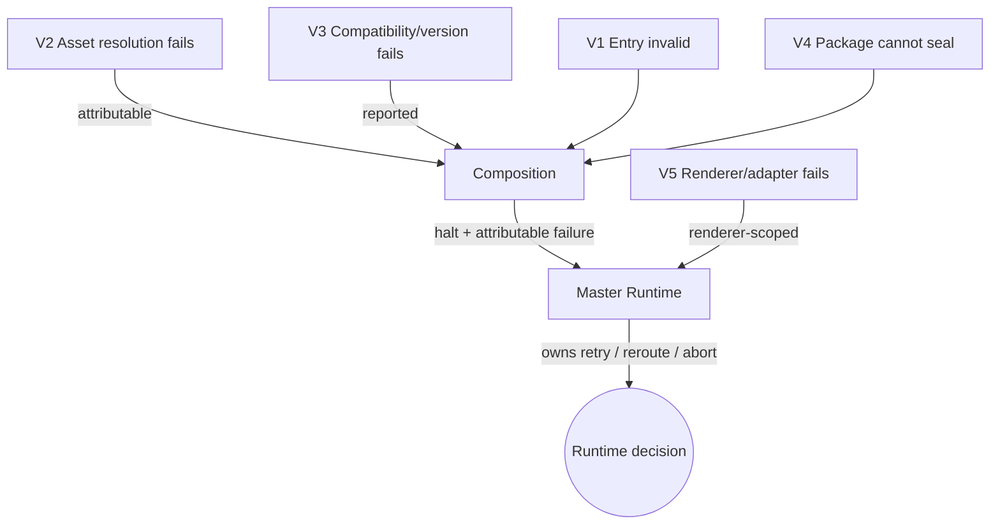
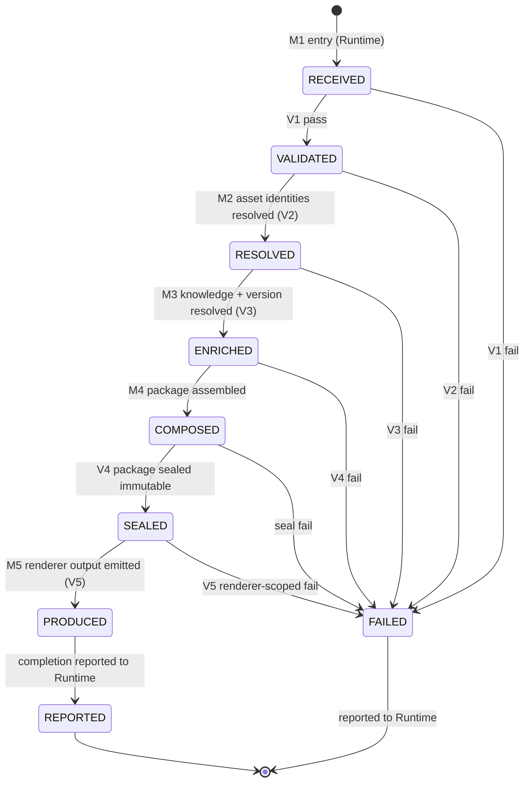

# Visual Production System (VPS)

## Stage A — Module A4: Data Flow Architecture

> **Document type:** Architecture design (data flow only)
> **Project:** Visual Production System (VPS)
> **Roadmap position:** Stage A · Module A4 — follows locked *A1 — Vision & Philosophy*, *A2 — System Architecture*, *A3 — Repository Structure*
> **Depends on / inherits:** `VPS_Vision_and_Philosophy.md`, `VPS_System_Architecture.md`, `VPS_Repository_Structure.md`
> **Status:** Proposed — defines how information moves through the VPS for all Stage B modules
> **Scope discipline:** This document defines **how information flows** through the four locked layers — the movement, ownership transitions, checkpoints, and states of data. It intentionally contains **no asset definitions, no production workflows, and no Runtime behavior/implementation.** It introduces **no implementation details** (no engines, models, formats, schemas, tools). Later modules implement *inside* these flows.

---

## 0. Purpose of This Document

A1 defined *why* the VPS exists, A2 defined its *four-layer structure*, and A3 defined *where everything lives*. A4 defines *how information travels* — from the moment the Master Runtime hands over an approved input to the moment a production-ready, renderer-agnostic output is available.

A4 is the behavioral contract of the architecture at the level of **data movement**, not execution. It answers: what data enters, how it is enriched and transformed, which layer owns it at each moment, where it is checked, how failure and version information propagate, and what states a production request passes through. It does **not** describe *how* any layer performs its transformation (that is Stage B).

Every rule here is a direct application of the locked disciplines: **single source of truth**, **no duplicate ownership**, **deterministic compilation**, **runtime-driven**, **renderer-agnostic**, **immutable production packages**, and **evolve by extension, not rewrite**.

---

## 1. End-to-End Data Flow

A single production request moves through five ordered movements, strictly following the A2 downward dependency direction. Data is **enriched** as it descends (reference → resolved reference → assembled package) and **transformed** exactly once at the Composition→Production boundary into renderer output.

**The five movements:**
- **M1 · Runtime entry** — approved input enters the single VPS entry point (Composition).
- **M2 · Asset discovery** — asset *identities* are discovered/resolved (Asset Layer is authoritative for definitions).
- **M3 · Knowledge lookup** — relationships, compatibility, version authority, and search are queried (Knowledge Layer).
- **M4 · Composition** — a complete, immutable production package is compiled.
- **M5 · Production handoff** — the package is consumed and transformed into renderer-specific output.

Given identical Runtime input, asset library, knowledge state, and governed configuration, this flow produces the same package and the same class of output — **deterministic** (A1/A2).

---

## 2. Runtime Entry Flow (M1)

- The Master Runtime is the sole initiator; the VPS never self-triggers (A1 "runtime governs, VPS obeys").
- Entry occurs at **exactly one point — the Composition Layer** — via the versioned Runtime integration contract (A2 IP-2).
- The Runtime passes **approved, compiled input** (the upstream Generation output). The VPS treats this input as **read-only**: it is not the VPS's to own or mutate.
- On entry, the request receives an identity and enters the `RECEIVED` state (§11). The Runtime retains ownership of orchestration/scheduling state; the VPS owns only the in-flight request's *data* transitions.
- No asset discovery, lookup, or composition begins until entry validation (§8, checkpoint V1) passes.

---

## 3. Asset Discovery Flow (M2)

- Asset discovery resolves **asset identities**, never asset *content copies*. The Asset Layer remains the single source of truth for *what an asset is* (A2 §4).
- Composition never reads asset definitions to *store* them; it resolves an identity to a **canonical reference** it can place into the scene graph and package.
- Discovery is **identity-addressed** (A3 §5): references are stable across repository reorganization.
- Discovery is mediated by the Knowledge Layer for *selection* (M3) and confirmed against the Asset Layer for *existence/identity*. A reference that cannot be resolved fails at checkpoint V2 (§8) — never a fabricated or guessed asset.
- No new asset is created during discovery; the flow is strictly read/resolve.

---

## 4. Knowledge Lookup Flow (M3)

- Composition queries the Knowledge Layer for **relationships, compatibility rules, search results, and version authority** — all *about* assets, by reference (A2 §2.2, A3 §3).
- The Knowledge Layer answers with **facts and asset identities**; it returns no asset definitions and stores no selections.
- **Version authority is resolved here:** the query result includes which asset/definition version is canonical, sourced from `knowledge/versions/` (A3 §6). This is where version information *enters* the flow (see §10).
- Compatibility is enforced at lookup: an incompatible or unsatisfiable selection fails at checkpoint V3 (§8); Knowledge never invents a relationship to satisfy a query (A2 FB-2).
- Lookup is deterministic: the same query against the same Knowledge state yields the same facts.

---

## 5. Composition Flow (M4)

- Composition is the layer where discovered references (M2) and knowledge facts (M3) are **assembled** into the derived artifacts it owns: the **scene graph**, the **asset-selection decisions**, and the **production package** (A2 §2.3).
- Assembly is **deterministic compilation** (A1): known inputs → a single, predictable package. Any unavoidable non-determinism stays contained at the edges and is recorded, never leaked into the package.
- The output of composition is an **immutable production package**: once assembled and validated (checkpoint V4, §8), it is sealed and cannot be mutated downstream (architectural rule: immutable production packages).
- The package is **renderer-agnostic** — it carries scene graph, resolved references, and selection decisions, but nothing renderer-specific (A2 §2.3, renderer-agnostic rule).
- The package **embeds the resolved version set** (§10) so it is self-describing and reproducible.

---

## 6. Production Handoff Flow (M5)

- The immutable package crosses the Composition→Production boundary as a **one-way hand-off of a finished artifact**, not a shared mutable state (A2 §3).
- The Production Layer **consumes** the package and, through its renderer-agnostic core plus a per-renderer adapter, produces **tool-specific output** (A2 §2.4; A3 `production/adapters/<renderer>/`).
- Production **does not mutate** the package; it reads the immutable input and emits new output artifacts it owns.
- A renderer/adapter failure is **isolated** to that renderer and reported as renderer-scoped (A2 FB-4); it never corrupts the package or affects other adapters.
- Completion and produced-artifact references are reported back to the Runtime through the reporting channel (A2 IP-3); outcomes reach platform intelligence **via the Runtime**, preserving the acyclic graph (A2 §10).

---

## 7. Metadata Flow

- Metadata **originates from and is owned by the Knowledge Layer** and always references assets by identity (A2 §4; A3 §3). It is never copied into another layer's owned store.
- Metadata **enters a request as query results** (M3) and **rides along by reference** inside the production package — the package references metadata/versions, it does not become a second owner of them.
- Production consumes only what the package carries; it does not query Knowledge directly (A2 §5 — Production depends only on the package + renderer contracts). This keeps metadata single-owner and the dependency graph acyclic.
- Any new descriptive information produced as a *result* of production (e.g., output outcomes) flows outward through the Runtime to platform intelligence, not back into the VPS as a cycle.

---

## 8. Validation Checkpoints (Validation Flow)

Validation is a set of **gates between movements**, each guarding an invariant. A failed gate stops the flow and raises an attributable error (§9) — the flow never proceeds on invalid data. Rules live in `vps/validation/` (A3 §4).

| Checkpoint | Location | Guards |
|-----------|----------|--------|
| **V1 · Entry validation** | after M1 (Runtime entry) | Input is well-formed and complete per the Runtime contract before any work begins. |
| **V2 · Asset resolution** | during M2 (asset discovery) | Every referenced asset identity resolves to a canonical Asset-Layer definition — no unresolved or fabricated references. |
| **V3 · Compatibility & selection** | during M3 (knowledge lookup) | Selections satisfy compatibility rules; the query is satisfiable; version authority is resolvable. |
| **V4 · Package seal** | end of M4 (composition) | The package is complete, deterministic, self-describing (embeds version set), and renderer-agnostic — then it is sealed immutable. |
| **V5 · Handoff/adapter** | during M5 (production) | The consuming adapter can process the sealed package; failures are renderer-scoped, package untouched. |
| **V6 · Ownership/SSOT (cross-cutting)** | continuous | No datum acquires a second owner; single-source-of-truth holds across all transitions (`validation/ownership/`). |

Validation is **automatable** (A1/A3), supporting future unattended execution.

---

## 9. Error Propagation Flow (Error Flow)

Errors follow A1 "fail loud, fail traceable" and A2 failure boundaries. **Errors propagate upward to the Runtime; they never cascade downward as silent, improvised success.**

- Each layer contains its own failures and reports them across its contract boundary (A2 §9).
- **Composition is the single aggregation point** for upstream (entry/asset/knowledge/package) failures and reports them to the Runtime through the one reporting channel (A2 IP-4).
- **Production failures are renderer-scoped** and reported independently, without touching the sealed package or other adapters.
- The **Runtime — not the VPS — owns the response** (retry, reroute, abort). The VPS never invents orchestration (A1 N2, A2 §6).
- Errors are **traceable**: each carries the checkpoint, layer, and request identity, preserving determinism-by-explanation (A1 §13).

---

## 10. Version Propagation (Version Flow)

- **Version authority originates in the Knowledge Layer** (`knowledge/versions/`, A3 §6) and **enters the flow at M3** as part of lookup results.
- Composition **captures the resolved version set** and **embeds it into the immutable package** at V4. From that point the package is **self-describing**: it records exactly which asset/definition versions it was built from.
- Because definitions are **immutable per version** (A3 §6), an embedded version set allows any past production to be **reproduced deterministically**.
- Production **reads but never alters** version information; it flows through untouched with the package.
- **No layer downstream of Knowledge re-derives version authority** — this keeps version as a single-owner datum and prevents drift (single source of truth).

---

## 11. State Transition Model

A production request passes through a fixed, ordered set of states. Transitions are one-directional (except explicit terminal `FAILED`), and each transition is gated by a checkpoint (§8).

- **States are data states, not orchestration states.** They describe the *request's data*, which the VPS owns in-flight; scheduling/retry state remains the Runtime's (A1/A2).
- **`SEALED` is the immutability boundary:** no state after it may mutate the package.
- **`FAILED` is terminal within the VPS** and always ends in a report to the Runtime, which decides what happens next.

---

## 12. Data Ownership Transitions (Ownership Transition Model)

Ownership is **exclusive at every instant** and changes only through defined hand-offs. A datum never has two owners simultaneously (A2 §4; architectural rule: never duplicate ownership).

| Movement / state | Data in motion | Exclusive owner | Transition rule |
|------------------|----------------|-----------------|-----------------|
| Before M1 | Approved compiled input | **Master Runtime** | Passed read-only to VPS; Runtime retains the original |
| M1 → RECEIVED | In-flight request data | **Composition** (in-flight custodian) | VPS owns request data; Runtime still owns orchestration state |
| M2 | Asset definitions | **Asset Layer** (always) | Composition holds *references*, never ownership of definitions |
| M3 | Metadata, relationships, versions | **Knowledge Layer** (always) | Composition holds *query results by reference*, never ownership |
| M4 | Scene graph, selections, package | **Composition** | Composition is the sole owner of derived artifacts |
| V4 SEALED | Immutable production package | **Composition** (author) → handed to **Production** as immutable input | Ownership of *content* is frozen; Production owns only its *consumption + output* |
| M5 | Renderer-specific output | **Production** | Production owns adapters and output; never owns the package content |
| Report | Produced-artifact references + outcomes | **Master Runtime** (on report) | Outcomes leave the VPS via the Runtime; no internal cycle |

**Key invariants:**
- Lower-layer data (definitions, metadata, versions) is **always owned by its home layer**; higher layers only ever hold **references or immutable copies**, never ownership.
- The **package's content ownership freezes at SEAL**; downstream layers own their *actions*, not the package.
- **No transition ever creates a second owner** — enforced continuously by checkpoint V6.

---

## 13. Architectural Constraints

The data flow is bound by, and demonstrably satisfies, the locked rules:

| # | Constraint | How the flow satisfies it |
|---|-----------|---------------------------|
| DC-1 | **Follows four-layer architecture** | Movements M1–M5 traverse the layers in the A2 downward direction only (§1). |
| DC-2 | **Preserves single source of truth** | Definitions/metadata/versions stay owned by their home layers; others hold references (§7, §10, §12). |
| DC-3 | **Never duplicates data ownership** | Exclusive ownership at every instant; V6 enforces it continuously (§12, §8). |
| DC-4 | **Deterministic** | Same inputs → same package → same output class; non-determinism contained + recorded (§1, §5). |
| DC-5 | **Runtime-driven** | Single entry (Composition), Runtime initiates and owns retry/scheduling (§2, §9). |
| DC-6 | **Supports future automation** | Gated checkpoints and states are automatable; no human step is structurally required (§8, §11). |
| DC-7 | **Renderer-agnostic** | Package is renderer-neutral; renderer specifics appear only in Production adapters at M5 (§5, §6). |
| DC-8 | **Immutable production packages** | Package sealed at V4; no downstream mutation permitted (§5, §11 `SEALED`). |

---

## 14. Data Flow Readiness Assessment

| Dimension | Question | Assessment |
|-----------|----------|------------|
| **A1 alignment** | Deterministic, fail-loud, runtime-driven, asset-first? | **Yes** — deterministic compilation, attributable errors, single Runtime entry, identity-addressed assets. |
| **A2 alignment** | Follows four layers + acyclic direction + single entry/report? | **Yes** — M1–M5 move strictly downward/forward; one entry, one report; no upward calls. |
| **A3 alignment** | Uses the layout's ownership + version authority + validation homes? | **Yes** — version authority in `knowledge/versions/`, validation in `vps/validation/`, adapters per renderer. |
| **Exclusive ownership** | Is layer ownership exclusive throughout? | **Yes** — ownership transition table shows one owner per datum per instant; V6 enforces continuously. |
| **Implementation neutrality** | Any implementation details? | **No** — no engines, models, formats, schemas, tools; no assets, workflows, or runtime behavior. |
| **Determinism** | Is data movement deterministic? | **Yes** — identical inputs yield identical package + version set; non-determinism contained and recorded. |
| **Stage B plug-in** | Can Stage B plug in without redesign? | **Yes** — each layer's transformation is a black box behind its movement/checkpoint; Stage B fills it in place. |

**Readiness verdict:** **READY.** The data flow architecture is complete, deterministic, and consistent with A1/A2/A3, with exclusive ownership preserved across all transitions. Stage B modules may implement each layer's internal transformation without altering this flow.

---

## 15. Internal Quality Review (self-check performed before finalization)

- ✅ **Aligns with A1, A2, and A3.** Verified — deterministic/fail-loud/runtime-driven (A1); four-layer downward, single entry/report (A2); ownership, version authority, and validation homes match the A3 layout.
- ✅ **Layer ownership remains exclusive.** Verified — the ownership transition table (§12) assigns exactly one owner per datum per instant; higher layers hold references/immutable copies only; V6 enforces continuously.
- ✅ **No implementation details introduced.** Verified — the document describes movement, ownership, checkpoints, and states only; it names no engine, model, format, schema, or tool, and defines no assets, workflows, or runtime behavior.
- ✅ **Data movement is deterministic.** Verified — identical inputs produce the same sealed package and embedded version set; unavoidable non-determinism is contained at the edges and recorded.
- ✅ **Stage B modules plug in without redesign.** Verified — each layer's transformation is treated as a black box behind its movement and checkpoint, so Stage B implements internals in place without changing the flow, states, or ownership rules.

No inconsistencies remained at finalization.

---

## 16. Relationship to Remaining Modules

A4 defines the data movement that later modules operate within; it designs none of their internals:

- **Anticipated remaining Stage A work:** a **Contracts & Interfaces** module (the versioned boundaries — Runtime, inter-layer, renderer-adapter — that formalize the movements and checkpoints described here and populate `vps/contracts/`). Its exact identifier/sequence is governed by the locked VPS roadmap; A4 does not declare the roadmap.
- **Stage B (implemented inside these flows):** Asset Layer resolution (M2), Knowledge Layer lookup/versioning (M3, §10), Composition assembly + sealing (M4, V4), Production core + adapters (M5) — each filling in a black box without altering flow, states, checkpoints, or ownership.

A4 guarantees each future transformation has a defined place in the flow, a defined owner, and a defined checkpoint.

---

*End of Stage A · Module A4 — Data Flow Architecture. This document defines how information moves through the Visual Production System and inherits the locked A1, A2, and A3 modules.*
