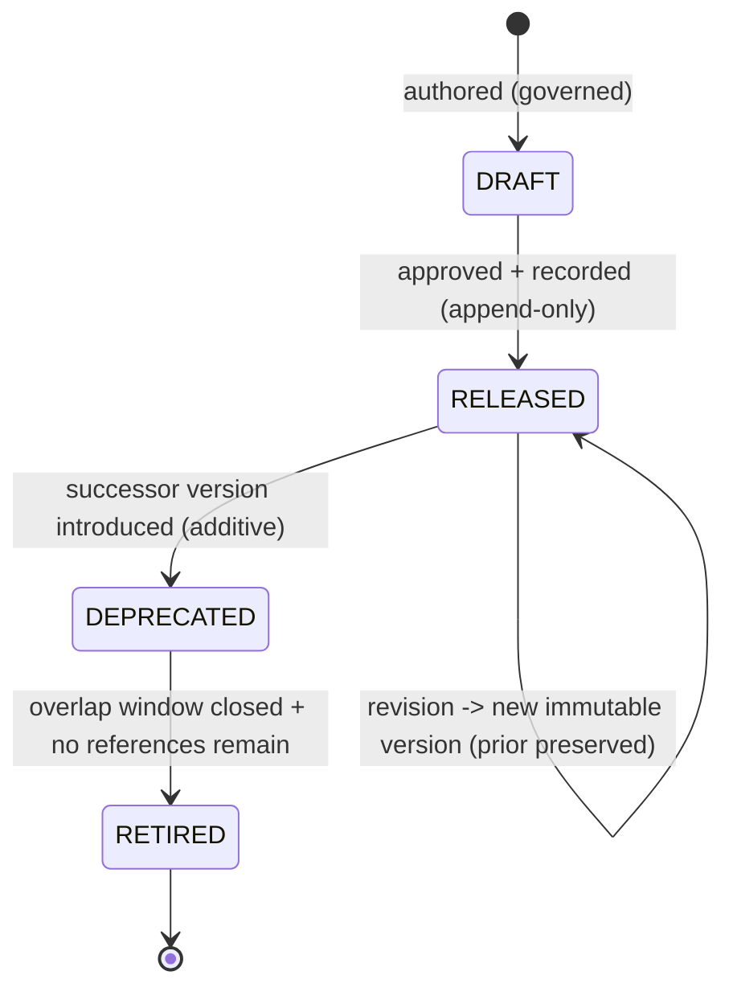

# Visual Production System (VPS)

## Stage B — Module B2: Expression System

> **Document type:** Module specification (conceptual, implementation-independent)
> **Project:** Visual Production System (VPS)
> **Roadmap position:** Stage B · Module B2 — the second Asset-Layer specification module, following the locked B1 Character System
> **Home layer:** Asset Layer (`vps/asset/`) — per A6 §2 (B2) and A3 §3
> **Depends on / inherits (locked):** A1–A10 (Stage A) and B1 Character System
> **Status:** Proposed — the canonical Expression System specification
> **Scope discipline:** This document defines **only the canonical Expression System.** It **does not define characters, poses, or animations**, and it **does not define compatibility relationships** (those belong to the Knowledge Layer / B8). It is **conceptual and implementation-independent**: no engines, models, formats, schemas-as-code, field types, or tools. It defines *what an expression is and how it is governed* — not how it is stored, applied to a character, or rendered.

---

## 0. Purpose of This Document

B2 specifies the expression as an independent, reusable Asset-Layer asset kind — a sibling of the character, not a part of it. Under A6, the Expression System is an **Asset-Layer module** whose single responsibility is to be the **single source of truth for what an expression is and which expression is which.**

Critically, an expression in B2 is defined **on its own terms**, disjoint from any character. The fact that an expression may later be *applied to* or *associated with* a character is a **relationship owned by the Knowledge Layer (B8)** — never encoded here. This keeps B2 an independent Asset-Layer leaf (A6 §5) and preserves single source of truth.

Every rule applies the locked disciplines: **asset-first**, **single source of truth**, **determinism**, **identity over location**, **implementation-independence**, **contract-based Runtime compatibility**, and **no responsibility overlap**.

---

## 1. Expression Purpose

- **P-1 · An expression is a reusable visual asset.** It is a first-class, reusable Asset-Layer entity referenceable by identity across unlimited future productions (A1 reuse; A6 B2).
- **P-2 · Single source of truth for "what an expression is."** The Expression System is the one authoritative place an expression is defined; no other module defines or copies an expression definition (A2 §4; A7 MD-1/ID-6).
- **P-3 · Define once, reference everywhere.** An expression is authored once and consumed by reference; never duplicated (A1 §12; A7 ID-6).
- **P-4 · An independent kind, not a character part.** An expression is defined without reference to any character; character↔expression association is a B8 relationship (§12).
- **P-5 · A stable anchor for future modules.** The identity an expression exposes is what B8 and future modules reference — without B2 knowing about them (§12).

**Out of purpose (explicitly):** characters, poses, animations, scene placement, compatibility relationships, application logic, and rendering.

---

## 2. Expression Identity Model

The backbone of single source of truth and determinism (A7 ID-*).

- **IM-1 · Exactly one identity per expression.** A single canonical identity denotes one expression (A7 ID-1).
- **IM-2 · Stable & immutable.** Once assigned, an expression identity never changes and is never reused for a different expression, regardless of later edits or storage reorganization (A7 ID-1; A3 §5).
- **IM-3 · Globally unique within the VPS.** An expression identity never collides with any other asset identity of any kind — including characters (A7 ID-2).
- **IM-4 · Kind-attributable.** An expression identity makes its owning kind (expression) and owning module (B2) unambiguous from the identity alone (A7 ID-3).
- **IM-5 · Opaque to consumers.** Consumers treat an expression identity as an opaque reference; they must not parse it to infer content or bypass B2 (A7 ID-4).
- **IM-6 · Identity ≠ version.** Identity says *which expression*; version says *which revision* (A7 ID-5; §8).
- **IM-7 · Deterministic resolution.** Identity + version resolves to the same canonical definition given the same repository/version state (A4 determinism).
- **IM-8 · Character-independent.** An expression identity encodes no character identity and no character association (§12; A7 CP-4).

---

## 3. Expression Metadata Model *(intrinsic only)*

> **Boundary note (no-overlap):** the Knowledge Layer (B8) owns **relational/extrinsic metadata** — relationships (including any expression↔character association), compatibility, and cross-kind indexing (A2 §4; A7 MD-1; A8 §5). B2 owns **only intrinsic definitional metadata** — attributes that *are* part of the canonical expression definition.

Intrinsic metadata categories (conceptual — not a storage schema):

- **MM-1 · Identity metadata.** The expression's canonical identity and kind attribution (§2). Owned by B2.
- **MM-2 · Descriptive metadata.** Human-meaningful descriptors of the expression as a standalone entity (its name, classification tags — §4/§5). Owned by B2.
- **MM-3 · Definitional metadata.** The canonical, intrinsic properties that constitute *what the expression is* as a reusable asset, kept implementation-independent. Owned by B2.
- **MM-4 · Lifecycle/version metadata.** The expression's version and lifecycle state (§8). Content authority is B2's; **version authority of record remains the Knowledge Layer registry** (A8 §5) — B2 exposes its version, it does not run a competing registry.
- **MM-5 · Provenance/governance metadata.** Attribution and change-record references supporting audit (A7 DOC/CM), recorded append-only per A8.

**Explicitly excluded from B2 metadata:** any expression↔character association, relationships to other assets, compatibility rules, pose/animation associations, and any cross-kind index — all Knowledge-Layer (B8) concerns.

---

## 4. Expression Classification System

Classification is an **intrinsic, expression-only taxonomy** — categorizing expressions *as expressions*, never as relationships to other kinds.

- **CL-1 · Intrinsic categorization only.** Classification describes properties of the expression itself; it never encodes links to characters, poses, animations, or other assets (§12 no-overlap).
- **CL-2 · Governed vocabulary.** Uses a governed, versioned vocabulary so categories are consistent across all expressions (A7; A8 additive dimensions).
- **CL-3 · Additive & versioned.** New categories are added additively behind a versioned vocabulary; existing expressions are never broken (A8 EV-1).
- **CL-4 · Deterministic.** An expression's classification is a stable property of its definition/version, not a runtime decision.
- **CL-5 · Non-authoritative for combination.** Classification may *inform* future compatibility decisions but B2 decides no compatibility; it only exposes classification for B8 to consult (§9 boundary).

---

## 5. Expression Naming Standard

Naming makes expressions unambiguous for humans; it never substitutes for identity (A7 N-*/ID-*).

- **NM-1 · Name is descriptive, identity is authoritative.** Consumers reference by identity, never by name (A7 ID-4).
- **NM-2 · Uniqueness within the expression kind.** Names are unique among expressions to avoid human ambiguity; renaming does not change identity (IM-2).
- **NM-3 · Consistent casing/format per A7.** Follows the single A7 §1 naming rule, applied uniformly to all expressions — no per-expression dialects.
- **NM-4 · Renderer/model-neutral.** Names never encode a renderer, engine, model, or vendor (A7 N-6).
- **NM-5 · No character encoding.** An expression name never embeds a character name or identity — names describe the expression alone (§12).
- **NM-6 · Renaming is a governed change.** A name change is governed and recorded, leaving identity untouched (A7 N-7; §11).

---

## 6. Expression Identifier Strategy

- **ID-STR-1 · Minted once, by B2.** Expression identities are assigned solely by the Expression System at definition time; no other module mints expression identities (A2 §4).
- **ID-STR-2 · Opaque & stable.** Identifiers are opaque and permanent (IM-5/IM-2); consumers derive no meaning from them.
- **ID-STR-3 · Distinct from name and version.** Identifier ≠ name (§5) and identifier ≠ version (§8) — three separate concepts (A7 ID-5).
- **ID-STR-4 · Reference-only across boundaries.** Anything leaving B2 — into the Knowledge Layer, Composition, or across the Runtime seam — carries the identifier (and version), never a copy of the definition (A4 §12; A5 §5; A7 ID-6).
- **ID-STR-5 · Kind-resolvable, collision-free.** The scheme keeps expression identities resolvable to the expression kind/module and free of collision with characters or any other kind (A7 ID-2/ID-3).

---

## 7. Expression Ownership

Ownership is exclusive and singular (A6 §7; A7 SSOT).

| Owned datum | Owner | Others may… |
|-------------|-------|-------------|
| Canonical expression **definitions** + their **identities** | **B2 Expression System** (Asset Layer) | reference by identity/version only |
| Expression **name & intrinsic classification** | **B2** | read; never redefine |
| Expression **version content** | **B2** (content) / **Knowledge Layer** (version authority of record) | query authority via B8 |
| Expression↔character (and any cross-kind) relationships & compatibility | **Knowledge Layer (B8)** — *not B2* | B2 exposes identity/attributes for B8 to relate |
| Pose / Animation associations to an expression | **their respective modules + B8** — *not B2* | B2 remains unaware of them |

- **OW-1 · One owner, no copies.** No module copies an expression definition; all use references (A7 ID-6).
- **OW-2 · B2 owns definitions, not relationships.** B2 never owns relational or compatibility data — that is B8 (prevents the most likely overlap, especially the expression↔character link).

---

## 8. Expression Lifecycle

The expression lifecycle instantiates the locked A8 version lifecycle for expression definitions; B2 defines the shape, not a version manager.



- **LC-1 · Immutable per version.** A change to a released expression produces a **new version**; existing versions are never mutated (A8 VE-3) — enabling deterministic reproduction.
- **LC-2 · Self-describing usage.** When an expression participates in a production, the exact expression version is embedded in the immutable production package by Composition (A4 §10; A8 VE-4) — B2 simply exposes stable, versioned definitions.
- **LC-3 · Deprecate with a successor.** A superseded version is deprecated only when an additive successor exists, with a governed overlap window (A8 VL-3/VL-4).
- **LC-4 · Safe retirement.** Retirement occurs only after the window closes and no governed reference remains (A8 VL-5; A7 DEP-6).
- **LC-5 · Append-only history.** All lifecycle transitions are recorded append-only (A3 §6; A8 VE-5).
- **LC-6 · Independent lifecycle.** An expression's lifecycle is independent of any character's lifecycle; versions are not coupled across kinds (an association, if any, is a B8 concern).

---

## 9. Expression Compatibility Posture *(requirements only — relationships owned by B8)*

> **Boundary note:** compatibility *relationships* (including whether an expression may combine with a character) are owned and decided by the Knowledge Layer (B8) and enforced at the A4 V3 checkpoint by Asset Validation (B10) (A8 §6). B2 defines **no** compatibility relationships; it defines only the **requirements it must satisfy to be compatibility-checkable.**

- **CR-1 · Expose a stable, resolvable identity + version** so B8 can relate it and B10 can gate it deterministically (§2/§8).
- **CR-2 · Expose intrinsic classification** (§4) as read-only attributes for B8 to form relationships — B2 states none itself (CL-5).
- **CR-3 · Deterministic, immutable inputs.** Because expression versions are immutable (§8), any verdict B8/B10 compute over an expression is deterministic and reproducible (A8 CM-5).
- **CR-4 · No cross-kind assumptions.** An expression definition must not assume or encode compatibility with characters or any other kind; it remains self-contained (A7 CP-4; §12).
- **CR-5 · Contract-exposed, not self-asserted.** An expression exposes compatibility-relevant attributes through the governed contract surface; it never asserts that it *is* compatible with anything (that is B8's verdict).

---

## 10. Expression Repository Organization

Per A3 (`vps/asset/`), the Expression System occupies a single, exclusive subtree; B2 defines the organization, this document creates no content.

```text
vps/
└── asset/
    ├── registry/
    │   └── expression/         # authoritative expression identity registry (define-once identities)
    └── definitions/
        └── expression/         # canonical expression definitions (governed data; assets NOT defined here in B2)
```

- **RO-1 · One exclusive subtree.** Expressions live only under the expression subtree of the Asset Layer; no expression data exists elsewhere (A3 §3; SSOT).
- **RO-2 · Registry separated from definitions.** Identity assignment (registry) is kept distinct from definition content, both owned by B2.
- **RO-3 · Identity-addressed, not path-addressed.** References use identity, so definitions may be reorganized within the subtree without breaking references (A3 §5; IM-2).
- **RO-4 · Grows as governed data.** The subtree grows by adding expression definitions as data, not by changing logic (A3 §7; A1 "grow the library").
- **RO-5 · No foreign content.** The expression subtree holds only expression definitions/identities — never characters, poses, animations, relationships, or metadata owned by other modules.
- **RO-6 · Sibling to, not nested under, characters.** The expression subtree is parallel to the character subtree; expressions are never stored inside a character (reinforces independence, §12).

---

## 11. Expression Extensibility Strategy

- **EX-1 · Additive definitions.** New expressions are added as new governed definitions under the expression subtree; no structural change and no impact on existing expressions (A6 §8; A8 EV-1).
- **EX-2 · Additive intrinsic attributes.** New intrinsic classification/descriptive dimensions are added additively behind versioned vocabularies (§4; A8).
- **EX-3 · Versioned evolution.** Changes to an existing expression are new immutable versions, never in-place mutations (§8).
- **EX-4 · No overlap growth.** Extensibility never expands B2 into characters, poses, animations, relationships, or compatibility — those grow in their own modules (§12).
- **EX-5 · Contract-stable.** The expression contract surface evolves additively and backward-compatibly so consumers (B8, Composition, Runtime) are never broken (A7 CT-6; A8 §6).

---

## 12. Expression Scope Boundaries & No-Overlap Declaration

B2 explicitly **defers** the following and absorbs none of them:

| Concern | Owner (not B2) | B2's only relationship to it |
|---------|----------------|-------------------------------|
| Characters | B1 Character System | independent kind; B2 defines no characters and stores no character data |
| Expression↔character association | Knowledge Layer (B8) | B2 exposes an expression identity to be related; encodes no association |
| Poses | Pose System (future) + B8 | B2 exposes identity only; defines no poses |
| Animations | Animation Preset System (future) + B8 | B2 exposes identity only; defines no animations |
| Props / Environments / Cameras | their future modules | independent kinds; B2 knows nothing of them |
| Relationships & cross-kind index | Knowledge Layer (B8) | B2 exposes identity/attributes; owns no relationships |
| Compatibility relationships & verdicts | B8 (owner) + B10 (gate) | B2 satisfies compatibility *requirements* (§9); asserts no compatibility |
| Scene assembly / package | Composition (B9) | B2 provides referenced definitions; assembles nothing |
| Renderer output | Production (later stage) | B2 is renderer-agnostic; defines nothing renderer-specific |

**No-overlap guarantee:** B2 owns exactly "what an expression is + which expression is which." Every other concern — especially the expression↔character link — is referenced by identity or owned elsewhere, never absorbed.

---

## 13. Expression System Specification (Consolidated)

> The Expression System is the Asset-Layer, single-source, identity-addressed, versioned definition of reusable expressions, defined independently of characters. It owns expression definitions, identities, intrinsic metadata, intrinsic classification, and names; it exposes stable identities/versions/attributes for other modules to reference; and it owns no relationships, compatibility, character/pose/animation associations, assembly, or rendering.

This consolidates the identity model (§2), intrinsic metadata (§3), classification (§4), naming (§5), identifier strategy (§6), ownership (§7), lifecycle (§8), compatibility posture (§9), repository organization (§10), extensibility (§11), and scope boundaries (§12) into one coherent, expression-only module.

---

## 14. Expression Readiness Assessment

| Dimension | Question | Assessment |
|-----------|----------|------------|
| **Scope limited to expressions** | Does B2 define only expressions? | **Yes** — no characters/poses/animations, and no compatibility relationships; §12 declares all deferrals. |
| **No absorbed responsibilities** | Are future-module responsibilities absorbed? | **No** — expression↔character association and all relational/compatibility concerns are owned by B8; poses/animations by their modules. |
| **Stage A alignment** | Does B2 fit A1–A10? | **Yes** — Asset-Layer home (A2/A3/A6), identity/standards (A7), lifecycle/validation (A8), evolution (A9), within the lock (A10). |
| **B1 alignment** | Is B2 consistent with the locked Character System? | **Yes** — parallel independent Asset-Layer kind; references character identity only via B8; encodes no character data. |
| **SSOT** | Is single source of truth preserved? | **Yes** — B2 is the sole expression authority; references only elsewhere. |
| **Runtime compatibility** | Is B2 Runtime-compatible? | **Yes** — exposes identity/version by reference; reachable only via the locked seam through Composition; owns no orchestration. |
| **Implementation-independence** | Any implementation detail? | **No** — conceptual model only; no engines/models/formats/schemas-as-code/tools. |
| **Supports future modules** | Can Character, Pose, Animation, and the Knowledge Layer build on B2? | **Yes** — B2 provides a stable, opaque, versioned expression identity they reference, without B2 knowing them. |

**Readiness verdict:** **READY.** The Expression System is a complete, expression-only, Stage-A-aligned specification that supports the Character, Pose, Animation, and Knowledge-Layer modules without overlap.

---

## 15. Internal Quality Review (self-check performed before finalization)

- ✅ **Scope is limited to expressions.** Verified — B2 defines only the expression model; §12 explicitly defers characters, poses, animations, relationships, and compatibility to their owners.
- ✅ **No future module responsibilities are absorbed.** Verified — the expression↔character association and all relational/extrinsic metadata and compatibility relationships are owned by B8; poses/animations by their future modules; B2 owns only intrinsic definitions and identities and merely *exposes* attributes.
- ✅ **Aligns with Stage A.** Verified — Asset-Layer placement (A2/A3/A6), identifier/naming/metadata standards (A7), version lifecycle and validation gates (A8), additive evolution (A9), within the A10 lock; Runtime-compatible via the single seam (A5).
- ✅ **Supports Character, Pose, Animation, and Knowledge Layer modules.** Verified — B2 is an independent kind parallel to B1 that exposes a stable, opaque, versioned identity those modules (and B8) reference, without B2 depending on or defining any of them.
- ✅ **Scope discipline held.** Verified — conceptual/implementation-independent; no assets enumerated; a single document is committed.

No inconsistencies remained at finalization.

---

## 16. Remaining Stage B Modules

B2 is the second of the ten locked Stage B modules (A6/A9); it changes no roadmap.

- **Asset Layer (remaining):** **B3 Pose**, **B4 Prop**, **B5 Environment**, **B6 Camera**, **B7 Animation Preset** — each a separate, disjoint asset-kind module defined independently and referencing other identities only via B8.
- **Knowledge Layer:** **B8 Asset Relationship Graph** — will own relationships/compatibility/index across kinds, referencing B1 character and B2 expression identities.
- **Composition Layer:** **B9 Asset Packaging** — will assemble resolved selections into the immutable production package.
- **Cross-cutting:** **B10 Asset Validation** — will gate expression (and all) invariants at the A4 checkpoints.

B2 guarantees these can proceed by providing the stable expression identity foundation they build upon, with no overlap and no roadmap change.

---

*End of Stage B · Module B2 — Expression System. This document specifies only the canonical Expression System and inherits the locked A1–A10 and B1. It defines no characters, poses, animations, or compatibility relationships, and implements no behavior.*
