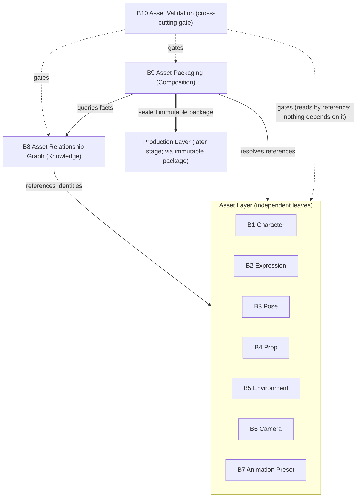

# Visual Production System (VPS)

## Stage A — Module A6: Module Overview (Stage B Module Architecture)

> **Document type:** Architecture design (module map only)
> **Project:** Visual Production System (VPS)
> **Roadmap position:** Stage A · Module A6 — follows locked *A1–A5*; final architecture-phase module before Stage B build begins
> **Depends on / inherits:** `VPS_Vision_and_Philosophy.md` (A1), `VPS_System_Architecture.md` (A2), `VPS_Repository_Structure.md` (A3), `VPS_Data_Flow_Architecture.md` (A4), `VPS_Runtime_Integration_Architecture.md` (A5)
> **Status:** Proposed — defines the complete Stage B module architecture
> **Scope discipline:** This document defines **what each Stage B module is, owns, and connects to** — its architectural envelope. It intentionally defines **no individual assets** (no specific characters, expressions, poses, props, environments, cameras, or presets) and **implements no module behavior.** It introduces **no implementation details** (no engines, models, formats, schemas, or tools). Stage B modules will be *built inside* the layers and homes defined by A2/A3, obeying the flow (A4) and integration (A5) already locked.

---

## 0. Purpose of This Document

A1–A5 defined the constitution, the four layers, the repository layout, the data flow, and the Runtime seam. A6 is the **bridge into Stage B**: it enumerates every planned Stage B module and fixes, for each, a single unique responsibility and a single home layer — *before* any module is built.

A6 is a **map, not a build.** It guarantees that when Stage B begins, every module already has exactly one place to live (A3), one owner (A2 §4), a defined position in the data flow (A4), and reachability only through the locked Runtime seam (A5). It designs no assets and writes no behavior.

Every rule applies the locked disciplines: **four-layer architecture**, **single source of truth**, **no responsibility overlap**, **acyclic dependencies**, **Runtime-driven**, **renderer-agnostic**, **implementation-independent**.

---

## 1. Layer Placement Principle for Stage B

The ten Stage B modules distribute across the locked A2 layers and the A3 cross-cutting validation hierarchy. **Each module lives in exactly one layer.**

- **Asset Layer** (`vps/asset/`) — the seven *asset-kind* modules. Each owns the canonical definitions and identities of **one kind** of reusable visual asset. Asset-kind modules **do not depend on one another**; any relationship between kinds is owned by the Knowledge Layer, not by an asset module. This keeps the Asset Layer a dependency-free foundation (A2 §5) and preserves single source of truth per kind.
- **Knowledge Layer** (`vps/knowledge/`) — the **Asset Relationship Graph**, which owns *all* relationships, compatibility, and cross-kind indexing, by reference to asset identities.
- **Composition Layer** (`vps/composition/`) — **Asset Packaging**, which assembles resolved selections into the immutable, renderer-agnostic production package (A4 M4/V4).
- **Cross-cutting Validation** (`vps/validation/`) — **Asset Validation**, which enforces structural, ownership/SSOT, and compatibility invariants as flow gates (A4 V1–V6). It is a *gate*, not a data owner, so nothing depends *on* it in a way that forms a cycle.
- **Production Layer** (`vps/production/`) — **not populated by these ten Stage B modules.** Renderer adapters are a distinct, later concern reached only through the immutable package (A4 M5); they are intentionally out of A6's named set and require no change to any module below.

---

## 2. Complete Stage B Module Map

| # | Module | Home Layer | One-line unique purpose |
|---|--------|-----------|--------------------------|
| B1 | **Character System** | Asset | Owns canonical definitions + identities of reusable **character** assets |
| B2 | **Expression System** | Asset | Owns canonical definitions + identities of reusable **expression** assets |
| B3 | **Pose System** | Asset | Owns canonical definitions + identities of reusable **pose** assets |
| B4 | **Prop System** | Asset | Owns canonical definitions + identities of reusable **prop** assets |
| B5 | **Environment System** | Asset | Owns canonical definitions + identities of reusable **environment** assets |
| B6 | **Camera System** | Asset | Owns canonical definitions + identities of reusable **camera** assets (framing/rig presets as assets) |
| B7 | **Animation Preset System** | Asset | Owns canonical definitions + identities of reusable **animation preset** assets |
| B8 | **Asset Relationship Graph** | Knowledge | Owns all **relationships, compatibility, and cross-kind indexing** between asset identities |
| B9 | **Asset Packaging** | Composition | Owns assembly of resolved selections into the **immutable production package** |
| B10 | **Asset Validation** | Validation (cross-cutting) | Owns the **invariant gates** (structure, SSOT/ownership, compatibility) across the flow |

**Overlap guard:** B1–B7 are disjoint by *asset kind*; B8 owns *relationships* (never definitions); B9 owns *assembly* (never definitions or relationships); B10 owns *gating* (never data). No two modules own the same thing.

---

## 3. Per-Module Architecture

Each module is defined by the ten required fields. All descriptions are envelopes only — no assets, no behavior, no implementation.

### B1 — Character System *(Asset Layer)*
1. **Purpose:** Provide the single source of truth for reusable character assets.
2. **Scope:** Character asset definitions and their stable identities only.
3. **Responsibilities:** Guarantee define-once identity and canonical definition for each character asset.
4. **Inputs:** Governed authoring inputs for character definitions (contract-shaped; content is Stage B, assets not defined here).
5. **Outputs:** Canonical character definitions addressable by stable identity.
6. **Ownership:** Exclusive owner of character definitions/identities in `vps/asset/`.
7. **Dependencies:** None on other asset modules (foundation). Uses only Asset-Layer identity/registry mechanisms.
8. **Integration points:** Referenced by B8 (relationships), resolved by B9 (packaging), gated by B10 (validation).
9. **Constraints:** No relationships, no rendering, no cross-kind logic; identity-addressed; single definition per character.
10. **Expansion strategy:** New character definitions are added as data under its subtree; no structural change.

### B2 — Expression System *(Asset Layer)*
1. **Purpose:** Single source of truth for reusable expression assets.
2. **Scope:** Expression asset definitions and identities only.
3. **Responsibilities:** Define-once identity and canonical definition per expression.
4. **Inputs:** Governed authoring inputs for expression definitions.
5. **Outputs:** Canonical expression definitions by identity.
6. **Ownership:** Exclusive owner of expression definitions/identities.
7. **Dependencies:** None on other asset modules. (The "expression-applies-to-character" fact is a **relationship owned by B8**, not a dependency here.)
8. **Integration points:** Related to characters via B8; resolved by B9; gated by B10.
9. **Constraints:** Owns no character data and no relationships; identity-addressed; single definition per expression.
10. **Expansion strategy:** Additive definitions under its subtree.

### B3 — Pose System *(Asset Layer)*
1. **Purpose:** Single source of truth for reusable pose assets.
2. **Scope:** Pose asset definitions and identities only.
3. **Responsibilities:** Define-once identity and canonical definition per pose.
4. **Inputs:** Governed authoring inputs for pose definitions.
5. **Outputs:** Canonical pose definitions by identity.
6. **Ownership:** Exclusive owner of pose definitions/identities.
7. **Dependencies:** None on other asset modules; pose↔character/other-kind links are B8 relationships.
8. **Integration points:** Related via B8; resolved by B9; gated by B10.
9. **Constraints:** No relationships, no other-kind data; identity-addressed; single definition per pose.
10. **Expansion strategy:** Additive definitions under its subtree.

### B4 — Prop System *(Asset Layer)*
1. **Purpose:** Single source of truth for reusable prop assets.
2. **Scope:** Prop asset definitions and identities only.
3. **Responsibilities:** Define-once identity and canonical definition per prop.
4. **Inputs:** Governed authoring inputs for prop definitions.
5. **Outputs:** Canonical prop definitions by identity.
6. **Ownership:** Exclusive owner of prop definitions/identities.
7. **Dependencies:** None on other asset modules.
8. **Integration points:** Related via B8; resolved by B9; gated by B10.
9. **Constraints:** No relationships, no other-kind data; identity-addressed; single definition per prop.
10. **Expansion strategy:** Additive definitions under its subtree.

### B5 — Environment System *(Asset Layer)*
1. **Purpose:** Single source of truth for reusable environment assets.
2. **Scope:** Environment asset definitions and identities only.
3. **Responsibilities:** Define-once identity and canonical definition per environment.
4. **Inputs:** Governed authoring inputs for environment definitions.
5. **Outputs:** Canonical environment definitions by identity.
6. **Ownership:** Exclusive owner of environment definitions/identities.
7. **Dependencies:** None on other asset modules.
8. **Integration points:** Related via B8; resolved by B9; gated by B10.
9. **Constraints:** No relationships, no other-kind data; identity-addressed; single definition per environment.
10. **Expansion strategy:** Additive definitions under its subtree.

### B6 — Camera System *(Asset Layer)*
1. **Purpose:** Single source of truth for reusable camera assets (framing/rig presets treated as assets).
2. **Scope:** Camera asset definitions and identities only — *definitions*, not their placement in a scene.
3. **Responsibilities:** Define-once identity and canonical definition per camera asset.
4. **Inputs:** Governed authoring inputs for camera definitions.
5. **Outputs:** Canonical camera definitions by identity.
6. **Ownership:** Exclusive owner of camera definitions/identities.
7. **Dependencies:** None on other asset modules.
8. **Integration points:** Related via B8; *applied* to a scene during B9 packaging; gated by B10.
9. **Constraints:** Owns definitions only; scene placement/framing decisions belong to Composition (B9), not here — prevents overlap.
10. **Expansion strategy:** Additive definitions under its subtree.

### B7 — Animation Preset System *(Asset Layer)*
1. **Purpose:** Single source of truth for reusable animation preset assets.
2. **Scope:** Animation preset asset definitions and identities only — *definitions*, not their application.
3. **Responsibilities:** Define-once identity and canonical definition per animation preset.
4. **Inputs:** Governed authoring inputs for animation preset definitions.
5. **Outputs:** Canonical animation preset definitions by identity.
6. **Ownership:** Exclusive owner of animation preset definitions/identities.
7. **Dependencies:** None on other asset modules.
8. **Integration points:** Related via B8; *applied* during B9 packaging; gated by B10.
9. **Constraints:** Owns definitions only; application/sequencing belongs to Composition (B9) and downstream Production — prevents overlap.
10. **Expansion strategy:** Additive definitions under its subtree.

### B8 — Asset Relationship Graph *(Knowledge Layer)*
1. **Purpose:** Single source of truth for how asset identities relate and what is compatible.
2. **Scope:** Relationships, compatibility rules, and cross-kind indexing/search — **by reference only**.
3. **Responsibilities:** Answer "what relates to what, what is compatible, which version is authoritative, how to find it" across all asset kinds.
4. **Inputs:** Asset identities from B1–B7 (by reference); governed relationship/compatibility records.
5. **Outputs:** Relationship/compatibility facts and asset identities (never definitions).
6. **Ownership:** Exclusive owner of relationships, compatibility, index, and version authority (`knowledge/`), per A4 §10.
7. **Dependencies:** Depends only on Asset-Layer **identities** (references), never on asset definitions' contents or on Composition.
8. **Integration points:** Queried by B9 during composition (A4 M3); consulted by B10 for compatibility gating.
9. **Constraints:** Stores no asset definition copies; never selects or assembles; references identities only.
10. **Expansion strategy:** New relationship/compatibility dimensions added as additive subtrees; consumers opt in via versioned contracts.

### B9 — Asset Packaging *(Composition Layer)*
1. **Purpose:** Assemble resolved asset selections into the immutable, renderer-agnostic production package.
2. **Scope:** Scene-graph assembly, application of selected assets (incl. camera/animation placement), and package sealing (A4 M4/V4).
3. **Responsibilities:** Turn Runtime-approved input + B8 facts + resolved B1–B7 references into one sealed, self-describing package.
4. **Inputs:** Runtime-approved input (A5, by reference); B8 facts; resolved asset references (B1–B7); resolved version set (A4 §10).
5. **Outputs:** One **immutable production package** (references + scene graph + selections + embedded version set).
6. **Ownership:** Exclusive owner of the scene graph, selection decisions, and the production package (A2 §2.3, A4 §12).
7. **Dependencies:** Depends on B8 (Knowledge) and resolves B1–B7 (Asset) references. Does **not** depend on B10 (gating is applied to it, not depended on by it).
8. **Integration points:** Entry from the Runtime (A5 single entry); hands the sealed package to the Production Layer (A4 M5).
9. **Constraints:** Defines no assets; owns nothing renderer-specific; package immutable after seal; deterministic assembly.
10. **Expansion strategy:** New composition/selection strategies added within its subtree behind existing Knowledge/Asset contracts.

### B10 — Asset Validation *(Validation, cross-cutting)*
1. **Purpose:** Enforce the VPS invariants as gates so invalid data never advances.
2. **Scope:** Structural validation, single-source-of-truth/ownership checks, and compatibility conformance (A4 V1–V6).
3. **Responsibilities:** Pass/fail each checkpoint with an attributable result; block on violation.
4. **Inputs:** Artifacts/references produced across the flow (asset definitions by reference, B8 facts, B9 package) plus validation rules (`vps/validation/`).
5. **Outputs:** Attributable pass/fail verdicts feeding the A4 error flow / A5 failure contract.
6. **Ownership:** Exclusive owner of validation rules and verdicts; owns **no** asset, relationship, or package data.
7. **Dependencies:** Reads other modules' outputs by reference/contract. **Nothing depends on B10 as a data source**, so it introduces no cycle (it is a gate in the flow).
8. **Integration points:** Invoked at A4 checkpoints; failures surface to the Runtime via the A5 failure contract.
9. **Constraints:** Never mutates or owns the data it checks; verdicts only; deterministic checks.
10. **Expansion strategy:** New rules/checkpoints added additively under `vps/validation/`; automatable.

---

## 4. Responsibility Matrix

Each module maps to **exactly one** unique responsibility; the matrix demonstrates zero overlap.

| Module | Owns *definitions* of… | Owns *relationships* | Owns *assembly/package* | Owns *gating* |
|--------|------------------------|----------------------|--------------------------|----------------|
| B1 Character | characters | — | — | — |
| B2 Expression | expressions | — | — | — |
| B3 Pose | poses | — | — | — |
| B4 Prop | props | — | — | — |
| B5 Environment | environments | — | — | — |
| B6 Camera | camera assets | — | — | — |
| B7 Animation Preset | animation presets | — | — | — |
| B8 Relationship Graph | — | **all** relationships/compatibility/index/version authority | — | — |
| B9 Asset Packaging | — | — | **the** scene graph + selections + immutable package | — |
| B10 Asset Validation | — | — | — | **all** structural/SSOT/compatibility gates |

Every column has a single owner (or is disjoint by kind), confirming **no module duplicates another**.

---

## 5. Dependency Diagram

Dependencies are minimal and acyclic, obeying the A2 downward direction. Asset-kind modules are independent leaves; relationships live in Knowledge; packaging depends downward; validation is a gate (no inbound data dependency).

- **No cycles:** arrows point down/forward only; B10's gate edges are read-only observations, not dependencies others rely on.
- **Asset-kind independence:** B1–B7 have no inter-dependencies; cross-kind links are B8 relationships.

---

## 6. Module Interaction Overview

For a single production request (A4 flow), the modules interact in this order:

1. **Runtime → B9** (A5 single entry): approved input arrives at Asset Packaging (Composition).
2. **B9 → B8** (A4 M3): Packaging queries the Relationship Graph for compatible selections + version authority.
3. **B8 → B1–B7** (by reference): the graph returns asset identities across the relevant kinds.
4. **B9 → B1–B7** (A4 M2): Packaging resolves those identities to canonical references.
5. **B9 assembles + seals** (A4 M4/V4): scene graph + selections → one immutable package embedding the version set.
6. **B10 gates throughout** (A4 V1–V6): structural/SSOT/compatibility verdicts block invalid advancement; failures surface via the A5 failure contract.
7. **B9 → Production** (A4 M5): the sealed package is handed off; renderer adapters (later stage) emit output; results/refs report to the Runtime (A5).

Interactions cross **contracts only** (A5); no module reaches into another's internals.

---

## 7. Ownership Matrix

| Owned datum | Exclusive owner | Others may… |
|-------------|-----------------|-------------|
| Character / Expression / Pose / Prop / Environment / Camera / Animation definitions + identities | **B1 / B2 / B3 / B4 / B5 / B6 / B7** respectively | reference by identity only |
| Relationships, compatibility, cross-kind index, version authority | **B8** | query by reference |
| Scene graph, selection decisions, immutable production package | **B9** | receive references to the sealed package |
| Validation rules and verdicts | **B10** | receive verdicts; cannot mutate rules |
| Orchestration/scheduling/global state; approved input payload | **Master Runtime** (A5) | VPS reads input by reference only |
| Renderer adapters + renderer-specific output | **Production Layer** (later stage) | receive the immutable package |

No datum has two owners — **single source of truth preserved** across all ten modules.

---

## 8. Expansion Strategy

Growth is **additive** and lands in exactly one owner (A2 §12, A3 §8):

- **New asset kind** → a *new* Asset-Layer module (e.g., B11) with its own disjoint responsibility + subtree; register its relationships in B8. No existing module changes.
- **New relationship/compatibility dimension** → additive subtree in B8; consumers opt in via versioned contracts.
- **New composition/selection strategy** → additive within B9, behind existing Asset/Knowledge contracts.
- **New validation rule/checkpoint** → additive within B10; automatable.
- **New renderer** → a Production-Layer adapter (later stage), invisible to B1–B10 (reached only via the immutable package).
- **New AI model** → governed configuration reference; model-agnostic; touches no module structurally.

**Invariant:** every future change is a new module or an additive subtree behind a versioned contract — never a shared responsibility, never a new inter-module cycle.

---

## 9. Architectural Constraints

| # | Constraint | How A6 satisfies it |
|---|-----------|----------------------|
| MC-1 | **Aligns with A1–A5** | Modules obey the constitution (A1), sit in the four layers (A2), live in their A3 homes, follow the A4 flow, and are reachable only via the A5 seam. |
| MC-2 | **Preserves four-layer architecture** | Each module lives in exactly one layer (Asset/Knowledge/Composition) or the cross-cutting validation hierarchy. |
| MC-3 | **Prevents responsibility overlap** | Responsibility matrix (§4) shows a single owner per concern; B1–B7 disjoint by kind. |
| MC-4 | **Maintains single source of truth** | Ownership matrix (§7) assigns exactly one owner per datum; others reference by identity. |
| MC-5 | **Keeps dependencies acyclic** | Dependency diagram (§5) is a downward DAG; asset-kind modules are independent; B10 is a non-dependency gate. |
| MC-6 | **Supports Runtime integration** | Single entry at B9 (A5); failures via the A5 failure contract; capability-, renderer-, model-agnostic. |
| MC-7 | **Implementation-independent** | No engines/models/formats/schemas/tools; no individual assets; no behavior — envelopes only. |

---

## 10. Stage B Readiness Assessment

| Dimension | Question | Assessment |
|-----------|----------|------------|
| **Unique responsibility** | Does every module have one unique responsibility? | **Yes** — verified by the responsibility matrix (§4). |
| **No duplication** | Does any module duplicate another? | **No** — B1–B7 disjoint by kind; B8/B9/B10 own distinct concerns. |
| **Minimal, acyclic deps** | Are dependencies minimal and acyclic? | **Yes** — independent asset leaves; single downward path; gate has no inbound data dependency. |
| **Single source of truth** | Is SSOT preserved? | **Yes** — one owner per datum (§7). |
| **Layer fidelity** | Does each module live in exactly one layer? | **Yes** — layer placement is explicit (§1, §2). |
| **Runtime reach** | Reachable only through the locked seam? | **Yes** — Runtime enters at B9 only (A5). |
| **Growth** | Does it support future growth without redesign? | **Yes** — additive modules/subtrees behind versioned contracts (§8). |
| **Implementation neutrality** | Any implementation/asset detail? | **No** — envelopes only. |

**Readiness verdict:** **READY.** The Stage B module architecture is complete, non-overlapping, acyclic, and aligned with A1–A5. Each module may now be designed and built inside its layer without restructuring.

---

## 11. Internal Quality Review (self-check performed before finalization)

- ✅ **Every Stage B module has a unique responsibility.** Verified — the responsibility matrix (§4) shows a single owner per concern; the seven asset modules are disjoint by kind, and B8/B9/B10 own relationships/assembly/gating respectively.
- ✅ **No module duplicates another.** Verified — definitions (B1–B7), relationships (B8), assembly/package (B9), and gating (B10) are mutually exclusive; camera/animation *definitions* (B6/B7) are separated from their *application* (B9) to remove the most likely overlap.
- ✅ **Dependencies are minimal and acyclic.** Verified — asset-kind modules are independent leaves; B8 references identities only; B9 depends downward; B10 is a read-only gate nothing depends on. The dependency diagram (§5) is a DAG.
- ✅ **The architecture supports future growth.** Verified — new kinds/dimensions/strategies/rules/renderers/models are all additive behind versioned contracts, with no shared responsibility and no new cycles (§8).
- ✅ **Aligns with A1–A5.** Verified — constitution (A1), four layers (A2), repository homes (A3), data flow + checkpoints + version flow (A4), and single-entry contract seam (A5) are all honored.
- ✅ **Scope discipline held.** Verified — no individual assets defined, no module behavior implemented, no implementation details introduced; a single document is committed.

No inconsistencies remained at finalization.

---

## 12. Relationship to Remaining Modules

A6 completes the **Stage A architecture phase** by mapping Stage B. It designs no module internals.

- **Stage A status after A6:** A1 (Vision & Philosophy), A2 (System Architecture), A3 (Repository Structure), A4 (Data Flow Architecture), A5 (Runtime Integration Architecture), and A6 (Module Overview) are complete. No further Stage A architecture module is required by this map; any additional Stage A work (e.g., a dedicated Contracts & Interfaces module) is at the discretion of the locked VPS roadmap, which A6 does not itself declare.
- **Stage B (next):** build B1–B10 inside their assigned layers/homes, each obeying the ownership, flow, and integration rules locked in A1–A6, and each fillable in place without altering this map.

A6 guarantees that every planned Stage B module already has exactly one home, one owner, one responsibility, and one defined position in the flow.

---

*End of Stage A · Module A6 — Module Overview (Stage B Module Architecture). This document maps all planned Stage B modules and inherits the locked A1–A5. It defines no assets and implements no behavior.*
