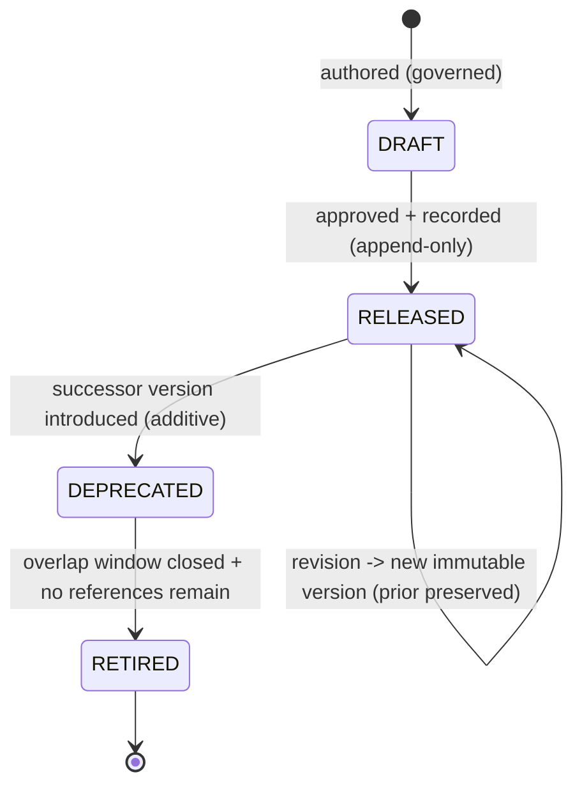

# Visual Production System (VPS)

## Stage B — Module B3: Pose System

> **Document type:** Module specification (conceptual, implementation-independent)
> **Project:** Visual Production System (VPS)
> **Roadmap position:** Stage B · Module B3 — the third Asset-Layer specification module, following the locked B1 Character System and B2 Expression System
> **Home layer:** Asset Layer (`vps/asset/`) — per A6 §2 (B3) and A3 §3
> **Depends on / inherits (locked):** A1–A10 (Stage A), B1 Character System, B2 Expression System
> **Status:** Proposed — the canonical Pose System specification
> **Scope discipline:** This document defines **only the canonical Pose System.** It **does not define characters, expressions, or animations**, and it **does not define compatibility relationships** (those belong to the Knowledge Layer / B8). It is **conceptual and implementation-independent**: no engines, models, formats, schemas-as-code, field types, or tools. It defines *what a pose is and how it is governed* — not how it is stored, applied to a character, sequenced, or rendered.

---

## 0. Purpose of This Document

B3 specifies the pose as an independent, reusable Asset-Layer asset kind — a sibling of the character and the expression, not a part of either. Under A6, the Pose System is an **Asset-Layer module** whose single responsibility is to be the **single source of truth for what a pose is and which pose is which.**

A pose in B3 is defined **on its own terms**, disjoint from any character, expression, or animation. The fact that a pose may later be *applied to* a character or *sequenced within* an animation is a **relationship owned by the Knowledge Layer (B8)** or the concern of a future module — never encoded here. This keeps B3 an independent Asset-Layer leaf (A6 §5) and preserves single source of truth.

Every rule applies the locked disciplines: **asset-first**, **single source of truth**, **determinism**, **identity over location**, **implementation-independence**, **contract-based Runtime compatibility**, and **no responsibility overlap**.

---

## 1. Pose Purpose

- **P-1 · A pose is a reusable visual asset.** It is a first-class, reusable Asset-Layer entity referenceable by identity across unlimited future productions (A1 reuse; A6 B3).
- **P-2 · Single source of truth for "what a pose is."** The Pose System is the one authoritative place a pose is defined; no other module defines or copies a pose definition (A2 §4; A7 MD-1/ID-6).
- **P-3 · Define once, reference everywhere.** A pose is authored once and consumed by reference; never duplicated (A1 §12; A7 ID-6).
- **P-4 · An independent kind.** A pose is defined without reference to any character, expression, or animation; any such association is a B8 relationship or a future module's concern (§12).
- **P-5 · A stable anchor for future modules.** The identity a pose exposes is what B8 and future modules reference — without B3 knowing about them (§12).

**Out of purpose (explicitly):** characters, expressions, animations, scene placement, compatibility relationships, application/sequencing logic, and rendering.

---

## 2. Pose Identity Model

The backbone of single source of truth and determinism (A7 ID-*).

- **IM-1 · Exactly one identity per pose.** A single canonical identity denotes one pose (A7 ID-1).
- **IM-2 · Stable & immutable.** Once assigned, a pose identity never changes and is never reused for a different pose, regardless of later edits or storage reorganization (A7 ID-1; A3 §5).
- **IM-3 · Globally unique within the VPS.** A pose identity never collides with any other asset identity of any kind — including characters and expressions (A7 ID-2).
- **IM-4 · Kind-attributable.** A pose identity makes its owning kind (pose) and owning module (B3) unambiguous from the identity alone (A7 ID-3).
- **IM-5 · Opaque to consumers.** Consumers treat a pose identity as an opaque reference; they must not parse it to infer content or bypass B3 (A7 ID-4).
- **IM-6 · Identity ≠ version.** Identity says *which pose*; version says *which revision* (A7 ID-5; §8).
- **IM-7 · Deterministic resolution.** Identity + version resolves to the same canonical definition given the same repository/version state (A4 determinism).
- **IM-8 · Kind-independent.** A pose identity encodes no character, expression, or animation identity and no association to them (§12; A7 CP-4).

---

## 3. Pose Metadata Model *(intrinsic only)*

> **Boundary note (no-overlap):** the Knowledge Layer (B8) owns **relational/extrinsic metadata** — relationships (including any pose↔character or pose↔animation association), compatibility, and cross-kind indexing (A2 §4; A7 MD-1; A8 §5). B3 owns **only intrinsic definitional metadata** — attributes that *are* part of the canonical pose definition.

Intrinsic metadata categories (conceptual — not a storage schema):

- **MM-1 · Identity metadata.** The pose's canonical identity and kind attribution (§2). Owned by B3.
- **MM-2 · Descriptive metadata.** Human-meaningful descriptors of the pose as a standalone entity (its name, classification tags — §4/§5). Owned by B3.
- **MM-3 · Definitional metadata.** The canonical, intrinsic properties that constitute *what the pose is* as a reusable asset, kept implementation-independent. Owned by B3.
- **MM-4 · Lifecycle/version metadata.** The pose's version and lifecycle state (§8). Content authority is B3's; **version authority of record remains the Knowledge Layer registry** (A8 §5) — B3 exposes its version, it does not run a competing registry.
- **MM-5 · Provenance/governance metadata.** Attribution and change-record references supporting audit (A7 DOC/CM), recorded append-only per A8.

**Explicitly excluded from B3 metadata:** any pose↔character, pose↔expression, or pose↔animation association, relationships to other assets, compatibility rules, and any cross-kind index — all Knowledge-Layer (B8) concerns.

---

## 4. Pose Classification System

Classification is an **intrinsic, pose-only taxonomy** — categorizing poses *as poses*, never as relationships to other kinds.

- **CL-1 · Intrinsic categorization only.** Classification describes properties of the pose itself; it never encodes links to characters, expressions, animations, or other assets (§12 no-overlap).
- **CL-2 · Governed vocabulary.** Uses a governed, versioned vocabulary so categories are consistent across all poses (A7; A8 additive dimensions).
- **CL-3 · Additive & versioned.** New categories are added additively behind a versioned vocabulary; existing poses are never broken (A8 EV-1).
- **CL-4 · Deterministic.** A pose's classification is a stable property of its definition/version, not a runtime decision.
- **CL-5 · Non-authoritative for combination.** Classification may *inform* future compatibility decisions but B3 decides no compatibility; it only exposes classification for B8 to consult (§9 boundary).

---

## 5. Pose Naming Standard

Naming makes poses unambiguous for humans; it never substitutes for identity (A7 N-*/ID-*).

- **NM-1 · Name is descriptive, identity is authoritative.** Consumers reference by identity, never by name (A7 ID-4).
- **NM-2 · Uniqueness within the pose kind.** Names are unique among poses to avoid human ambiguity; renaming does not change identity (IM-2).
- **NM-3 · Consistent casing/format per A7.** Follows the single A7 §1 naming rule, applied uniformly to all poses — no per-pose dialects.
- **NM-4 · Renderer/model-neutral.** Names never encode a renderer, engine, model, or vendor (A7 N-6).
- **NM-5 · No cross-kind encoding.** A pose name never embeds a character, expression, or animation name or identity — names describe the pose alone (§12).
- **NM-6 · Renaming is a governed change.** A name change is governed and recorded, leaving identity untouched (A7 N-7; §11).

---

## 6. Pose Identifier Strategy

- **ID-STR-1 · Minted once, by B3.** Pose identities are assigned solely by the Pose System at definition time; no other module mints pose identities (A2 §4).
- **ID-STR-2 · Opaque & stable.** Identifiers are opaque and permanent (IM-5/IM-2); consumers derive no meaning from them.
- **ID-STR-3 · Distinct from name and version.** Identifier ≠ name (§5) and identifier ≠ version (§8) — three separate concepts (A7 ID-5).
- **ID-STR-4 · Reference-only across boundaries.** Anything leaving B3 — into the Knowledge Layer, Composition, or across the Runtime seam — carries the identifier (and version), never a copy of the definition (A4 §12; A5 §5; A7 ID-6).
- **ID-STR-5 · Kind-resolvable, collision-free.** The scheme keeps pose identities resolvable to the pose kind/module and free of collision with characters, expressions, or any other kind (A7 ID-2/ID-3).

---

## 7. Pose Ownership

Ownership is exclusive and singular (A6 §7; A7 SSOT).

| Owned datum | Owner | Others may… |
|-------------|-------|-------------|
| Canonical pose **definitions** + their **identities** | **B3 Pose System** (Asset Layer) | reference by identity/version only |
| Pose **name & intrinsic classification** | **B3** | read; never redefine |
| Pose **version content** | **B3** (content) / **Knowledge Layer** (version authority of record) | query authority via B8 |
| Pose↔character / pose↔expression / pose↔animation (and any cross-kind) relationships & compatibility | **Knowledge Layer (B8)** — *not B3* | B3 exposes identity/attributes for B8 to relate |
| Animation sequencing that uses a pose | **Animation Preset System (future) + B8** — *not B3* | B3 remains unaware of it |

- **OW-1 · One owner, no copies.** No module copies a pose definition; all use references (A7 ID-6).
- **OW-2 · B3 owns definitions, not relationships.** B3 never owns relational or compatibility data — that is B8 (prevents the most likely overlap: pose↔character and pose↔animation links).

---

## 8. Pose Lifecycle

The pose lifecycle instantiates the locked A8 version lifecycle for pose definitions; B3 defines the shape, not a version manager.



- **LC-1 · Immutable per version.** A change to a released pose produces a **new version**; existing versions are never mutated (A8 VE-3) — enabling deterministic reproduction.
- **LC-2 · Self-describing usage.** When a pose participates in a production, the exact pose version is embedded in the immutable production package by Composition (A4 §10; A8 VE-4) — B3 simply exposes stable, versioned definitions.
- **LC-3 · Deprecate with a successor.** A superseded version is deprecated only when an additive successor exists, with a governed overlap window (A8 VL-3/VL-4).
- **LC-4 · Safe retirement.** Retirement occurs only after the window closes and no governed reference remains (A8 VL-5; A7 DEP-6).
- **LC-5 · Append-only history.** All lifecycle transitions are recorded append-only (A3 §6; A8 VE-5).
- **LC-6 · Independent lifecycle.** A pose's lifecycle is independent of any character's, expression's, or animation's lifecycle; versions are not coupled across kinds (an association, if any, is a B8 concern).

---

## 9. Pose Compatibility Posture *(requirements only — relationships owned by B8)*

> **Boundary note:** compatibility *relationships* (including whether a pose may combine with a character, expression, or animation) are owned and decided by the Knowledge Layer (B8) and enforced at the A4 V3 checkpoint by Asset Validation (B10) (A8 §6). B3 defines **no** compatibility relationships; it defines only the **requirements it must satisfy to be compatibility-checkable.**

- **CR-1 · Expose a stable, resolvable identity + version** so B8 can relate it and B10 can gate it deterministically (§2/§8).
- **CR-2 · Expose intrinsic classification** (§4) as read-only attributes for B8 to form relationships — B3 states none itself (CL-5).
- **CR-3 · Deterministic, immutable inputs.** Because pose versions are immutable (§8), any verdict B8/B10 compute over a pose is deterministic and reproducible (A8 CM-5).
- **CR-4 · No cross-kind assumptions.** A pose definition must not assume or encode compatibility with characters, expressions, animations, or any other kind; it remains self-contained (A7 CP-4; §12).
- **CR-5 · Contract-exposed, not self-asserted.** A pose exposes compatibility-relevant attributes through the governed contract surface; it never asserts that it *is* compatible with anything (that is B8's verdict).

---

## 10. Pose Repository Organization

Per A3 (`vps/asset/`), the Pose System occupies a single, exclusive subtree; B3 defines the organization, this document creates no content.

```text
vps/
└── asset/
    ├── registry/
    │   └── pose/               # authoritative pose identity registry (define-once identities)
    └── definitions/
        └── pose/               # canonical pose definitions (governed data; assets NOT defined here in B3)
```

- **RO-1 · One exclusive subtree.** Poses live only under the pose subtree of the Asset Layer; no pose data exists elsewhere (A3 §3; SSOT).
- **RO-2 · Registry separated from definitions.** Identity assignment (registry) is kept distinct from definition content, both owned by B3.
- **RO-3 · Identity-addressed, not path-addressed.** References use identity, so definitions may be reorganized within the subtree without breaking references (A3 §5; IM-2).
- **RO-4 · Grows as governed data.** The subtree grows by adding pose definitions as data, not by changing logic (A3 §7; A1 "grow the library").
- **RO-5 · No foreign content.** The pose subtree holds only pose definitions/identities — never characters, expressions, animations, relationships, or metadata owned by other modules.
- **RO-6 · Sibling to other kinds.** The pose subtree is parallel to the character, expression, and other asset-kind subtrees; poses are never stored inside another kind (reinforces independence, §12).

---

## 11. Pose Extensibility Strategy

- **EX-1 · Additive definitions.** New poses are added as new governed definitions under the pose subtree; no structural change and no impact on existing poses (A6 §8; A8 EV-1).
- **EX-2 · Additive intrinsic attributes.** New intrinsic classification/descriptive dimensions are added additively behind versioned vocabularies (§4; A8).
- **EX-3 · Versioned evolution.** Changes to an existing pose are new immutable versions, never in-place mutations (§8).
- **EX-4 · No overlap growth.** Extensibility never expands B3 into characters, expressions, animations, relationships, or compatibility — those grow in their own modules (§12).
- **EX-5 · Contract-stable.** The pose contract surface evolves additively and backward-compatibly so consumers (B8, Composition, Runtime) are never broken (A7 CT-6; A8 §6).

---

## 12. Pose Scope Boundaries & No-Overlap Declaration

B3 explicitly **defers** the following and absorbs none of them:

| Concern | Owner (not B3) | B3's only relationship to it |
|---------|----------------|-------------------------------|
| Characters | B1 Character System | independent kind; B3 defines no characters and stores no character data |
| Expressions | B2 Expression System | independent kind; B3 defines no expressions and stores no expression data |
| Animations | Animation Preset System (future) + B8 | B3 exposes identity only; defines no animations and no sequencing |
| Pose↔character / pose↔expression / pose↔animation associations | Knowledge Layer (B8) | B3 exposes a pose identity to be related; encodes no association |
| Props / Environments / Cameras | their future modules | independent kinds; B3 knows nothing of them |
| Relationships & cross-kind index | Knowledge Layer (B8) | B3 exposes identity/attributes; owns no relationships |
| Compatibility relationships & verdicts | B8 (owner) + B10 (gate) | B3 satisfies compatibility *requirements* (§9); asserts no compatibility |
| Scene assembly / package | Composition (B9) | B3 provides referenced definitions; assembles nothing |
| Renderer output | Production (later stage) | B3 is renderer-agnostic; defines nothing renderer-specific |

**No-overlap guarantee:** B3 owns exactly "what a pose is + which pose is which." Every other concern — especially the pose↔character and pose↔animation links — is referenced by identity or owned elsewhere, never absorbed.

---

## 13. Pose System Specification (Consolidated)

> The Pose System is the Asset-Layer, single-source, identity-addressed, versioned definition of reusable poses, defined independently of characters, expressions, and animations. It owns pose definitions, identities, intrinsic metadata, intrinsic classification, and names; it exposes stable identities/versions/attributes for other modules to reference; and it owns no relationships, compatibility, character/expression/animation associations, sequencing, assembly, or rendering.

This consolidates the identity model (§2), intrinsic metadata (§3), classification (§4), naming (§5), identifier strategy (§6), ownership (§7), lifecycle (§8), compatibility posture (§9), repository organization (§10), extensibility (§11), and scope boundaries (§12) into one coherent, pose-only module.

---

## 14. Pose Readiness Assessment

| Dimension | Question | Assessment |
|-----------|----------|------------|
| **Scope limited to poses** | Does B3 define only poses? | **Yes** — no characters/expressions/animations, and no compatibility relationships; §12 declares all deferrals. |
| **No absorbed responsibilities** | Are future-module responsibilities absorbed? | **No** — pose↔character/expression/animation associations and all relational/compatibility concerns are owned by B8; animations by their module. |
| **Stage A alignment** | Does B3 fit A1–A10? | **Yes** — Asset-Layer home (A2/A3/A6), identity/standards (A7), lifecycle/validation (A8), evolution (A9), within the lock (A10). |
| **B1/B2 alignment** | Is B3 consistent with the locked Character and Expression Systems? | **Yes** — parallel independent Asset-Layer kind; references other identities only via B8; encodes no cross-kind data. |
| **SSOT** | Is single source of truth preserved? | **Yes** — B3 is the sole pose authority; references only elsewhere. |
| **Runtime compatibility** | Is B3 Runtime-compatible? | **Yes** — exposes identity/version by reference; reachable only via the locked seam through Composition; owns no orchestration. |
| **Implementation-independence** | Any implementation detail? | **No** — conceptual model only; no engines/models/formats/schemas-as-code/tools. |
| **Supports future modules** | Can Character, Expression, Animation, and the Knowledge Layer build on B3? | **Yes** — B3 provides a stable, opaque, versioned pose identity they reference, without B3 knowing them. |

**Readiness verdict:** **READY.** The Pose System is a complete, pose-only, Stage-A-aligned specification that supports the Character, Expression, Animation, and Knowledge-Layer modules without overlap.

---

## 15. Internal Quality Review (self-check performed before finalization)

- ✅ **Scope is limited to poses.** Verified — B3 defines only the pose model; §12 explicitly defers characters, expressions, animations, relationships, and compatibility to their owners.
- ✅ **No future module responsibilities are absorbed.** Verified — pose↔character/expression/animation associations and all relational/extrinsic metadata and compatibility relationships are owned by B8; animation sequencing by its future module; B3 owns only intrinsic definitions and identities and merely *exposes* attributes.
- ✅ **Aligns with Stage A.** Verified — Asset-Layer placement (A2/A3/A6), identifier/naming/metadata standards (A7), version lifecycle and validation gates (A8), additive evolution (A9), within the A10 lock; Runtime-compatible via the single seam (A5).
- ✅ **Supports Character, Expression, Animation, and Knowledge Layer modules.** Verified — B3 is an independent kind parallel to B1/B2 that exposes a stable, opaque, versioned identity those modules (and B8) reference, without B3 depending on or defining any of them.
- ✅ **Scope discipline held.** Verified — conceptual/implementation-independent; no assets enumerated; a single document is committed.

No inconsistencies remained at finalization.

---

## 16. Remaining Stage B Modules

B3 is the third of the ten locked Stage B modules (A6/A9); it changes no roadmap.

- **Asset Layer (remaining):** **B4 Prop**, **B5 Environment**, **B6 Camera**, **B7 Animation Preset** — each a separate, disjoint asset-kind module defined independently and referencing other identities only via B8.
- **Knowledge Layer:** **B8 Asset Relationship Graph** — will own relationships/compatibility/index across kinds, referencing B1 character, B2 expression, and B3 pose identities.
- **Composition Layer:** **B9 Asset Packaging** — will assemble resolved selections into the immutable production package.
- **Cross-cutting:** **B10 Asset Validation** — will gate pose (and all) invariants at the A4 checkpoints.

B3 guarantees these can proceed by providing the stable pose identity foundation they build upon, with no overlap and no roadmap change.

---

*End of Stage B · Module B3 — Pose System. This document specifies only the canonical Pose System and inherits the locked A1–A10, B1, and B2. It defines no characters, expressions, animations, or compatibility relationships, and implements no behavior.*
