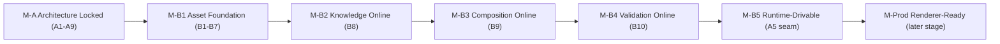
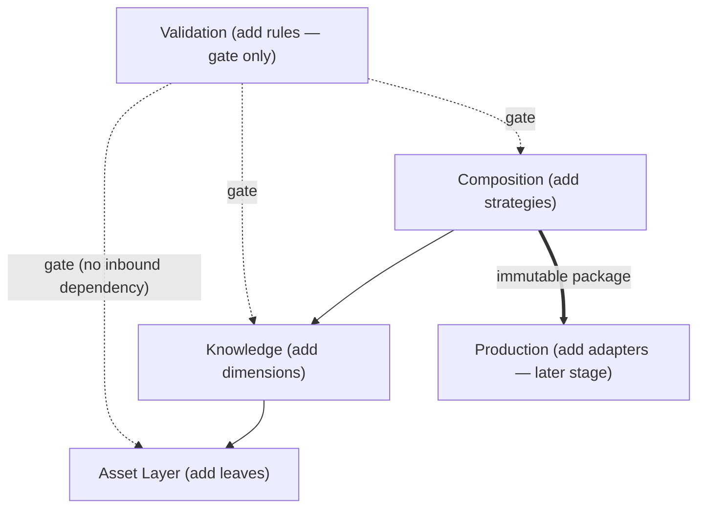

# Visual Production System (VPS)

## Stage A — Module A9: Roadmap & Evolution Strategy

> **Document type:** Architecture governance (evolution strategy only)
> **Project:** Visual Production System (VPS)
> **Roadmap position:** Stage A · Module A9 — follows locked *A1–A8*; the long-term evolution governance for the VPS
> **Depends on / inherits:** A1 (Vision & Philosophy), A2 (System Architecture), A3 (Repository Structure), A4 (Data Flow Architecture), A5 (Runtime Integration Architecture), A6 (Module Overview), A7 (Engineering Standards), A8 (Validation & Versioning Architecture)
> **Status:** Proposed — the binding long-term evolution strategy for the VPS
> **Scope discipline:** This document documents the **long-term architectural evolution strategy** while **preserving the existing locked roadmap.** It **does not redefine the locked roadmap**, **introduces no new Stage B modules**, defines **no assets**, and implements **no behavior.** It introduces **no implementation details** (no engines, models, formats, schemas, or tools). It records *strategy, milestones, and governance* only.

---

## 0. Purpose of This Document

A1–A8 defined the constitution, architecture, repository, data flow, Runtime seam, module map, engineering standards, and validation/versioning framework. A9 answers the remaining architectural question: **how the VPS evolves over the long term without eroding any of that.**

A9 is **strategy, not change.** It neither alters the locked roadmap (Stage A → Stage B as fixed by A6) nor adds modules; it documents the *principles, milestones, and governance* under which future work proceeds so that growth remains additive, deterministic, single-owner, and redesign-averse.

Every rule applies the locked disciplines: **preserve the locked roadmap**, **single source of truth**, **deterministic architecture**, **contract-based Runtime integration**, **implementation-independence**, and **minimize future redesign**.

---

## 1. Locked Roadmap (Preserved, Not Redefined)

For reference only — A9 restates the roadmap exactly as locked by prior modules and **changes nothing**:

- **Stage A — Architecture & Governance (COMPLETE/LOCKED):** A1 Vision & Philosophy · A2 System Architecture · A3 Repository Structure · A4 Data Flow Architecture · A5 Runtime Integration Architecture · A6 Module Overview · A7 Engineering Standards · A8 Validation & Versioning Architecture · A9 Roadmap & Evolution Strategy (this module).
- **Stage B — Module Build (locked scope, per A6):** B1 Character · B2 Expression · B3 Pose · B4 Prop · B5 Environment · B6 Camera · B7 Animation Preset (Asset Layer) · B8 Asset Relationship Graph (Knowledge) · B9 Asset Packaging (Composition) · B10 Asset Validation (cross-cutting).

> **Preservation clause:** A9 introduces **no new Stage B module** and **no reordering** of the above. Any future module beyond B10 is a *governed future amendment* (§6), not part of the locked roadmap and not declared here.

---

## 2. VPS Evolution Strategy (Overview)

The VPS evolves along a **stable core with evolving edges** (A1 §15): the architecture, layer boundaries, ownership rules, and governance are the fixed core; assets, relationships, renderers, and models are the evolving edges.

Three evolution principles anchor everything:

- **ES-1 · Additive over mutative.** Growth adds modules, subtrees, versions, or contracts; it does not rewrite existing surfaces (A6 §8; A7 CM-1; A8 EV-1).
- **ES-2 · Governed over incidental.** Every evolution step is validated against A1–A8 and recorded append-only; nothing drifts silently (A7 §10; A8 §8).
- **ES-3 · Reproducible over disposable.** Immutable versions + self-describing packages keep every past production reproducible after any evolution (A8 VE-3/VE-4).

---

## 3. Architectural Milestones & Milestone Map

Milestones are **capability thresholds**, not new scope. They describe the architecturally meaningful states the VPS passes through as the *locked* roadmap is executed.

| Milestone | Meaning | Basis (locked) |
|-----------|---------|----------------|
| **M-A · Architecture Locked** | Stage A (A1–A9) complete; the frame, standards, and governance are fixed | A1–A9 |
| **M-B1 · Asset Foundation** | Asset-Layer modules (B1–B7) provide single-source asset definitions | A6 Asset Layer |
| **M-B2 · Knowledge Online** | Relationship Graph (B8) provides relationships/compatibility/version authority | A6 B8; A8 §5 |
| **M-B3 · Composition Online** | Asset Packaging (B9) compiles immutable, self-describing production packages | A6 B9; A4 M4/V4 |
| **M-B4 · Validation Online** | Asset Validation (B10) enforces all invariant gates uniformly | A6 B10; A8 §1–§3 |
| **M-B5 · Runtime-Drivable** | The Runtime can drive an end-to-end production through the single seam | A5; A4 M1–M5 |
| **M-Prod · Renderer-Ready** | Production-Layer renderer adapters consume the immutable package (later stage) | A2 §2.4; A4 M5 |

> The map **describes** the locked sequence; it does not add or reorder modules.

---

## 4. Stage Sequencing Rationale

Why the locked sequence is correct (documented, not changed):

- **SR-1 · Foundations before dependents (A2 DAG).** Asset definitions (B1–B7) precede Knowledge (B8) because relationships reference asset identities; Knowledge precedes Composition (B9) because packaging queries relationships; Validation (B10) spans all because it gates every boundary. This mirrors the A2 downward dependency direction.
- **SR-2 · Single-source before combination.** A thing must be defined once (Asset Layer) before it can be related (Knowledge) or assembled (Composition) — SSOT demands this order.
- **SR-3 · Determinism before automation.** The deterministic core (A4) and its gates (A8) must exist before the Runtime automates end-to-end runs (A5) — you automate only what is already reproducible (A1 §13).
- **SR-4 · Renderer-agnostic core before renderers.** The renderer-agnostic package (B9) precedes any renderer adapter (later stage), so renderers remain pluggable rather than structural (A2/A5).

The rationale confirms the locked order is the *only* order consistent with A1–A8; A9 therefore preserves it.

---

## 5. Dependency Evolution Model

Dependencies **evolve in count, never in direction**. The A2/A6 acyclic, downward graph is invariant; only additive leaves and versioned contracts change.

- **DE-1 · Direction is frozen.** `Asset ← Knowledge ← Composition → Production`, with Validation as a non-dependency gate, never reverses or cycles (A2 §5; A6 §5).
- **DE-2 · Growth is by leaf/edge addition.** New asset kinds add independent Asset-Layer leaves; new relationships/dimensions add within Knowledge; new strategies add within Composition — all behind existing contracts (A6 §8).
- **DE-3 · Contracts absorb change.** Every new dependency is expressed against a versioned contract, so consumers are insulated (A7 CT-6; A8 §5/§6).
- **DE-4 · No new coupling to Runtime internals.** Evolution never couples the VPS to Runtime internals; the single contract seam is the only bridge (A5 §11).
- **DE-5 · Gate stays outside the graph.** Validation remains a read-only gate; adding rules never introduces an inbound dependency or a cycle (A8 VA-1).

---

## 6. Expansion Governance (Governance of Future Enhancements)

Any enhancement **beyond the locked roadmap** is admitted only through a governed path — never silently.

- **EG-1 · Amendment, not drift.** A future module (beyond B10), a new layer capability, or a changed principle enters only by a governed amendment to the relevant locked module (A7 CM-3); A9 declares none.
- **EG-2 · Additive placement.** An admitted enhancement must land in exactly one owner and one home (A3/A6), preserving disjoint ownership and SSOT.
- **EG-3 · Contract-versioned.** Cross-boundary enhancements ship as new contract versions with governed deprecation (A7 §12; A8 §7).
- **EG-4 · Readiness-gated.** No enhancement is adopted until it passes the A8 release-readiness model (RR-1…RR-9), uniformly with all Stage B modules.
- **EG-5 · Recorded + traceable.** Every enhancement is recorded append-only with a citation to the architecture it satisfies (A7 DOC-3/CM-5).
- **EG-6 · Roadmap integrity.** Enhancements may extend the roadmap only by governed addition after Stage B; they may never redefine or reorder the locked Stage A/Stage B sequence.

---

## 7. Future Compatibility Strategy

- **FC-1 · Versioned contracts everywhere.** All boundaries (inter-layer, Runtime, renderer) are versioned so parts evolve on independent timelines (A5 §10; A7 CT-2; A8 §5).
- **FC-2 · Backward-compatible by default.** Additive change preserves existing consumers; breaking change is a new major version plus governed deprecation (A8 §6/§7).
- **FC-3 · Renderer & model independence.** New renderers are adapters; new models are configuration references — neither touches the core (A1; A2; A5 §12).
- **FC-4 · Self-describing reproducibility.** Packages embed their resolved version set, so future changes never invalidate past productions (A8 VE-4).
- **FC-5 · Forward headroom.** Because the core is stable and the edges are pluggable, unforeseen future capability is absorbed by extension rather than redesign (A1 §15).

---

## 8. Backward Compatibility Policy

- **BC-1 · Existing consumers keep working.** An additive change must not break any current consumer of a contract or asset (A7 CT-6).
- **BC-2 · Breaking change ⇒ new major version + deprecation window.** Never applied in place; the prior version is deprecated through the A8 §7 lifecycle with a governed overlap window (A8 VL-3/VL-4).
- **BC-3 · Immutable past.** Released versions are never mutated or deleted; rollback is a safe forward selection of a prior immutable version (A8 §12).
- **BC-4 · Consumer-paced migration.** Consumers migrate during the overlap window on their own timeline (A5 §10; A8 UP-2).
- **BC-5 · Reproducibility guarantee.** Any production made under an older version remains exactly reproducible (A8 VE-3/VE-4).

---

## 9. Architectural Stability Policy

Stability is an explicit, defended property — not an accident.

- **SP-1 · Stable core.** The four-layer architecture, dependency direction, ownership rules, data flow, Runtime seam, engineering standards, and validation/versioning framework (A1–A8) are the stable core and change only by governed amendment.
- **SP-2 · Evolving edges.** Assets, relationships, composition strategies, renderers, and models are the designated change surface; they absorb most evolution.
- **SP-3 · Amendment discipline.** A core change is a conscious, recorded amendment with architectural justification (A7 CM-3); it is never incidental.
- **SP-4 · Precedence on conflict.** Where a proposed change conflicts with a locked module, the locked module prevails until formally amended (A7 APP-5).
- **SP-5 · Enforced stability.** Automatable invariants (ownership, acyclicity, contract conformance, versioning) are enforced via `vps/validation/` (A7 GOV-6; A8 §1).

---

## 10. Long-term Maintenance Strategy

- **MS-1 · Self-describing system.** Repository-driven definitions, in-place ownership notes, and self-describing packages let the system's behavior be reconstructed at any time (A1; A3 §9; A8 VE-4).
- **MS-2 · One reason to change per module.** Single-responsibility modules (A6) keep maintenance localized; a change touches one owner.
- **MS-3 · Grow the library, not the codebase.** Most long-term value accrues as governed data (assets, relationships), keeping logic stable (A1; A3 §7).
- **MS-4 · Automatable governance.** Naming, ownership, compatibility, and versioning checks are automatable, lowering long-term maintenance cost (A7 §13; A8 §9).
- **MS-5 · Append-only history.** A complete, append-only record (`vps/versioning/changelog/`) supports audit, debugging, and deterministic reconstruction (A3 §6; A8 VE-5).
- **MS-6 · Deprecation hygiene.** Superseded items are deprecated and retired on a governed schedule, preventing accumulation of dead surfaces (A8 §7).

---

## 11. Architectural Success Criteria

The VPS architecture is a long-term success if, over its lifetime:

- **SC-1** — No evolution has required a foundational redesign of the A1–A8 core.
- **SC-2** — Single source of truth has held: no datum ever acquired a second owner.
- **SC-3** — Determinism has held: identical inputs + repository state always produced the same result, and every past production remains reproducible.
- **SC-4** — The dependency graph has stayed acyclic and downward through every addition.
- **SC-5** — AI models and renderers were swapped via configuration/adapters, never via redesign.
- **SC-6** — The Runtime drove every capability through the single, unchanged contract seam.
- **SC-7** — Every enhancement entered additively, contract-versioned, readiness-gated, and recorded — with the locked Stage A/Stage B roadmap never redefined.
- **SC-8** — Growth manifested mostly as accumulated governed data, not as swelling core logic.

---

## 12. Roadmap Readiness Assessment

| Dimension | Question | Assessment |
|-----------|----------|------------|
| **Roadmap preservation** | Does A9 change the locked roadmap? | **No** — it restates and defends the A6 sequence; adds no module and no reordering. |
| **New-module discipline** | Are new Stage B modules introduced? | **No** — B1–B10 are the locked set; anything beyond is a governed future amendment only. |
| **A1–A8 alignment** | Does the strategy fit the locked architecture and governance? | **Yes** — milestones, dependency, compatibility, and maintenance all cite A1–A8. |
| **Determinism** | Is deterministic architecture preserved? | **Yes** — immutable versions, self-describing packages, deterministic readiness. |
| **SSOT** | Is single source of truth preserved? | **Yes** — additive placement into one owner; ownership invariant defended by SP/EG. |
| **Runtime integration** | Is Runtime integration preserved? | **Yes** — single contract seam remains the only bridge through all evolution. |
| **Implementation neutrality** | Any implementation detail introduced? | **No** — strategy/milestones/governance only. |
| **Redesign risk** | Is future redesign minimized? | **Yes** — stable core + evolving edges + additive, governed change. |

**Readiness verdict:** **READY.** The evolution strategy is complete, preserves the locked roadmap, and is aligned with A1–A8. Future work — beginning with Stage B — can proceed under one uniform, stability-preserving governance.

---

## 13. Internal Quality Review (self-check performed before finalization)

- ✅ **No changes are made to the locked roadmap.** Verified — §1 restates Stage A (A1–A9) and Stage B (B1–B10) exactly as locked; §3/§4 describe the sequence without adding or reordering; §6 confines any module beyond B10 to a governed *future* amendment that A9 does not declare.
- ✅ **Evolution strategy aligns with A1–A8.** Verified — every strategy element cites its basis (A2 DAG, A4 flow, A5 seam, A6 map, A7 standards, A8 validation/versioning); the milestone map follows the locked dependency order.
- ✅ **Governance supports future Stage B work.** Verified — expansion governance (§6), compatibility (§7), backward compatibility (§8), and maintenance (§10) apply uniformly to B1–B10 and gate all future work via the A8 readiness model.
- ✅ **Architecture remains stable.** Verified — the stability policy (§9) fixes the A1–A8 core, designates edges as the change surface, and makes core change a governed, recorded amendment with locked-module precedence on conflict.
- ✅ **Scope discipline held.** Verified — no roadmap redefinition, no new Stage B modules, no assets, no behavior, no implementation details; a single document is committed.

No inconsistencies remained at finalization.

---

## 14. Relationship to Remaining Modules

A9 is the long-term evolution governance; it builds nothing and changes no roadmap.

- **Stage A status after A9:** A1–A9 complete — Vision & Philosophy, System Architecture, Repository Structure, Data Flow Architecture, Runtime Integration Architecture, Module Overview, Engineering Standards, Validation & Versioning Architecture, and Roadmap & Evolution Strategy. With A9, the **Stage A architecture-and-governance phase is fully specified**; A9 declares no further Stage A module, and any such addition would itself be a governed amendment under the locked roadmap.
- **Stage B (next, per the locked roadmap):** build **B1–B10** inside their assigned layers (A6), obeying the flow (A4) and Runtime seam (A5), satisfying every A7 standard, fitting the A8 validation & versioning framework, and evolving only under the A9 strategy locked here.

A9 guarantees that the VPS can grow for the long term — through Stage B and beyond — without eroding determinism, single source of truth, Runtime integration, or the locked roadmap.

---

*End of Stage A · Module A9 — Roadmap & Evolution Strategy. This document governs the long-term evolution of the Visual Production System, preserves the locked roadmap unchanged, and inherits the locked A1–A8. It defines no assets, adds no Stage B modules, and implements no behavior.*
