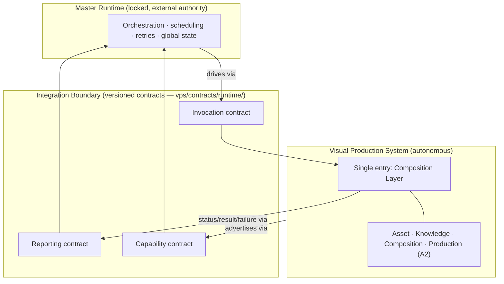
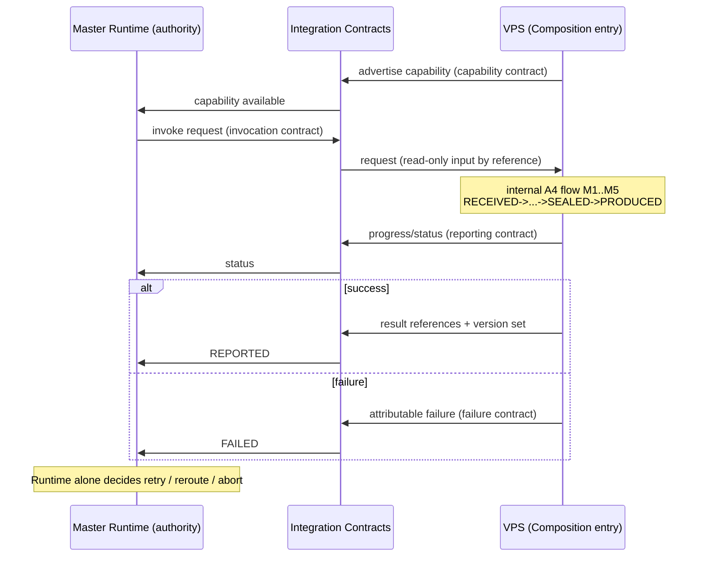
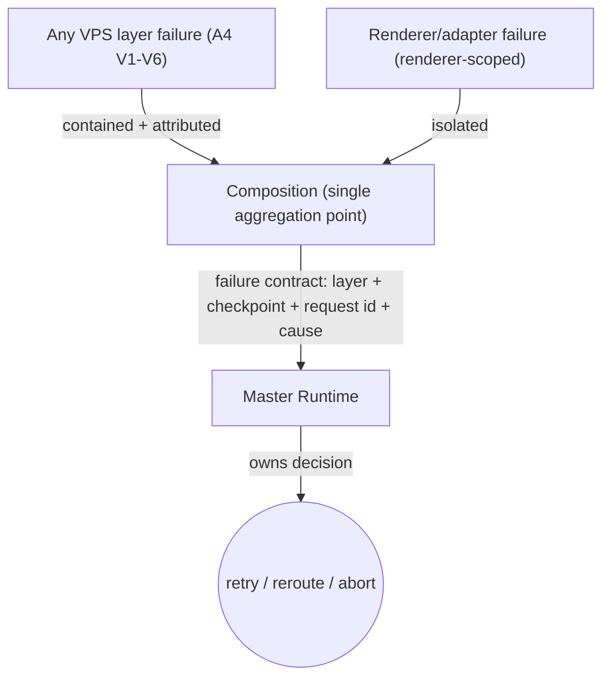
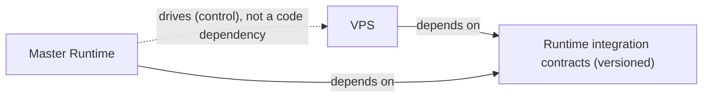

# Visual Production System (VPS)

## Stage A — Module A5: Runtime Integration Architecture

> **Document type:** Architecture design (integration contracts only)
> **Project:** Visual Production System (VPS)
> **Roadmap position:** Stage A · Module A5 — follows locked *A1 — Vision & Philosophy*, *A2 — System Architecture*, *A3 — Repository Structure*, *A4 — Data Flow Architecture*
> **Depends on / inherits:** `VPS_Vision_and_Philosophy.md`, `VPS_System_Architecture.md`, `VPS_Repository_Structure.md`, `VPS_Data_Flow_Architecture.md`
> **Status:** Proposed — defines the stable integration boundary between the Master Runtime and the VPS for all Stage B modules
> **Scope discipline:** This document defines **only how the Master Runtime and the VPS integrate through stable architectural contracts.** It **does not redefine the Master Runtime**, **does not implement Runtime behavior**, and **does not implement VPS behavior.** It introduces **no implementation details** (no engines, models, formats, schemas, protocols, or tools) and defines **no assets or production workflows.** The Master Runtime is treated as a locked, external authority whose internals are out of scope.

---

## 0. Purpose of This Document

A1 established the constitution, A2 the four layers, A3 the repository layout, and A4 the data flow. A5 defines the **single, stable seam** between the locked Master Runtime and the VPS: what crosses it, in which direction, who owns what on each side, and how it evolves without either side reaching into the other.

A5 is a **boundary contract**, not a behavior specification. It describes the *shape and rules* of the integration — the entry points, the request/response models, the ownership lines, the lifecycle touchpoints, error and version handling — while leaving *how* the Runtime orchestrates and *how* the VPS produces entirely to their respective (locked or future) modules.

Every rule here applies the locked disciplines: **Runtime authority**, **VPS autonomy**, **contract-based communication**, **no circular dependencies**, **single source of truth**, **determinism**, **repository-driven**, **renderer-agnostic**, and **immutable production packages**.

---

## 1. Runtime Integration Architecture (Overview)

The integration is a **one-seam, contract-mediated boundary**. The Master Runtime is the **orchestration authority**; the VPS is a **self-contained capability provider**. They communicate only across a versioned contract set — never through shared internals or shared mutable state.

**Core stance:**
- The Runtime **drives**; the VPS **serves**. Authority flows Runtime → VPS; the VPS never drives the Runtime.
- There is **exactly one control entry** into the VPS (the Composition Layer, per A2/A4) and **exactly one reporting channel** out.
- All crossing is **contract-mediated and versioned**, so each side evolves independently.

---

## 2. Runtime Entry Points

"Runtime entry points" are the points **the Runtime exposes to be driven from**, that the VPS relies upon as an external authority. The VPS depends only on their *contracts*, never their internals (Runtime is locked).

- **RE-1 · Invocation origin.** The Runtime is the sole initiator of a production request; the VPS never self-triggers. The VPS depends on the *invocation contract*, not on how the Runtime decides to invoke.
- **RE-2 · Reporting sink.** The Runtime exposes a destination for status, results, and failures. The VPS depends on the *reporting contract* shape only.
- **RE-3 · Capability registry.** The Runtime consumes the VPS's advertised capability through the *capability contract*, so it can drive the VPS without knowing how the VPS works.
- **RE-4 · Lifecycle authority.** The Runtime owns start/retry/reroute/abort decisions (see §8). The VPS observes lifecycle only insofar as the contract defines.

The VPS treats all four as **read-only external dependencies expressed as contracts** — consistent with "do not redefine the Master Runtime."

---

## 3. VPS Integration Points

These are the points **the VPS exposes to the Runtime** (formalizing A2 IP-1..IP-5 and A4 M1/M5 at the boundary):

- **VP-1 · Capability exposure.** The VPS advertises *what* it can produce via the capability contract — never *how* (A2 IP-1).
- **VP-2 · Single invocation entry.** The Runtime submits a request to **one** entry — the Composition Layer (A2/A4 M1). No other layer is reachable from the Runtime.
- **VP-3 · Status & result reporting.** The VPS reports progress, completion, and produced-artifact **references** back through the reporting contract (A2 IP-3, A4 REPORTED state).
- **VP-4 · Failure reporting.** The VPS surfaces attributable failures through the same channel (A2 IP-4, A4 §9).
- **VP-5 · Repository-driven description.** All capabilities and contracts are repository-resident (`vps/contracts/`, A3), so the Runtime can drive the VPS entirely from the repository.

**Invariant:** the VPS exposes exactly **one control entry and one reporting channel** — keeping the authority line single and unambiguous, and preventing the Runtime from coupling to VPS internals.

---

## 4. Runtime-to-VPS Request Model

Defined as a **contract shape**, not an implementation. A request crossing Runtime → VPS carries only what the VPS needs to begin deterministically:

- **Request identity** — a stable identifier for correlation across reporting and audit.
- **Approved compiled input (by reference)** — the upstream Generation output the VPS treats as **read-only** and does **not** own (A4 §2, §12). Passed by reference to preserve single source of truth.
- **Capability selector** — which advertised capability is being invoked (from the capability contract).
- **Governed configuration reference** — a reference to the applicable configuration (enabled renderers, model selection, environment) resolved from `vps/config/` (A3); values are not inlined, preserving single-source configuration.
- **Contract version** — the version of the invocation contract in use (§10).

**Rules:**
- The request is **immutable input** to the VPS; the VPS never writes back into it.
- The request carries **references, not owned data** — the Runtime retains ownership of the input and of orchestration state (A4 §12).
- The request is **sufficient for deterministic execution**: same request + same repository state ⇒ same result (determinism rule).

---

## 5. VPS-to-Runtime Response Model

Also a **contract shape**. A response crossing VPS → Runtime carries only outcomes and references:

- **Request identity** — echoes the correlating identifier.
- **Terminal or progress status** — mapped from the A4 data-state model (e.g., `REPORTED` on success, `FAILED` on failure). States are *data states*, not orchestration states.
- **Produced-artifact references** — references to renderer-agnostic/renderer-specific outputs owned by the Production Layer; the response carries **references, not the artifacts themselves** (single source of truth).
- **Resolved version set (by reference)** — which asset/definition versions the immutable package embedded (A4 §10), enabling deterministic reproduction and reporting.
- **Attributable failure descriptor** (on failure) — layer, checkpoint (A4 V1–V6), and request identity; carries cause, not remediation (remediation is the Runtime's decision).

**Rules:**
- The VPS **reports; it does not command.** It never instructs the Runtime to retry/reschedule — it supplies facts and lets the Runtime decide (Runtime authority).
- Responses are **fact-bearing and traceable**, preserving determinism-by-explanation (A1 §13).

---

## 6. Ownership Boundary Model

Ownership is **exclusive and non-overlapping** across the seam (extends A4 §12; enforces single source of truth and no duplicate ownership).

| Concern | Owner | The other side may… |
|---------|-------|----------------------|
| Orchestration, scheduling, retries, reroute, abort | **Master Runtime** | VPS observes only via contract; never owns or duplicates it |
| Global/session state across requests | **Master Runtime** | VPS holds only in-flight request *data* state (A4 §11) |
| Approved compiled input (the request payload) | **Master Runtime** | VPS reads by reference; never mutates or owns |
| Capability definition (what VPS can do) | **VPS** | Runtime consumes via capability contract; never defines it |
| Asset definitions / metadata / versions | **VPS layers** (per A2/A3) | Runtime never reaches in; sees only referenced results |
| Scene graph, selections, **immutable production package** | **VPS (Composition)** | Runtime receives references only; package is immutable |
| Renderer adapters + produced outputs | **VPS (Production)** | Runtime receives references only |
| Decision to retry/reroute/abort on failure | **Master Runtime** | VPS supplies attributable cause only |

**Boundary invariants:**
- **Runtime authority preserved:** the Runtime alone owns *when/whether* work runs and what happens on failure.
- **VPS autonomy preserved:** the VPS alone owns *how* it produces and all of its internal data.
- **No datum has two owners across the seam;** everything crossing is a reference or an immutable payload.

---

## 7. Integration Contract Model

All communication crosses a **small, versioned contract set** living in `vps/contracts/runtime/` (A3). Contracts define *shape and rules*, not behavior.

| Contract | Direction | Purpose |
|----------|-----------|---------|
| **Capability contract** | VPS → Runtime (advertise) | Declares what the VPS can produce, so the Runtime drives it without knowing internals (VP-1/RE-3). |
| **Invocation contract** | Runtime → VPS | Carries the request model (§4) to the single VPS entry (VP-2). |
| **Reporting contract** | VPS → Runtime | Carries the response model (§5): status, result references, version set (VP-3). |
| **Failure contract** | VPS → Runtime | Carries the attributable failure descriptor (§5, VP-4). May be a defined part of the reporting contract. |

**Contract rules:**
- **Contract-based only:** neither side calls the other's internals; the contract set is the *entire* integration surface.
- **Versioned:** each contract carries an explicit version (§10) and evolves additively.
- **Repository-resident:** contracts are governed artifacts in `vps/contracts/`, enabling repository-driven, deterministic invocation.
- **Renderer-agnostic:** no contract encodes renderer specifics; renderer selection is a configuration reference (§4), and renderer output is referenced, not embedded — supporting multiple renderers.

---

## 8. Runtime Lifecycle Interaction Model

The Runtime owns the lifecycle; the VPS participates only at defined touchpoints. This maps the A4 data-state model onto the seam **without** the VPS assuming any orchestration role.

- **Touchpoints only:** advertise → invoke → report. The VPS exposes nothing else to the lifecycle.
- **The Runtime decides lifecycle outcomes** (retry/reroute/abort); the VPS never does (Runtime authority, A1 N2).
- **Idempotent by request identity:** a re-invocation with the same request identity + repository state is deterministically the same work (determinism; supports automation).
- **Immutable package respected:** nothing in the lifecycle mutates a sealed package (A4 `SEALED`).

---

## 9. Error Interaction Model

Extends A4 §9 to the seam. Errors move **VPS → Runtime as attributable facts**; the Runtime owns the response.

- **Single aggregation, single channel:** the VPS reports all failures through the failure/reporting contract from its one reporting channel (A4 §9).
- **Attributable + traceable:** each failure names the layer, the A4 checkpoint, and the request identity — cause only, never remediation.
- **No upward improvisation:** the VPS never converts a failure into a silent, non-deterministic success, and never self-retries as if it were the Runtime.
- **Isolation preserved:** renderer failures stay renderer-scoped and do not corrupt the package or other adapters (A2 FB-4, supports multiple renderers).

---

## 10. Version Compatibility Model

Two distinct version concerns meet at the seam and must not be conflated:

1. **Contract versions** (integration compatibility) — the versions of the capability/invocation/reporting/failure contracts.
2. **Content version set** (production reproducibility) — which asset/definition versions the package embedded (owned by the Knowledge Layer, A4 §10).

**Rules:**
- **Explicit contract versioning.** Every request/response declares the contract version in use; the two sides negotiate on version, not on internals.
- **Additive, backward-compatible evolution.** New contract versions extend; they do not break existing consumers. Deprecation is staged (A2 §13, A3 §6).
- **Independent evolution.** Because contracts are versioned, the Runtime and VPS evolve on separate timelines without forcing lockstep releases (VPS autonomy + Runtime authority both preserved).
- **Content versions ride in the response by reference**, keeping version authority single-owner in Knowledge (no duplicate ownership) and enabling deterministic reproduction.
- **Compatibility is repository-checkable.** Contract conformance/versioning is validated via `vps/validation/contracts/` (A3), supporting automated, repository-driven checks.

---

## 11. Dependency Rules

The seam preserves the A2 acyclic dependency principle at the system boundary.

- **Both sides depend on the contract, not on each other's internals.** The contract is the shared, stable dependency — neither party imports or reaches into the other.
- **No circular dependency.** Control flows Runtime → VPS; the VPS never depends on Runtime internals, and the Runtime never depends on VPS internals. The only shared surface is the versioned contract set.
- **VPS-internal direction unchanged.** Inside the VPS, the A2 downward DAG (`Asset ← Knowledge ← Composition → Production`) is untouched; the Runtime attaches only at the Composition entry.
- **Repository-driven dependency.** The dependency is expressed as repository-resident contracts (`vps/contracts/`), not as runtime coupling.

---

## 12. Future Extensibility Model

Integration grows by **versioned contract extension**, never by widening the seam or coupling internals.

- **New capabilities** → advertised through a new capability-contract version; existing invocations keep working.
- **New renderers** → invisible to the seam: renderer selection stays a configuration reference (§4) and outputs are referenced (§5); Production adds an adapter (A2/A3) without any contract change.
- **New AI models** → invisible to the seam: model selection is a governed configuration reference; model-agnostic (A1).
- **New request/response fields** → added additively under a new contract version, with older versions still honored.
- **New lifecycle touchpoints** (if ever needed) → introduced as additive, versioned contract extensions; the Runtime remains the authority.
- **Automation growth** → the contract-only, idempotent, repository-driven seam is already automation-ready; higher autonomy is unlocked by the Runtime without a redesign.

**Extensibility invariant:** every future change lands in a **versioned contract** or in **configuration**, never in a new coupling between Runtime and VPS internals.

---

## 13. Integration Readiness Assessment

| Dimension | Question | Assessment |
|-----------|----------|------------|
| **Single seam** | Is the integration surface minimal and singular? | **Yes** — one entry (Composition), one reporting channel, a small versioned contract set. |
| **Runtime authority** | Does the Runtime retain full orchestration authority? | **Yes** — Runtime owns invoke/retry/reroute/abort and all orchestration/global state. |
| **VPS autonomy** | Does the VPS retain internal autonomy? | **Yes** — the Runtime never reaches into VPS layers; it sees capabilities and references only. |
| **Contract-based** | Is all communication contract-mediated? | **Yes** — capability/invocation/reporting/failure contracts are the entire surface. |
| **Acyclic** | Are circular dependencies prevented? | **Yes** — both sides depend on the contract, not each other's internals. |
| **Determinism** | Is deterministic execution preserved? | **Yes** — request is sufficient + immutable; same request + repo state ⇒ same result. |
| **SSOT** | Is single source of truth preserved across the seam? | **Yes** — only references/immutable payloads cross; no datum gains a second owner. |
| **Immutable packages** | Are production packages immutable across integration? | **Yes** — the seam carries references to sealed packages; nothing mutates them. |

**Readiness verdict:** **READY.** The integration architecture is complete, minimal, contract-only, and consistent with A1–A4.

---

## 14. Runtime Compatibility Assessment

| Dimension | Question | Assessment |
|-----------|----------|------------|
| **Non-modification** | Does A5 change the Master Runtime architecture? | **No** — the Runtime is treated as a locked, external authority; only the VPS-side contract dependency is defined. |
| **Authority model fit** | Does it fit the Runtime's "orchestration authority" role? | **Yes** — the VPS is a subordinate capability provider driven by the Runtime (A1/A2). |
| **State ownership** | Does the VPS avoid duplicating Runtime state/orchestration? | **Yes** — orchestration, scheduling, retries, and global state remain solely with the Runtime. |
| **Repository-driven fit** | Can the Runtime drive the VPS from the repository? | **Yes** — capabilities and contracts are repository-resident (`vps/contracts/`). |
| **Version independence** | Can Runtime and VPS evolve independently? | **Yes** — versioned, additive contracts allow separate release timelines. |
| **Failure-response fit** | Does the Runtime keep sole authority over failure response? | **Yes** — the VPS reports attributable cause; the Runtime decides retry/reroute/abort. |

**Compatibility verdict:** **COMPATIBLE.** The integration relies only on stable contracts and preserves the locked Master Runtime's role without redefinition.

---

## 15. Internal Quality Review (self-check performed before finalization)

- ✅ **Aligns with A1–A4.** Verified — runtime-driven/deterministic/asset-first (A1); single entry + acyclic layers (A2); contracts/config/validation homes (A3); movements, states, checkpoints, and version flow (A4) are honored at the seam.
- ✅ **Does not modify the Master Runtime architecture.** Verified — the Runtime is treated strictly as a locked external authority; A5 defines only the VPS-side contract dependency and the shared contract shapes, implementing no Runtime behavior.
- ✅ **Preserves deterministic execution.** Verified — the request is immutable and sufficient; same request + repository state yields the same result; the content version set rides in the response for reproducibility.
- ✅ **Preserves single source of truth.** Verified — only references and immutable payloads cross the seam; orchestration state stays with the Runtime and content/version authority stays within the VPS layers; no datum gains a second owner.
- ✅ **Supports every planned Stage B module.** Verified — the seam is capability-, renderer-, and model-agnostic; Stage B modules implement VPS internals behind the single entry without changing any contract.
- ✅ **Scope discipline held.** Verified — no Runtime/VPS behavior implemented, no assets or production workflows defined, no implementation details introduced; a single document is committed.

No inconsistencies remained at finalization.

---

## 16. Relationship to Remaining Modules

A5 defines the boundary that later modules operate across; it implements none of their internals:

- **Anticipated remaining Stage A work:** a **Contracts & Interfaces** module would formalize the *internal* inter-layer and renderer-adapter contracts and the concrete shapes of the Runtime contracts introduced here, fully populating `vps/contracts/`. Its exact identifier/sequence is governed by the locked VPS roadmap; A5 does not declare the roadmap.
- **Stage B (implemented behind this seam):** the Runtime attaches only at the Composition entry; Stage B builds Asset/Knowledge/Composition/Production internals without altering the integration contracts, ownership boundaries, lifecycle touchpoints, or version model defined here.

A5 guarantees that every future VPS capability is reachable by the Runtime through the same stable, versioned, contract-only seam.

---

*End of Stage A · Module A5 — Runtime Integration Architecture. This document defines how the Master Runtime integrates with the Visual Production System through stable contracts and inherits the locked A1–A4 modules. The Master Runtime itself is unchanged.*
