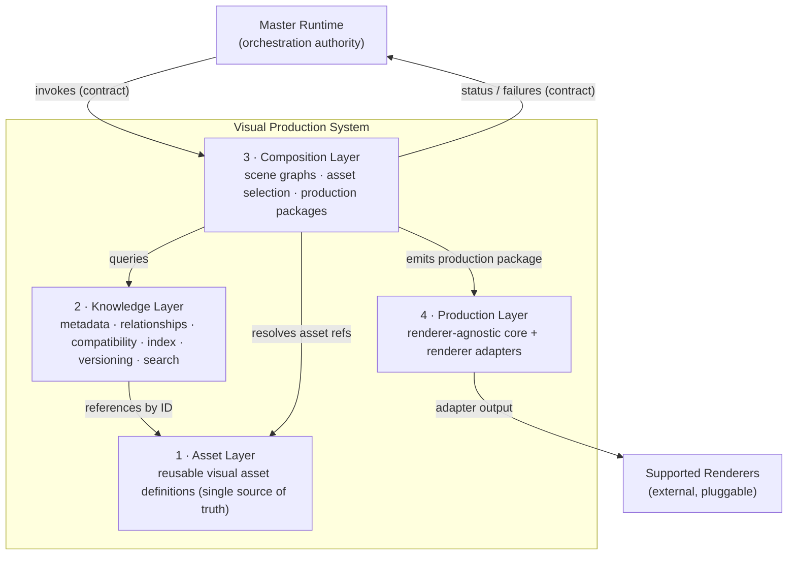
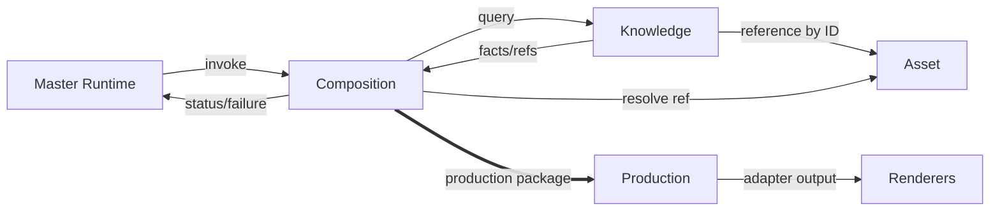
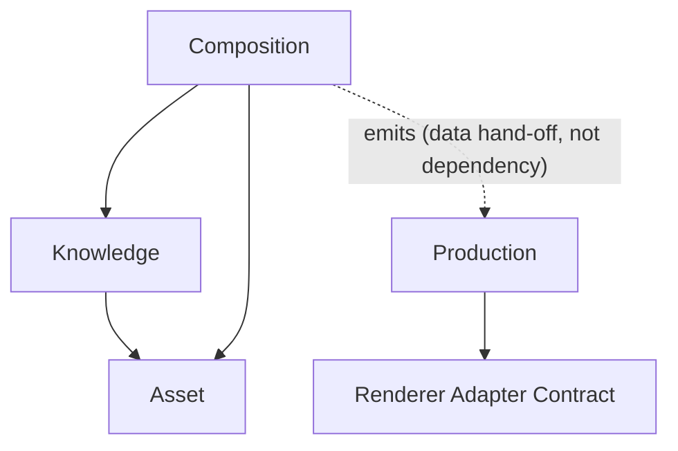
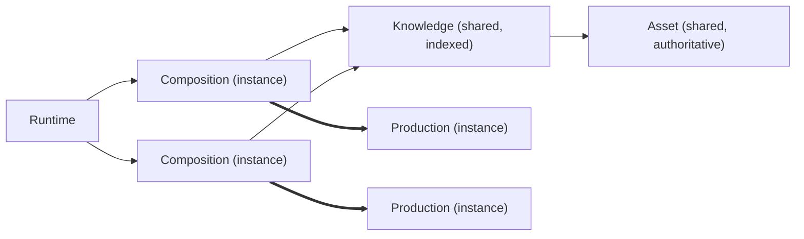
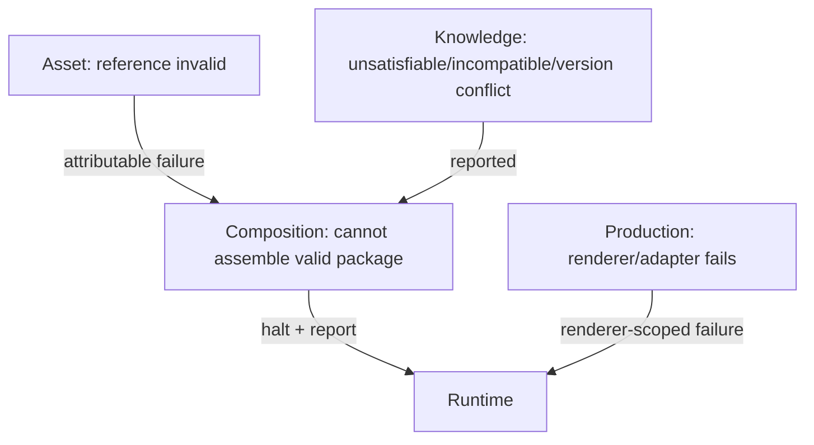
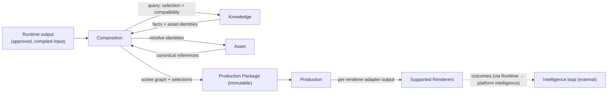

# Visual Production System (VPS)

## Stage A — Module A2: System Architecture

> **Document type:** Architecture design (structure only)
> **Project:** Visual Production System (VPS)
> **Roadmap position:** Stage A · Module A2 — follows the locked *Module A1 — Vision & Philosophy*
> **Depends on / inherits:** `VPS_Vision_and_Philosophy.md` (locked constitution)
> **Status:** Proposed — defines the complete layered architecture for all Stage B modules
> **Scope discipline:** This document defines the **structure, layers, boundaries, and interactions** of the VPS. It intentionally contains **no asset definitions, no characters, no expressions, and no production workflows.** It also introduces **no implementation details** (no engines, models, formats, schemas, or tools). Those belong to later modules and must conform to the architecture defined here.

---

## 0. Purpose of This Document

Module A1 established *why* the VPS exists and the laws it obeys. Module A2 establishes *how the VPS is structured* to obey those laws: the layers, who owns what, how information flows, where dependencies are allowed to point, and where failures are contained.

This architecture is the load-bearing frame for every Stage B module. Stage B modules will *implement inside* these layers; they may not move a responsibility across a layer boundary, reverse a dependency, or create a second owner for any piece of data. If a future module cannot be built without breaking this architecture, the architecture must be formally amended first.

Everything here is a direct application of the A1 constitution: **asset-first**, **generation-as-compilation**, **single source of truth**, **runtime-driven**, **repository-driven**, **AI-model agnostic**, **renderer-agnostic**, **deterministic**, and **evolvable by extension rather than rewrite**.

---

## 1. VPS System Architecture (Overall)

The VPS is a **four-layer, strictly downward-dependent, contract-bound pipeline** that sits beneath the Master Runtime. The Runtime drives it; the VPS produces renderer-ready outputs.

The four locked layers, from foundation to output:

1. **Asset Layer** — reusable visual assets (the base of truth for *what* a visual thing is).
2. **Knowledge Layer** — metadata, relationships, compatibility, indexing, versioning, and search *about* those assets.
3. **Composition Layer** — transforms Runtime outputs into scene graphs, asset selections, and production packages.
4. **Production Layer** — generates tool-specific outputs for supported renderers, while remaining renderer-agnostic.

**Reading the diagram:** authority flows *down* from the Runtime into Composition; queries flow *down* from Composition into Knowledge and from Knowledge into Asset; a finished **production package** flows *across* from Composition into Production; Production emits renderer-specific artifacts to external renderers through adapters. Nothing ever points back upward.

---

## 2. Layer Architecture & Responsibilities

Each layer has **one clearly bounded responsibility set**. Responsibilities are defined so they do **not overlap** (verified in §12).

### 2.1 Asset Layer — *reusable visual assets*
- **Owns:** the authoritative *definitions* of reusable visual assets — the single source of truth for *what an asset is*.
- **Responsible for:** existence, identity, and canonical definition of each reusable asset; guaranteeing that each asset is defined exactly once and addressable by a stable identity.
- **Does NOT:** describe relationships between assets, decide when an asset is used, or render anything.
- **Deliberately unspecified here:** the *kinds* of assets and their contents (assets, characters, expressions) are **not** defined in this module — that is Stage B work performed *inside* this layer.

### 2.2 Knowledge Layer — *metadata, relationships, compatibility, indexing, versioning, search*
- **Owns:** all information *about* assets — metadata, the relationship graph, compatibility rules, search indices, and the version registry. It is the single source of truth for *relationships and descriptive knowledge*, always referencing assets by their Asset-Layer identity.
- **Responsible for:** answering "what exists, how do things relate, what is compatible with what, which version applies, and how do I find it" — without owning the asset definitions themselves.
- **Does NOT:** store a second copy of an asset definition, choose assets for a scene, or produce output.
- **Depends on:** the Asset Layer only (references by identity).

### 2.3 Composition Layer — *Runtime output → scene graph, asset selection, production package*
- **Owns:** the *derived* artifacts of a production request — the scene graph, the asset-selection decisions, and the assembled production package. These are outputs of deterministic transformation, not new sources of truth.
- **Responsible for:** receiving Runtime output, querying the Knowledge Layer to select compatible assets, resolving those selections against Asset-Layer identities, and compiling a complete, renderer-agnostic **production package**.
- **Does NOT:** define or store assets, own metadata/relationships, or know anything renderer-specific.
- **Depends on:** the Knowledge Layer (for selection/compatibility) and the Asset Layer (to resolve references). Receives its trigger from the Runtime.

### 2.4 Production Layer — *renderer-agnostic core + tool-specific output*
- **Owns:** the renderer adapters and the renderer-specific output artifacts they produce.
- **Responsible for:** consuming a production package and generating tool-specific outputs for each supported renderer, while keeping a renderer-agnostic core so renderers are pluggable behind a stable contract.
- **Does NOT:** make composition/selection decisions, define assets, or hold metadata. It transforms an already-complete package into renderer output.
- **Depends on:** the Composition Layer's production package (as input) and renderer adapters (as pluggable dependencies).

---

## 3. Inter-layer Communication Model

Communication is **contract-bound, unidirectional, and typed by role**:

- **Query communication (downward):** Composition → Knowledge → Asset. A higher layer *asks*; a lower layer *answers*. Answers are read-only references and facts, never control.
- **Artifact hand-off (stage-to-stage):** Composition → Production. Composition emits an immutable **production package**; Production consumes it. This is a one-way hand-off of a finished artifact, not a shared mutable state.
- **Invocation & reporting (with the Runtime):** Runtime → Composition (invoke); Composition → Runtime (status/completion/failure). This is the only channel through which the VPS is driven and through which it reports.

**Rules of communication:**
- No layer calls *upward*. A lower layer never invokes or depends on a higher one.
- No layer bypasses its neighbor to reach two layers down for *control* — control is stepwise. (Composition may *resolve* Asset identities returned by Knowledge; it does not manage the Asset Layer.)
- All communication crosses a **versioned contract boundary**, so layers evolve independently.

---

## 4. Data Ownership

Single source of truth is enforced by giving each datum **exactly one owning layer**; every other layer references it by identity or receives it as an immutable artifact.

| Data | Owning layer | How others use it |
|------|--------------|-------------------|
| Reusable asset *definition* (what an asset is) | **Asset** | Referenced by stable identity only |
| Metadata, relationships, compatibility rules | **Knowledge** | Queried; never copied |
| Search index / catalog | **Knowledge** | Queried |
| Version registry (which version is authoritative) | **Knowledge** | Queried |
| Scene graph | **Composition** | Passed forward inside the production package |
| Asset-selection decisions | **Composition** | Passed forward inside the production package |
| Production package (assembled, renderer-agnostic) | **Composition** | Consumed by Production as immutable input |
| Renderer adapters + renderer-specific output | **Production** | Emitted to external renderers |
| Invocation, scheduling, retries, global state | **Master Runtime** (outside VPS) | VPS is driven by it; never duplicates it |

**Ownership laws:**
- No datum has two owners.
- No layer stores a copy of another layer's owned data; it references by identity or consumes an immutable hand-off.
- The VPS never owns orchestration state — that remains with the Runtime (per A1).

---

## 5. Dependency Rules

Dependencies form a **directed acyclic graph** with a single downward direction. Circular dependencies are prohibited.

- **Asset Layer:** depends on nothing (foundation / leaf).
- **Knowledge Layer:** depends only on the Asset Layer.
- **Composition Layer:** depends on the Knowledge Layer and the Asset Layer.
- **Production Layer:** depends only on the *production-package contract* (its input) and on *renderer-adapter contracts*. It does **not** depend on Knowledge or Asset directly.
- **Runtime:** external; drives Composition through a contract. The VPS depends on the Runtime's *invocation contract*, not on Runtime internals.

**Rules:**
1. Dependencies point downward/forward only — never upward, never in a cycle.
2. Cross-layer dependencies are expressed against **contracts**, not concrete internals.
3. A layer may be replaced or evolved as long as its contract holds.

---

## 6. Runtime Integration Points

The VPS integrates with the Master Runtime at a **small, explicit set of contract-bound points** and nowhere else (consistent with A1's "runtime governs, VPS obeys"):

- **IP-1 · Capability exposure.** The VPS advertises its production capability to the Runtime through a versioned contract; the Runtime discovers *what* the VPS can do without knowing *how*.
- **IP-2 · Invocation.** The Runtime triggers a production request by passing its output into the **Composition Layer** — the single entry point of the VPS.
- **IP-3 · Status & completion reporting.** Composition reports progress, completion, and produced-artifact references back to the Runtime through the contract.
- **IP-4 · Failure reporting.** Any layer's failure is surfaced to the Runtime as a clear, attributable, contract-defined failure (see §9). The Runtime — not the VPS — decides retries/scheduling.
- **IP-5 · Repository-driven description.** All capabilities, contracts, and configuration are repository-resident, so the Runtime can drive the VPS entirely from the repository.

The VPS exposes **exactly one control entry point (Composition)** and **one reporting channel** to keep the authority line single and unambiguous.

---

## 7. Repository Organization Strategy

The repository is the system of record; the architecture maps cleanly onto it (organizational strategy only — no file/format specifics):

- **Layer-aligned regions.** Each of the four layers occupies its own top-level region so ownership boundaries are visible in the repository structure itself.
- **Contracts held separately from internals.** Inter-layer and Runtime contracts live in a dedicated, versioned region so they can evolve on their own cadence and be validated independently.
- **Configuration externalized.** Volatile choices (which renderers are supported, model/engine selection) live as governed configuration, not embedded in any layer's logic.
- **Assets and knowledge as versioned data, not code.** The Asset and Knowledge regions grow as governed *data*, keeping the codebase stable while the library expands (supports the A1 "grow the library, not the codebase" strategy).
- **Single authoritative location per concept.** The repository layout physically discourages duplication: there is exactly one place an asset definition or a relationship record can live.
- **Repository-driven execution.** Everything required to run is describable from the repository, enabling Runtime-driven, auditable execution.

---

## 8. Scalability Model

Scalability follows A1: **grow output and capability without growing complexity linearly.**

- **Layer independence enables independent scaling.** Because layers are contract-bound, each can scale on its own profile (e.g., read-heavy Knowledge search vs. compute-heavy Production) without forcing the others to change.
- **Stateless transformation layers scale horizontally.** Composition and Production are designed as stateless transformers over their inputs, so multiple production requests parallelize naturally under Runtime control.
- **Data layers scale as data.** The Asset and Knowledge layers scale by growing their governed content and indices, not by enlarging logic.
- **Renderers scale by addition.** Supporting more renderers is adding adapters behind the Production contract, not redesigning Production.
- **Reuse absorbs volume.** Higher output volume draws on existing assets/knowledge, so marginal cost per additional output stays low (A1 "scale through reuse").
- **Bounded blast radius.** Growth in one dimension (more assets, more renderers, more volume) does not force redesign in unrelated dimensions.

---

## 9. Failure Isolation Model

Each layer is a **failure boundary**. Failures are contained, attributed, and reported — never silently swallowed or allowed to cascade upward (A1 "fail loud, fail traceable").

- **FB-1 · Asset boundary.** A missing or invalid asset *identity* is detected when referenced; it surfaces as an attributable resolution failure rather than a rendered guess.
- **FB-2 · Knowledge boundary.** An unsatisfiable query, unmet compatibility rule, or version conflict fails within Knowledge and is reported to its caller (Composition) — Knowledge never fabricates a relationship to succeed.
- **FB-3 · Composition boundary.** If a complete, valid production package cannot be assembled deterministically, Composition halts and reports a clear failure to the Runtime; it never emits a partial or improvised package.
- **FB-4 · Production boundary.** A renderer/adapter failure is isolated to that renderer; it does not corrupt the production package or affect other renderers/adapters, and it is reported as renderer-scoped.
- **FB-5 · Runtime reporting.** All boundary failures roll up to the Runtime through the failure contract; the Runtime owns the decision to retry, reroute, or abort.

**Isolation guarantees:** a fault in one renderer cannot break another; a knowledge fault cannot produce a bad asset definition; no layer converts an upstream failure into a silent, non-deterministic success.

---

## 10. Data Flow Overview

The canonical, deterministic flow of a single production request:

1. The Runtime hands approved output to **Composition**.
2. Composition **queries Knowledge** for compatible asset selections and resolves them against **Asset** identities.
3. Composition **compiles an immutable production package** (scene graph + selections).
4. **Production** consumes the package and produces **renderer-specific outputs** through adapters.
5. Outcomes flow back to platform intelligence **through the Runtime** (not through an internal VPS cycle), preserving the acyclic dependency graph.

Given the same Runtime input, the same asset library, and the same governed configuration, this flow is **deterministic and reproducible** (A1 determinism preserved).

---

## 11. Architecture Constraints

The architecture is bound by, and demonstrably satisfies, the following (mapping the brief's rules to structure):

| # | Constraint | How the architecture satisfies it |
|---|-----------|-----------------------------------|
| AC-1 | **Runtime-driven** | Single invocation entry (Composition) and single reporting channel; Runtime owns orchestration (§6). |
| AC-2 | **Repository-driven** | Layer-aligned, contract-separated, config-externalized repository; execution describable from the repo (§7). |
| AC-3 | **AI-model agnostic** | No layer's structure assumes a model; any AI use sits behind a contract as a swappable dependency (inherited from A1). |
| AC-4 | **Renderer-agnostic** | Production keeps a renderer-agnostic core; renderers are adapters behind a stable contract (§2.4, §5). |
| AC-5 | **No circular dependencies** | Strictly downward DAG: Asset ← Knowledge ← Composition → Production (§5). |
| AC-6 | **Single source of truth** | Each datum has exactly one owning layer; others reference by identity (§4). |
| AC-7 | **Deterministic compilation** | Composition compiles an immutable package from governed inputs; non-determinism contained at edges (§10). |
| AC-8 | **Supports future automation** | Stateless transform layers + single Runtime control line = unattended, scalable execution (§6, §8). |
| AC-9 | **Minimizes future redesign** | Volatility isolated behind contracts/adapters; layers evolve independently; growth is additive (§13, §14). |

---

## 12. Extensibility Model

The architecture grows by **extension within layers and addition behind contracts** — never by moving responsibilities across layers.

- **New renderers** → add an adapter behind the Production renderer contract. No change to Composition, Knowledge, or Asset.
- **New asset kinds** → extend the Asset Layer's definitions and register their metadata/relationships in the Knowledge Layer. No change to Composition control flow or Production.
- **New composition strategies** → add within the Composition Layer against existing Knowledge/Asset contracts.
- **New knowledge dimensions** (e.g., additional relationship or compatibility categories) → extend the Knowledge Layer; consumers opt in through versioned contracts.
- **New AI capabilities** → introduced behind the model-agnostic abstraction as swappable dependencies.

**Overlap check (quality gate):** each extension point lands in exactly one layer, confirming the layer responsibilities are disjoint:
- *What an asset is* → Asset only.
- *What is known/related/compatible/findable about assets* → Knowledge only.
- *What to select and how to assemble a package* → Composition only.
- *How to emit for a specific renderer* → Production only.

No extension requires two layers to own the same responsibility.

---

## 13. Future Compatibility Strategy

- **Versioned contracts everywhere.** Every inter-layer and Runtime boundary is versioned, so layers and integrations evolve on independent timelines without breaking consumers.
- **Additive-only evolution.** New capability is added; existing contracts are not broken. Deprecation is staged through versioning.
- **Stable core, evolving edges.** Layer boundaries and the dependency direction are the stable core; renderers, asset kinds, models, and composition strategies are the evolving edges.
- **Technology independence.** Because renderers and models are pluggable, the architecture absorbs technological change instead of being obsoleted by it.
- **Stage B readiness.** The four layers are defined generally enough that every planned Stage B module fits inside exactly one of them without structural change (see §15 and §16).
- **Redesign minimization.** By isolating all known axes of change behind contracts and adapters, the architecture makes a foundational rewrite improbable.

---

## 14. Architecture Readiness Assessment

| Dimension | Question | Assessment |
|-----------|----------|------------|
| **Layer disjointness** | Do layer responsibilities overlap? | **No** — each responsibility maps to exactly one layer; verified via the §12 overlap check. |
| **Implementation neutrality** | Are implementation details excluded? | **Yes** — no engines, models, formats, schemas, or tools; no assets/characters/expressions/workflows. |
| **Runtime alignment** | Does it align with the locked Master Runtime? | **Yes** — single invocation entry, single reporting channel, Runtime owns orchestration/state. |
| **Dependency safety** | Are circular dependencies prevented? | **Yes** — strictly downward DAG with contract-bound edges. |
| **Single source of truth** | Is every datum singly owned? | **Yes** — ownership table (§4) assigns exactly one owner per datum. |
| **Determinism** | Is deterministic compilation preserved? | **Yes** — immutable production package from governed inputs; non-determinism confined to edges. |
| **Stage B support** | Does it support all planned Stage B modules? | **Yes** — each future module fits inside exactly one layer without structural change. |
| **Redesign risk** | Is future redesign minimized? | **Yes** — volatility isolated behind versioned contracts/adapters; evolution is additive. |

**Readiness verdict:** **READY.** The four-layer architecture is complete, internally consistent, non-overlapping, and aligned with both the A1 constitution and the locked Master Runtime. Stage B module design may proceed by implementing *inside* these layers.

---

## 15. Internal Quality Review (self-check performed before finalization)

- ✅ **Layer responsibilities do not overlap.** Verified via the §12 extension/overlap check — each responsibility (what an asset *is* / what is *known* about it / what to *select & assemble* / how to *emit per renderer*) lands in exactly one layer.
- ✅ **No implementation details introduced.** Verified — the document defines structure, ownership, dependencies, and boundaries only; it names no engine, model, renderer, format, schema, or tool, and defines no assets, characters, expressions, or workflows.
- ✅ **Aligns with the locked Master Runtime.** Verified — the VPS exposes a single invocation entry (Composition) and a single reporting channel; it never owns orchestration, scheduling, retries, or global state.
- ✅ **Supports all planned Stage B modules.** Verified — the four layers are general enough that every anticipated Stage B module (asset model, knowledge/registry, composition, renderer adapters) fits inside exactly one layer without structural change.
- ✅ **Future redesign risk minimized.** Verified — a stable core (layer boundaries + downward DAG) with all known change axes (renderers, asset kinds, models, strategies) isolated behind versioned contracts and adapters; evolution is additive.

No inconsistencies remained at finalization.

---

## 16. Relationship to Remaining Architecture Modules

This architecture frames — but does not design — the modules that follow. Each remaining module will be built **inside exactly one locked layer**:

- **Stage B (per-layer design & implementation):**
  - **Asset Layer module(s)** — the asset model and single-source registry (the "define once" mechanism).
  - **Knowledge Layer module(s)** — metadata/relationship/compatibility model, index, version registry, and search.
  - **Composition Layer module(s)** — scene-graph construction, asset-selection logic, and production-package assembly.
  - **Production Layer module(s)** — the renderer-agnostic core and per-renderer adapters.
- **Cross-cutting (defined against contracts, not inside a single layer):** the versioned contract set, the Runtime integration contract, and governed configuration.

None of these are designed here; A2 only guarantees each will have exactly one correct home.

---

*End of Stage A · Module A2 — System Architecture. This document is the structural frame for all subsequent Visual Production System modules and inherits the locked Module A1 constitution.*
