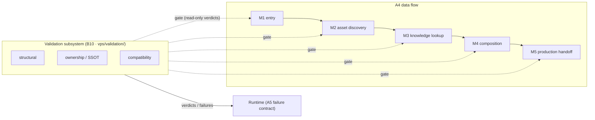
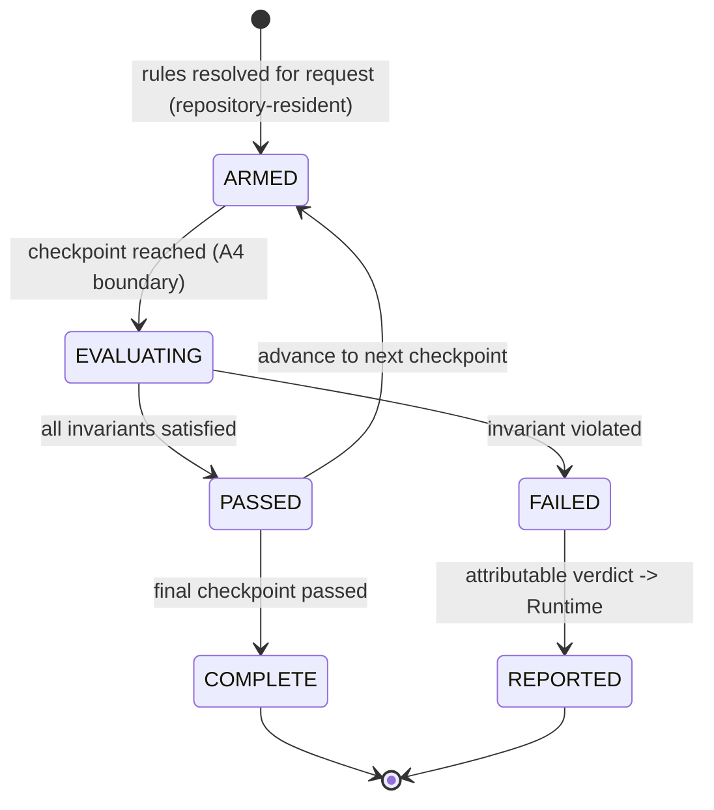
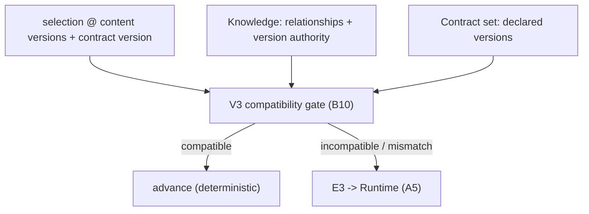
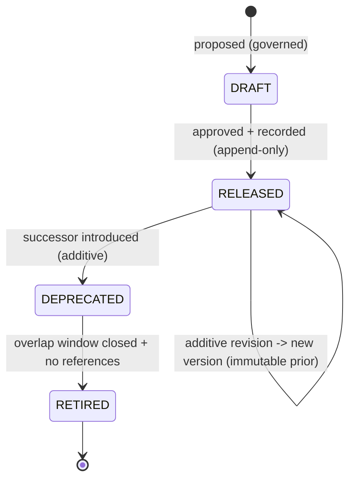

# Visual Production System (VPS)

## Stage A — Module A8: Validation & Versioning Architecture

> **Document type:** Architecture governance (framework only)
> **Project:** Visual Production System (VPS)
> **Roadmap position:** Stage A · Module A8 — follows locked *A1–A7*; the validation-and-versioning governance framework for all Stage B modules
> **Depends on / inherits:** A1 (Vision & Philosophy), A2 (System Architecture), A3 (Repository Structure), A4 (Data Flow Architecture), A5 (Runtime Integration Architecture), A6 (Module Overview), A7 (Engineering Standards)
> **Status:** Proposed — the binding validation & versioning framework for Stage B
> **Scope discipline:** This document defines the **architectural framework** governing validation, compatibility, and version evolution across the VPS. It **defines no assets**, **implements no validation logic**, and **implements no version management.** It introduces **no implementation details** (no engines, models, formats, schemas-as-code, algorithms, or tools). It states *architecture, lifecycles, ownership, and governance* only — applicable uniformly regardless of how any module is later built.

---

## 0. Purpose of This Document

A4 introduced validation checkpoints and version flow; A5 introduced contract-vs-content versioning at the Runtime seam; A6 assigned validation to Asset Validation (B10) and version authority to the Knowledge Layer (B8); A7 set the engineering standards for both. A8 unifies these into a **single, coherent governance framework**: one architecture for *how the VPS proves correctness* and *how the VPS evolves over time* without breaking determinism or single source of truth.

A8 is **governance, not construction.** It defines the framework a Stage B module's validation and versioning behavior must fit within; it writes none of that behavior. If a Stage B design cannot fit this framework, either the design is wrong or A8 must be formally amended first (per A7 §10/§13).

Every rule applies the locked disciplines: **single source of truth**, **determinism**, **four-layer fidelity**, **contract-based Runtime integration**, **implementation-independence**, **uniform governance**, and **minimize future redesign**.

---

## 1. Validation Architecture

Validation is the VPS's **correctness-proving subsystem** — a cross-cutting concern (A3 `vps/validation/`) owned by Asset Validation (A6 B10), operating as **gates in the data flow** (A4), never as a data owner.

**Architectural stance:**
- **VA-1 · Gates, not owners.** Validation reads artifacts by reference and issues verdicts. It owns *rules and verdicts* only — never asset definitions, relationships, or packages (A6 B10; A7 VAL-6). This is what keeps it outside the dependency graph and cycle-free.
- **VA-2 · Three invariant classes.** All validation reduces to three families the framework must always cover: **structural** (well-formedness), **ownership/SSOT** (exactly one owner per datum), and **compatibility** (governed combinability + contract/version agreement).
- **VA-3 · Positioned at layer boundaries.** Validation attaches at the movement boundaries of A4 (M1–M5), so invalid data never crosses a layer boundary.
- **VA-4 · Deterministic and attributable.** The same inputs always yield the same verdict; every verdict names layer + checkpoint + request identity + cause (A7 VAL-2/VAL-4).
- **VA-5 · Automatable + repository-checkable.** Every rule is expressible as an automatable check against repository-resident definitions and contracts (A7 VAL-5), supporting future unattended execution.
- **VA-6 · Fail loud.** A violation halts the flow and reports; it never degrades into a silent, non-deterministic success (A1; A4 §9).

---

## 2. Validation Lifecycle

A validation instance follows a fixed, deterministic lifecycle for each production request, mirroring the A4 request states without owning them.

- **LC-1 · Armed from the repository.** Applicable rules are resolved from `vps/validation/` before evaluation — no ad-hoc rules (A7 GOV-4).
- **LC-2 · Evaluated at checkpoints only.** Evaluation occurs at defined A4 boundaries (§3), not arbitrarily.
- **LC-3 · Binary, attributable verdict.** Each checkpoint yields pass or fail; failure carries full attribution and stops advancement (A7 EC-1).
- **LC-4 · No mutation.** The lifecycle never alters the data it evaluates (VA-1); it only permits or blocks advancement.
- **LC-5 · Deterministic replay.** Re-evaluating the same request against the same repository state reproduces the same verdicts.

---

## 3. Validation Checkpoints

The framework binds validation to the **A4 checkpoint set (V1–V6)**, assigning each the invariant class it enforces. A8 does not add new checkpoints; it governs the existing ones uniformly.

| Checkpoint | A4 boundary | Invariant class enforced | Failure class (A7 §11) |
|-----------|-------------|--------------------------|-------------------------|
| **V1 · Entry** | after M1 | structural (request well-formed, contract-compatible) | E1 |
| **V2 · Asset resolution** | during M2 | structural + ownership (identity resolves to one canonical owner) | E2 |
| **V3 · Compatibility & version** | during M3 | compatibility (governed combinability + version authority resolvable) | E3 |
| **V4 · Package seal** | end of M4 | structural + ownership (complete, deterministic, self-describing, single-owner) | E4 |
| **V5 · Handoff/adapter** | during M5 | structural (adapter can consume sealed package) | E5 (renderer-scoped) |
| **V6 · Ownership/SSOT** | continuous | ownership (no datum acquires a second owner) | E6 |

- **CK-1 · Uniform coverage.** Every Stage B module that participates in a movement is subject to the checkpoint(s) on that boundary — no module is exempt (A7 §13).
- **CK-2 · Continuous SSOT gate.** V6 runs across all transitions, not just at one point (A7 VAL-3).
- **CK-3 · Renderer isolation.** V5 failures stay renderer-scoped and never corrupt the sealed package (A2 FB-4; A7 EC-3).

---

## 4. Validation Ownership

Ownership is **unambiguous and singular** (A6/A7 SSOT).

| Concern | Exclusive owner | Others may… |
|---------|-----------------|-------------|
| Validation **rules** | **Asset Validation (B10)** in `vps/validation/` | reference the rule set; never define private rules |
| Validation **verdicts** | **Asset Validation (B10)** | receive verdicts; never override them |
| The **data being validated** | its home layer/module (A6) | validation reads by reference only, never owns |
| **Response to a failed verdict** | **Master Runtime** (A5) | validation supplies cause; never decides retry/abort |

- **VO-1 · One validator of record.** B10 is the single owner of validation rules and verdicts across the whole VPS; no layer runs a competing, privately-owned validation authority.
- **VO-2 · Gate, never owner of data.** B10 owning verdicts does not make it an owner of the validated data — preserving both SSOT and the acyclic graph (A6 B10).
- **VO-3 · Runtime owns the consequence.** A failed verdict is reported; the Runtime alone decides what happens next (A5 §9).

---

## 5. Version Architecture

Versioning is the VPS's **evolution subsystem**. A8 formalizes the A5/A7 rule that **two version concerns are permanently distinct** and separately owned.

| Version concern | What it denotes | Exclusive authority | Home |
|-----------------|-----------------|---------------------|------|
| **Content version** | which revision of an asset/definition | **Knowledge Layer** version registry (A6 B8) | `vps/knowledge/versions/` |
| **Contract version** | which revision of an interface/contract | **governed contract set** (A5/A7) | `vps/contracts/` |

**Architectural stance:**
- **VE-1 · Single authority per concern.** Content-version authority lives only in Knowledge; contract-version authority lives only in the contract set. Neither is re-derived elsewhere (A4 §10; A7 VER-1/VER-2).
- **VE-2 · Identity ≠ version.** Identity says *which* asset; version says *which revision* (A7 ID-5). They are distinct and never conflated.
- **VE-3 · Immutability per version.** A change yields a new version; existing versions are never mutated (A7 VER-3) — the foundation of deterministic reproduction.
- **VE-4 · Self-describing packages.** The immutable production package embeds the exact resolved content-version set it was built from (A4 §10; A6 B9; A7 VER-4).
- **VE-5 · Append-only history.** All version transitions are recorded append-only (`vps/versioning/changelog/`, A3 §6; A7 VER-6).

---

## 6. Version Compatibility Model

Compatibility governs whether two versioned things may interoperate — and it is **declared, checked, and deterministic** (A7 CP-*).

- **CM-1 · Content compatibility is a Knowledge relationship.** Whether two asset versions may be combined is a governed relationship owned by B8; no asset-kind module encodes it internally (A6 overlap guard; A7 CP-1/CP-4).
- **CM-2 · Contract compatibility is negotiated on version.** Interacting parties agree on an explicit contract version; a mismatch is detected at V1/V3, never silently coerced (A5 §10; A7 CP-3).
- **CM-3 · Backward-compatible by default.** Additive evolution preserves compatibility with existing consumers; a breaking change requires a new major contract version and a governed deprecation (§8; A7 §12).
- **CM-4 · Checked at gates.** Compatibility verdicts are produced only at the V3 checkpoint by B10 against B8 facts (A4; §3).
- **CM-5 · Deterministic verdict.** The same versions against the same compatibility state always yield the same verdict.

---

## 7. Version Lifecycle

Each versioned entity (content or contract) follows one governed lifecycle. A8 defines the lifecycle *shape*; it manages no versions.

- **VL-1 · Draft → Released.** A version becomes authoritative only when governed and recorded; releases are append-only (A7 CM-5).
- **VL-2 · Immutable once released.** A released version is never mutated; further change creates a new version (VE-3).
- **VL-3 · Deprecated with a successor.** A superseded version is marked deprecated only when an additive successor exists (A7 DEP-1/DEP-3).
- **VL-4 · Overlap window.** Deprecated and successor coexist for a governed window so consumers migrate independently (A5 §10; A7 DEP-2).
- **VL-5 · Retired safely.** Final retirement occurs only after the window closes and no governed reference remains (A7 DEP-5/DEP-6).

---

## 8. Evolution Strategy

The VPS evolves by **additive, versioned, governed change** — never by silent mutation (A1 long-term evolution; A7 CM/DEP).

- **EV-1 · Additive-first.** New content versions, contract versions, relationship dimensions, validation rules, or modules are added; existing surfaces are not broken (A6 §8; A7 CM-1).
- **EV-2 · Breaking change is a new major version + deprecation.** It is never applied in place; the old version is deprecated through the §7 lifecycle.
- **EV-3 · Independent timelines.** Because content and contract versions are separately owned and versioned, Runtime, VPS layers, and modules evolve without lockstep releases (A5 §10).
- **EV-4 · Reproducibility preserved.** Immutable versions + self-describing packages guarantee any past production remains reproducible after evolution (VE-3/VE-4).
- **EV-5 · Governed and recorded.** Every evolution step is validated against A1–A8 and recorded append-only (A7 GOV-5/CM-5).

---

## 9. Release Readiness Model

A change (module, contract version, or content version) is **release-ready** only when it passes a uniform governance gate — the same gate for every Stage B module.

| Gate | Question | Basis |
|------|----------|-------|
| **RR-1 · Validation-clean** | Do all applicable checkpoints (V1–V6) pass deterministically? | §1–§3 |
| **RR-2 · Ownership-clean** | Does every datum have exactly one owner (V6)? | §4; A6/A7 SSOT |
| **RR-3 · Compatibility-clean** | Are content & contract compatibilities satisfied or governed-deprecated? | §6 |
| **RR-4 · Versioned & immutable** | Is the change a new immutable version (not a mutation)? | §5/§7 |
| **RR-5 · Self-describing** | Do resulting packages embed their resolved version set? | VE-4 |
| **RR-6 · Recorded** | Is the change recorded append-only with architectural traceability? | §8; A7 DOC/CM |
| **RR-7 · Standards-conformant** | Does it satisfy every applicable A7 standard? | A7 §13 |

- **RR-8 · Uniform application.** This model applies identically to **all of B1–B10** and every future module (A7 §13); none is exempt.
- **RR-9 · Deterministic verdict.** Release readiness is a deterministic function of repository state, so it is automatable and auditable.

---

## 10. Compatibility Governance

- **CG-1 · Declared authority.** Compatibility (content) is governed solely by B8; contract compatibility solely by the versioned contract set. No shadow authorities.
- **CG-2 · Gate-enforced.** Compatibility is proven at V3 by B10; it is never assumed by a producer or consumer (A7 CP-2).
- **CG-3 · No cross-kind leakage.** An asset-kind module never encodes compatibility with another kind; that is a Knowledge relationship (A6 overlap guard).
- **CG-4 · Explicit contract negotiation.** Parties declare and agree contract versions; mismatch fails loud (A5 §10; §6 CM-2).
- **CG-5 · Deterministic + recorded.** Compatibility verdicts are deterministic and their governing relationships are recorded and versioned.

---

## 11. Upgrade Strategy

- **UP-1 · Additive rollout.** A new version is introduced alongside the current one; nothing is forced to upgrade at introduction (§8 EV-1).
- **UP-2 · Consumer-paced migration.** During the overlap window, consumers migrate on their own timeline via contract-version negotiation (§7 VL-4; A5 §10).
- **UP-3 · Validation-gated adoption.** An upgrade is adopted only after it passes the release-readiness model (§9) — determinism and SSOT preserved.
- **UP-4 · Reproducibility intact.** Because prior versions remain immutable and packages are self-describing, upgrading never invalidates past productions (VE-3/VE-4).
- **UP-5 · Recorded.** Every upgrade is recorded append-only with architectural traceability (A7 CM-5).

---

## 12. Rollback Strategy

Rollback is **safe because history is immutable and append-only** — it is a governed forward action, not a destructive rewrite.

- **RB-1 · Roll forward to a prior version.** Rollback selects a previously-released, still-valid version by identity+version; it never mutates or deletes history (VE-3; A7 CM-5).
- **RB-2 · Deterministic reconstruction.** Because packages are self-describing (embed their version set) and versions are immutable, any prior production is reconstructable exactly (VE-4).
- **RB-3 · Gate-checked.** A rollback target must itself pass release readiness (§9) and compatibility governance (§10) for the current request context.
- **RB-4 · Runtime-authorized.** The Runtime decides whether/when to roll back (as with any failure response, A5 §9); the VPS supplies the reproducible target, not the decision.
- **RB-5 · Recorded.** Rollbacks are recorded append-only; no history is erased, preserving audit and reproducibility.

---

## 13. Governance Constraints

| # | Constraint | How A8 satisfies it |
|---|-----------|----------------------|
| GC-1 | **Aligns with A1–A7** | Validation maps to A4 checkpoints/A6 B10; versioning maps to A4/A5/A6 B8; standards from A7 are the rule basis (§14). |
| GC-2 | **Preserves single source of truth** | One validator of record (B10); one authority per version concern (B8 / contract set); no shadow owners (§4/§5). |
| GC-3 | **Preserves deterministic execution** | Deterministic verdicts, immutable versions, self-describing packages, deterministic release readiness (§2/§5/§9). |
| GC-4 | **Supports Runtime integration** | Failures/verdicts surface via the A5 failure contract; the Runtime owns all responses and rollback decisions (§4/§12). |
| GC-5 | **Implementation-independent** | Framework, lifecycles, ownership, governance only — no logic, no version manager, no formats/tools. |
| GC-6 | **Governs every Stage B module uniformly** | RR-8/CK-1 bind B1–B10 and all future modules identically (A7 §13). |
| GC-7 | **Minimizes future redesign** | Additive-first evolution, versioned deprecation, immutable history, governed upgrade/rollback (§8/§11/§12). |

---

## 14. Validation & Versioning Readiness Assessment

| Dimension | Question | Assessment |
|-----------|----------|------------|
| **A1–A7 alignment** | Does the framework fit the locked architecture and standards? | **Yes** — validation maps to A4/A6 B10; versioning to A4/A5/A6 B8; rules basis is A7. |
| **Validation ownership** | Is validation ownership unambiguous? | **Yes** — B10 is the single owner of rules and verdicts; it owns no validated data (§4). |
| **Version governance determinism** | Is version governance deterministic? | **Yes** — immutable versions, single authorities, self-describing packages, deterministic readiness (§5/§9). |
| **SSOT** | Any risk of duplicate ownership? | **No** — one validator of record; one authority per version concern; continuous V6 gate. |
| **Uniform Stage B governance** | Are all Stage B modules governed uniformly? | **Yes** — RR-8/CK-1 bind B1–B10 and future modules identically. |
| **Runtime fit** | Does the Runtime retain response authority? | **Yes** — verdicts/failures reported; Runtime decides retry/abort/rollback. |
| **Implementation neutrality** | Any implementation detail introduced? | **No** — framework/lifecycle/ownership/governance only. |
| **Redesign risk** | Is future redesign minimized? | **Yes** — additive-first, versioned deprecation, immutable append-only history. |

**Readiness verdict:** **READY.** The validation & versioning architecture is complete, deterministic, single-owner, uniform across Stage B, and aligned with A1–A7.

---

## 15. Internal Quality Review (self-check performed before finalization)

- ✅ **Aligns with A1–A7.** Verified — validation attaches to the A4 checkpoints and is owned by A6 B10 under A3 `vps/validation/`; versioning uses the A4/A5 content-vs-contract split with authority in A6 B8 / the contract set; all rules trace to A7.
- ✅ **Validation ownership is unambiguous.** Verified — Asset Validation (B10) is the single owner of validation rules and verdicts across the entire VPS; it reads validated data by reference and owns none of it, and the Runtime owns the response to any failure.
- ✅ **Version governance is deterministic.** Verified — single authority per version concern, immutability per version, self-describing packages, and a release-readiness model that is a deterministic function of repository state.
- ✅ **Future Stage B modules are fully governed.** Verified — the checkpoint coverage (CK-1) and release-readiness model (RR-8) bind B1–B10 and any future module identically, with conformance as a completion gate.
- ✅ **Scope discipline held.** Verified — no assets defined; no validation logic implemented; no version management implemented; no implementation details introduced; a single document is committed.

No inconsistencies remained at finalization.

---

## 16. Relationship to Remaining Modules

A8 is the governance framework Stage B validation and versioning must fit within; it builds nothing.

- **Stage A status after A8:** A1–A8 complete — Vision & Philosophy, System Architecture, Repository Structure, Data Flow Architecture, Runtime Integration Architecture, Module Overview, Engineering Standards, and Validation & Versioning Architecture. This framework identifies **no further required Stage A module**; any additional Stage A work is at the discretion of the locked VPS roadmap, which A8 does not itself declare.
- **Stage B (next):** build **B1–B10** inside their assigned layers (A6), obeying the flow (A4) and Runtime seam (A5), satisfying every A7 standard, and fitting the validation & versioning framework locked here (A8) as part of their definition of done.

A8 guarantees that every Stage B module — and every future module — proves its correctness and evolves under one uniform, deterministic, single-owner framework.

---

*End of Stage A · Module A8 — Validation & Versioning Architecture. This document governs validation, compatibility, and version evolution across the Visual Production System and inherits the locked A1–A7. It defines no assets and implements no validation or version-management logic.*
