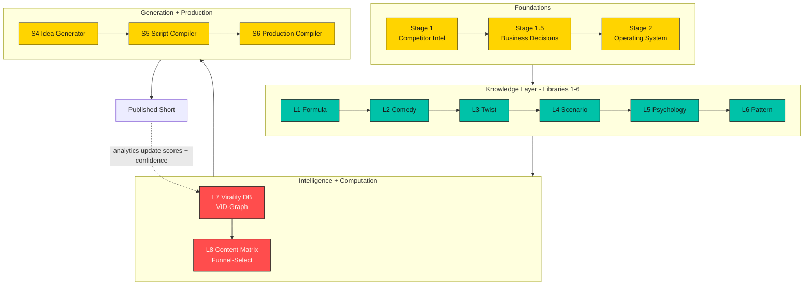

# Architecture Diagram

The complete layered architecture of C-Cloning, from foundations to published video and the analytics feedback loop.

## Reading the diagram
- **Foundations** decide what to build and how to operate.
- **Knowledge Layer** encodes why viral comedy works.
- **Intelligence + Computation** store and combine that knowledge.
- **Generation + Production** compile combinations into videos.
- The dotted arrow is the **self-improving feedback loop**: real analytics upgrade the graph's scores and confidence.

See also: [System Architecture](../docs/04-system-architecture.md).
