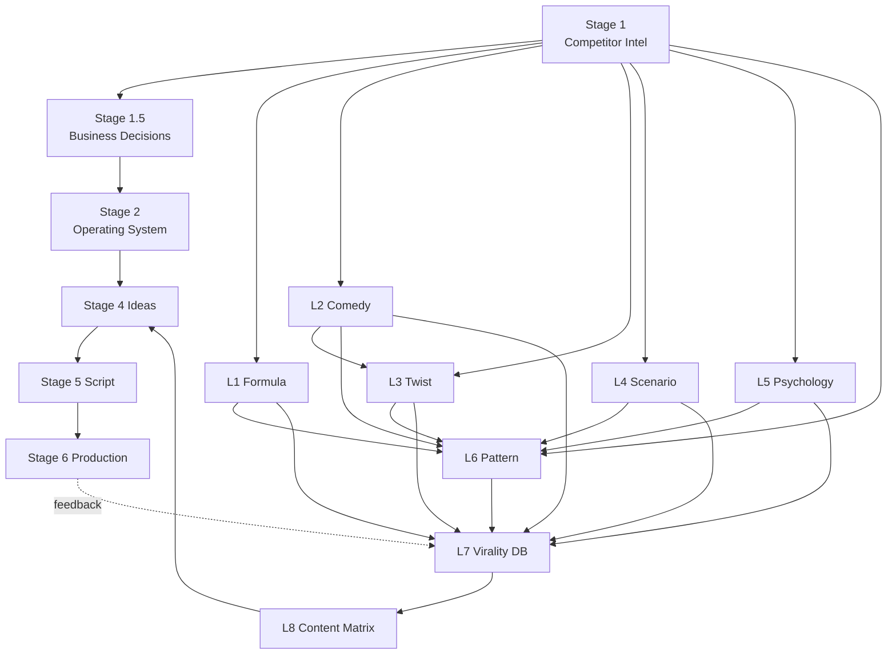

# Dependency Graph

What each stage/library **depends on** (arrows point from a dependency to the thing that consumes it).

## Dependency table

| Component | Depends on | Consumed by |
|---|---|---|
| Stage 1 | — | Stage 1.5, Libraries 1–6 |
| Stage 1.5 | Stage 1 | Stage 2 |
| Stage 2 | Stages 1, 1.5 | Stage 4 (operating rules) |
| Library 1 (Formula) | Stage 1 | L6, L7 |
| Library 2 (Comedy) | Stage 1 | L3, L6, L7 |
| Library 3 (Twist) | L2 | L6, L7 |
| Library 4 (Scenario) | Stage 1 | L6, L7 |
| Library 5 (Psychology) | Stage 1 | L6, L7 |
| Library 6 (Pattern) | L1–L5 | L7 |
| Library 7 (Virality DB) | L1–L6 | L8 |
| Library 8 (Content Matrix) | L7 | Stage 4 |
| Stage 4 (Ideas) | L8, Stage 2 | Stage 5 |
| Stage 5 (Script) | Stage 4, L1–L8 | Stage 6 |
| Stage 6 (Production) | Stage 5, Stage 2 | Publish → feedback to L7 |

See also: [Locked Roadmap](../docs/03-locked-roadmap.md).
