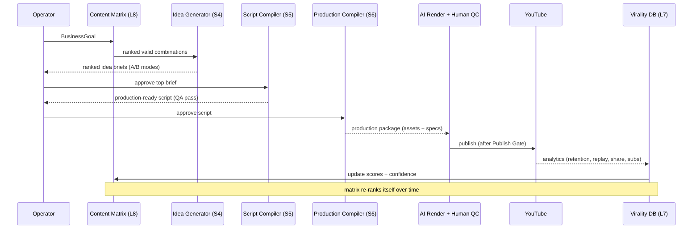

# Runtime Pipeline Diagram

The operational path from a business goal to a published, self-improving video.

## The loop's key property
The pipeline is a **closed loop**: outputs feed analytics, analytics update the intelligence graph, and the graph changes which ideas rank highest next — without altering any locked framework.

See also: [Future Runtime Workflow](../docs/31-future-runtime-workflow.md).
