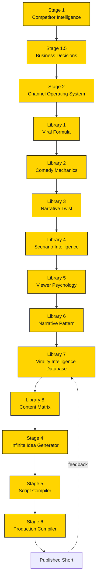

# Locked Roadmap

The C-Cloning system was designed in a strict, sequential order. Each stage was **approved and locked** before the next began. Locked outputs are **immutable** — later stages consume them but never redesign them.

> **Governance rule:** No document, contributor, or automated process may re-open a locked decision. Improvements are captured as *new* learnings and only alter *scores/confidence* inside the intelligence layer — never the locked frameworks themselves.

## Execution order

## Roadmap table

| Order | Stage / Library | Status | Output document |
|---|---|---|---|
| 1 | Stage 1 — Competitor Intelligence | ✅ Locked | [10](10-stage-1-competitor-intelligence.md) |
| 2 | Stage 1.5 — Business Decisions | ✅ Locked | [11](11-stage-1_5-business-decisions.md) |
| 3 | Stage 2 — Channel Operating System | ✅ Locked | [12](12-stage-2-channel-operating-system.md) |
| 4 | Library 1 — Viral Formula | ✅ Locked | [L1](../intelligence/01-viral-formula-library.md) |
| 5 | Library 2 — Comedy Mechanics | ✅ Locked | [L2](../intelligence/02-comedy-mechanics-library.md) |
| 6 | Library 3 — Narrative Twist | ✅ Locked | [L3](../intelligence/03-narrative-twist-library.md) |
| 7 | Library 4 — Scenario Intelligence | ✅ Locked | [L4](../intelligence/04-scenario-intelligence-library.md) |
| 8 | Library 5 — Viewer Psychology | ✅ Locked | [L5](../intelligence/05-viewer-psychology-library.md) |
| 9 | Library 6 — Narrative Pattern | ✅ Locked | [L6](../intelligence/06-narrative-pattern-library.md) |
| 10 | Library 7 — Virality Intelligence Database | ✅ Locked | [L7](../intelligence/07-virality-intelligence-database.md) |
| 11 | Library 8 — Content Matrix | ✅ Locked | [L8](../intelligence/08-content-matrix.md) |
| 12 | Stage 4 — Infinite Idea Generator | ✅ Locked | [13](13-stage-4-idea-generator.md) |
| 13 | Stage 5 — Script Compiler | ✅ Locked | [14](14-stage-5-script-compiler.md) |
| 14 | Stage 6 — Production Compiler | ✅ Locked | [15](15-stage-6-production-compiler.md) |

> **Note on numbering:** "Stage 1.5" and the "Library" sequence reflect the original design order. There is no "Stage 3"; the knowledge libraries occupy that conceptual slot. Stage numbering is preserved exactly as locked to avoid ambiguity in cross-references.

## Immutability contract

The following are **frozen** and may never be silently changed by any downstream stage:

- Business Goal, Narrative Pattern, Scenario, Comedy Mechanic, Twist, Formula selected for any compiled idea.
- The definitions of all nodes in [Library 7](../intelligence/07-virality-intelligence-database.md).
- The combination rules and constraints in [Library 8](../intelligence/08-content-matrix.md).

Only **scores and confidence values** inside the intelligence layer may update — and only from **real published-video analytics**.
