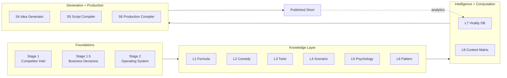
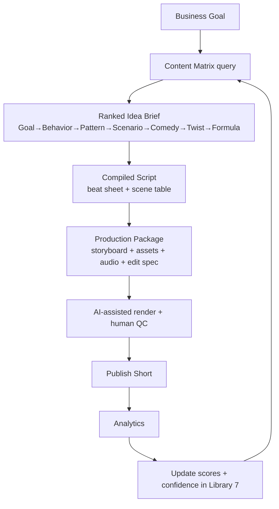

# System Architecture

C-Cloning is a **layered pipeline**. Each layer transforms the output of the previous one, moving from raw competitor intelligence to a published video. The defining property is **determinism**: given the same inputs, the system produces the same outputs, and every output is traceable back to evidence.

## The four macro-layers

## Layer responsibilities

| Layer | Answers the question | Key documents |
|---|---|---|
| **Foundations** | What are competitors doing, what should we build, and how do we operate? | [Stage 1](10-stage-1-competitor-intelligence.md), [1.5](11-stage-1_5-business-decisions.md), [2](12-stage-2-channel-operating-system.md) |
| **Knowledge** | *Why* does viral animated comedy work? | [Libraries 1–6](../intelligence/) |
| **Intelligence + Computation** | How is that knowledge stored, connected, scored, and combined? | [Library 7](../intelligence/07-virality-intelligence-database.md), [Library 8](../intelligence/08-content-matrix.md) |
| **Generation + Production** | How do we compile knowledge into ideas → scripts → assets? | [Stages 4](13-stage-4-idea-generator.md), [5](14-stage-5-script-compiler.md), [6](15-stage-6-production-compiler.md) |

## Data flow (end to end)

## Design principles

1. **Separation of knowledge and computation.** Libraries 1–6 hold *knowledge*; Library 7 *organizes* it; Library 8 *computes* with it. This keeps knowledge stable while generation evolves.
2. **Determinism with traceability.** Every idea carries its full decision path, compatibility scores, confidence, and evidence tags.
3. **Constraint enforcement.** Known failure modes are encoded as hard constraints so the system cannot repeat mistakes.
4. **Confidence as a first-class value.** Uncertainty is never hidden; it is a multiplier that ranks unproven combinations lower and flags them for validation.
5. **Feedback convergence.** Real analytics upgrade inferred assumptions toward observed truth over time.

## The dependency graph

See [`diagrams/dependency-graph.md`](../diagrams/dependency-graph.md) for the full node/edge dependency graph, and [`diagrams/architecture.md`](../diagrams/architecture.md) for the layered architecture diagram.

## Layer deep-dives
- [Knowledge Layer](05-knowledge-layer.md)
- [Generation Layer](06-generation-layer.md)
- [Production Layer](07-production-layer.md)
