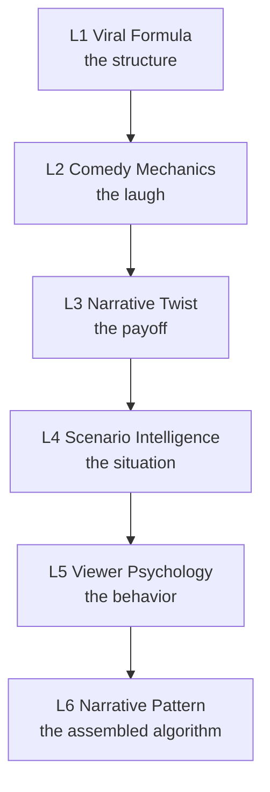
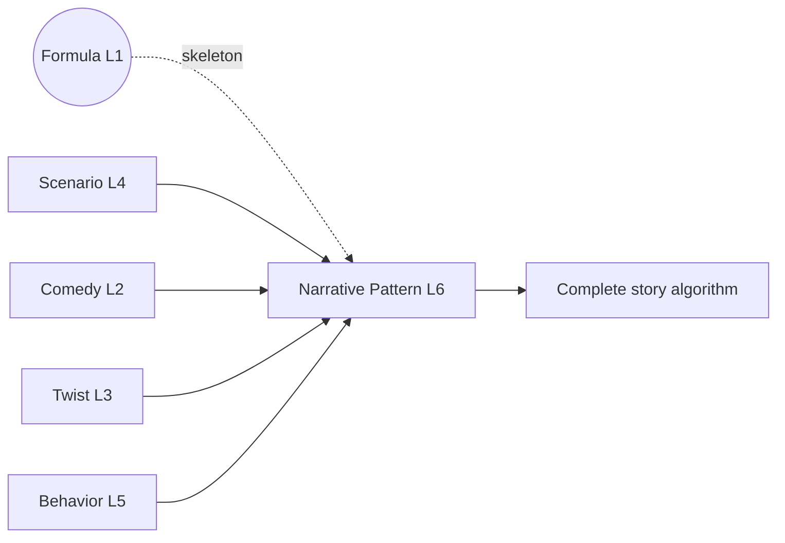

# Knowledge Layer

The Knowledge Layer is the intellectual foundation of C-Cloning. It consists of six libraries that answer a single question from different angles: **why does viral animated comedy work?**

Each library was built from first principles, discovers *reusable mechanics* (never one-off ideas), and tags every conclusion with **Evidence** (`[O]` Observed / `[I]` Inference) and **Confidence** (High/Med/Low).

## The six libraries

| Library | Discovers | One-line takeaway |
|---|---|---|
| [1 — Viral Formula](../intelligence/01-viral-formula-library.md) | The universal structure of viral Shorts | Virality is caused by structure, not idea. |
| [2 — Comedy Mechanics](../intelligence/02-comedy-mechanics-library.md) | Why people laugh | Laughter = a violated prediction that feels safe. |
| [3 — Narrative Twist](../intelligence/03-narrative-twist-library.md) | Why some endings are unforgettable | Unpredictable in foresight, inevitable in hindsight. |
| [4 — Scenario Intelligence](../intelligence/04-scenario-intelligence-library.md) | Which situations best host twists | The best scenarios pre-install the setup for free. |
| [5 — Viewer Psychology](../intelligence/05-viewer-psychology-library.md) | Why viewers act | Design for an action, not a feeling. |
| [6 — Narrative Pattern](../intelligence/06-narrative-pattern-library.md) | How everything assembles into story algorithms | Patterns are functions; stories are their outputs. |

## How the layer composes

Library 6 is the **integration point**: a Narrative Pattern is a complete story algorithm that assembles a Scenario (L4) + Comedy Mechanic (L2) + Twist (L3) + Behavior target (L5), all running the Viral Formula skeleton (L1).

## Why this layer exists

Without a knowledge layer, content is a guess. By reducing viral comedy to a finite set of **mechanics** rather than an infinite set of **topics**, the system gains reusable IP that can generate unlimited future videos. Topics are spent after one use; mechanics power thousands.

## How later layers consume it

- **Library 7** ingests every node from Libraries 1–6 and connects them into a scored graph.
- **Library 8** queries that graph to compute valid combinations.
- **Stages 4–6** compile those combinations into ideas, scripts, and assets.

## Related reading
- [Intelligence library index](../intelligence/README.md)
- [System Architecture](04-system-architecture.md)
