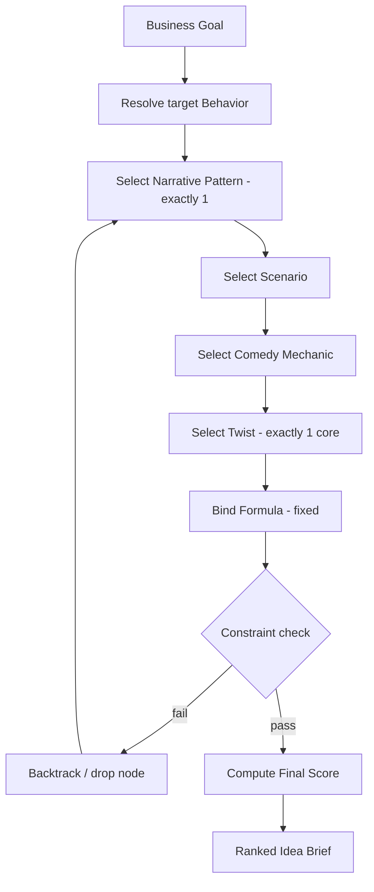

# Generation Layer

The Generation Layer converts the intelligence system into **ranked, production-ready idea briefs**. It spans the Computation Layer ([Library 8](../intelligence/08-content-matrix.md)) and [Stage 4](13-stage-4-idea-generator.md).

## Principle

> Ideas are **computed**, not brainstormed. Input a business goal; receive the highest-scoring valid combination.

## The generation funnel

## Two generation modes

| Mode | Source combinations | Use |
|---|---|---|
| **A — Deterministic** | Highest-scoring, high-confidence | Default production queue |
| **B — Exploration** | Medium/low-confidence | Labelled experiments testing a hypothesis; ~1 per 5 Mode A |

## What a brief contains

Every brief carries its complete reasoning path plus scores:

`Business Goal → Target Behavior → Narrative Pattern → Scenario → Comedy Mechanic → Twist → Formula → Premise (1–2 sentences) → Expected Outcome → Compatibility → Confidence → Priority`

## Ranking

`FinalScore = ViralityPotential × CompatibilityChain (geometric mean) × Confidence − DifficultyPenalty`, with a **hard gate**: any AdSafe < 4 or forbidden combination scores 0 and is rejected.

## Why this layer exists

It removes human randomness from ideation and makes idea quality **reproducible and rankable**. Another operator (or an automated agent) running the same goal produces the same top idea.

## Handoff
The top-ranked brief flows to the [Production Layer](07-production-layer.md) via [Stage 5](14-stage-5-script-compiler.md).

## Related reading
- [Library 8 — Content Matrix](../intelligence/08-content-matrix.md)
- [Stage 4 — Infinite Idea Generator](13-stage-4-idea-generator.md)
