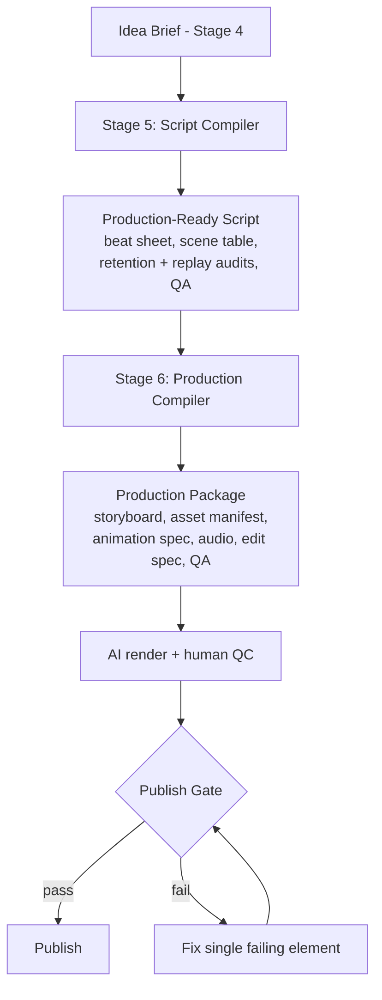

# Production Layer

The Production Layer turns a ranked idea brief into a finished, publishable video. It spans [Stage 5 — Script Compiler](14-stage-5-script-compiler.md) and [Stage 6 — Production Compiler](15-stage-6-production-compiler.md).

## Principle

> The idea brief is **source code**. Stage 5 compiles it into a script; Stage 6 compiles the script into a production package. Neither stage may redesign the idea — compilation only.

## Flow

## Stage 5 — Script Compiler

- **Input:** exactly one idea brief.
- **Output:** a beat sheet, a scene-by-scene production script (time, visual, character action, dialogue, SFX, emotion, library refs), a retention audit, a replay audit, a QA scorecard, and a final package summary.
- **Rule:** immutable inputs (goal, pattern, scenario, comedy, twist, formula). Issues are *reported*, never silently fixed.

## Stage 6 — Production Compiler

- **Input:** one approved script.
- **Output:** storyboard, asset manifest (reusable vs new), animation spec, voice/audio package, editing spec, QA scorecard, ordered production checklist with effort estimates, and a final production package.
- **Rule:** every artifact maps 1:1 to the approved script; no new scenes, jokes, or timing changes.

## Quality gate

No video publishes unless it passes the [Stage 2 Publish Gate](12-stage-2-channel-operating-system.md) — a checklist covering script, comedy, animation, timing, visual clarity, brand consistency, voice, audio, retention, metadata, and originality/safety. One failure blocks publishing.

## Asset reuse economics

The Production Layer depends on the **reusable asset library** defined in [Stage 2](12-stage-2-channel-operating-system.md). After the initial build, most videos reuse ~70% of assets, collapsing per-video production time toward the sub-45-minute (and later sub-30-minute) target.

## Worked example
The demonstrated compilation of Idea `A1` (an authority-figure comeuppance) runs end-to-end through both stages. See [Stage 5](14-stage-5-script-compiler.md) and [Stage 6](15-stage-6-production-compiler.md).

## Related reading
- [Daily Workflow](30-daily-workflow.md)
- [Future Runtime Workflow](31-future-runtime-workflow.md)
