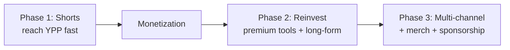

# Business Strategy

## The model
A faceless, AI-produced **YouTube Shorts** studio making advertiser-safe twist-ending animated comedy with a recurring cast — engineered to reach monetization fast, then scale into a multi-format AI content company.

## Positioning
C-Cloning occupies a gap no analyzed competitor fully owns:

| Trait | Rico | Osjtroubleson | Cartoon Box | **C-Cloning** |
|---|---|---|---|---|
| Twist-ending virality | ⚠️ | ⚠️ | ✅ | ✅ |
| Recurring lovable cast | ❌ | ✅ (regional) | ❌ (generic) | ✅ (global) |
| Advertiser-safe (high RPM) | ❌ | ✅ | ⚠️ | ✅ |
| Global / language-free | ✅ | ⚠️ | ✅ | ✅ |
| AI-native volume | ⚠️ | ❌ | ❌ | ✅ |

> The combination of *twist virality + recurring cast + advertiser-safe humor + AI volume* is the defensible position.

## Competitive moat
1. **Writing the twist** — the hardest-to-copy skill; simple art is enough.
2. **Reusable asset library** — the cost advantage (see [Stage 2](12-stage-2-channel-operating-system.md)).
3. **Recurring cast IP** — loyalty, subscribes, and future merch that generic-character competitors forfeit.
4. **The intelligence system itself** — deterministic generation competitors don't have.

## Monetization roadmap

- **Phase 1:** daily Shorts + retention-first formula → YPP application by ~Day 90.
- **Phase 2:** reinvest revenue into premium AI tools; expand into long-form; Shorts feed long-form as top-of-funnel.
- **Phase 3:** multiple channels/niches, merchandising on the recurring cast, sponsorship.

## Revenue levers
- **RPM** protected by advertiser-safe humor.
- **Watch time** compounded by replay/loop engineering.
- **Reach** expanded by share-optimized twists.
- **Returning viewers** built by the recurring cast.

## Cost structure (Phase 1)
~$120–250/month software stack; maximize free tiers; ~70% asset reuse per video after the initial library build.

## The overriding constraint
**Monetization eligibility for AI/faceless content** is the #1 business risk. The entire model is engineered around clearing the "original/transformative" bar: original scripts, original recurring cast, original voice, human-edited comedy. See [Stage 1.5 risk analysis](11-stage-1_5-business-decisions.md).

## Related reading
- [Objectives](02-objectives.md)
- [Decision Log](21-decision-log.md)
- [Future Expansion](32-future-expansion.md)
