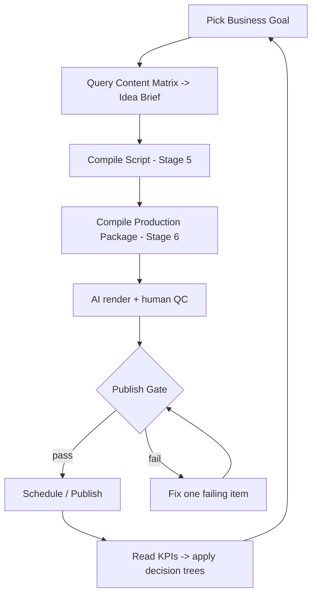

# Daily Workflow

How to operate C-Cloning today (Phase 1, Shorts-only, mostly manual with light automation). This is the operator's runbook; the full SOP lives in [Stage 2](12-stage-2-channel-operating-system.md).

## The loop

## Daily steps
1. **Pull ideas** — take the top approved briefs from the Mode A queue ([Stage 4](13-stage-4-idea-generator.md)); interleave ~1 Mode B experiment per 5.
2. **Compile script** — run [Stage 5](14-stage-5-script-compiler.md); require QA pass or rewrite the single failing beat.
3. **Assign presets** — reuse-first from the asset library ([Stage 2](12-stage-2-channel-operating-system.md)); only create what genuinely doesn't exist.
4. **Compile production package** — run [Stage 6](15-stage-6-production-compiler.md).
5. **Render + QC** — generate scenes/VO; human-check punchline timing and character consistency.
6. **Publish gate** — 11-point checklist; one failure blocks publishing.
7. **Schedule** — batch-schedule the week.
8. **Review KPIs** — apply the decision trees (retention/CTR/replay/share/subs).

## Batch production (the efficiency rule)
Never build one video end-to-end. Run each *stage* across the whole weekly batch (assembly line): 50 ideas → 30 scripts → assign presets → all VO in one run → animate by shared asset → edit/caption → QA → schedule.

## Cadence & targets
- 10–14 Shorts/week · ≤45 min/video · 100% schedule adherence.
- KPI thresholds: 3s retention ≥70%, completion ≥45%, shares/1k ≥3, subs/1k ≥2.

## Fix-it quick reference
| Symptom | Action |
|---|---|
| High 3s swipe | Fix the hook (open on conflict/curiosity) |
| Low completion | Strengthen escalation or the twist |
| Low replay | Add/strengthen the seed |
| Low shares | Sharpen the twist (irony/karma) |
| Low subs | Feature the recurring cast more |

## Protect the two human roles
The **punchline editor** and **animation QC** are the two stages AI can't yet own. Automate everything else.
