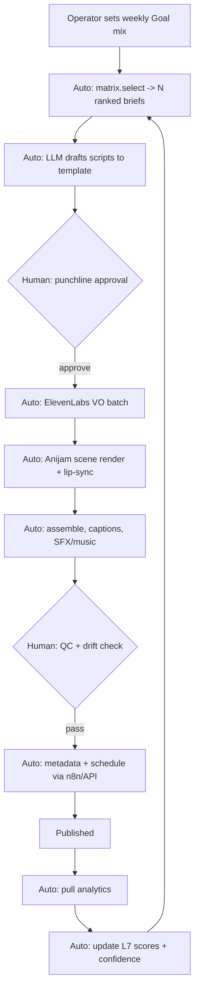

# Future Runtime Workflow

The target **automated** pipeline once the system is fully wired. The manual [Daily Workflow](30-daily-workflow.md) converges toward this as automation matures.

## Vision
A near-autonomous content factory where a human supplies goals and approves the punchline + final QC, and the system does the rest.

## Automation priorities (by ROI, from Stage 2)
1. Publishing / scheduling / metadata (n8n + YouTube API)
2. Idea generation + scoring (LLM + matrix)
3. Voice generation (TTS batch)
4. Analytics reporting + insights
5. Script drafting (structure; human keeps punchline)
6. Caption/subtitle generation
7. Thumbnail/end-card variants
8. Animation assembly
9. Feedback loop (auto kill/scale on KPI rules)

## Human-in-the-loop checkpoints
Two only: **punchline approval** (protects comedy quality + originality) and **QC/drift check** (protects brand consistency + monetization safety).

## The self-improving loop
Every published video's real metrics update node scores and confidence in [Library 7](../intelligence/07-virality-intelligence-database.md). Inferred assumptions converge toward observed truth, and the [Content Matrix](../intelligence/08-content-matrix.md) re-ranks automatically — the factory gets measurably smarter over time without changing any locked framework.

## Related reading
- [Automation roadmap in Stage 2](12-stage-2-channel-operating-system.md)
- [Future Expansion](32-future-expansion.md)
