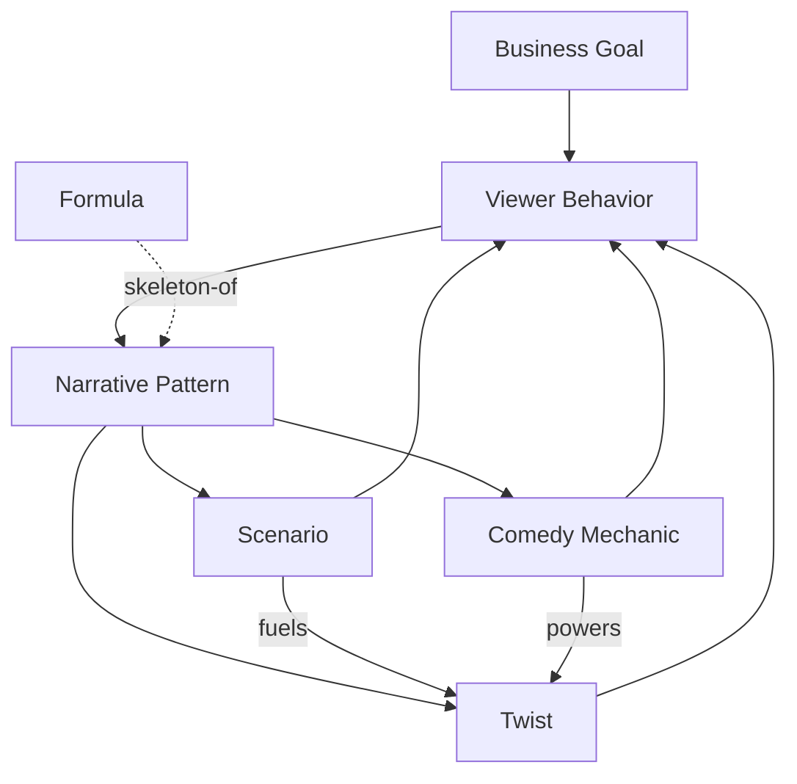

# Library 7 — Virality Intelligence Database

## Purpose
The **Intelligence Layer**: organize Libraries 1–6 into a single queryable, scored, evidence-tagged **knowledge graph** so future systems retrieve answers instead of reasoning from scratch. No new creative knowledge is created here — only organization.

## Philosophy
> Isolated knowledge is additive; connected knowledge is multiplicative. A graph lets any system ask "give me the highest-replay pattern for animal scenarios that's advertiser-safe" and get a deterministic, scored answer.

## Knowledge stored

### Core primitives
| Primitive | Definition |
|---|---|
| Knowledge Node | One reusable unit from a library |
| Relationship | A typed, scored, evidence-tagged link between nodes |
| Evidence | `[O]` observed / `[I]` inferred |
| Confidence | High (0.9) / Med (0.6) / Low (0.3) |
| Dependency | A hard prerequisite (e.g., Twist requires a Seed to enable Replay) |
| Decision Rule | An `IF goal → THEN prefer nodes` instruction |

### The knowledge graph (VID-Graph)

### Node registries (IDs locked)
- `NP1–NP8`, `SC1–SC10`, `TW1–TW10` + `TM1–TM3`, `CM-A1…CM-E2`, `VBA/VBD`, single `FM` (Plot-Twist).

### Scoring system
| Score | Formula |
|---|---|
| Virality Potential | `0.30·Share + 0.25·Replay + 0.20·Evergreen + 0.15·AdSafe + 0.10·Ease` |
| Replay Potential | `ReplayScore × (has Seed ? 1.0 : 0.5)` |
| Monetization Friendliness | `AdSafe × 0.6 + Evergreen × 0.4` |
| Combo Score | `mean(Virality) × mean(Compatibility) × mean(Confidence)` |

Confidence maps H=1.0 / M=0.7 / L=0.4 and is a **multiplier, never a filter**.

### Decision engine (excerpt)
- Goal = Replay → prefer NP4/NP7 + SC10/SC6 + TW5/TW6 + require TM3 Seed.
- Goal = Share → prefer NP1/NP3 + SC3/SC6/SC10 + TW2/TW3/TW4.
- Goal = Subscribe → NP2 + SC1 + TW1 + recurring-cast lead.

### Failure intelligence (forbidden)
Two twist cores · TW5+TW6 · CM-A2+CM-A3 · NP4/NP7 + SC8/SC9. Risk: SC9 (non-evergreen), graphic SC6/SC7 (ad-safety), Literal Trap as core.

## The Company Standard (locked) — "The VID-Graph Architecture"
A property graph of 6 node types + typed, scored edges, with Business Goals mapped to Behaviors, the Decision Engine querying the graph, and Failure Intelligence enforced as hard constraints.

## Relationships
Ingests all of Libraries 1–6; feeds [Library 8](08-content-matrix.md).

## How later stages consume it
[Library 8](08-content-matrix.md) traverses this graph to compute combinations; [Stage 4](../docs/13-stage-4-idea-generator.md) queries it via the matrix.

## Examples
Idea A1's nodes (NP1, SC1, CM-C2, TW3, FM) and their edges are all high-compatibility, high-confidence records — which is why it scores 9.2.

## Important decisions
- **Only real published-video analytics may promote a Confidence score.** This is how the graph self-corrects from inferred toward observed over time.
- Nodes are append-only for definitions; only scores/confidence update.
