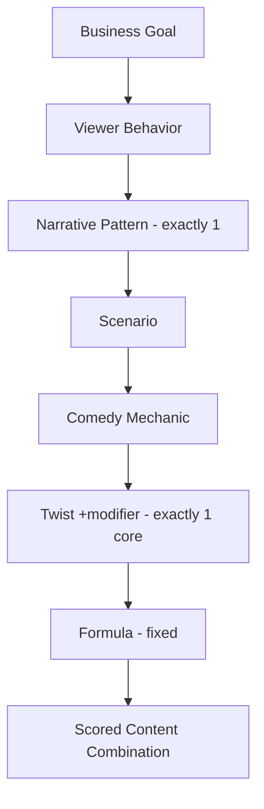

# Library 8 — The Content Matrix

## Purpose
The **Computation Layer**: a deterministic engine that combines nodes from the [VID-Graph](07-virality-intelligence-database.md) into ranked, valid, production-ready content combinations. No new creative concepts — only combination logic.

## Philosophy
> Ideas are **computed**, not brainstormed. Same goal in → same top-ranked combination out, fully traceable to evidence.

## Knowledge stored

### The matrix architecture (layered funnel)

### The combination algorithm (deterministic, greedy + backtracking)
1. Resolve Behavior from Goal · 2. Select Pattern (argmax compatibility × virality × confidence) · 3. Select Scenario (compatible, non-forbidden) · 4. Select Comedy (dominant) · 5. Select Twist (one core; attach TM3 Seed if goal=Replay) · 6. Bind fixed Formula · 7. Validate against constraints (backtrack on fail) · 8. Score · 9. Output ranked combination(s).

### Ranking
`FinalScore = ViralityPotential_avg × CompatibilityChain (geometric mean) × Confidence_avg − DifficultyPenalty`
**Hard gate:** AdSafe < 4 or any forbidden combo → Score 0 (rejected).

### Constraint engine
- **Hard (reject):** one pattern; one twist core; AdSafe≥4; not a forbidden combo; pattern↔scenario ≥4; seed if Replay; muted + recurring cast.
- **Soft (penalize):** prefer Evergreen≥4, Difficulty≤3, High confidence, fresh pattern×scenario pair.

## The Company Standard (locked) — "The Funnel-Select Matrix"
A single deterministic pipeline over the VID-Graph: Goal → resolve Behavior → greedy-select Pattern→Scenario→Comedy→Twist under compatibility → bind Formula → Constraint Engine → FinalScore rank → output top-ranked valid combination(s). Properties: deterministic, evidence-scored, constraint-guarded, confidence-weighted, traceable.

## Relationships
Queries [Library 7](07-virality-intelligence-database.md); powers [Stage 4](../docs/13-stage-4-idea-generator.md).

## How later stages consume it
`matrix.select(goal)` is the single call [Stage 4](../docs/13-stage-4-idea-generator.md) makes; its output is the immutable input to the [Script Compiler](../docs/14-stage-5-script-compiler.md).

## Examples
`matrix.select(Reach)` resolves Behavior=Share → NP1 → SC1 → CM-C2 → TW3 → Plot-Twist = **Idea A1**, FinalScore 9.2, Confidence H.

## Important decisions
- CompatibilityChain uses a **geometric mean** so one weak link drags the whole combination down.
- Confidence weights ranking but never filters — low-confidence combos appear lower and are flagged for validation.
- The analytics feedback loop re-ranks the matrix automatically as real data arrives.
