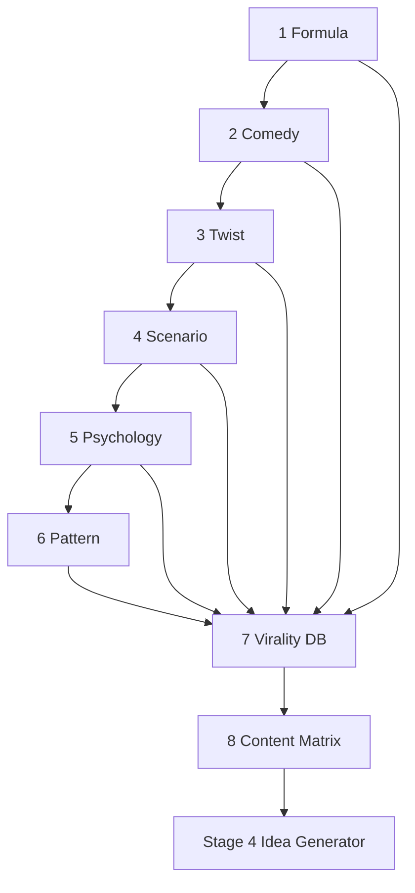

# Intelligence Libraries

The eight libraries are the permanent intellectual property of C-Cloning. Libraries 1–6 are the **Knowledge Layer** (why viral comedy works), Library 7 is the **Intelligence Layer** (the queryable graph), and Library 8 is the **Computation Layer** (the generation engine).

Every conclusion carries an **Evidence** tag — `[O]` Observed (seen in [Stage 1](../docs/10-stage-1-competitor-intelligence.md)) or `[I]` Inference — and a **Confidence** level (High/Med/Low).

## Index

| # | Library | Layer | Discovers / Provides |
|---|---|---|---|
| 1 | [Viral Formula](01-viral-formula-library.md) | Knowledge | The universal structure of viral Shorts |
| 2 | [Comedy Mechanics](02-comedy-mechanics-library.md) | Knowledge | Why people laugh |
| 3 | [Narrative Twist](03-narrative-twist-library.md) | Knowledge | Why endings are unforgettable |
| 4 | [Scenario Intelligence](04-scenario-intelligence-library.md) | Knowledge | Which situations host twists best |
| 5 | [Viewer Psychology](05-viewer-psychology-library.md) | Knowledge | Why viewers act |
| 6 | [Narrative Pattern](06-narrative-pattern-library.md) | Knowledge | How everything assembles into story algorithms |
| 7 | [Virality Intelligence Database](07-virality-intelligence-database.md) | Intelligence | Stores + connects + scores all knowledge |
| 8 | [Content Matrix](08-content-matrix.md) | Computation | Combines knowledge into ranked content |

## How they build on each other

## Reading order
Read 1 → 8 in sequence. Each library assumes the previous ones. The [Knowledge Layer overview](../docs/05-knowledge-layer.md) summarizes 1–6 together.
