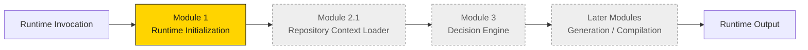

# C-Cloning Master Runtime

**Runtime Version:** 1.1
**Architecture Status:** Locked
**Subsystem Status:** Foundation milestone (documentation-only)

The **Master Runtime** is the deterministic execution engine that operates the locked
C-Cloning content pipeline. It does not invent the pipeline and it does not change the
approved project architecture. Its sole job is to **run** that architecture in a
controlled, modular, and reproducible way.

Where the [project architecture](../docs/00-index.md) answers *"what is C-Cloning and why
does it work?"*, the Master Runtime answers *"how is that system executed safely, in the
correct order, every single time?"*

---

## What the Master Runtime is

The Master Runtime is a **module chain**. Each module has one responsibility, a strict
input/output contract, and a hard boundary it must never cross. Modules execute in a fixed
order. Control only advances when the current module completes successfully.



Only **Module 1 (Runtime Initialization)** is delivered in this milestone. All later
modules are documented as contracts and planned components.

---

## Guiding conviction

The Master Runtime inherits the project's founding conviction:

> **Deterministic systems beat creative gambles.** Given the same inputs, the runtime must
> produce the same outputs, and every output must be traceable back to the approved,
> locked knowledge base.

An operating system validates its environment before running any workload. The Master
Runtime does the same: it refuses to execute against a partially initialized or unverified
state.

---

## Directory layout

```text
master-runtime/
├── README.md                     # This file
├── docs/                         # Approved runtime architecture documentation
│   ├── Runtime_Vision.md
│   ├── Runtime_Philosophy.md
│   ├── Runtime_Principles.md
│   ├── Runtime_Architecture.md
│   ├── Runtime_Architecture_v1.1.md
│   ├── Runtime_Data_Flow.md
│   ├── Runtime_Roadmap.md
│   ├── Runtime_Module_Overview.md
│   └── Runtime_Progress.md
├── modules/                      # Per-module contracts and specifications
│   └── Module_01_Runtime_Initialization.md
├── runtime/                      # Runtime execution home (implementation lands here later)
│   └── README.md
└── prompts/                      # Executable module prompts
    └── Module_01.md
```

---

## Reading order

1. [Runtime Vision](docs/Runtime_Vision.md) — why the runtime exists
2. [Runtime Philosophy](docs/Runtime_Philosophy.md) — how the runtime thinks
3. [Runtime Principles](docs/Runtime_Principles.md) — the rules it never breaks
4. [Runtime Architecture](docs/Runtime_Architecture.md) — the v1.0 module chain
5. [Runtime Architecture v1.1](docs/Runtime_Architecture_v1.1.md) — the refined loader model
6. [Runtime Data Flow](docs/Runtime_Data_Flow.md) — how context and control move
7. [Runtime Module Overview](docs/Runtime_Module_Overview.md) — every module contract
8. [Runtime Roadmap](docs/Runtime_Roadmap.md) — build order and milestones
9. [Runtime Progress](docs/Runtime_Progress.md) — what is built vs. pending

---

## Scope of this milestone

This milestone delivers **approved architecture documentation only**. It intentionally does
**not** ship runtime configuration files (`runtime_manifest.yaml`, `runtime_versions.yaml`,
`execution_modes.yaml`, `module_registry.yaml`, `repository_map.yaml`). Those are the next
milestone; this documentation explains *why each of them will exist*. See
[Runtime Roadmap](docs/Runtime_Roadmap.md#deferred-runtime-configuration).
