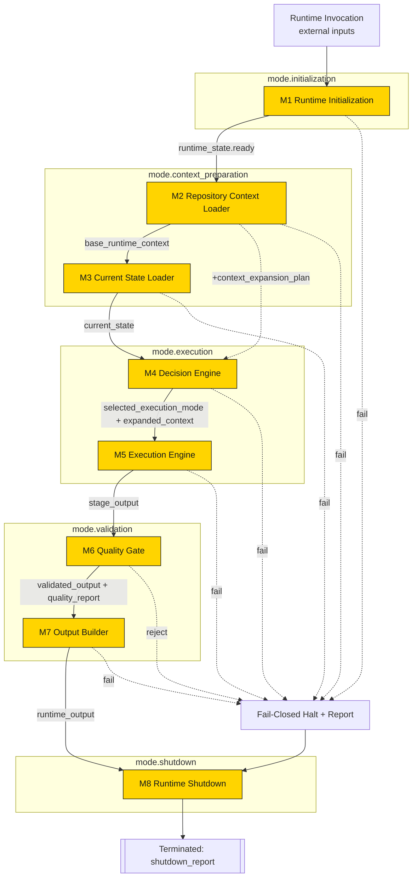
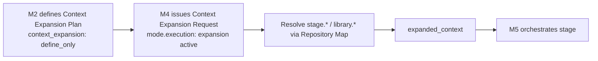
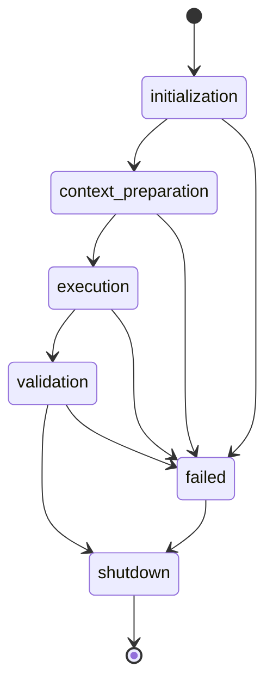

# Runtime Integration Report

> **Phase:** Runtime Integration (system verification). **No component was redesigned or
> modified.** This report verifies that the locked Master Runtime components operate together
> as one coherent runtime.
> **Scope of verification:** Runtime Manifest, Repository Map, Module Registry, Execution
> Modes, Runtime Versions, and Modules 1-8, all at v1.0/v1.1 as locked.
> **Method:** Cross-checked the five configuration files and eight module specifications
> against each other programmatically (chain wiring, I/O data flow, config consumption,
> dependency DAG, mode transitions, version consistency).

## 1. Integration verdict

**PASS - the Runtime integrates cleanly.** All ten verification areas conform. One item was
flagged and confirmed as expected-by-design (Module 1 external bootstrap inputs); it is not a
defect. No dependency conflicts and no interface conflicts exist.

## 2. End-to-end Runtime lifecycle diagram



## 3. Runtime dependency verification

| Check | Result |
|---|---|
| Module `order` unique + contiguous 1..8 | ✅ PASS |
| `next` chain follows order, terminates at Module 8 (`next: null`) | ✅ PASS |
| `depends_on` forms a DAG (no cycles) | ✅ PASS |
| Every `depends_on` target has a strictly lower order | ✅ PASS |
| `chain.entry_point` / `chain.terminal` resolve to registered modules | ✅ PASS |

Verified chain: `initialization → context_loader → state_loader → decision_engine →
execution_engine → quality_gate → output_builder → shutdown`.

## 4. Interface compatibility report

Each module's declared non-config inputs are produced by an upstream module; config inputs
resolve via the Repository Map.

| Module | Non-config inputs | Produced upstream? |
|---|---|---|
| M1 Initialization | runtime_invocation, project_identifier, repository_connection, runtime_version | **External (entry point)** - expected |
| M2 Context Loader | runtime_state.ready | ✅ M1 |
| M3 State Loader | base_runtime_context | ✅ M2 |
| M4 Decision Engine | base_runtime_context, current_state, context_expansion_plan | ✅ M2, M3 |
| M5 Execution Engine | selected_execution_mode, expanded_context | ✅ M4 |
| M6 Quality Gate | stage_output | ✅ M5 |
| M7 Output Builder | validated_output | ✅ M6 |
| M8 Shutdown | runtime_output | ✅ M7 |

**No interface conflicts.** Module 1's inputs are external bootstrap inputs per its locked
contract, not a missing dependency.

## 5. Runtime Configuration usage report

All five configuration components are referenced by the manifest and consumed by at least one
module. Every `config.*` dependency resolves to a `runtime_config` entry in the Repository
Map. No paths are hardcoded in any module (all references are logical ids).

| Component | Consumed by (config_dependencies) | Manifest load phase |
|---|---|---|
| `config.manifest` | M1, M2, M8 | (root) |
| `config.repository_map` | M2, M3, M5, M6, M7 | context_loading |
| `config.module_registry` | M1 | initialization |
| `config.execution_modes` | M4, M5 | decision |
| `config.runtime_versions` | M1 | initialization |

Coverage: **5/5 core components consumed; none unused.**

## 6. Data flow verification

The produced-token set accumulates monotonically and satisfies every downstream consumer:

```
M1 -> runtime_state.ready
M2 -> base_runtime_context, context_expansion_plan
M3 -> current_state
M4 -> selected_execution_mode, expanded_context
M5 -> stage_output
M6 -> validated_output, quality_report
M7 -> runtime_output
M8 -> shutdown_report   (terminal)
```

Every consumer's required token exists before it is consumed. **Data flow is complete and
ordered.** Design-level artifacts (Execution Plan, Context Expansion Request, Validation
Report, Runtime Summary, Shutdown Report) map onto the locked registry outputs without
introducing new tokens - confirming no redesign.

## 7. Failure flow verification

| Aspect | Result |
|---|---|
| Every module inherits `execution_policies.fail_closed` (`on_failure: terminate`, no recovery, no substitution) | ✅ PASS |
| Every operating mode sets `failure_policy.on_failure: halt` | ✅ PASS |
| Quality Gate rejection (`approved`≠true) halts forward transition | ✅ PASS |
| Shutdown is reachable as the deterministic terminal for both success and failure (exit 0 / exit 1) | ✅ PASS |
| No mode advances on failure (fail-closed, forward-only) | ✅ PASS |

The runtime always resolves to a known terminal state (`completed` or `failed`); it never
continues in a partial/degraded state.

## 8. Context Expansion flow verification



- Definition (M2, `mode.context_preparation`, `define_only`) and execution (M4, `mode.execution`, `active`) are correctly separated per Architecture v1.1.
- Expansion branches (`idea_generation` / `script_compilation` / `production_compilation`) resolve only through logical ids in the Repository Map. ✅ PASS

## 9. Runtime state & execution mode transitions



- Mode chain is linear, acyclic, and terminates at `mode.shutdown` (`next_mode: null`). ✅
- Every module maps to **exactly one** mode; no module is uncovered or double-covered. ✅
- Mode-to-module grouping is contiguous with module order. ✅

## 10. Version consistency

| Check | Result |
|---|---|
| All config `schema_version` share one MAJOR line (1.x) | ✅ PASS |
| All module `version` MAJOR == runtime MAJOR (1) | ✅ PASS |
| Runtime Versions records match each file's actual version | ✅ PASS (verified in prior phase) |

## Integration readiness assessment

**READY.** The five configuration components and eight module specifications form one
coherent, internally consistent runtime: wiring, interfaces, data flow, config consumption,
dependency graph, mode/state transitions, failure handling, context expansion, and versions
all verify. No dependency or interface conflicts were found. No locked component required
modification.

## Production readiness assessment

**Documentation/specification layer: production-ready.** The runtime is fully specified,
integrated, and verifiable end to end at the design level.

**Honest gating note (no change made):**
1. The locked `module_registry.yaml` records Modules 2-8 as `status: planned` (Module 1
   `contract_approved`). Advancing these to `implemented` is a future coordinated **registry
   version bump** per the locked upgrade policy - not part of this verification phase.
2. This phase verifies **specifications and configuration**, not executable code. Runnable
   module implementations (Milestone 2+ of the Runtime Roadmap) are still pending.

Therefore: **integration-verified and specification-production-ready; executable
implementation remains outstanding** and is the correct next milestone.

## Verification method note

All results above were produced by cross-checking the locked files against each other (no
files were modified). The single flagged item - Module 1's inputs having no upstream producer
- was confirmed expected: Module 1 is the entry point and receives external bootstrap inputs
per its contract.

## Related reading
- [Runtime Architecture v1.1](docs/Runtime_Architecture_v1.1.md)
- [Runtime Data Flow](docs/Runtime_Data_Flow.md)
- [Runtime Module Overview](docs/Runtime_Module_Overview.md)
- [Runtime Roadmap](docs/Runtime_Roadmap.md)
