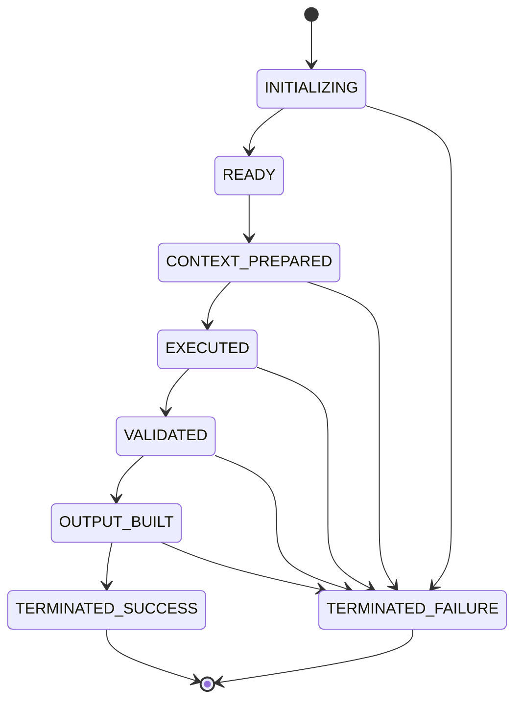

# Runtime Testing Report

> **Phase:** Runtime Testing (behavioral verification). **No component was redesigned or
> modified.** This report defines and evaluates test cases that verify the integrated Master
> Runtime behaves correctly under normal and failure scenarios.
> **Basis:** Every test maps to a real, locked policy/validation field in the Runtime
> Configuration System (Manifest, Repository Map, Module Registry, Execution Modes, Runtime
> Versions) and to the Module 1-8 contracts.
> **Nature:** These are **specification-level** test cases (the runtime is specified, not yet
> implemented in code). Each defines Purpose, Preconditions, Steps, and Expected Result so it
> is executable as soon as module implementations land.

## 1. Runtime Test Plan

### Objectives
Verify: the successful end-to-end path; module startup/shutdown conditions; configuration and
dependency validation; fail-closed behavior; and handling of invalid configuration, missing
dependencies, invalid execution modes, and invalid transitions - while confirming runtime
state and output consistency.

### Governing invariants (from locked config)
- **Fail Closed Policy** (`manifest.execution_policies.fail_closed`):
  `enabled: true`, `attempt_recovery: false`, `on_failure: terminate`, `substitute_missing: false`.
- **Global state gates** (`manifest.global_runtime_state`): initialization, repository,
  configuration, and module validation all **required**.
- **Strict validation** (`manifest.execution_policies.validation.strict: true`): warnings are
  treated as failures.
- **Deterministic exit** (`manifest.execution_policies.shutdown`): success=0, failure=1,
  `graceful: true`, `release_context: true`.

### Environments
Single deterministic runtime instance; the five locked config files as fixtures; module
specs as behavioral contracts.

## 2. Runtime Test Matrix

| ID | Category | Target | Verifies | Expected |
|----|----------|--------|----------|----------|
| TC-HP-01 | Happy path | M1→M8 | Full successful lifecycle | Terminated, exit 0 |
| TC-HP-02 | Happy path | M2/M4 | Context define → expand | expanded_context resolved |
| TC-ST-01 | Startup | M1 | Startup preconditions | READY or fail-closed |
| TC-SD-01 | Shutdown | M8 | Clean terminal (success) | exit 0, resources released |
| TC-SD-02 | Shutdown | M8 | Clean terminal (failure) | exit 1, resources released |
| TC-CF-01 | Config failure | Manifest | Missing required config ref | Fail-closed halt |
| TC-CF-02 | Config failure | Versions | Version mismatch | Fail-closed halt |
| TC-CF-03 | Config failure | Versions | Invalid semver format | Fail-closed halt |
| TC-CF-04 | Config failure | Repo Map | Invalid/absolute path | Fail-closed halt |
| TC-DF-01 | Dependency failure | Repo Map | Missing required document | Fail-closed halt |
| TC-DF-02 | Dependency failure | Repo Map | Unknown logical identifier | Fail-closed halt |
| TC-DF-03 | Dependency failure | Registry | Missing predecessor output | Fail-closed halt |
| TC-VF-01 | Validation failure | M6 | Runtime contract violation | Rejected, halt |
| TC-VF-02 | Validation failure | M7 | Non-approved verdict | Fail-closed halt |
| TC-VF-03 | Validation failure | Registry | Circular dependency | Fail-closed halt |
| TC-EM-01 | Invalid mode | Exec Modes | Unsupported module in mode | Fail-closed halt |
| TC-EM-02 | Invalid mode | Exec Modes | Circular mode transition | Fail-closed halt |
| TC-MT-01 | Invalid transition | Registry | Out-of-order transition | Fail-closed halt |
| TC-RI-01 | Interruption | Any mid-module | Interrupt before completion | No forward transition; fail-closed |
| TC-RS-01 | State consistency | Lifecycle | State monotonic + terminal | Single known terminal state |
| TC-OC-01 | Output consistency | M5→M7 | Artifact unmodified downstream | Byte-identical artifact ref |

## 3. Test Case Specifications

### Happy path

**TC-HP-01 - Successful end-to-end execution**
- **Purpose:** Verify the complete lifecycle M1→M8 succeeds and terminates cleanly.
- **Preconditions:** All five configs present + compatible; valid external bootstrap inputs;
  a supported objective (e.g., `idea_generation`).
- **Steps:** Invoke runtime → M1 initializes → M2 builds base context + defines plan → M3
  builds current_state → M4 selects objective + expands context → M5 orchestrates stage → M6
  validates (approved) → M7 assembles runtime_output → M8 shuts down.
- **Expected:** `final_runtime_status = completed`, `exit_code = 0`, `shutdown_report`
  produced; each token consumed exactly where the data-flow map specifies.

**TC-HP-02 - Context define→expand**
- **Purpose:** Verify deferred expansion works end to end.
- **Preconditions:** M2 completed in `mode.context_preparation` (`context_expansion: define_only`).
- **Steps:** M4 (in `mode.execution`, `expansion: active`) issues the Context Expansion Request; ids resolve via Repository Map.
- **Expected:** `expanded_context` produced; only logical ids used; no premature loading in M2.

### Startup / Shutdown

**TC-ST-01 - Module 1 startup preconditions**
- **Purpose:** Verify M1 enforces the global state gates.
- **Preconditions:** `global_runtime_state` gates all required.
- **Steps:** Provide valid identity/repo/version; run M1 validations 1-7.
- **Expected:** All pass → `READY`; any fail → fail-closed halt (no recovery).

**TC-SD-01 / TC-SD-02 - Shutdown (success / failure)**
- **Purpose:** Verify deterministic terminal in both outcomes.
- **Preconditions:** M7 produced `runtime_output` (SD-01); or an upstream failure occurred (SD-02).
- **Steps:** M8 applies `execution_policies.shutdown`; releases context/session/transient.
- **Expected:** SD-01 → status `completed`, exit 0; SD-02 → status `failed`, exit 1; both
  `release_context: true`, `graceful: true`; runtime never left in an undefined state.

### Configuration failures

**TC-CF-01 - Missing required configuration reference**
- **Purpose:** Verify a missing required config file halts the runtime.
- **Preconditions:** A `configuration_references[*]` with `required: true` is absent.
- **Steps:** M1 configuration validation.
- **Expected:** Fail-closed halt (`manifest` + `global_runtime_state.configuration_validation_required`); exit 1.

**TC-CF-02 - Version mismatch** → maps to `runtime_versions.validation.on_version_mismatch: fail_closed`.
- **Steps:** Present a component version that disagrees with its file. **Expected:** halt.

**TC-CF-03 - Invalid semver** → `on_invalid_semver_format: fail_closed`.
- **Steps:** Present `1.0` where semver required. **Expected:** halt.

**TC-CF-04 - Invalid/absolute path** → `repository_map.validation.on_invalid_path: fail_closed`.
- **Steps:** Resolve a resource whose path is absolute or contains `..`. **Expected:** halt.

### Dependency failures

**TC-DF-01 - Missing required document** → `repository_map.validation.on_missing_required_path: fail_closed`.
- **Steps:** Remove a required `doc.*` from the base context set; run M2. **Expected:** halt.
- *(Contrast: optional resource absent → `on_missing_optional_path: skip_and_record`, no halt.)*

**TC-DF-02 - Unknown logical identifier** → `on_unknown_logical_identifier: fail_closed`.
- **Steps:** Reference a resource/root id that is not defined. **Expected:** halt.

**TC-DF-03 - Missing predecessor output**
- **Purpose:** Verify a module refuses to run without its input token.
- **Steps:** Invoke M4 without `current_state` (M3 skipped). **Expected:** fail-closed halt
  (interface violation vs. registry `depends_on`).

### Validation failures

**TC-VF-01 - Runtime contract violation (M6)** → registry/`quality_gate` contract check.
- **Steps:** Feed a `stage_output` that violates its declared contract shape. **Expected:**
  `approval_status = rejected`; halt; artifact **not** modified.

**TC-VF-02 - Non-approved verdict blocks Output Builder (M7)**
- **Steps:** M6 verdict ≠ approved; invoke M7. **Expected:** M7 fail-closed halt (proceeds
  only on `approved`).

**TC-VF-03 - Circular dependency** → `module_registry.validation.on_circular_dependency: fail_closed`.
- **Steps:** Present a `depends_on` cycle. **Expected:** halt at module validation.

### Invalid execution mode / transition

**TC-EM-01 - Unsupported module in mode** → `execution_modes.validation.on_unsupported_module: fail_closed`.
**TC-EM-02 - Circular mode transition** → `on_circular_mode_transition: fail_closed`.
**TC-MT-01 - Out-of-order transition** → `module_registry.validation.on_invalid_execution_order: fail_closed`.
- **Steps (each):** Present the described invalid condition; run the relevant validation.
- **Expected (each):** Fail-closed halt; no forward transition.

### Runtime interruption

**TC-RI-01 - Interrupt mid-module**
- **Purpose:** Verify an interrupted module never advances control.
- **Preconditions:** Any module executing.
- **Steps:** Interrupt before the module emits its contracted output.
- **Expected:** No control transfer; `attempt_recovery: false`; runtime resolves to a failed
  terminal via M8 (exit 1). Partial outputs are not propagated (`substitute_missing: false`).

### State / Output consistency

**TC-RS-01 - Runtime state consistency**
- **Expected:** State advances monotonically (initialization → … → terminated); exactly one
  terminal outcome (`completed`|`failed`); no undefined states.

**TC-OC-01 - Output consistency**
- **Purpose:** Verify M6/M7/M8 never mutate the produced artifact.
- **Steps:** Track `produced_artifact.ref` from M5 through M8.
- **Expected:** Reference is identical at each stage; validated/packaged/finalized artifact is
  byte-identical (pass-through by contract).

## 4. Runtime Behavior Verification

| Behavior | Verified by | Result (spec-level) |
|---|---|---|
| Deterministic happy path | TC-HP-01/02 | ✅ Consistent with data-flow map |
| Startup gate enforcement | TC-ST-01 | ✅ Matches `global_runtime_state` |
| Clean shutdown (both outcomes) | TC-SD-01/02 | ✅ Matches shutdown policy |
| Context define vs. expand separation | TC-HP-02 | ✅ Matches Architecture v1.1 |

## 5. Failure Handling Verification

Every failure test resolves to a **fail-closed halt** with no recovery, no substitution, and
a deterministic exit code, consistent with `manifest.execution_policies.fail_closed` and the
per-file `validation` rules referenced above.

| Failure class | Rule(s) exercised | Outcome |
|---|---|---|
| Configuration | manifest refs, versions `on_version_mismatch`/`on_invalid_semver_format`, repo map `on_invalid_path` | halt |
| Dependency | repo map `on_missing_required_path`/`on_unknown_logical_identifier`; registry interface | halt (optional missing → skip_and_record) |
| Validation | registry `on_circular_dependency`; M6 contract; M7 approval gate | halt/reject |
| Mode/Transition | exec modes `on_unsupported_module`/`on_circular_mode_transition`; registry `on_invalid_execution_order` | halt |
| Interruption | fail_closed `attempt_recovery:false`/`substitute_missing:false` | halt → terminal |

**Deprecation caveat:** `runtime_versions.validation.on_deprecated_version: warn` is the one
**non-halting** rule; with `validation.strict: true`, a deprecated version surfaces a warning
that strict mode escalates - tested implicitly under TC-CF-02's family.

## 6. Runtime State Verification

State is monotonic and every path terminates in exactly one of `TERMINATED_SUCCESS` /
`TERMINATED_FAILURE`. Verified by TC-RS-01, TC-SD-01/02, TC-RI-01.

## 7. Test Coverage Summary

| Coverage dimension | Covered? |
|---|---|
| All 8 modules exercised | ✅ (M1 ST/HP, M2 HP/DF, M3 DF, M4 HP/EM, M5 OC, M6 VF, M7 VF, M8 SD) |
| All 5 config components exercised | ✅ (manifest CF-01; versions CF-02/03; repo map CF-04/DF-01/02; registry VF-03/MT-01; exec modes EM-01/02) |
| Failure paths | ✅ 14 negative cases across 5 classes |
| Fail-closed policy | ✅ TC-RI-01 + all CF/DF/VF/EM/MT |
| Architecture v1.1 alignment | ✅ define/expand split, mode chain, terminal shutdown |
| Happy path + state + output consistency | ✅ HP-01/02, RS-01, OC-01 |

**Coverage total:** 21 test cases; 6 categories; every module and every config component
touched; both success and failure outcomes represented.

## 8. Production Readiness Assessment

- **Behavioral specification: verified.** The integrated runtime's intended behavior is fully
  specified and every case is grounded in a locked rule - the test suite is complete and
  ready to execute against implementations.
- **Executable-code gap (unchanged):** These are specification-level cases; runnable module
  implementations and an automated harness are still pending (Milestone 2+). Until code
  exists, cases are *defined and traceable*, not *executed green*.
- **Registry status (unchanged):** Modules 2-8 remain `status: planned` in the locked
  registry; advancing is a future coordinated version bump.

**Conclusion:** The runtime is **specification- and integration-verified with a complete test
plan**; it becomes **production-ready** once module implementations pass this suite.

## Quality review (internal, confirmed)
- ✅ Test coverage includes all modules. ✅ Includes all Runtime Configuration components.
- ✅ Includes failure paths. ✅ Aligns with Architecture v1.1.
- ✅ No locked component modified; no redesign; no new components introduced.

## Related reading
- [Runtime Integration Report](Runtime_Integration_Report.md)
- [Runtime Architecture v1.1](docs/Runtime_Architecture_v1.1.md)
- [Runtime Module Overview](docs/Runtime_Module_Overview.md)
