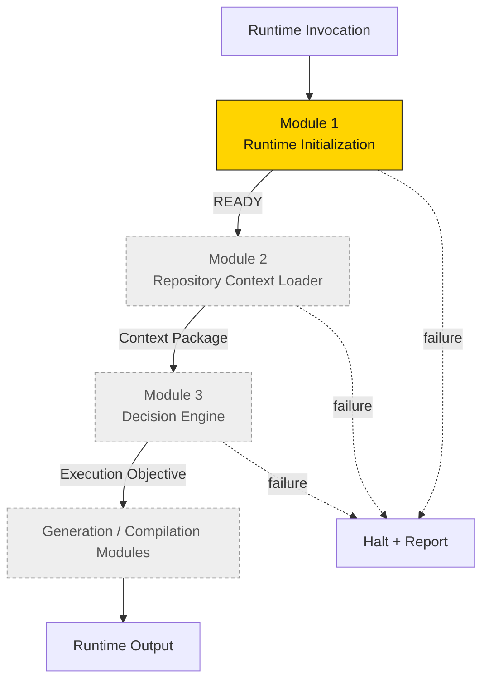
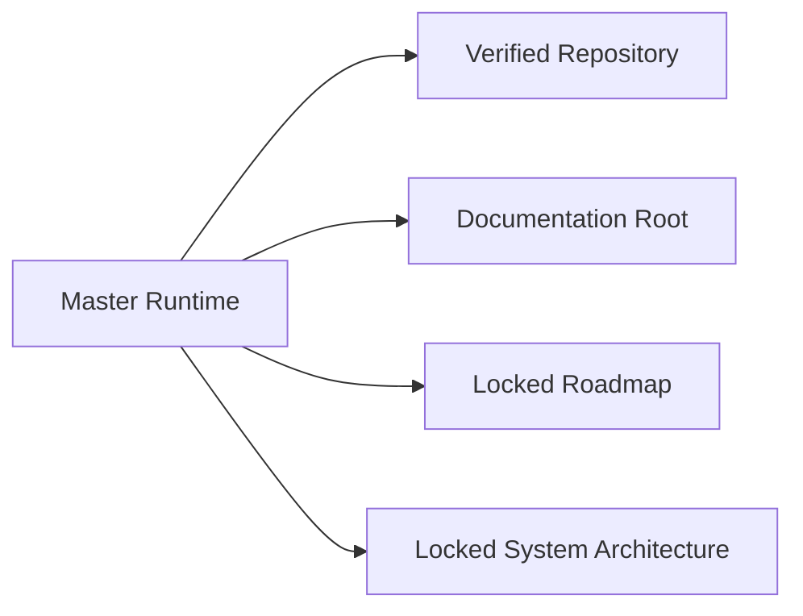
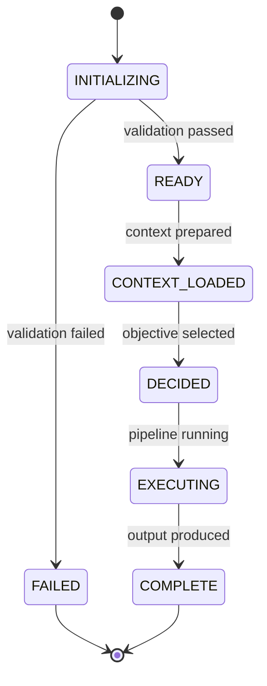

# Runtime Architecture (v1.0)

## Purpose

The Master Runtime architecture defines the **fixed module chain** that executes the
C-Cloning pipeline. Version 1.0 established the module model, the execution order, and the
fail-closed lifecycle. (The context-loading strategy was later refined in
[v1.1](Runtime_Architecture_v1.1.md).)

## Architectural model

The runtime is a **linear chain of single-responsibility modules**. Each module validates
its inputs, performs exactly one job, produces a contracted output, and transfers control
forward only on success.

## Responsibilities of the runtime as a whole

- Validate and initialize the execution environment.
- Prepare the runtime context from authoritative repository documentation.
- Determine the execution objective (Decision Engine).
- Orchestrate the locked pipeline stages in the correct order.
- Halt on any failure and return a report.
- Preserve determinism and traceability end to end.

## Dependencies

The runtime depends on the **locked project architecture** as its authoritative knowledge
base. It does not function without a verified repository, a documentation branch/root, and
the locked roadmap and architecture documents.

## Execution order (v1.0)

| Order | Module | Responsibility | Output |
|---|---|---|---|
| 1 | Runtime Initialization | Validate environment, initialize state | Initialization Report → `READY` |
| 2 | Repository Context Loader | Load required knowledge for the execution | Runtime Context Package |
| 3 | Decision Engine | Determine the execution objective | Selected objective |
| 4+ | Generation / Compilation | Execute the locked pipeline stage | Pipeline output |

## Module contracts (summary)

Each module obeys a common contract shape: **Inputs → Validation → Single Responsibility →
Contracted Output → Control Transfer (on success only)**. Full per-module contracts are in
the [Runtime Module Overview](Runtime_Module_Overview.md).

## Failure philosophy

The runtime is **fail-closed**. Any module that fails validation terminates execution
immediately and returns a failure report. It does not attempt recovery, does not substitute
missing inputs, and does not pass partial results forward. A partially initialized runtime
is treated as a failed runtime.

## Repository philosophy

Repository documentation is the **single source of truth**. The runtime reads authoritative
documents, preserves their terminology, and never rewrites or overrides them. Locked
decisions are immutable; only intelligence-layer scores/confidence may change, and only from
real analytics.

## Runtime lifecycle (v1.0)

## Runtime data flow

See [Runtime Data Flow](Runtime_Data_Flow.md) for the detailed context and control-flow
diagrams.

## Version note

v1.0 required an execution objective early in the chain. This created a circular dependency
between initialization and objective selection. The refined
[Architecture v1.1](Runtime_Architecture_v1.1.md) resolves this by separating **permanent
context loading** from **task-specific context expansion**.
