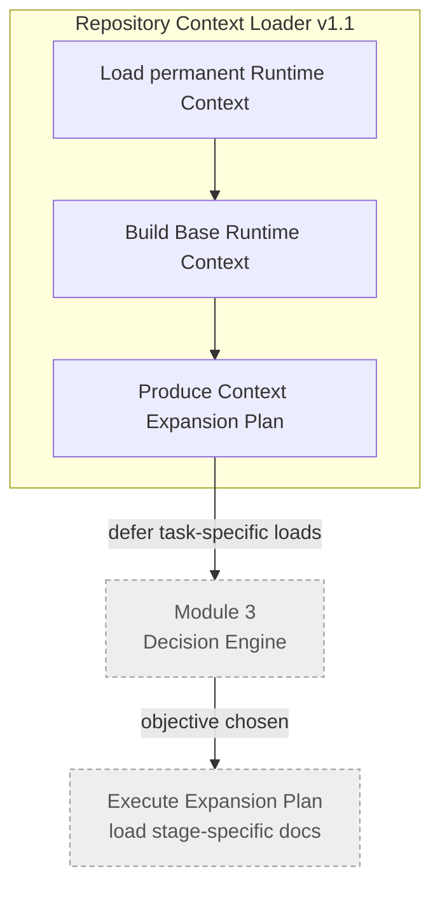
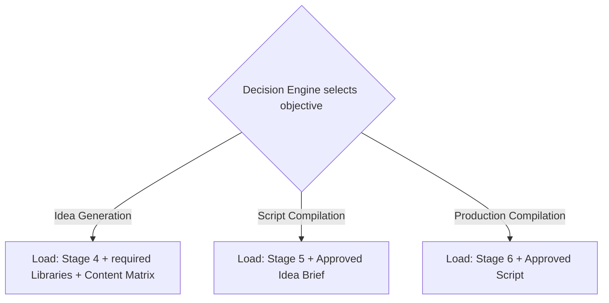
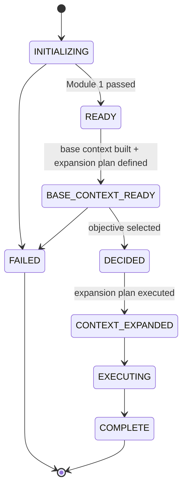

# Runtime Architecture (v1.1)

## Purpose

Version 1.1 **refines** the v1.0 architecture. It does **not** change the runtime module
model, the execution order, or the fail-closed lifecycle. It corrects **one thing**: the
context-loading strategy of the Repository Context Loader.

> v1.1 is a refinement, not a redesign. The locked module chain is preserved exactly.

## What changed

In v1.0 the Repository Context Loader expected an **Execution Objective** before the runtime
had finished preparing context. Because the objective is chosen by the Decision Engine
(a *later* module), this created a **circular dependency**: context loading waited on a
decision that itself depended on context.

v1.1 removes the circular dependency by splitting context loading into two clearly separated
phases.

## Two-phase context model

| Phase | Loaded by | Contents | Timing |
|---|---|---|---|
| **Base Runtime Context** | Repository Context Loader | Permanent context every execution needs (vision, locked roadmap, repository index, runtime architecture, runtime configuration) | Always, up front |
| **Context Expansion** | Deferred; triggered after the Decision Engine selects an objective | Stage-specific documents, libraries, briefs, scripts | On demand, per objective |

## Responsibilities (v1.1 loader)

- Load the runtime configuration and verify it.
- Load permanent repository context only.
- Build the Base Runtime Context.
- Produce a **Context Expansion Plan** (define it, do not execute it).
- Transfer control forward.

## Context Expansion Plan (defined, not executed)

The loader only **defines** these rules. Execution of the plan happens after the Decision
Engine chooses an objective.

## Dependencies

v1.1 introduces the concept of a **runtime configuration** as the authoritative operational
source (repository name, versions, documentation branch/root, required base documents,
module execution order, context expansion rules). Until that configuration file exists (next
milestone), the loader documents its need and does not fabricate values. See
[Runtime Roadmap](Runtime_Roadmap.md#deferred-runtime-configuration).

## Execution order (unchanged from v1.0)

Initialization → Context Loader → Decision Engine → Generation/Compilation. Only the
*internal behavior* of the Context Loader changed.

## Failure philosophy (unchanged)

Still fail-closed. If the runtime configuration is missing or unreadable, required base
documents are absent, the repository layout mismatches, or the architecture version does not
match, the loader terminates immediately without producing partial context.

## Repository philosophy (unchanged)

Authoritative documentation remains the single source of truth. The loader preserves
repository terminology and never reinterprets documentation beyond what execution requires.

## Runtime lifecycle (v1.1 view)

## Related reading
- [Runtime Architecture v1.0](Runtime_Architecture.md)
- [Runtime Data Flow](Runtime_Data_Flow.md)
- [Runtime Module Overview](Runtime_Module_Overview.md)
