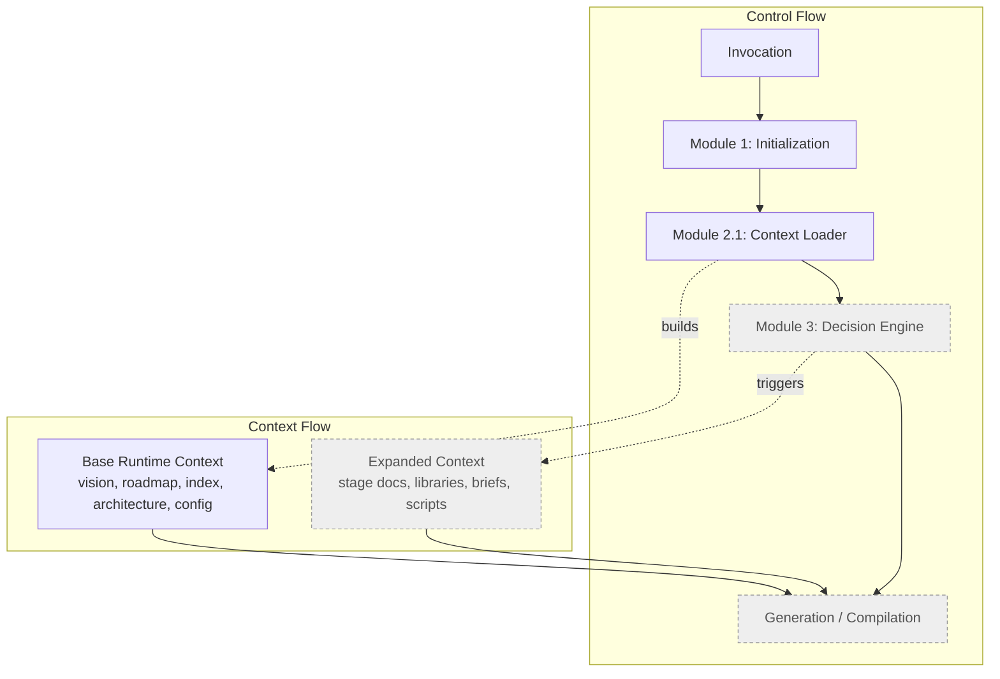
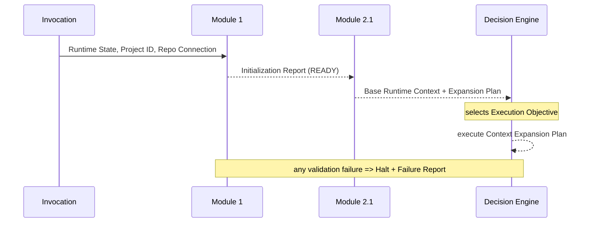
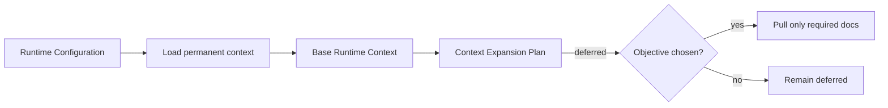
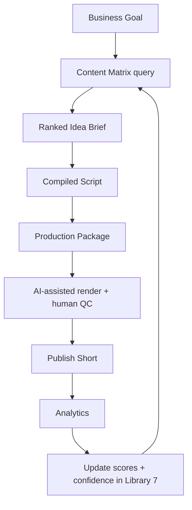

# Runtime Data Flow

## Purpose

This document describes how **context** and **control** move through the Master Runtime, and
how runtime execution connects to the locked C-Cloning pipeline data flow.

## Two flows: control and context

The runtime has two intertwined flows:

- **Control flow** — which module is active, and when control transfers.
- **Context flow** — what knowledge is loaded, and when it is loaded.

## Control transfer contract

Control moves forward **only** when the active module completes successfully and emits its
contracted output. Any failure diverts to a terminal failure report.

## Context loading data flow (v1.1)

## Connection to the locked pipeline data flow

Once context is prepared and an objective is chosen, the runtime drives the **locked**
C-Cloning data flow. The runtime orchestrates this flow; it does not alter it.

> The feedback edge (analytics → Library 7 scores/confidence) is the **only** mechanism by
> which the runtime's execution influences the knowledge base — and it changes scores and
> confidence only, never locked frameworks.

## Data artifacts by module

| Module | Consumes | Produces |
|---|---|---|
| Runtime Initialization | Runtime invocation, project ID, repo connection | Initialization Report, `READY` state |
| Repository Context Loader | Runtime configuration, repository connection | Base Runtime Context, Context Expansion Plan |
| Decision Engine | Base Runtime Context | Selected Execution Objective |
| Generation / Compilation | Expanded context + prior stage output | Idea Brief / Script / Production Package |

## Related reading
- [Runtime Architecture v1.1](Runtime_Architecture_v1.1.md)
- [Runtime Module Overview](Runtime_Module_Overview.md)
- [System Architecture data flow (knowledge base)](../../docs/04-system-architecture.md)
