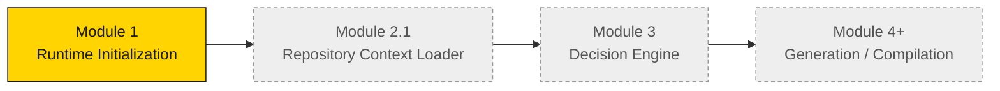
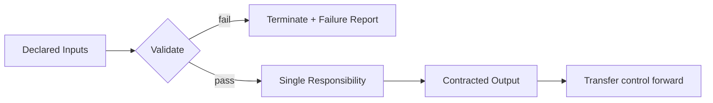

# Runtime Module Overview

## Purpose

This document catalogs every module in the Master Runtime and its **contract**. Only
**Module 1** is implemented in this milestone; the rest are documented as approved contracts
and planned components.

## The module chain

## Common module contract

Every module obeys the same shape:

- **One responsibility** per module.
- **Fail-closed** on any validation failure.
- **No cross-boundary work** — a module never does another module's job.
- **Explicit control transfer** on success only.

---

## Module 1 — Runtime Initialization  ✅ Built

**Purpose:** Prepare and validate the execution environment so the runtime starts from a
known, valid, deterministic state.

**Responsibilities:**
- Initialize runtime; verify runtime version and project identity.
- Verify repository availability and structure.
- Verify the locked architecture and required documentation exist.
- Initialize runtime state and produce an Initialization Report.
- Transfer control to the Repository Context Loader.

**Dependencies:** Runtime invocation, project identifier, repository connection, runtime
version.

**Inputs → Output:** Runtime invocation → Initialization Report (`READY`).

**Failure conditions:** Repository unavailable/inaccessible, required documentation missing,
locked roadmap missing, architecture mismatch, runtime version mismatch, invalid project
identifier. On failure: halt, no recovery, failure report.

**Out of scope:** Reading project documentation content, loading knowledge, business
decisions, executing workflows.

Full spec: [Module_01_Runtime_Initialization](../modules/Module_01_Runtime_Initialization.md).

---

## Module 2.1 — Repository Context Loader  ⏳ Planned

**Purpose:** Build the Base Runtime Context and define the Context Expansion Plan, using the
runtime configuration as the authoritative source.

**Responsibilities:**
- Load and verify the runtime configuration.
- Load permanent repository context only (vision, locked roadmap, index, architecture, config).
- Build the Base Runtime Context.
- Produce a Context Expansion Plan (define, do not execute).
- Transfer control to the Decision Engine.

**Dependencies:** Runtime state (from Module 1), runtime configuration, repository connection.

**Inputs → Output:** Runtime state + configuration → Base Runtime Context + Context Expansion Plan.

**Failure conditions:** Runtime configuration missing/unreadable, required base documents
absent, repository layout mismatch, architecture version mismatch.

**Out of scope:** Determining today's objective, loading stage-specific documents, loading
idea briefs or scripts, business decisions.

> **Refinement note:** This is the v1.1 loader. It separates permanent context from
> task-specific context to remove the v1.0 circular dependency on the execution objective.

---

## Module 3 — Decision Engine  ⏳ Planned

**Purpose:** Determine the Execution Objective for the current run, then trigger the
Context Expansion Plan for that objective.

**Responsibilities:**
- Consume the Base Runtime Context.
- Select the Execution Objective (e.g., Idea Generation, Script Compilation, Production Compilation).
- Trigger execution of the matching branch of the Context Expansion Plan.
- Transfer control to the appropriate generation/compilation module.

**Dependencies:** Base Runtime Context, Context Expansion Plan.

**Out of scope:** Environment validation, permanent context loading, rewriting knowledge,
re-opening locked decisions.

---

## Modules 4+ — Generation / Compilation  ⏳ Planned

These modules orchestrate the locked pipeline stages, in the locked order:

| Objective | Stage orchestrated | Requires |
|---|---|---|
| Idea Generation | Stage 4 — Infinite Idea Generator | Libraries + Content Matrix |
| Script Compilation | Stage 5 — Script Compiler | Approved Idea Brief |
| Production Compilation | Stage 6 — Production Compiler | Approved Script |

**Out of scope for all:** redesigning or optimizing any locked framework. They *execute*
locked stages; they never modify them.

## Related reading
- [Runtime Architecture v1.1](Runtime_Architecture_v1.1.md)
- [Runtime Data Flow](Runtime_Data_Flow.md)
- [Runtime Roadmap](Runtime_Roadmap.md)
