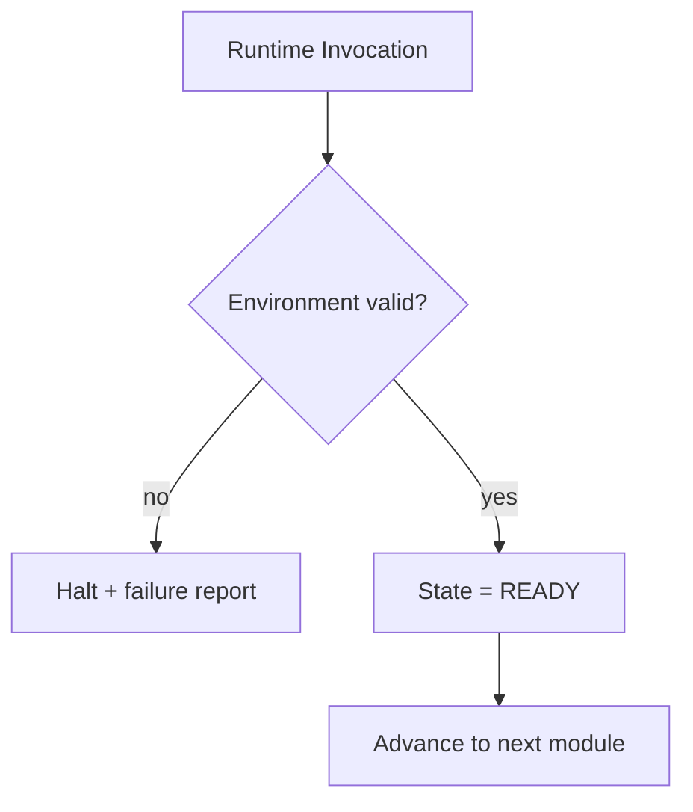

# Runtime Philosophy

The Master Runtime borrows its mental model from **operating systems and compilers**, not
from applications. It does not "try to be helpful" mid-execution; it enforces contracts.

## The operating-system analogy

Every reliable operating system validates its environment before executing any workload.
The Master Runtime does the same. It starts from a **known, valid, deterministic state** or
it does not start at all.

## The compiler analogy

The context loader behaves like a **compiler preparing a symbol table**, not like an
application executing business logic. It resolves what is needed, records where it lives,
and defers everything that is not yet required — without running any of it.

## Core philosophical commitments

| Commitment | Meaning for the runtime |
|---|---|
| **Determinism over improvisation** | The runtime never improvises. Behavior is defined by contracts and configuration. |
| **Fail-closed, never fail-open** | On any validation failure the runtime stops. A partial runtime is treated as a failed runtime. |
| **Minimum necessary context** | The runtime never loads the entire repository. It loads only what the current execution requires. |
| **Authoritative sources only** | Repository documentation is the single source of truth. The runtime never guesses or fabricates missing knowledge. |
| **Module boundaries are sacred** | A module does exactly its job and nothing more. It never performs the work of another module. |
| **Traceability is mandatory** | Every decision and output carries the path that produced it. |

## Why "structure over luck" applies to the runtime

The project rejects treating content as a creative gamble. The runtime rejects treating
execution as a hopeful sequence of steps. Just as ideas are *computed* rather than
brainstormed, runtime execution is *validated and orchestrated* rather than assumed to work.

## Behavioral stance

- The runtime **never continues after a failure** in the hope that things resolve later.
- The runtime **never substitutes** missing documentation with inference.
- The runtime **never re-opens** a locked decision.
- The runtime **never expands scope** to "be helpful"; it protects the contract instead.

## Related reading
- [Runtime Principles](Runtime_Principles.md)
- [Runtime Architecture](Runtime_Architecture.md)
- [Locked Roadmap governance rule (knowledge base)](../../docs/03-locked-roadmap.md)
