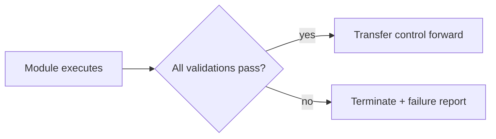

# Runtime Principles

These principles are **binding rules**. Every module inherits them. They may not be
silently overridden by any module, contributor, or automated process.

## 1. Determinism with traceability
Given identical inputs, the runtime produces identical outputs. Every output carries the
decision path, the loaded context, and the module chain that produced it.

## 2. Fail-closed execution
If any validation fails, execution **stops immediately**. The runtime never continues with
a partially initialized or unverified state. No recovery is attempted inside the failing
module; a failure report is returned instead.

## 3. Minimum necessary context
The runtime never loads the entire repository. It loads only permanent runtime context plus
the specific documents the current execution requires. Everything else is deferred.

## 4. Authoritative source of truth
Repository documentation is the single source of operational truth. The runtime:
- never guesses,
- never infers missing documentation,
- never substitutes an absent document,
- never hardcodes repository metadata that a declared configuration should provide.

## 5. Immutability of locked decisions
The runtime consumes locked frameworks but never redesigns, optimizes, or re-opens them.
Only **scores and confidence values** inside the intelligence layer may change, and only
from real published-video analytics — never runtime execution.

## 6. Strict module boundaries
Each module has exactly one responsibility and a strict input/output contract. A module
never performs business logic that belongs to another module, and never executes a later
module's work.

## 7. Explicit control transfer
Control advances only when the current module completes successfully and produces its
contracted output. Control transfer is explicit, ordered, and one-directional under normal
execution (feedback loops are defined by the pipeline, not by ad-hoc jumps).

## 8. Configuration over hardcoding
Operational metadata (versions, branches, roots, module order, expansion rules) belongs in
declared configuration, not in module logic. Until that configuration exists, the runtime
documents its need rather than fabricating values.

## 9. Separation of knowledge and execution
Knowledge lives in the repository. Execution logic lives in the runtime. The runtime moves
knowledge; it does not rewrite it.

## Principle-to-module mapping

| Principle | Enforced most visibly by |
|---|---|
| Fail-closed execution | Module 1 (Runtime Initialization) |
| Minimum necessary context | Module 2.1 (Repository Context Loader) |
| Configuration over hardcoding | Module 2.1 + deferred runtime configuration |
| Immutability of locked decisions | All modules; Decision Engine especially |
| Strict module boundaries | Every module contract |

## Related reading
- [Runtime Philosophy](Runtime_Philosophy.md)
- [Runtime Module Overview](Runtime_Module_Overview.md)
