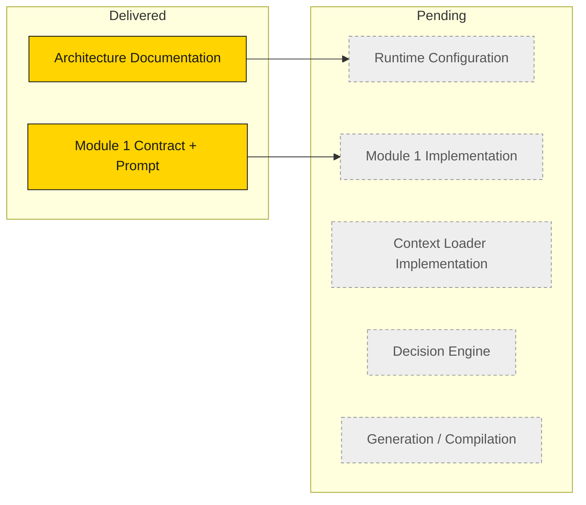

# Runtime Progress

## Purpose

A single, honest snapshot of what the Master Runtime subsystem has **built** versus what is
**pending**. This document tracks approved deliverables only.

## Build status

## Component status

| Component | Type | Status |
|---|---|---|
| Runtime Vision / Philosophy / Principles | Documentation | ✅ Delivered |
| Runtime Architecture v1.0 | Documentation | ✅ Delivered |
| Runtime Architecture v1.1 (loader refinement) | Documentation | ✅ Delivered |
| Runtime Data Flow | Documentation | ✅ Delivered |
| Runtime Module Overview | Documentation | ✅ Delivered |
| Runtime Roadmap | Documentation | ✅ Delivered |
| Module 1 — Runtime Initialization (contract) | Documentation | ✅ Delivered |
| Module 1 — executable prompt | Prompt | ✅ Delivered |
| `runtime/` execution home | Placeholder | ✅ Delivered (README only) |
| Runtime configuration files | Configuration | ⏳ Deferred to Milestone 1 |
| Module 1 implementation | Code | ⏳ Pending |
| Repository Context Loader (v1.1) implementation | Code | ⏳ Pending |
| Decision Engine | Code | ⏳ Pending |
| Generation / Compilation modules | Code | ⏳ Pending |

## Module chain progress

| Module | Contract documented | Prompt | Implemented |
|---|---|---|---|
| Module 1 — Runtime Initialization | ✅ | ✅ | ⏳ |
| Module 2.1 — Repository Context Loader | ✅ | ⏳ | ⏳ |
| Module 3 — Decision Engine | ✅ | ⏳ | ⏳ |
| Modules 4+ — Generation / Compilation | ✅ | ⏳ | ⏳ |

## What "delivered" means in this milestone

This milestone delivers **approved architecture documentation only**. No runtime
configuration and no executable runtime code are included. See the
[Runtime Roadmap](Runtime_Roadmap.md) for the sequencing rationale and the deferred
configuration files.

## Next step

Proceed to **Milestone 1 — Runtime Configuration**: author the declarative configuration
files whose rationale is documented in
[Runtime Roadmap → Deferred runtime configuration](Runtime_Roadmap.md#deferred-runtime-configuration).
