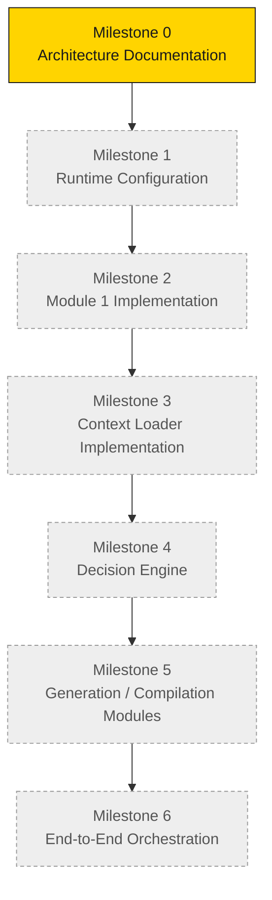
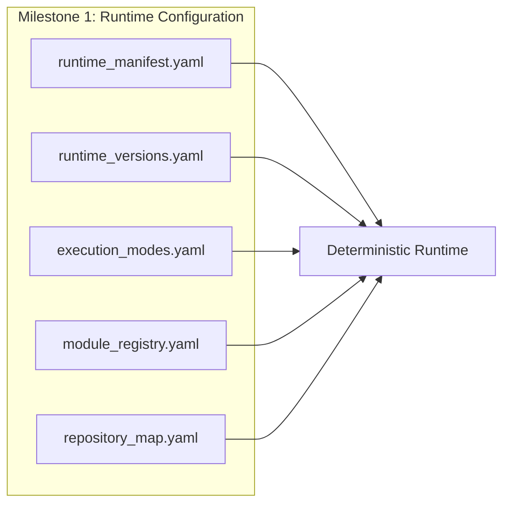

# Runtime Roadmap

## Purpose

The Runtime Roadmap defines the **build order** for the Master Runtime subsystem. Like the
project itself, the runtime is built in strict, sequential milestones. Each milestone is
approved and locked before the next begins.

> **Governance rule (inherited):** No milestone re-opens a locked runtime decision.
> Improvements are captured as new milestones, never as silent edits to locked contracts.

## Milestone order

## Milestone table

| Milestone | Scope | Status |
|---|---|---|
| 0 — Architecture Documentation | Approved runtime vision, philosophy, principles, architecture (v1.0 + v1.1), data flow, module contracts, this roadmap | ✅ This milestone |
| 1 — Runtime Configuration | The declarative configuration files that make behavior reproducible | ⏳ Next |
| 2 — Module 1 Implementation | Executable Runtime Initialization | ⏳ Planned |
| 3 — Context Loader Implementation | Executable v1.1 Repository Context Loader | ⏳ Planned |
| 4 — Decision Engine | Objective selection + expansion-plan trigger | ⏳ Planned |
| 5 — Generation / Compilation | Orchestrators for Stages 4/5/6 | ⏳ Planned |
| 6 — End-to-End Orchestration | Full chain, goal → published output | ⏳ Planned |

## Deferred runtime configuration

This milestone **intentionally does not create** the runtime configuration files. They
belong to **Milestone 1**. Their absence is deliberate, and this section documents **why
each will exist** so the next milestone has an approved rationale.

| Planned file | Why it will exist |
|---|---|
| **`runtime_manifest.yaml`** | The single authoritative runtime configuration. Declares repository name, runtime/architecture versions, documentation branch/root, required base documents, module execution order, and context-expansion rules. It exists so the runtime is driven by declared configuration instead of hardcoded metadata — the core requirement behind the v1.1 loader. |
| **`runtime_versions.yaml`** | Records compatible runtime and architecture versions. It exists to make version-compatibility checks explicit and machine-verifiable during initialization, enabling fail-closed behavior on version mismatch. |
| **`execution_modes.yaml`** | Declares supported execution objectives/modes (e.g., Idea Generation, Script Compilation, Production Compilation) and their properties. It exists so the Decision Engine selects from a declared, closed set rather than an inferred one. |
| **`module_registry.yaml`** | Enumerates modules, their order, responsibilities, and contracts. It exists so the module chain is data-driven and modules can be added or refined without rewriting orchestration logic. |
| **`repository_map.yaml`** | Maps logical documents (roadmap, architecture, stages, libraries) to their physical repository paths. It exists so the Context Loader resolves documents through a declared map instead of hardcoded paths, and so context-expansion plans are portable. |

> Until these files exist, the runtime **documents the need** for each value rather than
> guessing or hardcoding it. This is the fail-closed, configuration-over-hardcoding
> principle applied to the roadmap itself.

## Related reading
- [Runtime Architecture v1.1](Runtime_Architecture_v1.1.md)
- [Runtime Progress](Runtime_Progress.md)
- [Runtime Module Overview](Runtime_Module_Overview.md)
