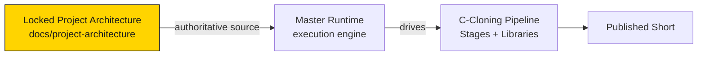

# Runtime Vision

## Purpose

The Master Runtime exists to **execute the locked C-Cloning architecture deterministically**.

C-Cloning is built on one conviction: viral animated comedy is produced by identifiable,
repeatable structures, and when those structures are encoded, content creation becomes an
engineering discipline. The Master Runtime is the engine that turns that engineering
discipline into a repeatable *execution*: it prepares a known-good environment, loads only
the required knowledge, decides what to run, and drives the pipeline from goal to output —
the same way, every time.

> The knowledge base defines *what the system knows*. The Master Runtime defines *how that
> knowledge is executed safely and reproducibly*.

## Vision statement

> Become the reliable execution substrate for the C-Cloning studio: a modular runtime where
> a human supplies goals, the runtime prepares and validates context, and every stage of the
> locked pipeline runs in the correct order with full traceability — never against a
> partially initialized or unverified state.

## What success looks like

| Dimension | Target state |
|---|---|
| **Determinism** | Same inputs → same outputs, every run. |
| **Traceability** | Every output can be traced back to the approved knowledge base and the module chain that produced it. |
| **Modularity** | Each module has one responsibility and a strict contract; modules can evolve independently. |
| **Safety** | The runtime halts on any validation failure rather than continuing in a degraded state. |
| **Reproducibility** | Runtime behavior is driven by declared configuration, not hardcoded metadata. |

## Relationship to the project

The Master Runtime is a **new subsystem**, not a continuation of the project architecture.
The project architecture (Foundations → Knowledge → Intelligence → Generation/Production)
remains the authoritative, immutable source of truth. The runtime **consumes** that
architecture; it never redesigns, optimizes, or overrides it.

## Non-goals

- The runtime does **not** generate ideas, compile scripts, or produce packages itself — it
  *orchestrates* the modules that do.
- The runtime does **not** modify the knowledge base.
- The runtime does **not** re-open locked decisions.

## Related reading
- [Runtime Philosophy](Runtime_Philosophy.md)
- [Runtime Principles](Runtime_Principles.md)
- [Project Vision (knowledge base)](../../docs/01-project-vision.md)
