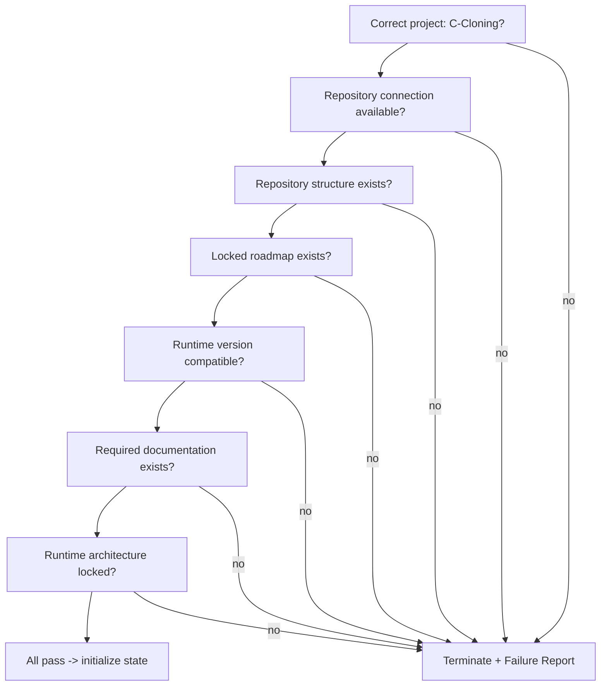
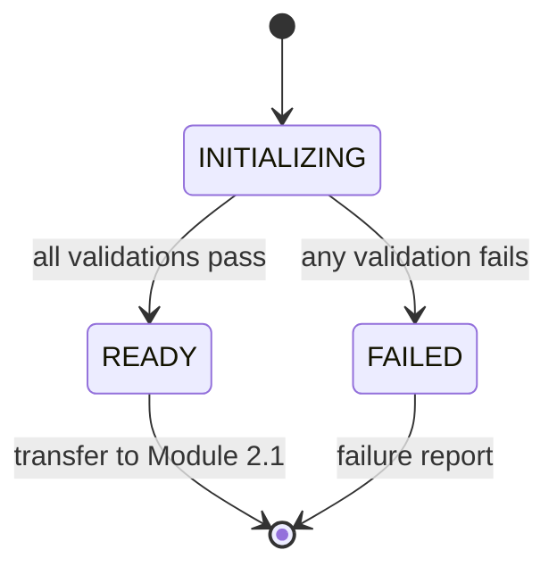

# Module 1 — Runtime Initialization

> **Status:** ✅ Contract approved · Implementation pending (Milestone 2)
> **Position in chain:** First module. Runs before any context is loaded.

## Purpose

Prepare the execution environment so the runtime starts from a **known, valid, deterministic
state**. Module 1 is the runtime's equivalent of an operating system validating its
environment before executing any workload. If initialization fails, execution stops
immediately — the runtime never continues in a partially initialized state.

Module 1 is **not** the Master Runtime. It prepares the environment and nothing more.

## Responsibilities

- Initialize the runtime.
- Verify the runtime version is compatible.
- Verify the project identity (`C-Cloning`).
- Verify repository availability and accessibility.
- Verify the repository structure exists (expected layout).
- Verify the locked roadmap exists.
- Verify required documentation exists.
- Verify the runtime architecture is locked.
- Initialize runtime state.
- Produce an Initialization Report.
- Transfer control to Module 2.1 (Repository Context Loader).

## Out of scope

- Reading project documentation **content**.
- Loading knowledge or current state.
- Making business decisions.
- Executing workflows or generating outputs.

Module 1 performs **existence and integrity checks only** — never content interpretation.

## Dependencies

| Input | Description |
|---|---|
| Runtime invocation | The trigger to start the runtime |
| Project identifier | Must resolve to `C-Cloning` |
| Repository connection | A reachable repository |
| Runtime version | Must be compatible with the locked architecture |

## Validation checklist

## Failure philosophy

Module 1 is **fail-closed**. On any failed check it:
- terminates initialization immediately,
- attempts **no** recovery,
- **never** substitutes or infers missing inputs,
- returns a failure report.

### Failure conditions
- Repository unavailable or inaccessible.
- Required documentation missing.
- Locked roadmap missing.
- Architecture mismatch.
- Runtime version mismatch.
- Invalid project identifier.

## Runtime state (on success)

| Field | Value |
|---|---|
| Runtime Status | `READY` |
| Repository Status | `VERIFIED` |
| Architecture Status | `LOCKED` |
| Execution Mode | `INITIALIZATION_COMPLETE` |
| Current Module | 1 |
| Next Module | Repository Context Loader |

## Output contract — Initialization Report

The module produces **only** an Initialization Report containing:

- Runtime Status
- Project
- Runtime Version
- Repository Status
- Architecture Status
- Validation Summary
- Initialization Result
- Next Module

It does not load knowledge, read documentation content, or perform execution. It stops
immediately after the report.

## Lifecycle position

## Executable prompt

The runnable prompt for this module lives at
[`../prompts/Module_01.md`](../prompts/Module_01.md).

## Related reading
- [Runtime Module Overview](../docs/Runtime_Module_Overview.md)
- [Runtime Architecture v1.0](../docs/Runtime_Architecture.md)
- [Runtime Principles](../docs/Runtime_Principles.md)
