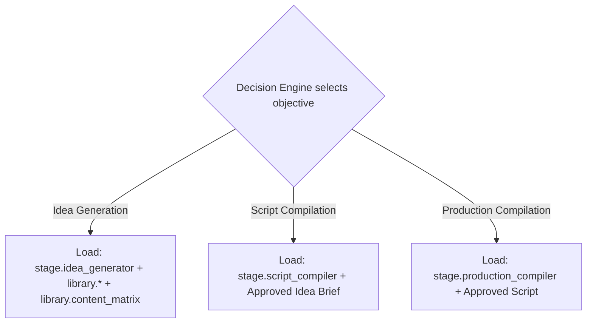
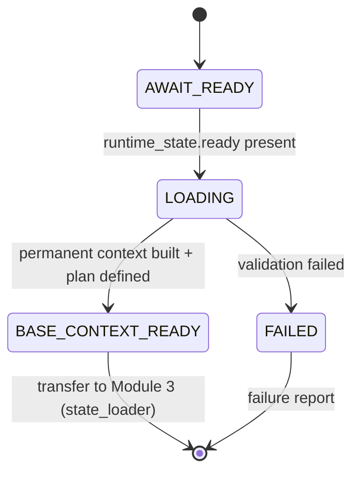

# Module 2 - Repository Context Loader (v1.1)

> **Status:** Specification finalized and validated against the completed Runtime
> Configuration System. This is a **validation + completion** step, not a redesign.
> **Registry note:** `module_registry.yaml` (LOCKED v1.0) records this module as
> `runtime.module.context_loader`, `status: planned`. This finalization does **not**
> modify the locked registry; advancing the `status` field is a future coordinated
> registry version bump governed by the locked upgrade policy.
> **Position in chain:** Order 2. Runs after Runtime Initialization; transfers control
> to Module 3 (Current State Loader).

## Purpose

Prepare the runtime's knowledge context by building the **Base Runtime Context** from
permanent, authoritative documentation, and by **defining** (not executing) the
**Context Expansion Plan** for task-specific loading. Module 2 behaves like a compiler
preparing a symbol table: it resolves what is needed and defers everything not yet
required.

Module 2 is **not** the Master Runtime. It prepares context and nothing more.

## Conformance to Master Runtime Architecture v1.1

This module is the v1.1 loader. v1.1 removed the v1.0 circular dependency by separating
**permanent context loading** (done here, always) from **task-specific context expansion**
(deferred, triggered later after an objective is selected). Module 2 loads permanent
context only and **defines** the expansion plan.

## Responsibilities (one responsibility)

**Single responsibility:** *Build the Base Runtime Context and define the Context
Expansion Plan.*

Operationally this means:
- Read the Runtime Manifest as the authoritative bootstrap configuration.
- Resolve all documents through the Repository Map by **logical identifier**.
- Use the Module Registry for its own module metadata and control transfer.
- Apply Execution Modes behavior for the `mode.context_preparation` operating mode.
- Use Runtime Versions to confirm the configuration set is compatible.
- Build the Base Runtime Context (permanent context only).
- Produce the Context Expansion Plan (define only).
- Transfer control to Module 3 (`runtime.module.state_loader`).

## Out of scope

- Determining today's execution objective (that is Module 4, Decision Engine).
- Loading stage-specific documents, idea briefs, scripts, or production packages.
- Any business logic (formula/comedy/narrative/scenario/psychology/strategy).
- Any execution logic or generation/compilation work.
- Loading current runtime/project state (that is Module 3, Current State Loader).

## Dependencies

| Kind | Value (from LOCKED config) |
|---|---|
| Predecessor module | `runtime.module.initialization` (must have produced `runtime_state.ready`) |
| Successor module (`next`) | `runtime.module.state_loader` |
| Inputs | `runtime_state.ready`, `config.manifest` |
| Outputs | `base_runtime_context`, `context_expansion_plan` |
| Config dependencies | `config.manifest`, `config.repository_map` |
| Operating mode | `mode.context_preparation` |

## Runtime Configuration usage

Module 2 consumes **all five** configuration components:

| Component | How Module 2 uses it |
|---|---|
| **Runtime Manifest** | Read as bootstrap: identity, repository roots, `configuration_references`, and `execution_policies.context_loading` / `context_expansion`. |
| **Repository Map** | Resolve every document by logical id (`doc.*`, `config.*`) to a physical path. Module 2 holds **no** hardcoded paths. |
| **Module Registry** | Read its own entry (`runtime.module.context_loader`): inputs, outputs, `depends_on`, `config_dependencies`, and `next`. |
| **Execution Modes** | Apply `mode.context_preparation`: `context_loading_policy: permanent` and `context_expansion_policy: define_only`. |
| **Runtime Versions** | Confirm the loaded configuration components are within their supported ranges with a uniform schema major before trusting them. |

## Validation (fail-closed)

Before producing any output, Module 2 verifies:
1. `runtime_state.ready` is present (Module 1 completed).
2. The Runtime Manifest is readable and schema-compatible.
3. Required configuration (`config.manifest`, `config.repository_map`) resolves via the map.
4. All Base Runtime Context logical ids resolve to existing, readable documents.
5. Configuration component versions pass the Runtime Versions compatibility gate.
6. The operating mode is `mode.context_preparation`.

On any failure: terminate immediately, no recovery, no substitution, return a failure
report (inherits `manifest.execution_policies.fail_closed`).

## Base Runtime Context (permanent context only)

Resolved strictly by logical identifier through the Repository Map:

| Logical id | Purpose in context |
|---|---|
| `config.manifest` | Bootstrap configuration |
| `config.repository_map` | Resolution source |
| `config.module_registry` | Module chain metadata |
| `config.execution_modes` | Operating-mode behavior |
| `config.runtime_versions` | Compatibility registry |
| `doc.index` | Repository navigation map |
| `doc.project_vision` | Permanent vision context |
| `doc.locked_roadmap` | Immutable execution order |
| `doc.system_architecture` | Locked architecture reference |

No stage documents, libraries, briefs, or scripts are loaded here.

## Context Expansion Plan (defined, not executed)

Module 2 defines the plan in logical identifiers and hands it forward. Execution is
deferred until the Decision Engine (Module 4) selects an objective while in
`mode.execution` (`context_expansion_policy: active`).



> Module 2 only **defines** these branches (as logical ids). It never loads them.

## Failure philosophy

Fail-closed. A missing required document, an unresolved logical id, a version
incompatibility, or a wrong operating mode terminates the module with a failure report.
Partial context is never passed forward.

## Lifecycle position



## Module interface summary

```text
identifier : runtime.module.context_loader
order      : 2
version    : 1.1.0
mode       : mode.context_preparation
inputs     : runtime_state.ready, config.manifest
outputs    : base_runtime_context, context_expansion_plan
depends_on : runtime.module.initialization
next       : runtime.module.state_loader
config     : config.manifest, config.repository_map
```

## Output contract - Runtime Context Report

Module 2 produces a Runtime Context Report containing: Context Status, Base Documents
Loaded, Base Documents Deferred, Context Expansion Plan, Repository Map / Manifest
versions used, and Next Module. It preserves repository terminology and does not
reinterpret documentation beyond what execution requires. See
[`../docs/Runtime_Data_Flow.md`](../docs/Runtime_Data_Flow.md) for the full data flow.

## Related reading
- [Runtime Architecture v1.1](../docs/Runtime_Architecture_v1.1.md)
- [Runtime Module Overview](../docs/Runtime_Module_Overview.md)
- [Module 1 - Runtime Initialization](Module_01_Runtime_Initialization.md)
