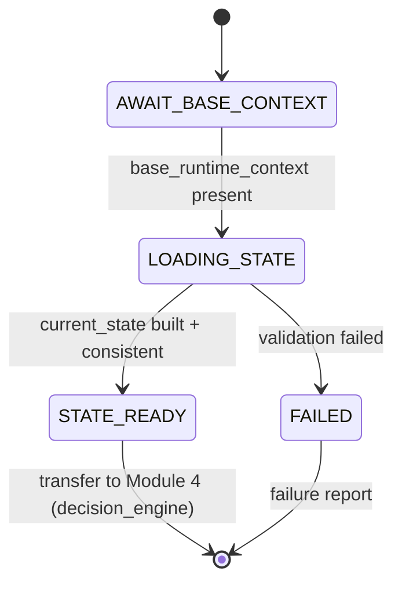

# Module 3 - Current State Loader (v1.0)

> **Status:** Specification finalized and validated against the completed Runtime
> Configuration System. Design + finalize step; no redesign of locked components.
> **Registry note:** `module_registry.yaml` (LOCKED v1.0) records this module as
> `runtime.module.state_loader`, `status: planned`. This finalization does **not**
> modify the locked registry; advancing the `status` field is a future coordinated
> registry version bump governed by the locked upgrade policy.
> **Position in chain:** Order 3. Runs after Module 2 (Repository Context Loader);
> transfers control to Module 4 (Decision Engine).

## Purpose

Load the runtime's **current, dynamic execution state** and assemble it into a single
**Current Runtime State** object for the Decision Engine. Module 3 supplies the *variable*
half of the runtime's inputs; Module 2 supplied the *permanent* half. It reads state, not
knowledge.

Module 3 is **not** the Master Runtime. It prepares dynamic state and nothing more.

## Conformance to Master Runtime Architecture v1.1

Module 3 runs inside `mode.context_preparation` alongside Module 2. Per v1.1's separation
of concerns, permanent context (Module 2) and dynamic state (Module 3) are prepared before
any objective is chosen. Module 3 loads **no** permanent knowledge and **defers** all
task-specific/expanded loading to the post-decision phase.

## Responsibilities (one responsibility)

**Single responsibility:** *Load the current runtime execution state and build the Current
Runtime State object.*

State items loaded (each optional unless supplied by the invocation/session):
- Current execution objective (if supplied)
- Current execution mode
- Active runtime session
- Pending work items
- Available runtime inputs
- Runtime constraints
- User-supplied execution parameters
- Current analytics snapshot (if available)
- Existing production backlog (if available)
- Available reusable assets (if available)
- Current approval status

Then: assemble the **Current Runtime State** object and transfer control to Module 4
(`runtime.module.decision_engine`).

## Out of scope

- Reading permanent documentation (`doc.*`) or intelligence libraries (`library.*`).
- Generating ideas, compiling scripts, or compiling production packages.
- Performing quality validation (Module 6).
- Making the objective decision (Module 4 consumes this state to decide).
- Modifying any Runtime Configuration.
- Any business logic or execution logic.

## Dependencies

| Kind | Value (from LOCKED config) |
|---|---|
| Predecessor module | `runtime.module.context_loader` (must have produced `base_runtime_context`) |
| Successor module (`next`) | `runtime.module.decision_engine` |
| Inputs | `base_runtime_context` |
| Outputs | `current_state` |
| Config dependencies | `config.repository_map` |
| Operating mode | `mode.context_preparation` |

## Runtime Configuration usage

Module 3 consumes all five components. The four config documents already validated by
Module 1 and carried in `base_runtime_context` are reused (not re-loaded); only
`config.repository_map` is a direct dependency for resolving optional repository-backed
state by logical id.

| Component | How Module 3 uses it |
|---|---|
| **Runtime Manifest** | Read (via `base_runtime_context`) for identity and `execution_policies` (fail-closed, logging). |
| **Repository Map** | Resolve any **optional** repository-backed state (analytics snapshot, backlog, reusable assets) by logical id. No hardcoded paths. |
| **Module Registry** | Read its own entry (`runtime.module.state_loader`): inputs, outputs, `depends_on`, `next`. |
| **Execution Modes** | Confirm it operates within `mode.context_preparation`; record `next_mode: mode.execution`. |
| **Runtime Versions** | Confirm the configuration set carried forward is compatible before trusting it. |

> Dynamic, non-repository state (session, user parameters, runtime inputs) arrives from the
> runtime invocation/environment - it has no repository path and needs none. Repository-
> backed optional state resolves through the Repository Map; when a corresponding logical id
> is absent (e.g., `assets_root` is reserved but unpopulated), it is treated as unavailable
> and recorded (map policy `on_missing_optional_path: skip_and_record`).

## Validation (fail-closed)

Before producing output, Module 3 verifies:
1. **Runtime initialized** - `runtime_state.ready` is present (Module 1 completed).
2. **Module 2 completed** - `base_runtime_context` is present and well-formed.
3. **Configuration compatible** - config components pass the Runtime Versions gate.
4. **Required runtime inputs available** - mandatory inputs for this session are present.
5. **Current state internally consistent** - e.g., a supplied objective is a member of the
   declared execution modes/objectives; approval status is a recognized value; constraints
   do not contradict available inputs.

On any failure: terminate immediately per the Fail Closed Policy
(`manifest.execution_policies.fail_closed`) - no recovery, no substitution, failure report.

## Current Runtime State schema

Optional fields are omitted (not fabricated) when unavailable. Repository-backed fields are
referenced by logical id, never by path.

```yaml
current_state:
  session:
    session_id: <opaque runtime session id>
    started_at: <timestamp>
  execution:
    objective: <supplied objective | null>      # decided by Module 4 if null
    mode: "mode.context_preparation"             # current operating mode
    next_mode: "mode.execution"
  inputs:
    available_inputs: [ <logical input tokens> ]
    user_parameters: { <key>: <value> }          # user-supplied execution params
    constraints: [ <runtime constraint tokens> ]
  work:
    pending_work_items: [ <work item refs> ]
    production_backlog:                            # optional
      available: <true|false>
      source_ref: <logical id | null>            # e.g. via assets_root when present
  resources:
    reusable_assets:                               # optional
      available: <true|false>
      source_ref: <logical id | null>
  analytics:
    snapshot:                                      # optional
      available: <true|false>
      source_ref: <logical id | null>
  approval:
    status: <pending | approved | rejected | not_required>
  provenance:
    config_versions_ref: "config.runtime_versions"
    built_by: "runtime.module.state_loader"
```

## Failure philosophy

Fail-closed. Missing required inputs, an incompatible configuration, a missing
`base_runtime_context`, or an internally inconsistent state terminates the module with a
failure report. Partial or inferred state is never passed forward.

## Lifecycle position



## Module interface summary

```text
identifier : runtime.module.state_loader
order      : 3
version    : 1.0.0
mode       : mode.context_preparation
inputs     : base_runtime_context
outputs    : current_state
depends_on : runtime.module.context_loader
next       : runtime.module.decision_engine
config     : config.repository_map
```

## Example Current Runtime State report

```text
CURRENT RUNTIME STATE REPORT
State Status   : READY
Operating Mode : mode.context_preparation  (next_mode: mode.execution)
Config Compat  : PASS (schema 1.0 uniform; versions in range)

Session        : sess-2f9c... (started 2026-07-31T14:58:00Z)
Objective      : <none supplied>            -> to be decided by Module 4
User Parameters: { weekly_goal_mix: "provided" }
Available Inputs: [ operator_goal ]
Constraints    : [ advertiser_safe, max_runtime_short ]
Pending Work   : [ ]
Production Backlog : unavailable (skip_and_record)
Reusable Assets    : unavailable (assets_root reserved, unpopulated)
Analytics Snapshot : unavailable
Approval Status    : not_required

Consistency Check  : PASS
Result             : SUCCESS
Next Module        : runtime.module.decision_engine
```

## Confirmation of production-readiness

The Module 3 specification conforms to Master Runtime Architecture v1.1, consumes all five
configuration components correctly, uses only logical identifiers (no hardcoded paths),
loads no permanent repository knowledge, contains no business or execution logic, and
preserves module boundaries. The specification is **production-ready**. (The locked registry
`status: planned` field is advanced only via a future coordinated registry version bump.)

## Related reading
- [Runtime Architecture v1.1](../docs/Runtime_Architecture_v1.1.md)
- [Runtime Module Overview](../docs/Runtime_Module_Overview.md)
- [Module 2 - Repository Context Loader](Module_02_Repository_Context_Loader.md)
