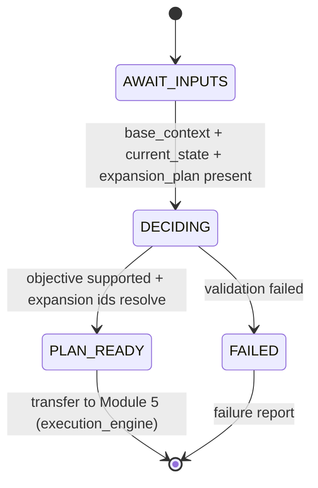

# Module 4 - Decision Engine (v1.0)

> **Status:** Specification finalized and validated against the completed Runtime
> Configuration System. Design + finalize step; no redesign of locked components.
> **Registry note:** `module_registry.yaml` (LOCKED v1.0) records this module as
> `runtime.module.decision_engine`, `status: planned`. This finalization does **not**
> modify the locked registry; advancing the `status` field is a future coordinated
> registry version bump governed by the locked upgrade policy.
> **Position in chain:** Order 4. First module of `mode.execution`. Runs after Modules
> 2 and 3; transfers control to Module 5 (Execution Engine).

## Purpose

Determine **what the Runtime should execute next** and express that decision as an
**Execution Plan**. Module 4 consumes the Base Runtime Context (Module 2) and the Current
Runtime State (Module 3), selects the Execution Objective, and issues the Context Expansion
Request that resolves the task-specific documents the plan needs. Module 5 executes the
plan; **Module 4 never performs the work itself**.

Module 4 is **not** the Master Runtime. It decides and plans; it does not generate.

## Conformance to Master Runtime Architecture v1.1

Module 4 is the point where v1.1's **deferred** Context Expansion Plan (defined by Module 2)
becomes a concrete request. It runs in `mode.execution`, whose policy is
`context_loading: expanded` and `context_expansion: active` - the mode that authorizes
expansion. Module 4 selects the objective and triggers the matching expansion branch; it
does not enter generation/compilation, which belongs to Module 5.

### Output mapping to the locked Module Registry (no redesign)

The registry fixes Module 4 outputs as `selected_execution_mode` and `expanded_context`.
This specification's deliverables map onto them exactly:

| Design-level artifact | Locked registry output it populates |
|---|---|
| Execution Objective + Required Runtime Mode | `selected_execution_mode` |
| Execution Plan (container) | carried within/alongside `selected_execution_mode` |
| Context Expansion Request → resolved documents | `expanded_context` |

## Responsibilities (one responsibility)

**Single responsibility:** *Decide the Execution Objective and produce the Execution Plan
(including the Context Expansion Request).*

Determinations made:
- **Execution Objective** - one supported branch of the Context Expansion Plan.
- **Required Runtime Mode** - the operating mode for the work (`mode.execution`).
- **Required Context Expansion** - which task-specific logical ids to resolve.
- **Required Runtime Inputs** - inputs the objective needs (from Current Runtime State).
- **Execution Priority** - relative priority for the selected work.
- **Execution Constraints** - constraints carried from Current Runtime State.
- **Required Downstream Modules** - the remaining chain to run (from Module Registry).

Then: emit the Execution Plan and trigger the Context Expansion Request, transferring
control to Module 5 (`runtime.module.execution_engine`).

## Out of scope

- Generating ideas, compiling scripts, or producing production packages (Module 5).
- Performing quality validation (Module 6).
- Executing Runtime workflows / doing the work.
- Modifying any Runtime Configuration.
- Any business logic (the *rules* of comedy/formula/etc.) or execution logic.

> Note: selecting **which** objective to run is a runtime routing decision, not business
> logic. Module 4 never applies creative rules; it routes based on Current Runtime State and
> the supported objective set.

## Dependencies

| Kind | Value (from LOCKED config) |
|---|---|
| Predecessor modules | `runtime.module.context_loader`, `runtime.module.state_loader` |
| Successor module (`next`) | `runtime.module.execution_engine` |
| Inputs | `base_runtime_context`, `current_state`, `context_expansion_plan` |
| Outputs | `selected_execution_mode`, `expanded_context` |
| Config dependency | `config.execution_modes` |
| Operating mode | `mode.execution` (`load: expanded`, `expansion: active`, `next_mode: mode.validation`) |

## Runtime Configuration usage

| Component | How Module 4 uses it |
|---|---|
| **Runtime Manifest** | Read (via base context) for `execution_policies` (fail-closed, logging) and `context_expansion` rules. |
| **Repository Map** | Resolve the Context Expansion Request's task-specific logical ids (`stage.*`, `library.*`) to physical documents. No hardcoded paths. |
| **Module Registry** | Determine Required Downstream Modules and the control-transfer target (`next`). |
| **Execution Modes** | Direct dependency: confirm operation in `mode.execution` and that the requested objective is supported before planning. |
| **Runtime Versions** | Confirm the configuration set is compatible before trusting it. |

## Validation (fail-closed)

Before producing the Execution Plan, Module 4 verifies:
1. **Module 2 completed** - `base_runtime_context` and `context_expansion_plan` present.
2. **Module 3 completed** - `current_state` present.
3. **Configuration compatible** - config passes the Runtime Versions gate.
4. **Current Runtime State valid** - internally consistent and complete for planning.
5. **Requested execution supported** - the chosen Execution Objective is a declared branch
   of the Context Expansion Plan and its expansion ids resolve via the Repository Map.

On any failure: terminate per the Fail Closed Policy - no recovery, no substitution,
failure report. A partially decided plan is never passed forward.

## Execution Plan schema

Repository-backed items are referenced by logical id, never by path.

```yaml
execution_plan:
  plan_id: <opaque plan id>
  execution_objective: <idea_generation | script_compilation | production_compilation>
  required_runtime_mode: "mode.execution"        # -> selected_execution_mode
  next_mode: "mode.validation"
  required_runtime_inputs: [ <input tokens from current_state> ]
  execution_priority: <low | normal | high>
  execution_constraints: [ <constraint tokens from current_state> ]
  context_expansion_request:                      # see schema below
    ref: <context_expansion_request.request_id>
  required_downstream_modules:                    # from module_registry (by id)
    - "runtime.module.execution_engine"
    - "runtime.module.quality_gate"
    - "runtime.module.output_builder"
    - "runtime.module.shutdown"
  provenance:
    decided_by: "runtime.module.decision_engine"
    inputs_ref: [ "base_runtime_context", "current_state", "context_expansion_plan" ]
    config_versions_ref: "config.runtime_versions"
```

## Context Expansion Request schema

Selects one branch of the Module 2 Context Expansion Plan and lists the logical ids to
resolve. The resolved result becomes the registry output `expanded_context`.

```yaml
context_expansion_request:
  request_id: <opaque request id>
  objective: <idea_generation | script_compilation | production_compilation>
  resolve:                                         # logical ids only (repository_map)
    documents: [ <e.g. stage.idea_generator, library.content_matrix, library.*> ]
    supplied_artifacts: [ <e.g. approved_idea_brief | approved_script | none> ]
  resolution_policy:
    source: "config.repository_map"
    on_missing_required: "fail_closed"
    on_missing_optional: "skip_and_record"
  target_output: "expanded_context"
```

> Branch mapping (from the locked Module 2 Context Expansion Plan):
> - `idea_generation` → `stage.idea_generator` + required `library.*` + `library.content_matrix`
> - `script_compilation` → `stage.script_compiler` + approved Idea Brief
> - `production_compilation` → `stage.production_compiler` + approved Script

## Failure philosophy

Fail-closed. An unsupported objective, an unresolved expansion id, an invalid Current
Runtime State, or an incompatible configuration terminates the module with a failure report.
No inferred or partial plan is emitted.

## Lifecycle position



## Module interface summary

```text
identifier : runtime.module.decision_engine
order      : 4
version    : 1.0.0
mode       : mode.execution   (load: expanded, expansion: active, next_mode: mode.validation)
inputs     : base_runtime_context, current_state, context_expansion_plan
outputs    : selected_execution_mode, expanded_context
depends_on : runtime.module.context_loader, runtime.module.state_loader
next       : runtime.module.execution_engine
config     : config.execution_modes
```

## Example Execution Plan

```text
EXECUTION PLAN
Plan Status        : READY
Execution Objective: idea_generation
Required Mode      : mode.execution   (next_mode: mode.validation)
Priority           : normal
Required Inputs    : [ operator_goal ]
Constraints        : [ advertiser_safe, max_runtime_short ]

Context Expansion Request:
  objective : idea_generation
  resolve.documents        : [ stage.idea_generator, library.content_matrix,
                               library.viral_formula, library.narrative_pattern ]
  resolve.supplied_artifacts: [ none ]
  resolution_policy.source : config.repository_map
  target_output            : expanded_context   (RESOLVED, all ids OK)

Required Downstream Modules:
  runtime.module.execution_engine -> quality_gate -> output_builder -> shutdown

Validation: PASS (objective supported; expansion ids resolvable; state valid; config compatible)
Result     : SUCCESS
Next Module : runtime.module.execution_engine
```

## Confirmation of production-readiness

The Module 4 specification conforms to Master Runtime Architecture v1.1, consumes all five
configuration components correctly, uses only logical identifiers (no hardcoded paths),
loads no permanent repository knowledge as *knowledge* (it resolves task-specific documents
into `expanded_context` for Module 5, and applies no creative/business rules), contains no
execution or business logic, and preserves module boundaries. Its outputs map exactly onto
the locked registry outputs. The specification is **production-ready**. (The locked registry
`status: planned` field is advanced only via a future coordinated registry version bump.)

## Related reading
- [Runtime Architecture v1.1](../docs/Runtime_Architecture_v1.1.md)
- [Runtime Module Overview](../docs/Runtime_Module_Overview.md)
- [Module 2 - Repository Context Loader](Module_02_Repository_Context_Loader.md)
- [Module 3 - Current State Loader](Module_03_Current_State_Loader.md)
