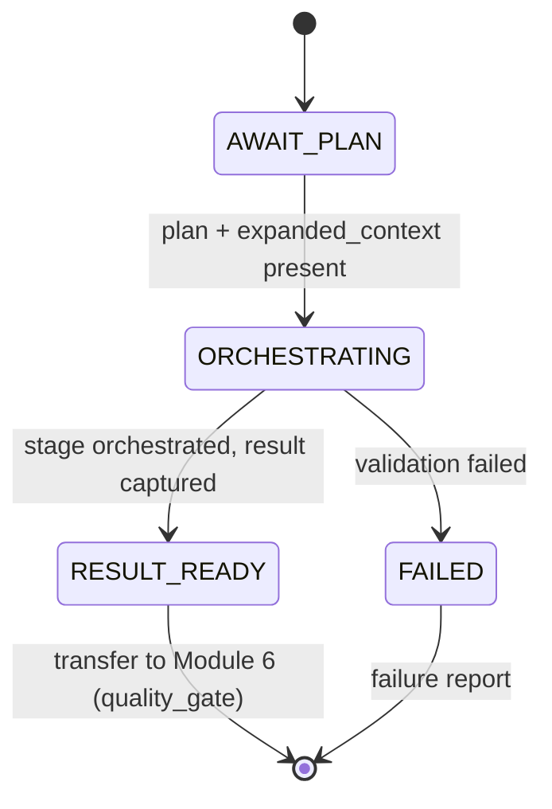

# Module 5 - Execution Engine (v1.0)

> **Status:** Specification finalized and validated against the completed Runtime
> Configuration System. Design + finalize step; no redesign of locked components.
> **Registry note:** `module_registry.yaml` (LOCKED v1.0) records this module as
> `runtime.module.execution_engine`, `status: planned`. This finalization does **not**
> modify the locked registry; advancing the `status` field is a future coordinated
> registry version bump governed by the locked upgrade policy.
> **Position in chain:** Order 5. Exit module of `mode.execution`. Runs after Module 4;
> transfers control to Module 6 (Quality Gate).

## Purpose

Execute the **Execution Plan** produced by Module 4 by **orchestrating** the locked pipeline
stage the plan selected, running it against the `expanded_context`. Module 5 drives
execution and prepares the results for the Quality Gate. It **orchestrates**; it does not
author business content and does not validate quality.

Module 5 is **not** the Master Runtime. It runs the plan; it neither decides nor judges.

## Conformance to Master Runtime Architecture v1.1

Module 5 is the exit module of `mode.execution` (`load: expanded`, `expansion: active`).
The permanent/dynamic context (Modules 2-3) and the decision + expansion (Module 4) are
already prepared; Module 5 consumes them and orchestrates the selected locked stage. The
*business rules* live in the locked knowledge base (the stage documents and prompts resolved
into `expanded_context`); Module 5 supplies **orchestration only** and holds no rules of its
own.

### Output mapping to the locked Module Registry (no redesign)

The registry fixes Module 5's output as `stage_output`. This specification's deliverables
map onto it exactly:

| Design-level artifact | Locked registry output it populates |
|---|---|
| Execution Result (wraps the stage's produced artifact) | `stage_output` |
| Execution Metadata | carried within `stage_output` provenance |
| Execution Log | carried within `stage_output` provenance |

## Responsibilities (one responsibility)

**Single responsibility:** *Orchestrate the selected locked pipeline stage per the Execution
Plan and produce the Execution Result.*

Operationally:
- Consume the Execution Plan (`selected_execution_mode`) and `expanded_context`.
- Orchestrate the selected Runtime workflow (the locked stage identified by the plan's
  objective), using the stage's own contract/prompt resolved into `expanded_context`.
- Apply approved downstream orchestration (sequence per the plan's required downstream set).
- Capture Execution Metadata and an Execution Log.
- Produce the Execution Result and transfer control to Module 6
  (`runtime.module.quality_gate`).

## Out of scope

- Generating ideas, writing scripts, or producing production packages **as its own logic**
  (Module 5 orchestrates the locked stage that does this per the knowledge base; it embeds
  no business rules itself).
- Performing quality validation (Module 6).
- Deciding or re-deciding the objective / redesigning the Execution Plan (Module 4 owns
  that; Module 5 executes the plan as given).
- Modifying any Runtime Configuration.

## Dependencies

| Kind | Value (from LOCKED config) |
|---|---|
| Predecessor module | `runtime.module.decision_engine` |
| Successor module (`next`) | `runtime.module.quality_gate` |
| Inputs | `selected_execution_mode`, `expanded_context` |
| Outputs | `stage_output` |
| Config dependencies | `config.repository_map`, `config.execution_modes` |
| Operating mode | `mode.execution` (exit module; `next_mode: mode.validation`) |

## Runtime Configuration usage

| Component | How Module 5 uses it |
|---|---|
| **Runtime Manifest** | Read (via context) for `execution_policies` (fail-closed, logging, shutdown). |
| **Repository Map** | Direct dependency: resolve any stage-referenced logical ids needed during orchestration. No hardcoded paths. |
| **Module Registry** | Confirm predecessor completion and the control-transfer target (`next`). |
| **Execution Modes** | Direct dependency: confirm operation in `mode.execution`; record `next_mode: mode.validation`. |
| **Runtime Versions** | Confirm the configuration set is compatible before executing. |

## Validation (fail-closed)

Before orchestrating, Module 5 verifies:
1. **Module 4 completed** - `selected_execution_mode` (Execution Plan) present.
2. **Execution Plan valid** - well-formed and internally consistent.
3. **Required context available** - `expanded_context` present and complete for the plan.
4. **Configuration compatible** - config passes the Runtime Versions gate.
5. **Requested workflow supported** - the plan's objective maps to a known locked stage and
   its expanded context is sufficient to orchestrate it.

On any failure: terminate per the Fail Closed Policy - no recovery, no substitution,
failure report. A partial Execution Result is never passed forward.

## Execution Result schema

Repository-backed items are referenced by logical id, never by path.

```yaml
execution_result:                                  # -> stage_output
  result_id: <opaque result id>
  objective: <idea_generation | script_compilation | production_compilation>
  status: <completed | failed>
  produced_artifact:
    kind: <idea_brief | script | production_package>
    ref: <opaque artifact ref>                     # the stage's output, not authored by M5
  source_context_ref: "expanded_context"
  next_module: "runtime.module.quality_gate"
  metadata_ref: <execution_metadata.metadata_id>
  log_ref: <execution_log.log_id>
```

## Execution Metadata schema

```yaml
execution_metadata:
  metadata_id: <opaque id>
  plan_ref: <execution_plan.plan_id>
  runtime_mode: "mode.execution"
  orchestrated_stage: <stage.idea_generator | stage.script_compiler | stage.production_compiler>
  started_at: <timestamp>
  finished_at: <timestamp>
  orchestrated_modules: [ <downstream orchestration ids, per plan> ]
  config_versions_ref: "config.runtime_versions"
  executed_by: "runtime.module.execution_engine"
```

## Execution Log

An ordered, structured record of orchestration steps (mode `logging: structured_json`), each
step: `{ seq, step, status, at }`. Carries no business content - only orchestration events.
Referenced by `execution_result.log_ref`.

## Failure philosophy

Fail-closed. An invalid plan, missing/insufficient `expanded_context`, an unsupported
workflow, or an incompatible configuration terminates the module with a failure report. No
inferred or partial result is emitted.

## Lifecycle position



## Module interface summary

```text
identifier : runtime.module.execution_engine
order      : 5
version    : 1.0.0
mode       : mode.execution   (exit module; next_mode: mode.validation)
inputs     : selected_execution_mode, expanded_context
outputs    : stage_output
depends_on : runtime.module.decision_engine
next       : runtime.module.quality_gate
config     : config.repository_map, config.execution_modes
```

## Example Execution Result

```text
EXECUTION RESULT (stage_output)
Result Status  : COMPLETED
Objective      : idea_generation
Orchestrated Stage : stage.idea_generator
Produced Artifact  : kind=idea_brief, ref=art-idea-7f21
Source Context     : expanded_context (RESOLVED)

Execution Metadata:
  plan_ref        : plan-4a9c
  runtime_mode    : mode.execution
  started/finished: 2026-07-31T15:02:10Z / 15:02:43Z
  orchestrated    : [ ]   (single-stage orchestration)
  config_versions : config.runtime_versions (compatible)

Execution Log: 5 steps recorded (structured_json), no business content

Validation : PASS (plan valid; context sufficient; workflow supported; config compatible)
Result     : SUCCESS
Next Module : runtime.module.quality_gate
```

## Confirmation of production-readiness

The Module 5 specification conforms to Master Runtime Architecture v1.1, consumes all five
configuration components correctly, uses only logical identifiers (no hardcoded paths),
embeds no business logic (it orchestrates the locked stage; rules stay in the knowledge
base), performs no quality validation, and preserves module boundaries. Its output maps
exactly onto the locked registry output `stage_output`. The specification is
**production-ready**. (The locked registry `status: planned` field is advanced only via a
future coordinated registry version bump.)

## Related reading
- [Runtime Architecture v1.1](../docs/Runtime_Architecture_v1.1.md)
- [Runtime Module Overview](../docs/Runtime_Module_Overview.md)
- [Module 4 - Decision Engine](Module_04_Decision_Engine.md)
